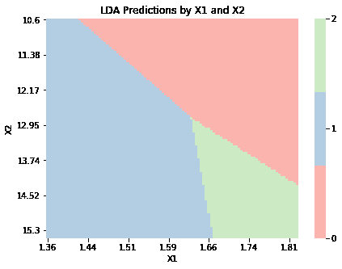
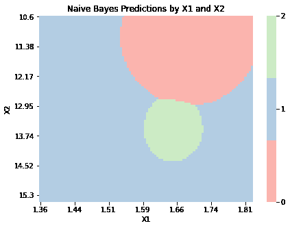

# 构建过程

> 原文：[`dafriedman97.github.io/mlbook/content/c4/construction.html`](https://dafriedman97.github.io/mlbook/content/c4/construction.html)

在本节中，我们构建 LDA、QDA 和朴素贝叶斯分类器。我们将在 wine 数据集上演示这些类别。

```py
import numpy as np 
import matplotlib.pyplot as plt
import seaborn as sns
from sklearn import datasets

wine = datasets.load_wine()
X, y = wine.data, wine.target 
```

## LDA

下面给出了线性判别分析（LDA）的实现。主要方法是`.fit()`。此方法进行三个重要的估计。对于每个$k$，我们估计$\pi_k$，即该类的先验概率。对于每个类别，我们也估计该类数据的均值$\bmu_k$。最后，我们估计跨类别的总体协方差矩阵$\bSigma$。这些估计的公式在概念部分中详细说明。

第二种和第三种方法，`.mvn_density()`和`.classify()`，用于对新观察值进行分类。`.mvn_density()`仅计算给定均值向量和协方差矩阵的多变量正态样本的密度（乘以一个常数）。`.classify()`实际上对每个测试观察值进行分类。它计算每个类别的密度，$p(\bx_n|Y_n = k)$，并将其乘以先验类别概率，$p(Y_n = k) = \pi_k$，以得到后验类别概率，$p(Y_n = k|\bx_n)$。然后它预测具有最高后验概率的类别。

```py
class LDA:

    ## Fitting the model 
    def fit(self, X, y):

        ## Record info
        self.N, self.D = X.shape
        self.X = X
        self.y = y

        ## Get prior probabilities 
        self.unique_y, unique_y_counts = np.unique(self.y, return_counts = True) # returns unique y and counts
        self.pi_ks = unique_y_counts/self.N

        ## Get mu for each class and overall Sigma
        self.mu_ks = []
        self.Sigma = np.zeros((self.D, self.D))        
        for i, k in enumerate(self.unique_y):

            X_k = self.X[self.y == k]
            mu_k = X_k.mean(0).reshape(self.D, 1)
            self.mu_ks.append(mu_k)

            for x_n in X_k:
                x_n = x_n.reshape(-1,1)
                x_n_minus_mu_k = (x_n - mu_k)
                self.Sigma += np.dot(x_n_minus_mu_k, x_n_minus_mu_k.T)

        self.Sigma /= self.N

    ## Making classifications

    def _mvn_density(self, x_n, mu_k, Sigma):
        x_n_minus_mu_k = (x_n - mu_k)
        density = np.exp(-(1/2)*x_n_minus_mu_k.T @ np.linalg.inv(Sigma) @ x_n_minus_mu_k)
        return density

    def classify(self, X_test):

        y_n = np.empty(len(X_test))
        for i, x_n in enumerate(X_test):

            x_n = x_n.reshape(-1, 1)
            p_ks = np.empty(len(self.unique_y))

            for j, k in enumerate(self.unique_y):
                p_x_given_y = self._mvn_density(x_n, self.mu_ks[j], self.Sigma)
                p_y_given_x = self.pi_ks[j]*p_x_given_y
                p_ks[j] = p_y_given_x

            y_n[i] = self.unique_y[np.argmax(p_ks)]

        return y_n 
```

我们拟合了下面的 LDA 模型并对训练观察值进行了分类。如输出所示，我们达到了 100%的训练准确率。

```py
lda = LDA()
lda.fit(X, y)
yhat = lda.classify(X)
np.mean(yhat == y) 
```

```py
1.0 
```

下面的函数根据模型的输入值可视化类别预测，其中$\bx_n \in \mathbb{R}²$。要应用此函数，我们从`wine`数据集中构建一个只有两列的模型。我们看到决策边界是线性的，正如我们期望从 LDA 中得到的。

```py
def graph_boundaries(X, model, model_title, n0 = 100, n1 = 100, figsize = (7, 5), label_every = 4):

        # Generate X for plotting 
        d0_range = np.linspace(X[:,0].min(), X[:,0].max(), n0)
        d1_range = np.linspace(X[:,1].min(), X[:,1].max(), n1)
        X_plot = np.array(np.meshgrid(d0_range, d1_range)).T.reshape(-1, 2)

        # Get class predictions
        y_plot = model.classify(X_plot).astype(int)

        # Plot 
        fig, ax = plt.subplots(figsize = figsize)
        sns.heatmap(y_plot.reshape(n0, n1).T,
                   cmap = sns.color_palette('Pastel1', 3),
                   cbar_kws = {'ticks':sorted(np.unique(y_plot))})
        xticks, yticks = ax.get_xticks(), ax.get_yticks()
        ax.set(xticks = xticks[::label_every], xticklabels = d0_range.round(2)[::label_every],
               yticks = yticks[::label_every], yticklabels = d1_range.round(2)[::label_every])
        ax.set(xlabel = 'X1', ylabel = 'X2', title = model_title + ' Predictions by X1 and X2')
        ax.set_xticklabels(ax.get_xticklabels(), rotation=0) 
```

```py
X_2d = X.copy()[:,2:4]
lda_2d = LDA()
lda_2d.fit(X_2d, y)
graph_boundaries(X_2d, lda_2d, 'LDA') 
```



## QDA

下面的 QDA 模型实现了。它与 LDA 几乎相同，除了协方差矩阵$\bSigma_k$是分别估计的。有关详细信息，请参阅概念部分。

```py
class QDA:

    ## Fitting the model

    def fit(self, X, y):

        ## Record info
        self.N, self.D = X.shape
        self.X = X
        self.y = y

        ## Get prior probabilities 
        self.unique_y, unique_y_counts = np.unique(self.y, return_counts = True) # returns unique y and counts
        self.pi_ks = unique_y_counts/self.N

        ## Get mu and Sigma for each class
        self.mu_ks = []
        self.Sigma_ks = []
        for i, k in enumerate(self.unique_y):

            X_k = self.X[self.y == k]
            mu_k = X_k.mean(0).reshape(self.D, 1)
            self.mu_ks.append(mu_k)

            Sigma_k = np.zeros((self.D, self.D))
            for x_n in X_k:
                x_n = x_n.reshape(-1,1)
                x_n_minus_mu_k = (x_n - mu_k)
                Sigma_k += np.dot(x_n_minus_mu_k, x_n_minus_mu_k.T)
            self.Sigma_ks.append(Sigma_k/len(X_k))

    ## Making classifications 

    def _mvn_density(self, x_n, mu_k, Sigma_k):
        x_n_minus_mu_k = (x_n - mu_k)
        density = np.linalg.det(Sigma_k)**(-1/2) * np.exp(-(1/2)*x_n_minus_mu_k.T @ np.linalg.inv(Sigma_k) @ x_n_minus_mu_k)
        return density

    def classify(self, X_test):

        y_n = np.empty(len(X_test))
        for i, x_n in enumerate(X_test):

            x_n = x_n.reshape(-1, 1)
            p_ks = np.empty(len(self.unique_y))

            for j, k in enumerate(self.unique_y):

                p_x_given_y = self._mvn_density(x_n, self.mu_ks[j], self.Sigma_ks[j])
                p_y_given_x = self.pi_ks[j]*p_x_given_y
                p_ks[j] = p_y_given_x

            y_n[i] = self.unique_y[np.argmax(p_ks)]

        return y_n 
```

```py
qda = QDA()
qda.fit(X, y)
yhat = qda.classify(X)
np.mean(yhat == y) 
```

```py
0.9943820224719101 
```

下面的图显示了基于 QDA 模型的输入变量的预测。正如预期的那样，决策边界是二次的，而不是线性的。我们还看到，对应于类别 2 的区域比其他区域小得多。这表明，要么类别 2 中的观察值较少，要么类别 2 中观察值的输入变量的估计方差小于其他类别的方差。

```py
qda_2d = QDA()
qda_2d.fit(X_2d, y)
graph_boundaries(X_2d, qda_2d, 'QDA') 
```


## 朴素贝叶斯

最后，我们在下面实现了一个朴素贝叶斯模型。此模型允许我们为数据集中的每个变量分配一个分布，尽管默认情况下它们都被假定为正态分布。由于每个变量都有自己的分布，因此估计模型参数更为复杂。对于每个变量和每个类别，我们通过 `_estimate_class_parameters` 分别估计参数。下面的结构允许使用正态、伯努利和泊松分布，尽管可以实现任何分布。

再次，我们通过计算 $p(Y_n = k|\bx_n)$ 对于 $k = 1, \dots, K$ 通过贝叶斯规则，并预测具有最高后验概率的类别来进行预测。由于每个变量可以有自己的分布，这个问题也更复杂。`_get_class_probability` 方法计算测试观察值的输入变量的概率密度。根据条件独立性假设，这仅仅是单个密度的乘积。

朴素贝叶斯在训练数据上的表现不如 LDA 或 QDA，这表明条件独立性假设可能不适合这个问题。

```py
class NaiveBayes:

    ######## Fit Model ########

    def _estimate_class_parameters(self, X_k):

        class_parameters = []

        for d in range(self.D):
            X_kd = X_k[:,d] # only the dth column and the kth class

            if self.distributions[d] == 'normal':
                mu = np.mean(X_kd)
                sigma2 = np.var(X_kd)
                class_parameters.append([mu, sigma2])

            if self.distributions[d] == 'bernoulli':
                p = np.mean(X_kd)
                class_parameters.append(p)

            if self.distributions[d] == 'poisson':
                lam = np.mean(X_kd)
                class_parameters.append(p)

        return class_parameters

    def fit(self, X, y, distributions = None):

        ## Record info
        self.N, self.D = X.shape
        self.X = X
        self.y = y
        if distributions is None:
            distributions = ['normal' for i in range(len(y))]
        self.distributions = distributions

        ## Get prior probabilities 
        self.unique_y, unique_y_counts = np.unique(self.y, return_counts = True) # returns unique y and counts
        self.pi_ks = unique_y_counts/self.N

        ## Estimate parameters
        self.parameters = []
        for i, k in enumerate(self.unique_y):
            X_k = self.X[self.y == k]
            self.parameters.append(self._estimate_class_parameters(X_k))

    ######## Make Classifications ########

    def _get_class_probability(self, x_n, j):

        class_parameters = self.parameters[j] # j is index of kth class
        class_probability = 1 

        for d in range(self.D):
            x_nd = x_n[d] # just the dth variable in observation x_n

            if self.distributions[d] == 'normal':
                mu, sigma2 = class_parameters[d]
                class_probability *= sigma2**(-1/2)*np.exp(-(x_nd - mu)**2/sigma2)

            if self.distributions[d] == 'bernoulli':
                p = class_parameters[d]
                class_probability *= (p**x_nd)*(1-p)**(1-x_nd)

            if self.distributions[d] == 'poisson':
                lam = class_parameters[d]
                class_probability *= np.exp(-lam)*lam**x_nd

        return class_probability 

    def classify(self, X_test):

        y_n = np.empty(len(X_test))
        for i, x_n in enumerate(X_test): # loop through test observations

            x_n = x_n.reshape(-1, 1)
            p_ks = np.empty(len(self.unique_y))

            for j, k in enumerate(self.unique_y): # loop through classes

                p_x_given_y = self._get_class_probability(x_n, j)
                p_y_given_x = self.pi_ks[j]*p_x_given_y # bayes' rule

                p_ks[j] = p_y_given_x

            y_n[i] = self.unique_y[np.argmax(p_ks)]

        return y_n 
```

```py
nb = NaiveBayes()
nb.fit(X, y)
yhat = nb.classify(X)
np.mean(yhat == y) 
```

```py
0.9775280898876404 
```

```py
nb_2d = NaiveBayes()
nb_2d.fit(X_2d, y)
graph_boundaries(X_2d, nb_2d, 'Naive Bayes') 
```



## LDA

以下给出了线性判别分析（LDA）的实现。主要方法是 `.fit()`。此方法进行三个重要的估计。对于每个 $k$，我们估计 $\pi_k$，即该类的先验概率。对于每个类别，我们也估计该类中数据的均值，$\bmu_k$。最后，我们估计跨类别的总体协方差矩阵，$\bSigma$。这些估计的公式在概念部分中详细说明。

后两个方法，`.mvn_density()` 和 `.classify()`，用于对新观察值进行分类。`.mvn_density()` 仅计算给定均值向量和协方差矩阵的多变量正态样本的密度（乘以一个乘数常数）。`.classify()` 实际上对每个测试观察值进行分类。它计算每个类别的密度 $p(\bx_n|Y_n = k)$，并将其乘以先验类别概率 $p(Y_n = k) = \pi_k$，以得到后验类别概率 $p(Y_n = k|\bx_n)$。然后它预测具有最高后验概率的类别。

```py
class LDA:

    ## Fitting the model 
    def fit(self, X, y):

        ## Record info
        self.N, self.D = X.shape
        self.X = X
        self.y = y

        ## Get prior probabilities 
        self.unique_y, unique_y_counts = np.unique(self.y, return_counts = True) # returns unique y and counts
        self.pi_ks = unique_y_counts/self.N

        ## Get mu for each class and overall Sigma
        self.mu_ks = []
        self.Sigma = np.zeros((self.D, self.D))        
        for i, k in enumerate(self.unique_y):

            X_k = self.X[self.y == k]
            mu_k = X_k.mean(0).reshape(self.D, 1)
            self.mu_ks.append(mu_k)

            for x_n in X_k:
                x_n = x_n.reshape(-1,1)
                x_n_minus_mu_k = (x_n - mu_k)
                self.Sigma += np.dot(x_n_minus_mu_k, x_n_minus_mu_k.T)

        self.Sigma /= self.N

    ## Making classifications

    def _mvn_density(self, x_n, mu_k, Sigma):
        x_n_minus_mu_k = (x_n - mu_k)
        density = np.exp(-(1/2)*x_n_minus_mu_k.T @ np.linalg.inv(Sigma) @ x_n_minus_mu_k)
        return density

    def classify(self, X_test):

        y_n = np.empty(len(X_test))
        for i, x_n in enumerate(X_test):

            x_n = x_n.reshape(-1, 1)
            p_ks = np.empty(len(self.unique_y))

            for j, k in enumerate(self.unique_y):
                p_x_given_y = self._mvn_density(x_n, self.mu_ks[j], self.Sigma)
                p_y_given_x = self.pi_ks[j]*p_x_given_y
                p_ks[j] = p_y_given_x

            y_n[i] = self.unique_y[np.argmax(p_ks)]

        return y_n 
```

我们在下面拟合了 LDA 模型并对训练观察值进行了分类。如图所示，我们达到了 100%的训练准确率。

```py
lda = LDA()
lda.fit(X, y)
yhat = lda.classify(X)
np.mean(yhat == y) 
```

```py
1.0 
```

下面的函数根据输入值可视化具有 $\bx_n \in \mathbb{R}²$ 的模型的类别预测。要应用此函数，我们从 `wine` 数据集中仅构建两个列的模型。我们看到决策边界是线性的，正如我们期望的 LDA 那样。

```py
def graph_boundaries(X, model, model_title, n0 = 100, n1 = 100, figsize = (7, 5), label_every = 4):

        # Generate X for plotting 
        d0_range = np.linspace(X[:,0].min(), X[:,0].max(), n0)
        d1_range = np.linspace(X[:,1].min(), X[:,1].max(), n1)
        X_plot = np.array(np.meshgrid(d0_range, d1_range)).T.reshape(-1, 2)

        # Get class predictions
        y_plot = model.classify(X_plot).astype(int)

        # Plot 
        fig, ax = plt.subplots(figsize = figsize)
        sns.heatmap(y_plot.reshape(n0, n1).T,
                   cmap = sns.color_palette('Pastel1', 3),
                   cbar_kws = {'ticks':sorted(np.unique(y_plot))})
        xticks, yticks = ax.get_xticks(), ax.get_yticks()
        ax.set(xticks = xticks[::label_every], xticklabels = d0_range.round(2)[::label_every],
               yticks = yticks[::label_every], yticklabels = d1_range.round(2)[::label_every])
        ax.set(xlabel = 'X1', ylabel = 'X2', title = model_title + ' Predictions by X1 and X2')
        ax.set_xticklabels(ax.get_xticklabels(), rotation=0) 
```

```py
X_2d = X.copy()[:,2:4]
lda_2d = LDA()
lda_2d.fit(X_2d, y)
graph_boundaries(X_2d, lda_2d, 'LDA') 
```


## QDA

下面的 QDA 模型实现。它与 LDA 几乎相同，除了协方差矩阵 $\bSigma_k$ 是分别估计的。有关详细信息，请参阅概念部分。

```py
class QDA:

    ## Fitting the model

    def fit(self, X, y):

        ## Record info
        self.N, self.D = X.shape
        self.X = X
        self.y = y

        ## Get prior probabilities 
        self.unique_y, unique_y_counts = np.unique(self.y, return_counts = True) # returns unique y and counts
        self.pi_ks = unique_y_counts/self.N

        ## Get mu and Sigma for each class
        self.mu_ks = []
        self.Sigma_ks = []
        for i, k in enumerate(self.unique_y):

            X_k = self.X[self.y == k]
            mu_k = X_k.mean(0).reshape(self.D, 1)
            self.mu_ks.append(mu_k)

            Sigma_k = np.zeros((self.D, self.D))
            for x_n in X_k:
                x_n = x_n.reshape(-1,1)
                x_n_minus_mu_k = (x_n - mu_k)
                Sigma_k += np.dot(x_n_minus_mu_k, x_n_minus_mu_k.T)
            self.Sigma_ks.append(Sigma_k/len(X_k))

    ## Making classifications 

    def _mvn_density(self, x_n, mu_k, Sigma_k):
        x_n_minus_mu_k = (x_n - mu_k)
        density = np.linalg.det(Sigma_k)**(-1/2) * np.exp(-(1/2)*x_n_minus_mu_k.T @ np.linalg.inv(Sigma_k) @ x_n_minus_mu_k)
        return density

    def classify(self, X_test):

        y_n = np.empty(len(X_test))
        for i, x_n in enumerate(X_test):

            x_n = x_n.reshape(-1, 1)
            p_ks = np.empty(len(self.unique_y))

            for j, k in enumerate(self.unique_y):

                p_x_given_y = self._mvn_density(x_n, self.mu_ks[j], self.Sigma_ks[j])
                p_y_given_x = self.pi_ks[j]*p_x_given_y
                p_ks[j] = p_y_given_x

            y_n[i] = self.unique_y[np.argmax(p_ks)]

        return y_n 
```

```py
qda = QDA()
qda.fit(X, y)
yhat = qda.classify(X)
np.mean(yhat == y) 
```

```py
0.9943820224719101 
```

下面的图表显示了基于输入变量的 QDA 模型的预测结果。正如预期的那样，决策边界是二次的，而不是线性的。我们还看到，对应于类别 2 的区域比其他区域小得多。这表明，要么类别 2 中的观察值较少，要么类别 2 中观察值的输入变量的估计方差小于其他类别的方差。

```py
qda_2d = QDA()
qda_2d.fit(X_2d, y)
graph_boundaries(X_2d, qda_2d, 'QDA') 
```


## 简单贝叶斯

最后，我们在下面实现了一个简单贝叶斯模型。这个模型允许我们为数据集中的每个变量分配一个分布，尽管默认情况下它们都被假定为正态分布。由于每个变量都有自己的分布，因此估计模型参数更加复杂。对于每个变量和每个类别，我们通过 `_estimate_class_parameters` 方法分别估计参数。下面的结构允许实现正态、伯努利和泊松分布，尽管可以实现任何分布。

再次，我们通过计算 $p(Y_n = k|\bx_n)$ 来进行预测，其中 $k = 1, \dots, K$，这是通过贝叶斯定理来预测具有最高后验概率的类别。由于每个变量可以有自己的分布，因此这个问题也更加复杂。`_get_class_probability` 方法计算测试观察值的输入变量的概率密度。根据条件独立性假设，这仅仅是各个密度的乘积。

简单贝叶斯在训练数据上的表现不如 LDA 或 QDA，这表明条件独立性假设可能不适合这个问题。

```py
class NaiveBayes:

    ######## Fit Model ########

    def _estimate_class_parameters(self, X_k):

        class_parameters = []

        for d in range(self.D):
            X_kd = X_k[:,d] # only the dth column and the kth class

            if self.distributions[d] == 'normal':
                mu = np.mean(X_kd)
                sigma2 = np.var(X_kd)
                class_parameters.append([mu, sigma2])

            if self.distributions[d] == 'bernoulli':
                p = np.mean(X_kd)
                class_parameters.append(p)

            if self.distributions[d] == 'poisson':
                lam = np.mean(X_kd)
                class_parameters.append(p)

        return class_parameters

    def fit(self, X, y, distributions = None):

        ## Record info
        self.N, self.D = X.shape
        self.X = X
        self.y = y
        if distributions is None:
            distributions = ['normal' for i in range(len(y))]
        self.distributions = distributions

        ## Get prior probabilities 
        self.unique_y, unique_y_counts = np.unique(self.y, return_counts = True) # returns unique y and counts
        self.pi_ks = unique_y_counts/self.N

        ## Estimate parameters
        self.parameters = []
        for i, k in enumerate(self.unique_y):
            X_k = self.X[self.y == k]
            self.parameters.append(self._estimate_class_parameters(X_k))

    ######## Make Classifications ########

    def _get_class_probability(self, x_n, j):

        class_parameters = self.parameters[j] # j is index of kth class
        class_probability = 1 

        for d in range(self.D):
            x_nd = x_n[d] # just the dth variable in observation x_n

            if self.distributions[d] == 'normal':
                mu, sigma2 = class_parameters[d]
                class_probability *= sigma2**(-1/2)*np.exp(-(x_nd - mu)**2/sigma2)

            if self.distributions[d] == 'bernoulli':
                p = class_parameters[d]
                class_probability *= (p**x_nd)*(1-p)**(1-x_nd)

            if self.distributions[d] == 'poisson':
                lam = class_parameters[d]
                class_probability *= np.exp(-lam)*lam**x_nd

        return class_probability 

    def classify(self, X_test):

        y_n = np.empty(len(X_test))
        for i, x_n in enumerate(X_test): # loop through test observations

            x_n = x_n.reshape(-1, 1)
            p_ks = np.empty(len(self.unique_y))

            for j, k in enumerate(self.unique_y): # loop through classes

                p_x_given_y = self._get_class_probability(x_n, j)
                p_y_given_x = self.pi_ks[j]*p_x_given_y # bayes' rule

                p_ks[j] = p_y_given_x

            y_n[i] = self.unique_y[np.argmax(p_ks)]

        return y_n 
```

```py
nb = NaiveBayes()
nb.fit(X, y)
yhat = nb.classify(X)
np.mean(yhat == y) 
```

```py
0.9775280898876404 
```

```py
nb_2d = NaiveBayes()
nb_2d.fit(X_2d, y)
graph_boundaries(X_2d, nb_2d, 'Naive Bayes') 
```


