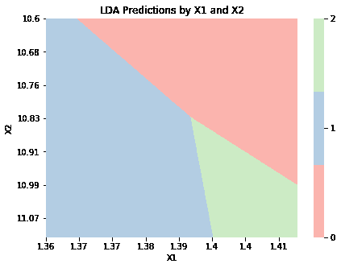
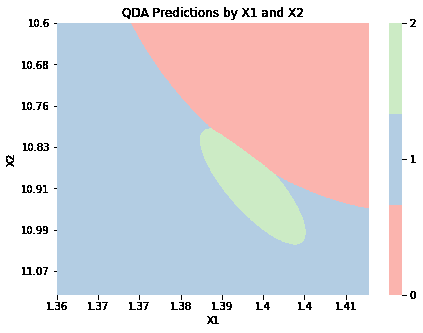
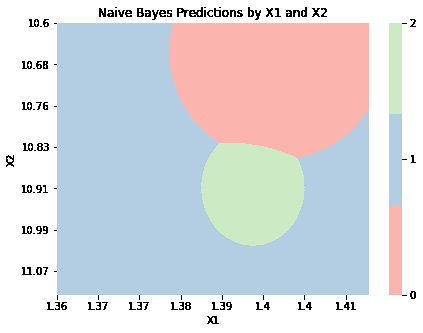

# 实现

> 原文：[`dafriedman97.github.io/mlbook/content/c4/code.html`](https://dafriedman97.github.io/mlbook/content/c4/code.html)

```py
import numpy as np 
import matplotlib.pyplot as plt
import seaborn as sns
from sklearn import datasets
wine = datasets.load_wine()
X, y = wine.data, wine.target 
```

下面的代码展示了使用 wine 数据集的 `scikit-learn` 实现的 LDA、QDA 和朴素贝叶斯。请注意，朴素贝叶斯实现假设 *所有* 变量都遵循正态分布，这与上一节中的构建不同。

```py
from sklearn.discriminant_analysis import LinearDiscriminantAnalysis, QuadraticDiscriminantAnalysis
from sklearn.naive_bayes import GaussianNB

lda = LinearDiscriminantAnalysis()
lda.fit(X, y);

qda = QuadraticDiscriminantAnalysis()
qda.fit(X, y);

nb = GaussianNB()
nb.fit(X, y); 
```

接下来，让我们检查这些 `scikit-learn` 实现是否返回与上一节中我们构建的相同的决策边界。创建这些图表的代码如下。

```py
def graph_boundaries(X, model, model_title, n0 = 1000, n1 = 1000, figsize = (7, 5), label_every = 4):

        # Generate X for plotting 
        d0_range = np.linspace(X[:,0].min(), X[:,0].max(), n0)
        d1_range = np.linspace(X[:,1].min(), X[:,1].max(), n1)
        X_plot = np.array(np.meshgrid(d0_range, d1_range)).T.reshape(-1, 2)

        # Get class predictions
        y_plot = model.predict(X_plot).astype(int)

        # Plot 
        fig, ax = plt.subplots(figsize = figsize)
        sns.heatmap(y_plot.reshape(n0, n1).T,
                   cmap = sns.color_palette('Pastel1', 3),
                   cbar_kws = {'ticks':sorted(np.unique(y_plot))})
        xticks, yticks = ax.get_xticks(), ax.get_yticks()
        ax.set(xticks = xticks[::label_every], xticklabels = d0_range.round(2)[::label_every],
               yticks = yticks[::label_every], yticklabels = d1_range.round(2)[::label_every])
        ax.set(xlabel = 'X1', ylabel = 'X2', title = model_title + ' Predictions by X1 and X2')
        ax.set_xticklabels(ax.get_xticklabels(), rotation=0) 
```

```py
X_2d = X.copy()[:,2:4]
lda_2d = LinearDiscriminantAnalysis()
lda_2d.fit(X_2d, y);
graph_boundaries(X_2d, lda_2d, 'LDA') 
```



```py
qda_2d = QuadraticDiscriminantAnalysis()
qda_2d.fit(X_2d, y);
graph_boundaries(X_2d, qda_2d, 'QDA') 
```



```py
nb_2d = GaussianNB()
nb_2d.fit(X_2d, y);
graph_boundaries(X_2d, nb_2d, 'Naive Bayes') 
```


