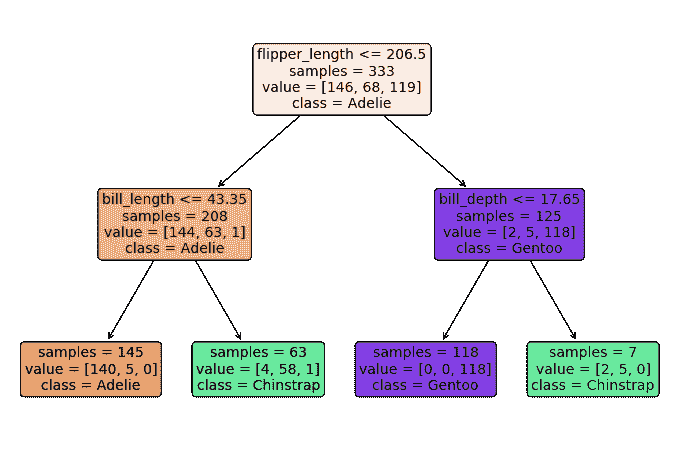

# 概念

> 原文：[`dafriedman97.github.io/mlbook/content/c5/concept.html`](https://dafriedman97.github.io/mlbook/content/c5/concept.html)

决策树是一种可解释的机器学习方法，用于回归和分类。树通过根据所选预测器的值迭代地分割训练数据样本；每个分割的目标是创建两个子样本，或称为“子节点”，它们的目标变量比它们的“父节点”具有更高的*纯度*。对于分类任务，纯度意味着第一个子节点应该主要包含一个类的观测值，而第二个子节点应该主要包含另一个类的观测值。对于回归任务，纯度意味着第一个子节点应该包含目标变量高值的观测值，而第二个子节点应该包含目标变量低值的观测值。

下面给出了一个使用 penguins 数据集的分类决策树的例子。该树试图根据企鹅的鳍和喙的信息来分类企鹅的物种—*Adelie*、*Gentoo*或*Chinstrap*。第一个“节点”显示有 333 个训练观测值，其中 146 个*Adelie*、68 个*Gentoo*和 119 个*Chinstrap*。我们首先根据企鹅的鳍长度是否小于或等于 206.5 毫米进行分割。如果是，企鹅移动到左边的节点，如果不是，则移动到右边的节点。然后我们为每个子节点重复此过程。

一旦我们到达树的底部，我们就做出预测。例如，如果一个测试观测值的`flipper_length`为 210，`bill_depth`为 12，我们会遵循树的结构并将其分类为*Gentoo*。这个简单的决策过程使得树非常易于解释。然而，它们可能在精确度（预测的准确性）和鲁棒性（对变量训练数据的敏感性）方面有所欠缺。

本章节演示了如何构建决策树。第一部分链接涵盖了回归任务，其中目标变量是定量型的，而第二部分链接涵盖了分类任务，其中目标变量是分类型的。
