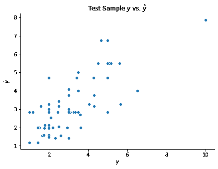

# 实现

> 原文：[`dafriedman97.github.io/mlbook/content/c5/code.html`](https://dafriedman97.github.io/mlbook/content/c5/code.html)

本节演示了如何使用 `scikit-learn` 拟合回归和决策树。我们将再次使用 tips 数据集来拟合回归树，以及 penguins 数据集来拟合分类树。

```py
## Import packages
import numpy as np 
import matplotlib.pyplot as plt
import seaborn as sns
import pandas as pd 
```

## 1. 回归树

让我们先加载数据。现在我们将保持为 `pandas` 数据框而不是 `numpy` 数组。

```py
## Load tips data
tips = sns.load_dataset('tips')
X = tips.drop(columns = 'tip')
y = tips['tip']

## Train-test split
np.random.seed(1)
test_frac = 0.25
test_size = int(len(y)*test_frac)
test_idxs = np.random.choice(np.arange(len(y)), test_size, replace = False)
X_train = X.drop(test_idxs)
y_train = y.drop(test_idxs)
X_test = X.loc[test_idxs]
y_test = y.loc[test_idxs] 
```

我们可以使用 `DecisionTreeRegressor` 类来拟合回归树。不幸的是，`scikit-learn` 目前不支持分类预测器。相反，我们首先必须将这些预测器转换为虚拟变量。请注意，这意味着分类变量的分割只能将一个值与其他值分开。例如，具有离散值 \(a, b, c\) 和 \(d\) 的变量不能分割为 \(\{a, b\}\) 与 \(\{c, d\}\)。

```py
from sklearn.tree import DecisionTreeRegressor

## Get dummies
X_train = pd.get_dummies(X_train, drop_first = True)
X_test = pd.get_dummies(X_test, drop_first = True)

## Build model
dtr = DecisionTreeRegressor(max_depth = 7, min_samples_split = 5)
dtr.fit(X_train, y_train)
y_test_hat = dtr.predict(X_test)

## Visualize predictions
fig, ax = plt.subplots(figsize = (7, 5))
sns.scatterplot(y_test, y_test_hat)
ax.set(xlabel = r'$y$', ylabel = r'$\hat{y}$', title = r'Test Sample $y$ vs. $\hat{y}$')
sns.despine() 
```



## 2. 分类树

`scikit-learn` 中的分类树实现几乎相同。相应的代码如下所示。

```py
## Load penguins data
penguins = sns.load_dataset('penguins')
penguins = penguins.dropna().reset_index(drop = True)
X = penguins.drop(columns = 'species')
y = penguins['species']

## Train-test split
np.random.seed(1)
test_frac = 0.25
test_size = int(len(y)*test_frac)
test_idxs = np.random.choice(np.arange(len(y)), test_size, replace = False)
X_train = X.drop(test_idxs)
y_train = y.drop(test_idxs)
X_test = X.loc[test_idxs]
y_test = y.loc[test_idxs] 
```

```py
from sklearn.tree import DecisionTreeClassifier

## Get dummies
X_train = pd.get_dummies(X_train, drop_first = True)
X_test = pd.get_dummies(X_test, drop_first = True)

## Build model
dtc = DecisionTreeClassifier(max_depth = 10, min_samples_split = 10)
dtc.fit(X_train, y_train)
y_test_hat = dtc.predict(X_test)

## Observe Accuracy
np.mean(y_test_hat == y_test) 
```

```py
0.9036144578313253 
```

## 1. 回归树

让我们先加载数据。现在我们将保持为 `pandas` 数据框而不是 `numpy` 数组。

```py
## Load tips data
tips = sns.load_dataset('tips')
X = tips.drop(columns = 'tip')
y = tips['tip']

## Train-test split
np.random.seed(1)
test_frac = 0.25
test_size = int(len(y)*test_frac)
test_idxs = np.random.choice(np.arange(len(y)), test_size, replace = False)
X_train = X.drop(test_idxs)
y_train = y.drop(test_idxs)
X_test = X.loc[test_idxs]
y_test = y.loc[test_idxs] 
```

然后，我们可以使用 `DecisionTreeRegressor` 类来拟合回归树。不幸的是，`scikit-learn` 目前不支持分类预测器。相反，我们首先必须将这些预测器转换为虚拟变量。请注意，这意味着分类变量的分割只能将一个值与其他值分开。例如，具有离散值 \(a, b, c\) 和 \(d\) 的变量不能分割为 \(\{a, b\}\) 与 \(\{c, d\}\)。

```py
from sklearn.tree import DecisionTreeRegressor

## Get dummies
X_train = pd.get_dummies(X_train, drop_first = True)
X_test = pd.get_dummies(X_test, drop_first = True)

## Build model
dtr = DecisionTreeRegressor(max_depth = 7, min_samples_split = 5)
dtr.fit(X_train, y_train)
y_test_hat = dtr.predict(X_test)

## Visualize predictions
fig, ax = plt.subplots(figsize = (7, 5))
sns.scatterplot(y_test, y_test_hat)
ax.set(xlabel = r'$y$', ylabel = r'$\hat{y}$', title = r'Test Sample $y$ vs. $\hat{y}$')
sns.despine() 
```


## 2. 分类树

`scikit-learn` 中的分类树实现几乎相同。相应的代码如下所示。

```py
## Load penguins data
penguins = sns.load_dataset('penguins')
penguins = penguins.dropna().reset_index(drop = True)
X = penguins.drop(columns = 'species')
y = penguins['species']

## Train-test split
np.random.seed(1)
test_frac = 0.25
test_size = int(len(y)*test_frac)
test_idxs = np.random.choice(np.arange(len(y)), test_size, replace = False)
X_train = X.drop(test_idxs)
y_train = y.drop(test_idxs)
X_test = X.loc[test_idxs]
y_test = y.loc[test_idxs] 
```

```py
from sklearn.tree import DecisionTreeClassifier

## Get dummies
X_train = pd.get_dummies(X_train, drop_first = True)
X_test = pd.get_dummies(X_test, drop_first = True)

## Build model
dtc = DecisionTreeClassifier(max_depth = 10, min_samples_split = 10)
dtc.fit(X_train, y_train)
y_test_hat = dtc.predict(X_test)

## Observe Accuracy
np.mean(y_test_hat == y_test) 
```

```py
0.9036144578313253 
```
