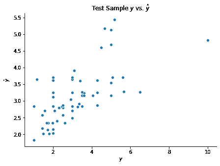

# 实现

> 原文：[`dafriedman97.github.io/mlbook/content/c6/code.html`](https://dafriedman97.github.io/mlbook/content/c6/code.html)

本节演示了如何使用 `scikit-learn` 拟合 bagging、随机森林和提升模型。我们再次使用 penguins 数据集进行分类，以及 tips 数据集进行回归。

```py
## Import packages
import numpy as np 
import matplotlib.pyplot as plt
import seaborn as sns
import pandas as pd 
```

## 1. Bagging 和 Random Forests

记住，bagging 和随机森林可以处理分类和回归任务。在这个例子中，我们将对 `penguins` 数据集进行分类。记住，`scikit-learn` 的树目前不支持分类预测器，因此我们必须首先将这些转换为虚拟变量

```py
## Load penguins data
penguins = sns.load_dataset('penguins')
penguins = penguins.dropna().reset_index(drop = True)
X = penguins.drop(columns = 'species')
y = penguins['species']

## Train-test split
np.random.seed(1)
test_frac = 0.25
test_size = int(len(y)*test_frac)
test_idxs = np.random.choice(np.arange(len(y)), test_size, replace = False)
X_train = X.drop(test_idxs)
y_train = y.drop(test_idxs)
X_test = X.loc[test_idxs]
y_test = y.loc[test_idxs]

## Get dummies
X_train = pd.get_dummies(X_train, drop_first = True)
X_test = pd.get_dummies(X_test, drop_first = True) 
```

### Bagging

下面是一个简单的 bagging 分类器的拟合示例。最重要的参数是 `n_estimators` 和 `base_estimator`，它们决定了 bagging 模型应该使用的弱学习者的数量和类型。默认的 `base_estimator` 是决策树，尽管这可以在下面的第二个示例中更改，该示例使用朴素贝叶斯估计器。

```py
from sklearn.ensemble import BaggingClassifier
from sklearn.naive_bayes import GaussianNB

## Decision Tree bagger
bagger1 = BaggingClassifier(n_estimators = 50, random_state = 123)
bagger1.fit(X_train, y_train)

## Naive Bayes bagger
bagger2 = BaggingClassifier(base_estimator = GaussianNB(), random_state = 123)
bagger2.fit(X_train, y_train)

## Evaluate
print(np.mean(bagger1.predict(X_test) == y_test))
print(np.mean(bagger2.predict(X_test) == y_test)) 
```

```py
0.963855421686747
0.9156626506024096 
```

### Random Forests

下面给出了 `scikit-learn` 中随机森林的一个示例。随机森林最重要的参数是估计器的数量（决策树），`max_features`（每个分割时考虑的预测因子数量），以及为决策树选择的任何参数（如最大深度）。下面给出了设置每个这些参数的指南。

+   `n_estimators`: 通常情况下，基础估计器的数量越多越好，尽管边际收益递减。虽然增加基础估计器的数量不会导致过拟合，但最终也不会带来任何好处。

+   `max_features`: 此参数默认设置为总特征数的平方根（在下面的示例中明确指出）。如果此值等于总特征数，我们就会得到一个 bagging 模型。降低此值会降低树之间的相关性，但也会阻止基础估计器学习可能有价值的信息。

+   决策树参数：这些参数通常保持不变。这允许单个决策树生长得较深，增加方差但减少偏差。然后通过单个树的集成来减少方差。

```py
from sklearn.ensemble import RandomForestClassifier
rf = RandomForestClassifier(n_estimators = 100, max_features = int(np.sqrt(X_test.shape[1])), random_state = 123)
rf.fit(X_train, y_train)
print(np.mean(rf.predict(X_test) == y_test)) 
```

```py
0.9879518072289156 
```

## 2. Boosting

注意

注意，`scikit-learn` 中的 `AdaBoostClassifier` 使用了一个与在 概念部分 中介绍的不同算法，尽管结果应该是相似的。`scikit-learn` 中的 `AdaBoostRegressor` 类使用我们介绍的相同算法：*AdaBoost.R2*

### AdaBoost 分类

`scikit-learn` 中的 `AdaBoostClassifier` 实际上能够处理多类目标变量，但为了保持一致性，让我们使用我们在 AdaBoost 构造中使用的相同二进制目标：企鹅的物种是否为 *Adelie*。

```py
## Make binary
y_train = (y_train == 'Adelie')
y_test = (y_test == 'Adelie') 
```

然后，我们可以使用 `AdaBoostClassifier` 类拟合分类器，如下所示。同样，我们首先将分类预测器转换为虚拟变量。默认情况下，分类器将使用 50 个决策树，每个树的最大深度为 1，作为弱学习者。

```py
from sklearn.ensemble import AdaBoostClassifier

## Get dummies
X_train = pd.get_dummies(X_train, drop_first = True)
X_test = pd.get_dummies(X_test, drop_first = True)

## Build model
abc = AdaBoostClassifier(n_estimators = 50)
abc.fit(X_train, y_train)
y_test_hat = abc.predict(X_test)

## Evaluate 
np.mean(y_test_hat == y_test) 
```

```py
0.9759036144578314 
```

可以轻松地使用不同的弱学习者在决策树的位置。下面是一个使用逻辑回归的示例。

```py
from sklearn.linear_model import LogisticRegression
abc = AdaBoostClassifier(base_estimator = LogisticRegression(max_iter = 1000))
abc.fit(X_train, y_train); 
```

### AdaBoost 回归

AdaBoost 回归在 `scikit-learn` 中几乎以相同的方式实现。以下是一个使用 `tips` 数据集的示例。

```py
## Load penguins data
tips = sns.load_dataset('tips')
tips = tips.dropna().reset_index(drop = True)
X = tips.drop(columns = 'tip')
y = tips['tip']

## Train-test split
np.random.seed(1)
test_frac = 0.25
test_size = int(len(y)*test_frac)
test_idxs = np.random.choice(np.arange(len(y)), test_size, replace = False)
X_train = X.drop(test_idxs)
y_train = y.drop(test_idxs)
X_test = X.loc[test_idxs]
y_test = y.loc[test_idxs] 
```

```py
from sklearn.ensemble import AdaBoostRegressor

## Get dummies
X_train = pd.get_dummies(X_train, drop_first = True)
X_test = pd.get_dummies(X_test, drop_first = True)

## Build model
abr = AdaBoostRegressor(n_estimators = 50)
abr.fit(X_train, y_train)
y_test_hat = abr.predict(X_test)

## Visualize predictions
fig, ax = plt.subplots(figsize = (7, 5))
sns.scatterplot(y_test, y_test_hat)
ax.set(xlabel = r'$y$', ylabel = r'$\hat{y}$', title = r'Test Sample $y$ vs. $\hat{y}$')
sns.despine() 
```



## 1. Bagging 和 Random Forests

记住，bagging 和随机森林可以处理分类和回归任务。在这个例子中，我们将对 `penguins` 数据集进行分类。记住，`scikit-learn` 的树目前不支持分类预测器，因此我们必须首先将这些转换为虚拟变量。

```py
## Load penguins data
penguins = sns.load_dataset('penguins')
penguins = penguins.dropna().reset_index(drop = True)
X = penguins.drop(columns = 'species')
y = penguins['species']

## Train-test split
np.random.seed(1)
test_frac = 0.25
test_size = int(len(y)*test_frac)
test_idxs = np.random.choice(np.arange(len(y)), test_size, replace = False)
X_train = X.drop(test_idxs)
y_train = y.drop(test_idxs)
X_test = X.loc[test_idxs]
y_test = y.loc[test_idxs]

## Get dummies
X_train = pd.get_dummies(X_train, drop_first = True)
X_test = pd.get_dummies(X_test, drop_first = True) 
```

### Bagging

下面拟合了一个简单的 bagging 分类器。最重要的参数是 `n_estimators` 和 `base_estimator`，它们决定了 bagging 模型应该使用的弱学习者的数量和类型。默认的 `base_estimator` 是决策树，尽管这可以在下面的第二个示例中更改，该示例使用朴素贝叶斯估计器。

```py
from sklearn.ensemble import BaggingClassifier
from sklearn.naive_bayes import GaussianNB

## Decision Tree bagger
bagger1 = BaggingClassifier(n_estimators = 50, random_state = 123)
bagger1.fit(X_train, y_train)

## Naive Bayes bagger
bagger2 = BaggingClassifier(base_estimator = GaussianNB(), random_state = 123)
bagger2.fit(X_train, y_train)

## Evaluate
print(np.mean(bagger1.predict(X_test) == y_test))
print(np.mean(bagger2.predict(X_test) == y_test)) 
```

```py
0.963855421686747
0.9156626506024096 
```

### 随机森林

下面给出了 `scikit-learn` 中随机森林的示例。随机森林最重要的参数是估计器的数量（决策树），`max_features`（每个分割时考虑的预测因子数量），以及为决策树选择的任何参数（如最大深度）。下面给出了设置每个这些参数的指南。

+   `n_estimators`：一般来说，基础估计器的数量越多越好，尽管边际收益递减。虽然增加基础估计器的数量不会导致过拟合，但最终它不会提供任何好处。

+   `max_features`：此参数默认设置为总特征数的平方根（在下面的示例中明确说明）。如果此值等于总特征数，我们将得到一个 bagging 模型。降低此值会降低树之间的相关性，但也会防止基础估计器学习可能有价值的信息。

+   决策树参数：这些参数通常保持不变。这允许单个决策树生长得较深，增加方差但减少偏差。然后，通过单个树的集成来减少方差。

```py
from sklearn.ensemble import RandomForestClassifier
rf = RandomForestClassifier(n_estimators = 100, max_features = int(np.sqrt(X_test.shape[1])), random_state = 123)
rf.fit(X_train, y_train)
print(np.mean(rf.predict(X_test) == y_test)) 
```

```py
0.9879518072289156 
```

### Bagging

下面拟合了一个简单的 bagging 分类器。最重要的参数是 `n_estimators` 和 `base_estimator`，它们决定了 bagging 模型应该使用的弱学习者的数量和类型。默认的 `base_estimator` 是决策树，尽管这可以在下面的第二个示例中更改，该示例使用朴素贝叶斯估计器。

```py
from sklearn.ensemble import BaggingClassifier
from sklearn.naive_bayes import GaussianNB

## Decision Tree bagger
bagger1 = BaggingClassifier(n_estimators = 50, random_state = 123)
bagger1.fit(X_train, y_train)

## Naive Bayes bagger
bagger2 = BaggingClassifier(base_estimator = GaussianNB(), random_state = 123)
bagger2.fit(X_train, y_train)

## Evaluate
print(np.mean(bagger1.predict(X_test) == y_test))
print(np.mean(bagger2.predict(X_test) == y_test)) 
```

```py
0.963855421686747
0.9156626506024096 
```

### 随机森林

以下是一个`scikit-learn`中随机森林的示例。随机森林最重要的参数是估计器的数量（决策树）、`max_features`（每个分割要考虑的预测器数量）以及为决策树选择的任何参数（如最大深度）。以下给出设置每个这些参数的指南。

+   `n_estimators`: 通常情况下，基础估计器的数量越多越好，尽管边际收益递减。虽然增加基础估计器的数量不会导致过拟合，但最终它不会带来任何好处。

+   `max_features`: 此参数默认设置为总特征数的平方根（以下示例中已明确说明）。如果此值等于总特征数，我们将得到一个袋装模型。降低此值会降低树之间的相关性，但也会阻止基础估计器学习可能有价值的信息。

+   决策树参数：这些参数通常保持不变。这允许单个决策树生长得较深，增加方差但减少偏差。然后，通过单个树的集成来减少方差。

```py
from sklearn.ensemble import RandomForestClassifier
rf = RandomForestClassifier(n_estimators = 100, max_features = int(np.sqrt(X_test.shape[1])), random_state = 123)
rf.fit(X_train, y_train)
print(np.mean(rf.predict(X_test) == y_test)) 
```

```py
0.9879518072289156 
```

## 2. 提升法

注意

注意，`scikit-learn`中的`AdaBoostClassifier`使用的算法与概念部分中介绍的不同，尽管结果应该相似。`scikit-learn`中的`AdaBoostRegressor`类使用我们介绍的相同算法：*AdaBoost.R2*

### AdaBoost 分类

`scikit-learn`中的`AdaBoostClassifier`实际上能够处理多类目标变量，但为了保持一致性，让我们使用我们在 AdaBoost 构建中使用的相同二进制目标：企鹅的物种是否为*阿德利*。

```py
## Make binary
y_train = (y_train == 'Adelie')
y_test = (y_test == 'Adelie') 
```

然后，我们可以使用`AdaBoostClassifier`类来拟合分类器，如下所示。同样，我们首先将分类预测器转换为虚拟变量。默认情况下，分类器将使用 50 个决策树，每个树的最大深度为 1，作为弱学习器。

```py
from sklearn.ensemble import AdaBoostClassifier

## Get dummies
X_train = pd.get_dummies(X_train, drop_first = True)
X_test = pd.get_dummies(X_test, drop_first = True)

## Build model
abc = AdaBoostClassifier(n_estimators = 50)
abc.fit(X_train, y_train)
y_test_hat = abc.predict(X_test)

## Evaluate 
np.mean(y_test_hat == y_test) 
```

```py
0.9759036144578314 
```

可以很容易地使用不同的弱学习器代替决策树。以下是一个使用逻辑回归的示例。

```py
from sklearn.linear_model import LogisticRegression
abc = AdaBoostClassifier(base_estimator = LogisticRegression(max_iter = 1000))
abc.fit(X_train, y_train); 
```

### AdaBoost 回归

AdaBoost 回归在`scikit-learn`中的实现几乎相同。以下是一个使用`tips`数据集的示例。

```py
## Load penguins data
tips = sns.load_dataset('tips')
tips = tips.dropna().reset_index(drop = True)
X = tips.drop(columns = 'tip')
y = tips['tip']

## Train-test split
np.random.seed(1)
test_frac = 0.25
test_size = int(len(y)*test_frac)
test_idxs = np.random.choice(np.arange(len(y)), test_size, replace = False)
X_train = X.drop(test_idxs)
y_train = y.drop(test_idxs)
X_test = X.loc[test_idxs]
y_test = y.loc[test_idxs] 
```

```py
from sklearn.ensemble import AdaBoostRegressor

## Get dummies
X_train = pd.get_dummies(X_train, drop_first = True)
X_test = pd.get_dummies(X_test, drop_first = True)

## Build model
abr = AdaBoostRegressor(n_estimators = 50)
abr.fit(X_train, y_train)
y_test_hat = abr.predict(X_test)

## Visualize predictions
fig, ax = plt.subplots(figsize = (7, 5))
sns.scatterplot(y_test, y_test_hat)
ax.set(xlabel = r'$y$', ylabel = r'$\hat{y}$', title = r'Test Sample $y$ vs. $\hat{y}$')
sns.despine() 
```


### AdaBoost 分类

`scikit-learn`中的`AdaBoostClassifier`实际上能够处理多类目标变量，但为了保持一致性，让我们使用我们在 AdaBoost 构建中使用的相同二进制目标：企鹅的物种是否为*阿德利*。

```py
## Make binary
y_train = (y_train == 'Adelie')
y_test = (y_test == 'Adelie') 
```

然后，我们可以使用`AdaBoostClassifier`类来拟合分类器，如下所示。同样，我们首先将分类预测器转换为虚拟变量。默认情况下，分类器将使用 50 个决策树，每个树的最大深度为 1，作为弱学习器。

```py
from sklearn.ensemble import AdaBoostClassifier

## Get dummies
X_train = pd.get_dummies(X_train, drop_first = True)
X_test = pd.get_dummies(X_test, drop_first = True)

## Build model
abc = AdaBoostClassifier(n_estimators = 50)
abc.fit(X_train, y_train)
y_test_hat = abc.predict(X_test)

## Evaluate 
np.mean(y_test_hat == y_test) 
```

```py
0.9759036144578314 
```

可以轻松地使用不同的弱学习器来代替决策树。下面展示了使用逻辑回归的示例。

```py
from sklearn.linear_model import LogisticRegression
abc = AdaBoostClassifier(base_estimator = LogisticRegression(max_iter = 1000))
abc.fit(X_train, y_train); 
```

### AdaBoost 回归

AdaBoost 回归在 `scikit-learn` 中几乎以相同的方式实现。下面展示了使用 `tips` 数据集的示例。

```py
## Load penguins data
tips = sns.load_dataset('tips')
tips = tips.dropna().reset_index(drop = True)
X = tips.drop(columns = 'tip')
y = tips['tip']

## Train-test split
np.random.seed(1)
test_frac = 0.25
test_size = int(len(y)*test_frac)
test_idxs = np.random.choice(np.arange(len(y)), test_size, replace = False)
X_train = X.drop(test_idxs)
y_train = y.drop(test_idxs)
X_test = X.loc[test_idxs]
y_test = y.loc[test_idxs] 
```

```py
from sklearn.ensemble import AdaBoostRegressor

## Get dummies
X_train = pd.get_dummies(X_train, drop_first = True)
X_test = pd.get_dummies(X_test, drop_first = True)

## Build model
abr = AdaBoostRegressor(n_estimators = 50)
abr.fit(X_train, y_train)
y_test_hat = abr.predict(X_test)

## Visualize predictions
fig, ax = plt.subplots(figsize = (7, 5))
sns.scatterplot(y_test, y_test_hat)
ax.set(xlabel = r'$y$', ylabel = r'$\hat{y}$', title = r'Test Sample $y$ vs. $\hat{y}$')
sns.despine() 
```


