# 概念

> 原文：[`dafriedman97.github.io/mlbook/content/c7/concept.html`](https://dafriedman97.github.io/mlbook/content/c7/concept.html)

\[ \newcommand{\sumN}{\sum_{n = 1}^N} \newcommand{\sumn}{\sum_n} \newcommand{\prodN}{\prod_{n = 1}^N} \newcommand{\by}{\mathbf{y}} \newcommand{\bX}{\mathbf{X}} \newcommand{\bx}{\mathbf{x}} \newcommand{\bz}{\mathbf{z}} \newcommand{\bw}{\mathbf{w}} \newcommand{\bbeta}{\boldsymbol{\beta}} \newcommand{\btheta}{\boldsymbol{\theta}} \newcommand{\bbetahat}{\boldsymbol{\hat{\beta}}} \newcommand{\bthetahat}{\boldsymbol{\hat{\theta}}} \newcommand{\bSigma}{\boldsymbol{\Sigma}} \newcommand{\bT}{\mathbf{T}} \newcommand{\dadb}[2]{\frac{\partial #1}{\partial #2}} \newcommand{\iid}{\overset{\small{\text{i.i.d.}}}{\sim}} \newcommand{\super}[2]{#1^{(#2)}} \newcommand{\superb}[2]{\mathbf{#1}^{(#2)}} \]

神经网络是一种高度强大且通用的模型类别，已成为机器学习中的一个热门话题。虽然神经网络经常优于其他流行的模型类别，使其获得了近乎魔法的黑盒算法声誉，但网络并不特别复杂或神秘。相反，通过优化高度参数化和非线性结构，神经网络足够灵活，可以模拟其他模型可能难以检测到的微妙关系。

注意

神经网络有多种形式，旨在完成各种任务。例如，循环神经网络被设计用来模拟时间序列数据，而卷积神经网络被设计用来模拟图像数据。在本章中，我们只介绍前馈神经网络（FFNNs）。FFNNs 可用于回归或分类任务，并作为其他形式神经网络的自然引入。

本节组织如下。

1.  模型结构

    1.  概述

    1.  层之间的通信

    1.  激活函数

1.  优化

    1.  反向传播

    1.  计算梯度

    1.  使用链式法则组合结果

1.  组合观测值

    1.  新的表示

    1.  梯度

## 1. 模型结构

在本章的整个过程中，假设我们拥有训练数据 \(\{\bx_n, \by_n\}_{n = 1}^N\)，其中 \(\bx_n \in \R^{D_x}\)（不包括截距项）且 \(\by_n \in \R^{D_y}\) 对于 \(n = 1, 2, \dots, N\)。换句话说，对于每个观测值，我们有 \(D_x\) 个预测变量和 \(D_y\) 个目标变量。在本章中，这些将主要被称为*输入*和*输出*变量，分别。请注意，与前面的章节不同，我们可能现在有一个*向量*的目标变量而不是单个值。如果每个观测值只有一个目标变量（即 \(D_y = 1\)），我们将将其写作 \(y_n\) 而不是 \(\by_n\)。

### 1.1 概述

下面的图是表示基本神经网络的有助于理解的表现形式。神经网络在层中操作。网络从*输入层*开始，由单个观察值的预测因子向量组成。这在图中由 \(x_0, \dots, x_3\) 表示（表明这里 \(D_x = 4\)）。然后网络通过一个或多个*隐藏层*。第一隐藏层是输入层的函数，每个后续隐藏层是前一个隐藏层的函数。（我们将在稍后更详细地讨论这些函数）。下面的网络有两个隐藏层。最后，网络从最后一个隐藏层进入*输出层*，表示目标变量或变量。在下面的网络中，目标变量是二维的（即 \(D_y = 2\)），所以该层由 \(y_0\) 和 \(y_1\) 的值表示。

注意

以下图所示的图表通常用于表示神经网络。请注意，这些图表一次只显示一个观察值。例如，\(x_0, \dots x_3\) 代表一个观察值内的四个预测因子，而不是四个不同的观察值。

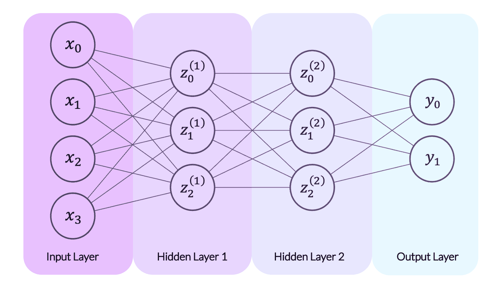

神经网络中的每一层都由*神经元*组成，如图上所示的圆圈。神经元仅仅是标量值。在*输入层*中，每个神经元代表一个单独的预测因子。在上面的图中，输入层有四个神经元，分别标记为 \(x_0\) 到 \(x_3\)，每个代表一个单独的预测因子。输入层中的神经元随后确定第一隐藏层中的神经元，分别标记为 \(\super{z}{1}_0\) 到 \(\super{z}{1}_2\)。我们将在稍后讨论*如何*，但现在只需注意上图从输入层神经元到第一隐藏层神经元的线条。一旦第一隐藏层的神经元被设置，它们就成为了下一层的预测因子，作用就像输入层一样。当最终隐藏层的神经元被固定时，它们作为输出层的预测因子。

一个自然的问题是我们的人工神经网络应该包含多少层。这个问题没有单一的答案，因为层数是由模型选择决定的。任何真正的神经网络都将包含一个输入层、一个输出层和至少一个隐藏层。上面的网络有两个隐藏层。请注意，上标表示隐藏层的编号，例如 \(z_{0}^{(1)}\) 到 \(z_2^{(1)}\) 在第一隐藏层，\(z_{0}^{(2)}\) 到 \(z_2^{(2)}\) 在第二隐藏层。我们也可以考虑输入层作为一个外生的“隐藏层”，并用 \(z_{0}^{(0)}\) 到 \(z_3^{(0)}\) 来表示它。

另一个自然的问题是每一层应该包含多少个神经元。这在一定程度上是由模型器选择的，在某种程度上是预先确定的。如果我们的预测向量长度为 \(D\)，则输入层必须具有 \(D\) 个神经元。同样，输出层必须具有与目标变量数量相等的神经元。例如，如果我们的模型试图预测某个月份商店的收入和成本（两个目标），则输出层必须有两个神经元。然而，隐藏层的大小是由模型器选择的。神经元太少可能会导致欠拟合，因为网络无法从数据中捕捉到重要的模式，而神经元太多可能会导致过拟合，允许网络拟合与训练数据完全匹配的参数。

### 1.2 层之间的通信

现在我们来探讨一层如何与下一层进行通信的过程。在本节中，让我们用 \(\bz^{(a)}\) 和 \(\super{\bz}{b}\) 来表示任意两个连续层中的神经元向量。例如，\(\super{\bz}{a}\) 可能是一个输入层，而 \(\super{\bz}{b}\) 是第一个隐藏层，或者 \(\super{\bz}{a}\) 可能是一个隐藏层，而 \(\super{\bz}{b}\) 是后续的隐藏层。假设 \(\super{\bz}{a} \in \R^{D_a}\) 和 \(\super{\bz}{b} \in \R^{D_b}\)。

在前馈神经网络中，\(\super{\bz}{b}\) 中的每个神经元都是 \(\super{\bz}{a}\) 中每个神经元的函数。这个函数发生在两个阶段：首先是将 \(\super{\bz}{a}\) 线性映射到一维，然后是一个称为 *激活函数* 的非线性函数。让我们看看 \(\super{\bz}{b}\) 中的一个单个神经元，\(\super{z}{b}_i\)。从 \(\super{\bz}{a}\) 到 \(\super{z}{b}_i\) 的转换形式如下

\[\begin{split} \begin{align*} \super{h}{b}_i &= \bw_i^\top\super{\bz}{a} + c_i \\ \super{z}{b}_i &= f(\super{h}{b}_i), \end{align*} \end{split}\]

其中 \(\bw_i \in \R^{D_a}\) 是权重向量，\(c_i\) 是常数截距项，\(f()\) 是激活函数。请注意，\(\bw_i\) 和 \(c_i\) 是 \(\super{\bz}{b}\) 中第 \(i^\text{th}\) 个神经元的特定值，而 \(f()\) 通常在 \(\super{\bz}{b}\) 中所有神经元中是通用的。我们还可以将两个层之间的函数关系写成矩阵形式，如下所示。

\[\begin{split} \begin{align*} \super{\mathbf{h}}{b} &= \mathbf{W}\super{\bz}{a} + \mathbf{c} \\\ \super{\mathbf{z}}{b} &= f(\super{\mathbf{h}}{b}), \end{align*} \end{split}\]

其中 \(\mathbf{W} \in \R^{D_b \times D_a}\)，\(\mathbf{c} \in \R^{D_b}\) 且 \(f()\) 是逐元素应用。

注意

注意，我们还没有讨论 \(\mathbf{W}\)，\(\mathbf{c}\) 或 \(f()\) 如何确定。现在，让我们考虑这些都被视为固定的，并专注于网络的结构。我们如何确定这些值将在下面的优化部分讨论。

一旦 \(\super{\bz}{b}\) 被固定，我们就使用相同的过程来创建下一层，\(\super{\bz}{c}\)。在同时讨论许多层时，给 \(\mathbf{W}, \mathbf{c}\) 和 \(f()\) 添加上标以指示层是有帮助的。我们可以将 \(\super{\bz}{a}\) 到 \(\super{\bz}{b}\) 的传输以及 \(\super{\bz}{b}\) 到 \(\super{\bz}{c}\) 的传输写为

\[\begin{split} \begin{align*} \super{\bz}{b} &= \super{f}{b}\left(\super{\mathbf{W}}{b}\super{\bz}{a} + \super{\mathbf{c}}{b} \right) \\ \super{\bz}{c} &= \super{f}{c}\left(\super{\mathbf{W}}{c}\super{\bz}{b} + \super{\mathbf{c}}{c} \right). \\ \end{align*} \end{split}\]

以下是一个神经网络的更数学化的表示。网络从预测器的向量 \(\bx\) 开始。然后这个向量被乘以 \(\super{\mathbf{W}}{1}\) 并加上 \(\super{\mathbf{c}}{1}\)，总和为 \(\super{\mathbf{h}}{1}\)。然后我们对 \(\super{\mathbf{h}}{1}\) 应用激活 \(\super{f}{1}\)，从而得到我们的单个隐藏层，\(\super{\mathbf{z}}{1}\)。然后以相同的过程应用于 \(\super{\bz}{1}\)，从而得到我们的输出向量，\(\by\)。

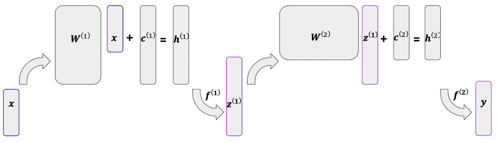

### 1.3 激活函数

正如我们所看到的，我们通过将前一层神经元的线性映射应用到一个神经元上，然后应用某种*激活函数*来创建一个层中的神经元。这个激活函数究竟是什么？激活函数是一个（通常是）非线性函数，它允许网络学习预测器（们）和目标变量（们）之间的复杂关系。

例如，假设目标变量 \(y_n\) 和预测器 \(x_n\) 之间的关系由以下公式给出

\[ y_n = |x_n| + \epsilon_n, \]

其中 \(\epsilon_n\) 是一个噪声项。尽管它很简单，但这种关系不能被线性模型准确拟合。

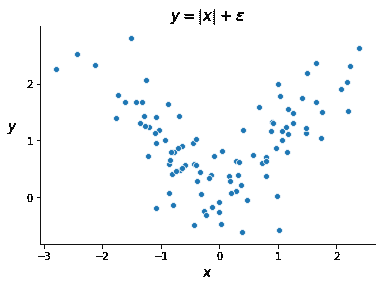

理想情况下，我们会将某个函数应用于预测器，并根据这个函数的结果使用不同的模型。在上面的例子中，如果 \(x_n > 0\)，则会“激活”模型 \(y_n \approx x_n\)，而如果 \(x_n \leq 0\)，则会“激活”模型 \(y_n \approx -x_n\)。因此得名“激活函数”。

存在许多常用的激活函数，决定使用哪个函数是构建神经网络时的一个主要考虑因素。在这里，我们将限制我们的讨论范围到两种最常见的函数：ReLU（线性整流单元）和 sigmoid 函数。线性激活函数（实际上是没有激活函数）也被讨论。

#### ReLU

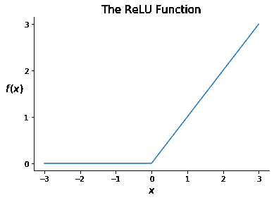

ReLU 是一种简单但极其常见的激活函数。它被定义为

\[ f(x) = \text{max}(x, 0). \]

这样一个简单的函数如何使神经网络受益？ReLU 就像一个开关，选择性地打开和关闭通道。考虑将神经网络拟合到上面生成的数据集，其中 \(y_n = |x_n| + \epsilon_n\)。让我们使用以下图表表示的非常简单的网络。这个网络有一个预测器，一个包含两个神经元的单个隐藏层和一个输出变量。

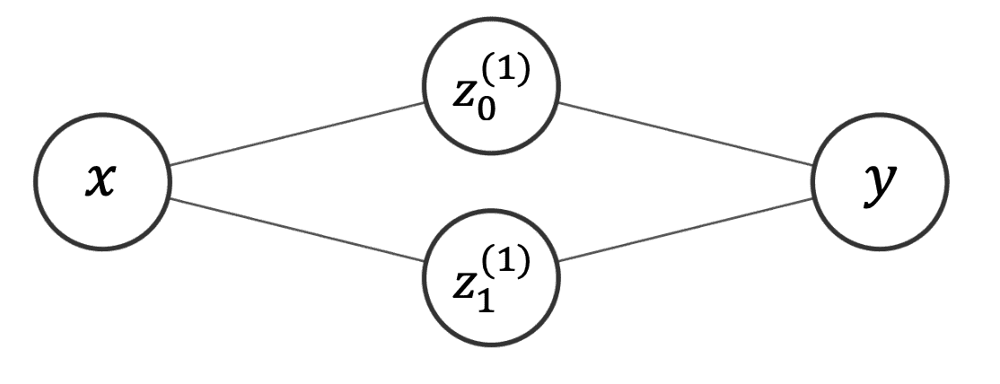

现在假设我们决定使用 \(f(\bx) = \text{ReLU}(\bx)\)，并得到以下参数：

\[\begin{split} \super{\mathbf{W}}{1} = \begin{pmatrix} 1 \\ -1 \end{pmatrix}, \hspace{1mm} \super{\mathbf{c}}{1} = \begin{pmatrix} 0 \\ 0 \end{pmatrix}, \hspace{1mm} \super{\mathbf{W}}{2} = \begin{pmatrix} 1 & 1 \end{pmatrix}, \hspace{1mm} \mathbf{c}^{(2)} = 0. \end{split}\]

这等价于以下完整模型

\[\begin{split} \begin{align*} \super{\bz}{1} &= \text{ReLU}\left( \begin{pmatrix} 1 \\ -1 \end{pmatrix} x \right) \\ y &= \begin{pmatrix} 1 & 1 \end{pmatrix} \super{\bz}{1}. \end{align*} \end{split}\]

这个模型能否拟合我们的数据集？假设 \(x_n = c\) 对于某个正的常数 \(c\)。那么我们将得到

\[\begin{split} \begin{align*} \super{\bz}{1} &= \text{ReLU}\left( \begin{pmatrix} c \\ -c \end{pmatrix} \right) = \begin{pmatrix} c \\ 0 \end{pmatrix} \\ y &= \begin{pmatrix} 1 & 1 \end{pmatrix} \begin{pmatrix} c \\ 0 \end{pmatrix} = c. \end{align*} \end{split}\]

因此，我们将预测 \(y_n = |x_n| = c\)，这是一个合理的预测结果！同样，如果 \(x_n = -c\)，我们也会得到有效的预测 \(y_n = |x_n| = c\)。ReLU 能够通过根据 \(x_n\) 的值激活不同的通道来实现这一结果：如果 \(x_n\) 大于 0，它激活 \(y_n = x_n\)；如果 \(x_n\) 小于 0，它激活 \(y_n = -x_n\)。

正如我们将在下一节中看到的，拟合神经网络包括计算激活函数的梯度。幸运的是，ReLU 有一个直接的导数：

\[\begin{split} \frac{\partial}{\partial x} \text{ReLU}(x) = \begin{cases} 1, & x > 0 \\ 0, & x \leq 0\. \end{cases} \end{split}\]

注意，这个导数在 0 处技术上没有定义。在实践中，我们很少会精确地将激活函数应用于 0，尽管在这种情况下，惯例是将其导数设为 0。

#### Sigmoid

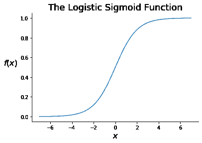

第二个常见的激活函数是 *逻辑 sigmoid 函数*，通常简称为 *sigmoid 函数*。这个函数在 第三章 的逻辑回归背景下被引入。sigmoid 函数定义为

\[ \sigma(x) = \frac{1}{1 + \exp(-x)}. \]

注意到 sigmoid 函数接受任何实数值并返回介于 0 和 1 之间的值。因此，sigmoid 函数通常应用于网络的最后一隐藏层，以便在输出层返回概率估计。这使得它在分类问题中很常见。

正如我们在第三章中看到的，sigmoid 函数的一个方便的事实是，我们可以用自身来表示其导数。

\[ \dadb{\sigma(x)}{x} = \frac{\exp(-x)}{\left( 1 + \exp(-x) \right)²} = \frac{1}{1 + \exp(-x)} \cdot \frac{\exp(-x)}{1 + \exp(-x)} = \sigma(x)\left(1 - \sigma(x)\right). \]

#### 线性激活函数

另一个可能的激活函数是“线性”激活函数，它与完全不使用激活函数相同。线性激活函数简单地返回其输入。它定义为

\[ f(x) = x, \]

并且有导数

\[ \dadb{f(x)}{x} = 1\. \]

线性激活函数通常用于神经网络回归的最后一层之前。我们不想将拟合值约束在某个范围内或将其一半设置为 0，而是希望保持它们原样。

## 2. 优化

我们现在已经看到，神经网络通过一系列线性映射和激活函数运行。层 \(\ell\) 的线性映射由 \(\super{\mathbf{W}}{\ell}\) 和 \(\super{\mathbf{c}}{\ell}\) 中的参数确定，也称为*权重*。本节讨论了神经网络中权重拟合的过程，称为*反向传播*。

本页的其余部分需要大量的矩阵微分，这在数学附录中介绍。请注意，我们使用“分子布局”，这意味着对于 \(\by \in \R^m\) 和 \(\bx \in \R^n\)，我们写 \(\partial\by/\partial\bx\) 为

\[\begin{split} \dadb{\by}{\bx} = \begin{bmatrix} \dadb{y_1}{x_1} & \dots & \dadb{y_1}{x_n} \\ & \dots & \\ \dadb{y_m}{x_1} & \dots & \dadb{y_m}{x_n} \end{bmatrix} \in \R^{m \times n}. \end{split}\]

### 2.1 反向传播

假设我们为我们的网络选择一些损失函数 \(\mathcal{L}\) 以最小化。请注意，因为我们的目标变量是多维的，\(\boldsymbol{\mathcal{L}}\) 函数将是一个损失向量（例如，第一个目标的损失，第二个目标的损失等）。为了找到网络的优化权重，我们可以进行梯度下降，反复对每个权重求损失函数的导数并相应调整。正如我们将看到的，这涉及到找到网络最终权重的梯度，然后使用链式法则找到先前权重的梯度。在这个过程中，我们沿着网络向后移动，因此得名“反向传播”。

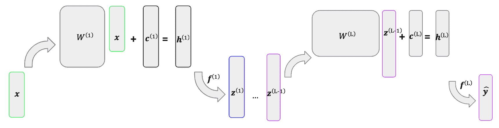

考虑对上述网络进行梯度下降。将损失函数写成 \(\mathcal{L}(\hat{\by})\)，其中 \(\hat{\by}\) 是网络的输出。让我们首先写出 \(\mathcal{L}\) 关于 \(\super{\mathbf{W}}{L}\)，我们网络中的最终权重矩阵的导数。我们可以使用链式法则来完成这个操作，如下所示。

\[ \dadb{\mathcal{L}(\hat{\by})}{\super{\mathbf{W}}{L}} = \dadb{\mathcal{L}(\hat{\by})}{\hat{\by}}\cdot\dadb{\hat{\by}}{\super{\mathbf{h}}{L}}\cdot \dadb{\super{\mathbf{h}}{L}}{\super{\mathbf{W}}{L}} \]

\(\super{\mathbf{c}}{L}\) 的梯度是等价的。这些计算背后的数学将在下一节中介绍。接下来，我们想要找到 \(\super{\mathbf{W}}{L-1}\) 的梯度，如下所示。

\[ \dadb{\mathcal{L}(\hat{\by})}{\super{\mathbf{W}}{L-1}} = \dadb{\mathcal{L}(\hat{\by})}{\hat{\by}} \cdot\dadb{\hat{\by}}{\super{\mathbf{h}}{L}} \cdot \dadb{\super{\mathbf{h}}{L}}{\super{\mathbf{z}}{L-1}} \cdot \dadb{\super{\mathbf{z}}{L-1}}{\super{\mathbf{h}}{L-1}} \cdot \dadb{\super{\mathbf{h}}{L-1}}{\super{\mathbf{W}}{L-1}} \]

这个表达式看起来很丑陋，但有一个捷径。这个梯度与 \(\super{\mathbf{W}}{L}\) 的梯度共享前两个项，它们代表 \(\super{\mathbf{h}}{L}\) 的梯度。为了节省时间（在写出梯度以及在实践中计算它们时），我们可以记录这个梯度，\(\nabla \super{\mathbf{h}}{L}\)，并在需要的地方应用它。我们也可以对 \(\nabla \mathbf{h}^{(L-1)}\) 做同样的事情，这简化了 \(\mathbf{W}^{(L-2)}\) 的梯度：

\[ \dadb{\mathcal{L}(\hat{\by})}{\super{\mathbf{W}}{L-2}} = \nabla \super{\mathbf{h}}{L-1} \cdot \dadb{\super{\mathbf{h}}{L-1}}{\super{\mathbf{z}}{L-2}} \cdot \dadb{\super{\mathbf{z}}{L-2}}{\super{\mathbf{h}}{L-2}} \cdot \dadb{\super{\mathbf{h}}{L-2}}{\super{\mathbf{W}}{L-2}}. \]

我们继续这个过程，直到达到第一组权重。

我们现在已经直观地看到了如何找到我们网络中许多权重的梯度。为了进行反向传播，我们只需使用这些梯度来运行梯度下降。接下来，让我们看看如何实际计算这些梯度。

### 2.2 梯度计算

在本节中，我们将推导出反向传播中使用的梯度。对于这个过程中的每一次迭代，我们需要知道我们的损失函数相对于整个网络中每个权重的导数。对于上面显示的网络，这需要计算以下梯度：

\[ \dadb{\mathcal{L}(\hat{\by})}{\superb{W}{1}}, \dadb{\mathcal{L}(\hat{\by})}{\superb{c}{1}}, \dots, \dadb{\mathcal{L}(\hat{\by})}{\superb{W}{L}}, \text{ 和 } \dadb{\mathcal{L}(\hat{\by})}{\superb{c}{L}}. \]

由于我们将使用链式法则来找到这些梯度，因此我们需要在途中计算其他梯度。所有必要的梯度都在下面推导出来。注意，以下子节按反向顺序（正如反向传播所做的那样）覆盖了网络单层中的各个阶段。

注意

注意，本节的其余部分只考虑一次一个观测值。例如，向量\(\by\)指的是单个观测值的输出变量，而不是多个观测值的 1 维输出变量的向量。同样，\(\partial \mathcal{L}(\hat{\by})/\partial\hat{\by}\)指的是相对于单个观测值输出的导数。最后一节讨论了如何将多个观测值的导数组合起来。

对于以下内容，假设总共有\(L\)层。也假设层\(\ell\)的大小为\(D_\ell\)，除了输入层和输出层，它们的大小分别为\(D_x\)和\(D_y\)。

#### 2.2.1 损失函数及其梯度

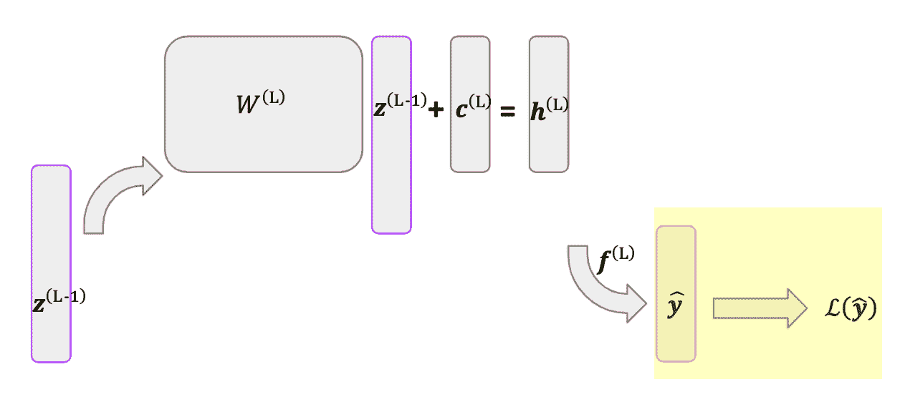

反向传播从网络结束的地方开始：损失函数\(\mathcal{L}(\hat{\by})\)。让我们先介绍一些常见的损失函数及其相对于我们预测的导数，\(\hat{\by}\)。稍后，我们将使用链式法则，使用这些导数来计算相对于我们网络权重的导数。

对于定量输出变量，一个常见的损失函数是残差平方和。对于单个观测值，损失是

\[ \mathcal{L}_{RSS}(\hat{\by}) = (\by - \hat{\by})². \]

注意

注意，损失是我们的预测(\(\hat{\by}\))和真实目标(\(\by\))的函数。然而，由于真实目标是固定的，我们只能操作\(\hat{\by}\)，因此我们将损失写成仅是\(\hat{\by}\)的函数。

注意，我们有一个损失向量，因为存在多个输出变量，并且我们独立地考虑每个变量的损失。现在，对于反向传播的第一步，我们计算这个损失相对于\(\hat{\by}\)的导数，它简单地给出

\[ \dadb{\mathcal{L}_{RSS}(\hat{\by})}{\hat{\by}} = -2(\by - \hat{\by})^\top \in \R^{1 \times D_y}. \]

由于我们使用的是分子布局约定，这个导数是一个长度为\(D_y\)的行向量，或者等价地，一个\(1\)乘以\(D_y\)的矩阵。

对于二元分类问题，一个常见的损失函数是对数损失或交叉熵，给出

\[ \mathcal{L}_{Log}(\hat{\by}) = -\Big(\by\log \hat{\by}+(1-\by)\log(1-\hat{\by})\Big), \]

其中\(\hat{\by}\)中的第\(i^\text{th}\)个条目给出了第\(i^\text{th}\)个输出变量等于 1 的估计概率。这个损失函数相对于\(\hat{\by}\)的导数由以下给出

\[ \begin{align*} \dadb{\mathcal{L}_{Log}(\hat{\by})}{\hat{\by}} &= \left(-\frac{\by}{\hat{\by}} + \frac{1-\by}{1-\hat{\by}} \right)^\top\in \R^{1 \times D_y}. \end{align*} \]

一旦我们计算出\(\partial \mathcal{L}(\hat{\by})/\partial\hat{\by}\)，我们就可以进一步向网络的反方向移动。由于\(\hat{\by}\)是激活函数的结果，反向传播的下一步是计算我们激活函数的导数。

#### 2.2.2 激活函数的梯度

回想一下，\(\superb{z}{\ell}\)，层 \(\ell\) 的输出层，是通过对线性映射 \(\superb{h}{\ell}\) 应用激活函数得到的结果。这包括最终层的输出，\(\mathbf{\hat{y}}\)，我们也可以将其写作 \(\superb{z}{L}\)。

##### ReLU

假设我们有 \(\superb{z}{\ell} = \super{f}{\ell}(\superb{h}{\ell})\) 其中 \(\super{f}{\ell}\) 是 ReLU 函数。我们感兴趣的是 \(\partial \superb{z}{\ell}/\partial \superb{h}{\ell}\)。对于 \(i \neq j\)，我们有

\[ \frac{\partial \super{z}{\ell}_i}{\partial \super{h}{\ell}_j} = 0, \]

由于 \(\super{z}{\ell}_i\) 不是 \(\super{h}{\ell}_j\) 的函数。然后使用 ReLU 导数，我们有

\[\begin{split} \dadb{\super{z}{\ell}_i}{\super{h}{\ell}_i} = \begin{cases} 1, & \super{h}{\ell}_i > 0 \\ 0, & \super{h}{\ell}_i \leq 0\. \end{cases} \end{split}\]

我们可以简洁地写出整个导数

\[ \dadb{\superb{z}{\ell}}{\superb{h}{\ell}} = \text{diag}(\superb{h}{\ell} > 0) \in \R^{D_\ell \times D_\ell}. \]

##### Sigmoid

现在假设我们有 \(\superb{z}{\ell} = \super{f}{\ell}(\superb{h}{\ell})\) 其中 \(\super{f}{\ell}\) 是 sigmoid 函数。再次，偏导数 \(\partial \super{z}{\ell}_i/\partial \super{h}{\ell}_j\) 对于 \(i \neq j\) 是 0。通过 sigmoid 导数，我们有

\[ \dadb{\super{z}{\ell}_i}{\super{h}{\ell}_i} = \sigma(\super{h}{\ell}_i)(1-\sigma(\super{h}{\ell}_i)). \]

我们可以再次简洁地写出整个结果

\[ \begin{align*} \dadb{\superb{z}{\ell}}{\superb{h}{\ell}} &= \text{diag}\left(\sigma(\superb{h}{\ell})(1-\sigma(\superb{h}{\ell})\right) \in \R^{D_\ell \times D_\ell}. \end{align*} \]

##### 线性

最后，假设我们有 \(\superb{z}{\ell} = \super{f}{\ell}(\superb{h}{\ell})\) 其中 \(\super{f}{\ell}\) 是线性函数。然后我们有

\[\begin{split} \dadb{\super{z}{\ell}_i}{\super{h}{\ell}_j} = \begin{cases} 1 , & i = j\\ 0, & i \neq j. \end{cases} \end{split}\]

整个梯度可以简单地表示为

\[ \dadb{\superb{z}{\ell}}{\superb{h}{\ell}} = I_{D_{\ell}} \in \R^{D_\ell \times D_\ell}. \]

#### 2.2.3 权重的梯度

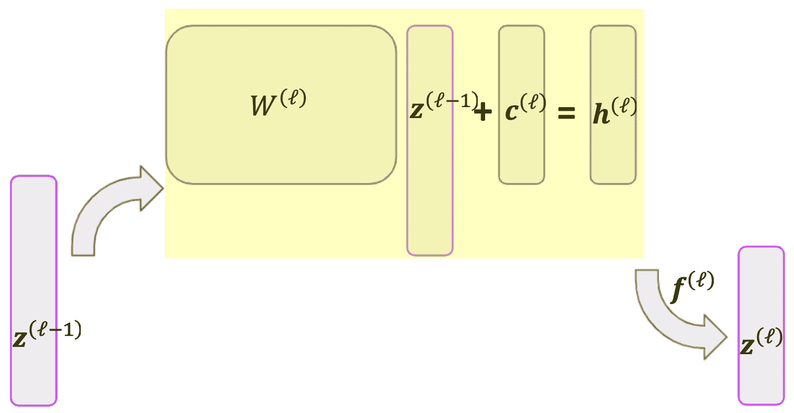

我们现在终于能够计算我们权重的梯度了。具体来说，我们将计算 \(\partial \superb{h}{\ell}/ \partial \superb{c}{\ell}\) 和 \(\partial \superb{h}{\ell}/ \partial \superb{W}{\ell}\)，结合我们之前通过链式法则得到的结果，这将使我们能够获得损失函数相对于层 \(\ell\) 权重的导数。

回想一下，我们通过

\[ \superb{h}{\ell} = \superb{W}{\ell}\superb{z}{\ell-1} + \superb{c}{\ell}, \]

给出简单的导数

\[ \dadb{\super{\mathbf{h}}{\ell}}{\superb{c}{\ell}} = I_{D_\ell} \in \R^{D_\ell \times D_\ell}. \]

导数\(\partial \superb{h}{\ell}/ \partial \superb{W}{\ell}\)更复杂。由于我们是对一个向量相对于一个矩阵求导，我们的结果将是一个张量。这个张量的形状将是\(D_\ell \times (D_\ell \times D_{\ell - 1})\)，因为\(\superb{h}{\ell} \in R^{D_\ell}\)且\(\superb{W}{\ell} \in \R^{D_\ell \times D_{\ell-1}}\)。这个张量的第一个元素由\(\partial \super{h}{\ell}_1/ \partial \superb{W}{\ell}\)给出。使用上面给出的\(\superb{h}{\ell}\)的表达式，我们看到这是一个矩阵，第一行有\((\superb{z}{\ell - 1})^\top\)，其他地方都是 0。更一般地，这个导数的第\(i^\text{th}\)项将除了其第\(i^\text{th}\)行有\((\superb{z}{\ell - 1})^\top\)外，其他都是 0。这如下所示。

\[\begin{split} \begin{align*} \dadb{\superb{h}{\ell}}{\superb{W}{\ell}} &= \begin{bmatrix} \dadb{\super{h}{\ell}_1}{\superb{W}{\ell}} \\ \\ \dots \\ \\ \dadb{\super{h}{\ell}_{n_\ell}}{\superb{W}{\ell}} \end{bmatrix} = \begin{bmatrix} \begin{bmatrix} \superb{z}{\ell - 1})^\top \\ ... \\ \mathbf{0}^\top \end{bmatrix}\\ \dots \\ \begin{bmatrix} \mathbf{0}^\top \\ \dots \\ (\superb{z}{\ell - 1})^\top\end{bmatrix}\end{bmatrix} \in \R^{D_\ell \times (D_\ell \times D_{\ell - 1})}. \end{align*} \end{split}\]

#### 2.2.4 最后一个梯度

现在我们已经拥有了计算相对于最终层权重的损失函数导数的所有必要结果。例如，我们可以评估

\[ \dadb{\mathcal{L}(\hat{\by})}{\super{\mathbf{W}}{L}} = \dadb{\mathcal{L}(\hat{\by})}{\hat{\by}}\cdot\dadb{\hat{\by}}{\super{\mathbf{h}}{L}}\cdot \dadb{\super{\mathbf{h}}{L}}{\super{\mathbf{W}}{L}} \]

使用 2.1、2.2 和 2.3 节的结果。然而，为了获得相对于前一层权重的损失函数的导数，我们需要一个额外的导数：\(\superb{h}{\ell}\)，即层\(\ell\)中的线性映射相对于\(\superb{z}{\ell - 1}\)，即前一层输出的导数。幸运的是，这个导数很简单：

\[ \dadb{\superb{h}{\ell}}{\superb{z}{\ell - 1}} = {\superb{W}{\ell}}. \]

现在我们有了\(\partial \superb{h}{\ell}/\partial \superb{z}{\ell - 1}\)，我们重用 2.2 和 2.3 节的结果来计算\(\partial \superb{z}{\ell - 1}/\partial \superb{h}{\ell - 1}\)和\(\partial \superb{h}{\ell - 1}/ \partial \superb{W}{\ell - 1}\)（分别）；这为我们计算前一层权重梯度提供了所有必要的结果。然后我们用层\(\ell - 2\)到第一层重复这个过程。

### 2.3 使用链式法则组合结果

我们已经看到了许多单个导数。最终，我们真正关心的是损失函数相对于网络权重的导数。让我们通过计算损失函数相对于上述熟悉网络中最终层权重的导数来回顾一下。假设 \(\super{f}{2}\) 是 Sigmoid 函数，我们使用对数损失。对于 \(\superb{W}{2}\)，我们得到以下结果。

\[\begin{split} \begin{align*} \dadb{\mathcal{L}(\hat{\by})}{\superb{W}{2}} &= \dadb{\mathcal{L}(\hat{\by})}{\hat{\by}}\cdot\dadb{\hat{\by}}{\super{\mathbf{h}}{2}}\cdot \dadb{\super{\mathbf{h}}{2}}{\superb{W}{2}} \\ &=-\left(\frac{\by}{\hat{\by}} + \frac{1-\by}{1-\hat{\by}} \right)^\top \cdot \text{diag}\left(\sigma(\superb{h}{2})(1- \sigma(\superb{h}{2}))\right)\cdot \mathbf{T} \\ &= -\begin{bmatrix} (\frac{y_1}{\hat{y}_1} + \frac{1-y_1}{1-\hat{y}_1})\cdot \sigma(\super{h}{2}_1)(1-\sigma(\super{h}{2}_1))\cdot \superb{z}{1} \\ \dots \\ (\frac{y_{n_2}}{\hat{y}_{n_2}} + \frac{1-y_{n_2}}{1-\hat{y}_{n_2}})\cdot \sigma(\super{h}{2}_{n_2})(1-\sigma(\super{h}{2}_{n_2}))\cdot \superb{z}{1} \end{bmatrix} \in \R^{n_2 \times n_1}, \end{align*} \end{split}\]

其中 \(\mathbf{T}\) 是第 2.2.3 节中讨论的张量导数。

对于 \(\superb{c}{2}\)，我们得到

\[\begin{split} \begin{align*} \dadb{\mathcal{L}(\hat{\by})}{\superb{c}{2}} &= \dadb{\mathcal{L}(\hat{\by})}{\hat{\by}}\cdot\dadb{\hat{\by}}{\super{\mathbf{h}}{2}}\cdot \dadb{\super{\mathbf{h}}{2}}{\superb{c}{2}} \\ &=-\left(\frac{\by}{\hat{\by}} + \frac{1-\by}{1-\hat{\by}} \right)^\top \cdot \text{diag}\left(\sigma(\superb{h}{2})(1- \sigma(\superb{h}{2}))\right)\cdot I_{n_2} \\ &= -\begin{bmatrix} (\frac{y_1}{\hat{y}_1} + \frac{1-y_1}{1-\hat{y}_1})\cdot \sigma(\super{h}{2}_1)(1-\sigma(\super{h}{2}_1)) \\ \dots \\ (\frac{y_{n_2}}{\hat{y}_{n_2}} + \frac{1-y_{n_2}}{1-\hat{y}_{n_2}})\cdot \sigma(\super{h}{2}_{n_2})(1-\sigma(\super{h}{2}_{n_2})) \end{bmatrix} \in \R^{n_2}. \end{align*} \end{split}\]

### 3. 结合观察

到目前为止，我们只考虑了单个观察的损失函数的导数。在训练网络时，我们当然希望考虑整个数据集。这样做的一种方法是将观察到的损失函数相对于权重的导数简单相加。由于数据集上的损失是单个观察损失的总和，而求和的导数是导数的和，因此我们可以简单地将上述结果相加。例如，为了找到相对于最终权重矩阵 \(\superb{W}{L}\) 的损失函数的导数，我们可以遍历观察并求和单个导数：

\[ \dadb{\mathcal{L}(\{\hat{\by}_n\}_{n = 1}^N))}{\superb{W}{L}} = \dadb{\sumN \mathcal{L}(\hat{\by}_n)}{\superb{W} {L}} = \sumN \dadb{\mathcal{L}(\hat{\by}_n)}{\superb{W}{L}}. \]

虽然这种方法简单直接，但在计算上效率不高。本节其余部分概述了一种更复杂但*快得多*的方法。

#### 3.1 新的表示

到目前为止，我们一直将预测器和输出视为向量。网络从 \(\bx\) 开始，输出 \(\superb{z}{1}\)。然后它使用 \(\superb{z}{1}\) 进行预测并输出 \(\superb{z}{2}\)。它重复这个过程，直到 \(\superb{z}{L-1}\) 输出 \(\mathbf{\hat{y}}\)。为了包含多个观测值，我们可以将这些向量转换为矩阵。再次假设我们的数据集由 \(N\) 个观测值组成，其中 \(\bx_n \in \R^{D_x}\) 和 \(\by_n \in \R^{D_y}\)。我们开始于 \(\bX \in \R^{N \times D_x}\)，其第 \(n\) 行是 \(\bx_n\)。请注意，在 \(\bX\) 中，\(\bx_n\) 是一个行向量；为了与前面的章节保持一致，我们希望它是一个列向量。因此，我们将使用 \(\bX^\top\) 而不是 \(\bX\)。

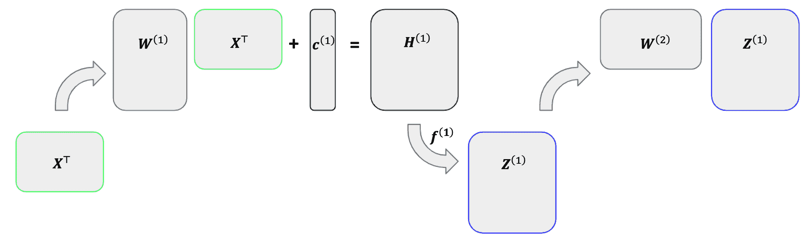

我们不会一次将每个观测值通过网络，而是将所有观测值一起输入，并为每个观测值分配其自己的列。在 \(\bX^\top\) 中的每一列代表一个观测值的预测器。然后我们乘以 \(\superb{W}{1}\) 并 *逐元素* 加上 \(\superb{c}{1}\) 以得到 \(\superb{H}{1}\)。在 \(\superb{H}{1}\) 中的每一列代表 \(\bX^\top\) 中对应列的线性组合向量。然后我们通过激活函数传递 \(\superb{H}{1}\) 以获得 \(\superb{Z}{1}\)。同样，在 \(\superb{Z}{1}\) 中的每一列代表 \(\bX^\top\) 中对应观测值的输出向量。然后我们重复这个过程，其中 \(\superb{Z}{1}\) 作为下一层的预测器矩阵。最终，我们将获得一个矩阵 \(\hat{\mathbf{Y}}^\top \in \R^{D_y \times N}\)，其第 \(n\) 列代表第 \(n\) 个观测值的拟合值向量。

#### 3.2 梯度

虽然这种新的表示方式更高效，但它也使得梯度更加复杂，因为我们是在矩阵而不是向量上求导。通常，一个矩阵相对于另一个矩阵的导数将是一个四维张量。幸运的是，有一个捷径。

对于我们网络中的每个参数 \(\theta\)，我们将通过询问“\(\theta\) 影响下一层的哪些参数”来找到其梯度。假设答案是某个集合 \(\{\psi_1, \psi_2, \dots, \psi_n\}\)，我们将计算损失函数相对于 \(\theta\) 的导数，如下所示

\[ \dadb{\mathcal{L}}{\theta} = \sum_{i = 1}^n \dadb{L}{\psi_i}\cdot \dadb{\psi_i}{\theta}. \]

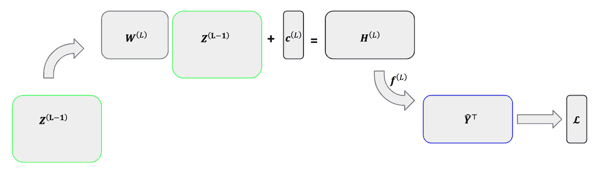

回想一下，我们的损失函数 \(\bf{\mathcal{L}}\) 是一个大小为 \(D_y\) 的向量，因为我们有 \(D_y\) 个输出变量。这个损失向量是预测矩阵 \(\hat{\mathbf{Y}}^\top\) 的 *行向量* 函数，这意味着 \(\mathbf{\mathcal{L}}\) 中的第 \(d^\text{th}\) 个元素仅是 \(\hat{\mathbf{Y}}^\top\) 的第 \(d^\text{th}\) 行的函数（这代表了第 \(d^\text{th}\) 个输出变量在观察中的拟合值）。对于 \(\hat{\mathbf{Y}}^\top\) 中的 \((i, d)^\text{th}\) 个元素，我们只需要考虑 \(\mathbf{\mathcal{L}}\) 中第 \(d^\text{th}\) 个元素的导数——\(\mathcal{L}\) 中任何其他元素相对于 \(\hat{\mathbf{Y}}^\top_{i, d}\) 的导数是 0。然后我们可以使用以下梯度来代替四维张量。

\[\begin{split} \dadb{\mathbf{\mathcal{L}}}{\mathbf{\hat{Y}}^\top} = \begin{bmatrix} \dadb{\mathcal{L}_{1}}{\mathbf{\hat{Y}}^\top_{1,1}} & ... & \dadb{\mathcal{L}_{1}}{\mathbf{\hat{Y}}^\top_{1,N}} \\ & ... & \\ \dadb{\mathcal{L}_{D_y}}{\mathbf{\hat{Y}}^\top_{D_y,1}} & ... & \dadb{\mathcal{L}_{D_y}}{\mathbf{\hat{Y}}^\top_{D_y,N}}\end{bmatrix} \end{split}\]

接下来，我们考虑 \(\mathbf{\hat{Y}}^\top\) 对 \(\superb{H}{L}\) 的导数。注意 \(\mathbf{\hat{Y}}^\top\) 是 \(\superb{H}{L}\) 的 *逐元素* 函数。这意味着我们只需要考虑前者中每个元素相对于后者中相应元素的梯度。这给我们

\[\begin{split} \dadb{\mathbf{\hat{Y}}^\top}{\superb{H}{L}} = \begin{bmatrix} \dadb{\mathbf{\hat{Y}}^\top_{1,1}}{\superb{H}{L}_{1,1}} & ... & \dadb{\mathbf{\hat{Y}}^\top_{1,N}}{\superb{H}{L}_{1,N}} \\ & ... & \\ \dadb{\mathbf{\hat{Y}}^\top_{D_y,1}}{\superb{H}{1}_{D_y,1}} & ... & \dadb{\mathbf{\hat{Y}}^\top_{D_y,N}}{\superb{L}{L}_{D_y,N}} \end{bmatrix}. \end{split}\]

现在，让我们使用上面描述的快捷方式。由于 \(\superb{H}{L}\) 中的每个元素只影响 \(\mathbf{\hat{Y}}^\top\) 中的相应元素，我们通过逐元素乘以上述两个梯度来计算 \(\partial \mathcal{L}/\partial \superb{H}{L}\)。即，

\[ \dadb{\mathcal{L}}{\superb{H}{L}} = \dadb{\mathbf{\mathcal{L}}}{\mathbf{\hat{Y}}^\top} \circ \dadb{\mathbf{\hat{Y}}^\top}{\superb{H}{L}}, \]

其中 \(\circ\) 是逐元素乘法运算符，也称为 *Hadamard 积*。

接下来是 \(\superb{c}{L}\)。在 \(\superb{H}{L}\) 中，每个元素只影响 \(\mathbf{\hat{Y}}^\top\) 中的一个元素，而在 \(\superb{c}{L}\) 中，每个元素影响 \(\superb{H}{L}\) 中的 \(N\) 个元素——其对应行的每个元素。考虑 \(\superb{c}{L}\) 中的第一个元素。由于这个元素影响 \(\superb{H}{L}\) 第一行的每个元素，链式法则给出

\[ \dadb{\mathcal{L}}{\super{c}{L}_1} = \sumN \dadb{\mathcal{L}}{\superb{H}{L}_{1,n}}\cdot\dadb{\superb{H}{L}_{1,n}}{\super{c}{L}_1}. \]

幸运的是，\(\partial \superb{H}{L}_{1,n}/\partial \super{c}{L}_1\) 等于 1，因为 \(\super{c}{L}_1\) 是一个截距项。这意味着损失函数相对于 \(\superb{c}{1}\) 的导数仅仅是 \(\partial\mathcal{L}/\partial \superb{H}{L}\) 的行和，或者说

\[ \dadb{\mathcal{L}}{\super{c}{L}_i} = \sumN \dadb{\mathcal{L}}{\superb{H}{L}_{i,n}}. \]

接下来，我们有 \(\superb{W}{L}\)。使用我们的快捷方式，我们询问“\(\superb{W}{L}\) 的 \((i, j)^\text{th}\) 个条目影响哪些值？”由于 \(\superb{H}{L} = \superb{W}{L}\superb{Z}{L-1}\)，我们有

\[ \superb{H}{L}_{i,n} = \superb{W}{L}_{i, j} \superb{Z}{L-1}_{j,n} \hspace{1mm} \forall \hspace{1mm} n \in \{1, \dots, N\}. \]

这告诉我们 \(\superb{W}{L}_{i,j}\) 影响到 \(\superb{H}{L}\) 的第 \(i\) 行的每个条目，并给出导数 \(\partial{\superb{H}{L}_{i, n}}/\partial \superb{W}{L}_{i, j} = \superb{Z}{L-1}_{j, n}.\) 因此，

\[ \dadb{\mathcal{L}}{\superb{W}{L}_{i, j}} = \sumN \dadb{\mathcal{L}}{\superb{H}{L}_{i, n}}\cdot\dadb{\superb{H}{L}_{i, n}}{\superb{W}{L}_{i, j}} = \sumN (\nabla \superb{H}{L})_{i, n}\cdot{\superb{Z}{L-1}_{j,n}}, \]

其中，\(\nabla \superb{H}{L}\) 是表示 \(\partial \mathcal{L}/\partial\superb{H}{L}\) 的矩阵。这可以通过使用张量点积为 \(\superb{W}{L}\) 中的每个元素计算，这将在构建部分中介绍。

最后，我们得到 \(\superb{Z}{L-1}\)。这种情况与 \(\superb{W}{L}\) 对称，采用相同的方法可以得到结果

\[ \dadb{\mathcal{L}}{\superb{Z}{L-1}_{i, n}} = \sum_{r = 1}^R \dadb{\mathcal{L}}{\superb{H}{L}_{r,n}}\cdot\dadb{\superb{H}{L}_{r, n}}{\superb{Z}{L-1}_{i, n}} = \sum_{r = 1}^R {(\nabla \superb{H}{L})}_{r, n}\cdot{\superb{W}{L}_{r,i}}. \]

再次，所有 \(\superb{Z}{L-1}\) 的导数可以使用张量点积一次计算出来。

## 1. 模型结构

在本章中，假设我们拥有训练数据 \(\{\bx_n, \by_n\}_{n = 1}^N\)，其中 \(\bx_n \in \R^{D_x}\)——这*不*包括截距项，并且 \(\by_n \in \R^{D_y}\) 对于 \(n = 1, 2, \dots, N\)。换句话说，对于每个观测值，我们有 \(D_x\) 个预测变量和 \(D_y\) 个目标变量。在本章中，这些将主要被称为*输入*和*输出*变量，分别。请注意，与前面的章节不同，我们可能现在有一个*向量*的目标变量而不是单个值。如果每个观测值只有一个目标变量（即 \(D_y = 1\)），我们将将其写作 \(y_n\) 而不是 \(\by_n\)。

### 1.1 概述

下面的图是表示基本神经网络的有助于理解的表达方式。神经网络在层中操作。网络从*输入层*开始，由单个观察的预测因子向量组成。这在图中由 \(x_0, \dots, x_3\) 表示（表示这里 \(D_x = 4\)）。然后网络通过一个或多个*隐藏层*。第一隐藏层是输入层的函数，每个后续的隐藏层是前一个隐藏层的函数。（我们将在稍后详细讨论这些函数）。下面的网络有两个隐藏层。最后，网络从最后一个隐藏层进入*输出层*，表示目标变量或变量。在下面的网络中，目标变量是二维的（即 \(D_y = 2\)），所以该层由 \(y_0\) 和 \(y_1\) 的值表示。

注意

像下面的图这样的图通常用来表示神经网络。请注意，这些图一次只显示一个观察。例如，\(x_0, \dots x_3\) 代表一个观察中的四个预测因子，而不是四个不同的观察。

神经网络中的每一层都由*神经元*组成，如图上所示的圆圈。神经元仅仅是标量值。在*输入层*中，每个神经元代表一个单独的预测因子。在上面的图中，输入层有四个神经元，分别标记为 \(x_0\) 到 \(x_3\)，每个代表一个单独的预测因子。输入层的神经元随后决定了第一隐藏层的神经元，分别标记为 \(\super{z}{1}_0\) 到 \(\super{z}{1}_2\)。我们将在稍后讨论*如何*，但现在只需注意上图上从输入层的神经元到第一隐藏层神经元的线条。一旦第一隐藏层的神经元被设定，它们就成为了下一层的预测因子，作用就像输入层一样。当最终隐藏层的神经元被固定时，它们作为输出层的预测因子。

一个自然的问题是我们的人工神经网络应该包含多少层。这个问题没有单一的答案，因为层数是由模型选择决定的。任何真正的神经网络都将包含一个输入层、一个输出层和至少一个隐藏层。上面的网络有两个隐藏层。请注意，上标表示隐藏层的编号，例如 \(z_{0}^{(1)}\) 到 \(z_2^{(1)}\) 在第一隐藏层，而 \(z_{0}^{(2)}\) 到 \(z_2^{(2)}\) 在第二隐藏层。我们也可以将输入层视为一个外生的“隐藏层”，并用 \(z_{0}^{(0)}\) 到 \(z_3^{(0)}\) 来表示它。

另一个自然的问题是每一层应该包含多少个神经元。这在一定程度上由模型设计者选择，在某种程度上是预先确定的。如果我们的预测向量长度为 \(D\)，则输入层必须包含 \(D\) 个神经元。同样，输出层必须包含与目标变量数量相等的神经元。例如，如果我们的模型试图预测某个月份商店的收入和成本（两个目标），则输出层必须有两个神经元。然而，隐藏层的尺寸由模型设计者选择。神经元太少可能会导致欠拟合，因为网络无法从数据中捕捉到重要的模式，而神经元太多可能会导致过拟合，允许网络拟合与训练数据完全匹配的参数。

### 1.2 层之间的通信

现在我们转向一层与下一层之间通信的过程。在本节中，让 \(\bz^{(a)}\) 和 \(\super{\bz}{b}\) 代表任意两个连续层中的神经元向量。例如，\(\super{\bz}{a}\) 可能是一个输入层，而 \(\super{\bz}{b}\) 是第一个隐藏层，或者 \(\super{\bz}{a}\) 可能是一个隐藏层，而 \(\super{\bz}{b}\) 是随后的隐藏层。假设 \(\super{\bz}{a} \in \R^{D_a}\) 和 \(\super{\bz}{b} \in \R^{D_b}\)。

在前馈神经网络中，\(\super{\bz}{b}\) 中的每个神经元都是 \(\super{\bz}{a}\) 中每个神经元的函数。这个函数分为两个阶段：首先将 \(\super{\bz}{a}\) 线性映射到一维，然后是一个称为 *激活函数* 的非线性函数。让我们看看 \(\super{\bz}{b}\) 中的一个单个神经元，\(\super{z}{b}_i\)。从 \(\super{\bz}{a}\) 到 \(\super{z}{b}_i\) 的转换形式如下

\[\begin{split} \begin{align*} \super{h}{b}_i &= \bw_i^\top\super{\bz}{a} + c_i \\ \super{z}{b}_i &= f(\super{h}{b}_i), \end{align*} \end{split}\]

其中 \(\bw_i \in \R^{D_a}\) 是权重向量，\(c_i\) 是一个常数截距项，\(f()\) 是一个激活函数。请注意，\(\bw_i\) 和 \(c_i\) 是 \(\super{\bz}{b}\) 中第 \(i^\text{th}\) 个神经元的特定值，而 \(f()\) 通常在 \(\super{\bz}{b}\) 中所有神经元中是通用的。我们还可以用矩阵形式写出两个层之间关系的函数，如下所示。

\[\begin{split} \begin{align*} \super{\mathbf{h}}{b} &= \mathbf{W}\super{\bz}{a} + \mathbf{c} \\\ \super{\mathbf{z}}{b} &= f(\super{\mathbf{h}}{b}), \end{align*} \end{split}\]

其中 \(\mathbf{W} \in \R^{D_b \times D_a}\)，\(\mathbf{c} \in \R^{D_b}\) 且 \(f()\) 是逐元素应用。

注意

注意，我们尚未讨论 \(\mathbf{W}\)，\(\mathbf{c}\) 或 \(f()\) 的确定方法。现在，让我们假设这些都被固定，并关注网络的结构。我们如何确定这些值将在下面的优化部分讨论。

一旦 \(\super{\bz}{b}\) 被固定，我们就使用相同的过程来创建下一层，\(\super{\bz}{c}\)。当我们同时讨论许多层时，给 \(\mathbf{W}, \mathbf{c}\) 和 \(f()\) 添加上标是有帮助的，以表示层。我们可以将 \(\super{\bz}{a}\) 到 \(\super{\bz}{b}\) 的传输以及随后 \(\super{\bz}{b}\) 到 \(\super{\bz}{c}\) 的传输写成

\[\begin{split} \begin{align*} \super{\bz}{b} &= \super{f}{b}\left(\super{\mathbf{W}}{b}\super{\bz}{a} + \super{\mathbf{c}}{b} \right) \\ \super{\bz}{c} &= \super{f}{c}\left(\super{\mathbf{W}}{c}\super{\bz}{b} + \super{\mathbf{c}}{c} \right). \\ \end{align*} \end{split}\]

下面给出了神经网络的更数学化的表示。网络从预测器的向量 \(\bx\) 开始。然后这个向量被乘以 \(\super{\mathbf{W}}{1}\) 并加上 \(\super{\mathbf{c}}{1}\)，总和为 \(\super{\mathbf{h}}{1}\)。然后我们对 \(\super{\mathbf{h}}{1}\) 应用激活 \(\super{f}{1}\)，从而得到我们的单个隐藏层，\(\super{\mathbf{z}}{1}\)。然后对 \(\super{\bz}{1}\) 应用相同的过程，从而得到我们的输出向量，\(\by\)。

### 1.3 激活函数

正如我们所见，我们通过将前一层神经元的线性映射并应用某种**激活函数**来创建一个单层神经元。那么这个激活函数究竟是什么呢？激活函数是一个（通常是）非线性函数，它允许网络学习预测器（们）和目标变量（们）之间的复杂关系。

假设，例如，目标变量 \(y_n\) 和预测器 \(x_n\) 之间的关系由以下公式给出

\[ y_n = |x_n| + \epsilon_n, \]

其中 \(\epsilon_n\) 是一个噪声项。尽管这个关系很简单，但它不能被线性模型准确拟合。

理想情况下，我们会将某个函数应用于预测器，并根据这个函数的结果使用不同的模型。在上面的例子中，如果 \(x_n > 0\)，则会“激活”模型 \(y_n \approx x_n\)，而如果 \(x_n \leq 0\)，则会“激活”模型 \(y_n \approx -x_n\)。因此得名“激活函数”。

存在许多常用的激活函数，决定使用哪个函数是构建神经网络时的一个重要考虑因素。在这里，我们将仅讨论两种最常见的函数：ReLU（修正线性单元）和 sigmoid 函数。线性激活函数（实际上是没有激活函数）也被讨论。

#### ReLU

ReLU 是一个简单但极其常见的激活函数。它定义为

\[ f(x) = \text{max}(x, 0). \]

这样一个简单的函数如何使神经网络受益？ReLU 就像一个开关，选择性地打开和关闭通道。考虑将一个神经网络拟合到上面生成的数据集，其中 \(y_n = |x_n| + \epsilon_n\)。让我们使用以下图表表示的非常简单的网络。这个网络有一个预测器，一个包含两个神经元的单个隐藏层和一个输出变量。

现在假设我们决定使用 \(f(\bx) = \text{ReLU}(\bx)\) 并得到以下参数：

\[\begin{split} \super{\mathbf{W}}{1} = \begin{pmatrix} 1 \\ -1 \end{pmatrix}, \hspace{1mm} \super{\mathbf{c}}{1} = \begin{pmatrix} 0 \\ 0 \end{pmatrix}, \hspace{1mm} \super{\mathbf{W}}{2} = \begin{pmatrix} 1 & 1 \end{pmatrix}, \hspace{1mm} \mathbf{c}^{(2)} = 0. \end{split}\]

这相当于以下完整模型

\[\begin{split} \begin{align*} \super{\bz}{1} &= \text{ReLU}\left( \begin{pmatrix} 1 \\ -1 \end{pmatrix} x \right) \\ y &= \begin{pmatrix} 1 & 1 \end{pmatrix} \super{\bz}{1}. \end{align*} \end{split}\]

这个模型能否拟合我们的数据集？假设 \(x_n = c\) 对于某个正的常数 \(c\)。那么我们将得到

\[\begin{split} \begin{align*} \super{\bz}{1} &= \text{ReLU}\left( \begin{pmatrix} c \\ -c \end{pmatrix} \right) = \begin{pmatrix} c \\ 0 \end{pmatrix} \\ y &= \begin{pmatrix} 1 & 1 \end{pmatrix} \begin{pmatrix} c \\ 0 \end{pmatrix} = c. \end{align*} \end{split}\]

因此，我们将预测 \(y_n = |x_n| = c\)，这是一个合理的预测结果！同样地，如果 \(x_n = -c\)，我们也会得到有效的预测 \(y_n = |x_n| = c\)。ReLU 能够通过根据 \(x_n\) 的值激活不同的通道来实现这个结果：如果 \(x_n\) 大于 0，它激活 \(y_n = x_n\)；如果 \(x_n\) 小于 0，它激活 \(y_n = -x_n\)。

如我们将在下一节中看到的，拟合神经网络包括计算激活函数的梯度。幸运的是，ReLU 有一个直接的导数：

\[\begin{split} \frac{\partial}{\partial x} \text{ReLU}(x) = \begin{cases} 1, & x > 0 \\ 0, & x \leq 0\. \end{cases} \end{split}\]

注意，这个导数在 0 处技术上是没有定义的。在实践中，我们很少会精确地将激活函数应用于 0，尽管在这种情况下，惯例是将它的导数设为 0。

#### Sigmoid

第二种常见的激活函数是 *对数逻辑 sigmoid 函数*，通常简称为 *sigmoid 函数*。这个函数在第三章中，在逻辑回归的背景下被引入。sigmoid 函数定义为

\[ \sigma(x) = \frac{1}{1 + \exp(-x)}. \]

注意，sigmoid 函数接受任何实数值并返回介于 0 和 1 之间的值。因此，sigmoid 函数通常应用于网络的最后一隐藏层，以便在输出层返回概率估计。这使得它在分类问题中很常见。

正如我们在第三章中看到的，sigmoid 函数的一个方便的事实是，我们可以用自身来表示其导数。

\[ \dadb{\sigma(x)}{x} = \frac{\exp(-x)}{\left( 1 + \exp(-x) \right)²} = \frac{1}{1 + \exp(-x)} \cdot \frac{\exp(-x)}{1 + \exp(-x)} = \sigma(x)\left(1 - \sigma(x)\right). \]

#### 线性激活函数

另一个可能的激活函数是“线性”激活函数，它等同于完全跳过激活函数。线性激活函数简单地返回其输入。它定义为

\[ f(x) = x, \]

并且有导数

\[ \dadb{f(x)}{x} = 1\. \]

线性激活函数通常在神经网络回归的最后一层之前使用。我们不想将拟合值限制在某个范围内或设置其中一半等于 0，而是希望保持它们原样。

### 1.1 概述

下面的图示有助于理解基本神经网络。神经网络在层中操作。网络从*输入层*开始，该层由单个观察值的预测向量组成。图中用 \(x_0, \dots, x_3\) 表示（表示此处 \(D_x = 4\)）。然后网络通过一个或多个*隐藏层*。第一个隐藏层是输入层的函数，每个后续的隐藏层是前一个隐藏层的函数。（我们将在后面更详细地讨论这些函数）。下面的网络有两个隐藏层。最后，网络从最后一个隐藏层传递到*输出层*，表示目标变量或变量。在下面的网络中，目标变量是二维的（即 \(D_y = 2\)），因此该层由 \(y_0\) 和 \(y_1\) 的值表示。

注意

像下面这样的图示通常用来表示神经网络。请注意，这些图示一次只显示一个观察值。例如，\(x_0, \dots x_3\) 代表一个观察值内的四个预测因子，而不是四个不同的观察值。

神经网络中的每一层都由 *神经元* 组成，在上述图中由圆圈表示。神经元仅仅是标量值。在 *输入层* 中，每个神经元代表一个单独的预测因子。在上面的图中，输入层有四个神经元，标记为 \(x_0\) 到 \(x_3\)，每个代表一个单独的预测因子。输入层中的神经元随后决定了第一隐藏层中的神经元，标记为 \(\super{z}{1}_0\) 到 \(\super{z}{1}_2\)。我们将在稍后讨论 *如何*，但现在只需注意上图从输入层神经元到第一隐藏层神经元的线条。一旦第一隐藏层的神经元被设置，它们就成为了下一层的预测因子，就像输入层一样起作用。当最终隐藏层的神经元被固定时，它们作为输出层的预测因子起作用。

一个自然的问题是我们神经网络应该包含多少层。对于这个问题没有唯一的答案，因为层数是由模型设计者选择的。任何真正的神经网络都将包含一个输入层、一个输出层以及至少一个隐藏层。上面的网络有两个隐藏层。请注意，上标表示隐藏层的编号，例如 \(z_{0}^{(1)}\) 到 \(z_2^{(1)}\) 都位于第一个隐藏层，而 \(z_{0}^{(2)}\) 到 \(z_2^{(2)}\) 都位于第二个隐藏层。我们也可以将输入层视为一个外生的“隐藏层”，并用 \(z_{0}^{(0)}\) 到 \(z_3^{(0)}\) 来表示它。

另一个自然的问题是每一层应该包含多少个神经元。这在一定程度上是由模型设计者选择的，在某种程度上是预先确定的。如果我们的预测向量长度为 \(D\)，则输入层必须包含 \(D\) 个神经元。同样，输出层必须包含与目标变量数量相等的神经元。例如，如果我们的模型试图预测某个月份商店的收入和成本（两个目标），则输出层必须有两个神经元。然而，隐藏层的大小是由模型设计者选择的。神经元太少可能会导致欠拟合，因为网络无法从数据中捕捉到重要的模式，而神经元太多可能会导致过拟合，使得网络能够拟合与训练数据完全匹配的参数。

### 1.2 层之间的通信

现在我们转向一个层与下一层之间通信的过程。在本节中，让 \(\bz^{(a)}\) 和 \(\super{\bz}{b}\) 代表任意两个连续层中的神经元向量。例如，\(\super{\bz}{a}\) 可能是一个输入层，而 \(\super{\bz}{b}\) 是第一个隐藏层，或者 \(\super{\bz}{a}\) 可能是一个隐藏层，而 \(\super{\bz}{b}\) 是随后的隐藏层。假设 \(\super{\bz}{a} \in \R^{D_a}\) 和 \(\super{\bz}{b} \in \R^{D_b}\)。

在前馈神经网络中，\(\super{\bz}{b}\) 中的每个神经元都是 \(\super{\bz}{a}\) 中每个神经元的函数。这个函数发生在两个阶段：首先是将 \(\super{\bz}{a}\) 线性映射到一维，然后是一个称为 *激活函数* 的非线性函数。让我们看看 \(\super{\bz}{b}\) 中的一个单个神经元，\(\super{z}{b}_i\)。从 \(\super{\bz}{a}\) 到 \(\super{z}{b}_i\) 的转换形式为

\[\begin{split} \begin{align*} \super{h}{b}_i &= \bw_i^\top\super{\bz}{a} + c_i \\ \super{z}{b}_i &= f(\super{h}{b}_i), \end{align*} \end{split}\]

其中 \(\bw_i \in \R^{D_a}\) 是权重向量，\(c_i\) 是常数截距项，\(f()\) 是激活函数。注意，\(\bw_i\) 和 \(c_i\) 对 \(\super{\bz}{b}\) 中的第 \(i^\text{th}\) 个神经元是特定的，而 \(f()\) 通常对所有 \(\super{\bz}{b}\) 中的神经元是通用的。我们还可以将连接两层的函数写成矩阵形式，如下所示。

\[\begin{split} \begin{align*} \super{\mathbf{h}}{b} &= \mathbf{W}\super{\bz}{a} + \mathbf{c} \\\ \super{\mathbf{z}}{b} &= f(\super{\mathbf{h}}{b}), \end{align*} \end{split}\]

其中 \(\mathbf{W} \in \R^{D_b \times D_a}\), \(\mathbf{c} \in \R^{D_b}\) 且 \(f()\) 是逐元素应用。

注意

注意，我们尚未讨论 \(\mathbf{W}\), \(\mathbf{c}\) 或 \(f()\) 的确定方法。目前，将这些都视为固定，并关注网络的结构。这些值的确定方法将在下面的优化部分讨论。

一旦 \(\super{\bz}{b}\) 被固定，我们就使用相同的过程来创建下一层，\(\super{\bz}{c}\)。在同时讨论多层时，给 \(\mathbf{W}, \mathbf{c}\) 和 \(f()\) 添加上标以指示层是有帮助的。我们可以将 \(\super{\bz}{a}\) 到 \(\super{\bz}{b}\) 的传输，随后 \(\super{\bz}{b}\) 到 \(\super{\bz}{c}\) 的传输写为

\[\begin{split} \begin{align*} \super{\bz}{b} &= \super{f}{b}\left(\super{\mathbf{W}}{b}\super{\bz}{a} + \super{\mathbf{c}}{b} \right) \\ \super{\bz}{c} &= \super{f}{c}\left(\super{\mathbf{W}}{c}\super{\bz}{b} + \super{\mathbf{c}}{c} \right). \\ \end{align*} \end{split}\]

以下给出了神经网络的一个更数学化的表示。网络从预测因子向量 \(\bx\) 开始。然后这个向量被乘以 \(\super{\mathbf{W}}{1}\) 并加上 \(\super{\mathbf{c}}{1}\)，总和为 \(\super{\mathbf{h}}{1}\)。然后我们对 \(\super{\mathbf{h}}{1}\) 应用激活函数 \(\super{f}{1}\)，从而得到我们的单个隐藏层 \(\super{\mathbf{z}}{1}\)。然后将相同的过程应用于 \(\super{\bz}{1}\)，从而得到我们的输出向量 \(\by\)。

### 1.3 激活函数

正如我们所看到的，我们通过将前一层神经元的线性映射然后应用某种 *激活函数* 来创建一个层的神经元。这个激活函数究竟是什么？激活函数是一个（通常是）非线性函数，它允许网络学习预测变量和目标变量之间的复杂关系。

假设，例如，目标变量 \(y_n\) 和预测变量 \(x_n\) 之间的关系由以下给出

\[ y_n = |x_n| + \epsilon_n, \]

其中 \(\epsilon_n\) 是一个噪声项。尽管这个关系很简单，但它不能被线性模型精确地拟合。

理想情况下，我们会应用某个函数到预测变量上，并根据这个函数的结果使用不同的模型。在上面的例子中，\(x_n > 0\) 会“激活”模型 \(y_n \approx x_n\)，而 \(x_n \leq 0\) 会“激活”模型 \(y_n \approx -x_n\)。因此得名“激活函数”。

常用的激活函数有很多，决定使用哪个函数是构建神经网络时的重要考虑因素。在这里，我们将限制我们的讨论范围到两种最常见的函数：ReLU（修正线性单元）和 sigmoid 函数。线性激活函数（实际上是没有激活函数）也被讨论了。

#### ReLU

ReLU 是一种简单但极其常见的激活函数。它被定义为

\[ f(x) = \text{max}(x, 0). \]

这样一个简单的函数如何使神经网络受益？ReLU 就像是一个开关，选择性地打开和关闭通道。考虑将神经网络拟合到由 \(y_n = |x_n| + \epsilon_n\) 生成的上述数据集。让我们使用以下图表表示的非常简单的网络。这个网络有一个预测变量，一个包含两个神经元的单个隐藏层和一个输出变量。

现在让我们假设我们决定使用 \(f(\bx) = \text{ReLU}(\bx)\) 并得到以下参数：

\[\begin{split} \super{\mathbf{W}}{1} = \begin{pmatrix} 1 \\ -1 \end{pmatrix}, \hspace{1mm} \super{\mathbf{c}}{1} = \begin{pmatrix} 0 \\ 0 \end{pmatrix}, \hspace{1mm} \super{\mathbf{W}}{2} = \begin{pmatrix} 1 & 1 \end{pmatrix}, \hspace{1mm} \mathbf{c}^{(2)} = 0. \end{split}\]

这相当于以下完整的模型

\[\begin{split} \begin{align*} \super{\bz}{1} &= \text{ReLU}\left( \begin{pmatrix} 1 \\ -1 \end{pmatrix} x \right) \\ y &= \begin{pmatrix} 1 & 1 \end{pmatrix} \super{\bz}{1}. \end{align*} \end{split}\]

这个模型能否拟合我们的数据集？假设 \(x_n = c\) 对于某个正的常数 \(c\)。然后我们将得到

\[\begin{split} \begin{align*} \super{\bz}{1} &= \text{ReLU}\left( \begin{pmatrix} c \\ -c \end{pmatrix} \right) = \begin{pmatrix} c \\ 0 \end{pmatrix} \\ y &= \begin{pmatrix} 1 & 1 \end{pmatrix} \begin{pmatrix} c \\ 0 \end{pmatrix} = c. \end{align*} \end{split}\]

因此，我们将预测 \(y_n = |x_n| = c\)，这是一个合理的结论！同样地，如果 \(x_n = -c\)，我们再次会得到有效的预测 \(y_n = |x_n| = c\)。ReLU 通过根据 \(x_n\) 的值激活不同的通道来实现这一结果：如果 \(x_n\) 大于 0，它激活 \(y_n = x_n\)；如果 \(x_n\) 小于 0，它激活 \(y_n = -x_n\)。

在下一节中，我们将看到，拟合神经网络包括取激活函数的梯度。幸运的是，ReLU 有一个直接的导数：

\[\begin{split} \frac{\partial}{\partial x} \text{ReLU}(x) = \begin{cases} 1, & x > 0 \\ 0, & x \leq 0\. \end{cases} \end{split}\]

注意，这个导数在 0 处技术上是没有定义的。在实践中，我们不太可能将激活函数应用于 0 的确切值，尽管在这种情况下，惯例是将其导数设置为 0。

#### Sigmoid

第二个常见的激活函数是 *对数 sigmoid 函数*，通常简称为 *sigmoid 函数*。这个函数在第三章的 第三章 中，在逻辑回归的背景下被引入。sigmoid 函数定义为

\[ \sigma(x) = \frac{1}{1 + \exp(-x)}. \]

注意，sigmoid 函数接受任何实数值，并返回一个介于 0 和 1 之间的值。因此，sigmoid 函数通常应用于网络的最后一隐藏层，以便在输出层返回概率估计。这使得它在分类问题中很常见。

正如我们在第三章中看到的，关于 sigmoid 函数的一个方便的事实是，我们可以用自身来表示其导数。

\[ \dadb{\sigma(x)}{x} = \frac{\exp(-x)}{\left( 1 + \exp(-x) \right)²} = \frac{1}{1 + \exp(-x)} \cdot \frac{\exp(-x)}{1 + \exp(-x)} = \sigma(x)\left(1 - \sigma(x)\right). \]

#### 线性激活函数

另一个可能的激活函数是“线性”激活函数，它与完全不使用激活函数相同。线性激活函数简单地返回其输入。它定义为

\[ f(x) = x, \]

并且具有导数

\[ \dadb{f(x)}{x} = 1\. \]

线性激活函数通常用于神经网络中的最后一层之前，用于回归。我们不想将拟合值约束在某个范围内，或者将其中一半设置为 0，我们希望保持它们不变。

#### ReLU

ReLU 是一个简单但极其常见的激活函数。它定义为

\[ f(x) = \text{max}(x, 0). \]

这样一个简单的函数如何使神经网络受益？ReLU 就像是一个开关，选择性地打开和关闭通道。考虑将一个神经网络拟合到上面生成的数据集，其中 \(y_n = |x_n| + \epsilon_n\)。让我们使用下面图表表示的非常简单的网络。这个网络有一个预测器，一个包含两个神经元的单个隐藏层，以及一个输出变量。

现在假设我们决定使用 \(f(\bx) = \text{ReLU}(\bx)\) 并得到以下参数：

\[\begin{split} \super{\mathbf{W}}{1} = \begin{pmatrix} 1 \\ -1 \end{pmatrix}, \hspace{1mm} \super{\mathbf{c}}{1} = \begin{pmatrix} 0 \\ 0 \end{pmatrix}, \hspace{1mm} \super{\mathbf{W}}{2} = \begin{pmatrix} 1 & 1 \end{pmatrix}, \hspace{1mm} \mathbf{c}^{(2)} = 0. \end{split}\]

这相当于以下完整的模型

\[\begin{split} \begin{align*} \super{\bz}{1} &= \text{ReLU}\left( \begin{pmatrix} 1 \\ -1 \end{pmatrix} x \right) \\ y &= \begin{pmatrix} 1 & 1 \end{pmatrix} \super{\bz}{1}. \end{align*} \end{split}\]

这个模型能否拟合我们的数据集？假设 \(x_n = c\) 对于某个正的常数 \(c\)。那么我们将得到

\[\begin{split} \begin{align*} \super{\bz}{1} &= \text{ReLU}\left( \begin{pmatrix} c \\ -c \end{pmatrix} \right) = \begin{pmatrix} c \\ 0 \end{pmatrix} \\ y &= \begin{pmatrix} 1 & 1 \end{pmatrix} \begin{pmatrix} c \\ 0 \end{pmatrix} = c. \end{align*} \end{split}\]

因此，我们将预测 \(y_n = |x_n| = c\)，这是一个合理的结果！同样地，如果 \(x_n = -c\)，我们又会得到有效的预测 \(y_n = |x_n| = c\)。ReLU 通过根据 \(x_n\) 的值激活不同的通道来实现这一结果：如果 \(x_n\) 大于 0，它激活 \(y_n = x_n\)；如果 \(x_n\) 小于 0，它激活 \(y_n = -x_n\)。

在下一节中，我们将看到，拟合神经网络包括计算激活函数的梯度。幸运的是，ReLU 的导数非常直接：

\[\begin{split} \frac{\partial}{\partial x} \text{ReLU}(x) = \begin{cases} 1, & x > 0 \\ 0, & x \leq 0\. \end{cases} \end{split}\]

注意，这个导数在 0 处在技术上是没有定义的。在实践中，我们不太可能将激活函数应用于 0 的确切值，尽管在这种情况下，惯例是将其导数设为 0。

#### Sigmoid

第二个常见的激活函数是 *逻辑 sigmoid 函数*，通常简称为 *sigmoid 函数*。这个函数在 第三章 中，在逻辑回归的上下文中被引入。sigmoid 函数定义为

\[ \sigma(x) = \frac{1}{1 + \exp(-x)}. \]

注意，sigmoid 函数接受任何实数值并返回介于 0 和 1 之间的值。因此，sigmoid 函数通常应用于网络的最后一个隐藏层，以便在输出层返回概率估计。这使得它在分类问题中很常见。

正如我们在第三章中看到的，sigmoid 函数的一个方便的事实是，我们可以用其自身来表示其导数。

\[ \dadb{\sigma(x)}{x} = \frac{\exp(-x)}{\left( 1 + \exp(-x) \right)²} = \frac{1}{1 + \exp(-x)} \cdot \frac{\exp(-x)}{1 + \exp(-x)} = \sigma(x)\left(1 - \sigma(x)\right). \]

#### 线性激活函数

另一个可能的激活函数是“线性”激活函数，它等同于完全跳过激活函数。线性激活函数简单地返回其输入。它定义为

\[ f(x) = x, \]

并且其导数为

\[ \dadb{f(x)}{x} = 1\. \]

线性激活函数通常在神经网络的最后一层之前用于回归。我们不想将拟合值限制在某个范围内或设置其中一半为 0，而是希望保持它们不变。

## 2\. 优化

我们已经看到，神经网络通过一系列线性映射和激活函数来操作。层 \(\ell\) 的线性映射由 \(\super{\mathbf{W}}{\ell}\) 和 \(\super{\mathbf{c}}{\ell}\) 中的参数确定，也称为*权重*。本节讨论了神经网络中权重拟合的过程，称为*反向传播*。

本页的其余部分需要大量的矩阵微分，这在数学附录中介绍。注意，我们使用“分子布局”，即对于 \(\by \in \R^m\) 和 \(\bx \in \R^n\)，我们写 \(\partial\by/\partial\bx\) 为

\[\begin{split} \dadb{\by}{\bx} = \begin{bmatrix} \dadb{y_1}{x_1} & \dots & \dadb{y_1}{x_n} \\ & \dots & \\ \dadb{y_m}{x_1} & \dots & \dadb{y_m}{x_n} \end{bmatrix} \in \R^{m \times n}. \end{split}\]

### 2.1 反向传播

假设我们选择某个损失函数 \(\mathcal{L}\) 来最小化我们的网络。注意，因为我们的目标变量是多维的，\(\boldsymbol{\mathcal{L}}\) 函数将是一个损失向量（例如，第一个目标的损失，第二个目标的损失等）。为了找到网络的最佳权重，我们可以进行梯度下降，重复地取损失函数关于每个权重的导数并相应地调整。正如我们将看到的，这涉及到找到网络最终权重的梯度，然后使用链式法则找到先前权重的梯度。在这个过程中，我们通过网络向后移动，因此得名“反向传播。”

考虑对上述网络进行梯度下降。将损失函数表示为 \(\mathcal{L}(\hat{\by})\)，其中 \(\hat{\by}\) 是网络的输出。让我们首先写出 \(\mathcal{L}\) 关于 \(\super{\mathbf{W}}{L}\) 的导数，即我们网络中的最终权重矩阵。我们可以使用链式法则，如下所示。

\[ \dadb{\mathcal{L}(\hat{\by})}{\super{\mathbf{W}}{L}} = \dadb{\mathcal{L}(\hat{\by})}{\hat{\by}}\cdot\dadb{\hat{\by}}{\super{\mathbf{h}}{L}}\cdot \dadb{\super{\mathbf{h}}{L}}{\super{\mathbf{W}}{L}} \]

\(\super{\mathbf{c}}{L}\) 的梯度是等效的。这些计算背后的数学将在下一节中介绍。接下来，我们想要找到 \(\super{\mathbf{W}}{L-1}\) 的梯度，如下所示。

\[ \dadb{\mathcal{L}(\hat{\by})}{\super{\mathbf{W}}{L-1}} = \dadb{\mathcal{L}(\hat{\by})}{\hat{\by}} \cdot\dadb{\hat{\by}}{\super{\mathbf{h}}{L}} \cdot \dadb{\super{\mathbf{h}}{L}}{\super{\mathbf{z}}{L-1}} \cdot \dadb{\super{\mathbf{z}}{L-1}}{\super{\mathbf{h}}{L-1}} \cdot \dadb{\super{\mathbf{h}}{L-1}}{\super{\mathbf{W}}{L-1}} \]

这个表达式看起来相当丑陋，但有一个捷径。这个梯度与 \(\super{\mathbf{W}}{L}\) 的梯度共享前两个项，这代表了 \(\super{\mathbf{h}}{L}\) 的梯度。为了节省时间（在写出梯度以及在实践中计算它们时），我们可以记录这个梯度，\(\nabla \super{\mathbf{h}}{L}\)，并在需要的地方应用它。我们也可以对 \(\nabla \mathbf{h}^{(L-1)}\) 做同样的事情，这简化了 \(\mathbf{W}^{(L-2)}\) 的梯度：

\[ \dadb{\mathcal{L}(\hat{\by})}{\super{\mathbf{W}}{L-2}} = \nabla \super{\mathbf{h}}{L-1} \cdot \dadb{\super{\mathbf{h}}{L-1}}{\super{\mathbf{z}}{L-2}} \cdot \dadb{\super{\mathbf{z}}{L-2}}{\super{\mathbf{h}}{L-2}} \cdot \dadb{\super{\mathbf{h}}{L-2}}{\super{\mathbf{W}}{L-2}}. \]

我们继续这个过程，直到达到第一组权重。

我们现在直观地看到了如何找到我们网络中许多权重的梯度。为了进行反向传播，我们只需使用这些梯度来运行梯度下降。接下来，让我们看看如何实际计算这些梯度。

### 2.2 计算梯度

在本节中，我们将推导出反向传播中使用的梯度。在这个过程中，对于每次迭代，我们需要知道损失函数相对于整个网络中每个权重的导数。对于上面显示的网络，这需要计算以下梯度：

\[ \dadb{\mathcal{L}(\hat{\by})}{\superb{W}{1}}, \dadb{\mathcal{L}(\hat{\by})}{\superb{c}{1}}, \dots, \dadb{\mathcal{L}(\hat{\by})}{\superb{W}{L}}, \text{ and } \dadb{\mathcal{L}(\hat{\by})}{\superb{c}{L}}. \]

由于我们将使用链式法则来找到这些梯度，因此我们需要在途中计算其他梯度。所有必要的梯度都在下面推导出来。注意，以下子节按反向顺序（正如反向传播所做的那样）覆盖了网络单层中的各个阶段。

注意

注意，本节的其余部分每次只考虑一个观察值。例如，向量 \(\by\) 指的是单个观察值的输出变量，而不是多个观察值的 1 维输出变量的向量。同样，\(\partial \mathcal{L}(\hat{\by})/\partial\hat{\by}\) 指的是损失相对于单个观察值输出的导数。最后一节讨论了如何将多个观察值的导数组合起来。

对于以下内容，假设总共有 \(L\) 层。除了输入层和输出层分别具有 \(D_x\) 和 \(D_y\) 的大小外，层 \(\ell\) 的大小为 \(D_\ell\)。

#### 2.2.1 损失函数及其梯度

反向传播从网络结束的地方开始：损失函数\(\mathcal{L}(\hat{\by})\)。让我们首先介绍一些常见的损失函数及其关于我们预测的\(\hat{\by}\)的导数。稍后，我们将使用链式法则，使用这些导数来计算关于我们网络权重的导数。

对于定量输出变量，一个常见的损失函数是残差平方和。对于单个观测值，损失如下：

\[ \mathcal{L}_{RSS}(\hat{\by}) = (\by - \hat{\by})². \]

注意

注意，损失是预测(\(\hat{\by}\))和真实目标(\(\by\))的函数。然而，由于真实目标是固定的，我们只能操作\(\hat{\by}\)，因此我们将损失仅作为\(\hat{\by}\)的函数来表示。

注意，我们有一个损失向量，因为存在多个输出变量，并且我们独立地考虑每个变量的损失。现在，对于反向传播的第一步，我们计算这个损失关于\(\hat{\by}\)的导数，它简单地给出如下

\[ \dadb{\mathcal{L}_{RSS}(\hat{\by})}{\hat{\by}} = -2(\by - \hat{\by})^\top \in \R^{1 \times D_y}. \]

由于我们使用的是分子布局约定，这个导数是一个长度为\(D_y\)的行向量，或者等价地是一个\(1\)乘以\(D_y\)的矩阵。

对于二元分类问题，一个常见的损失函数是对数损失或交叉熵，给出如下

\[ \mathcal{L}_{Log}(\hat{\by}) = -\Big(\by\log \hat{\by}+(1-\by)\log(1-\hat{\by})\Big), \]

其中，\(\hat{\by}\)中的第\(i\)个元素给出了第\(i\)个输出变量等于 1 的估计概率。该损失函数关于\(\hat{\by}\)的导数如下所示：

\[ \begin{align*} \dadb{\mathcal{L}_{Log}(\hat{\by})}{\hat{\by}} &= \left(-\frac{\by}{\hat{\by}} + \frac{1-\by}{1-\hat{\by}} \right)^\top\in \R^{1 \times D_y}. \end{align*} \]

一旦我们计算出\(\partial \mathcal{L}(\hat{\by})/\partial\hat{\by}\)，我们就可以进一步回溯到网络中。由于\(\hat{\by}\)是激活函数的结果，反向传播的下一步是计算激活函数的导数。

#### 2.2.2 激活函数的梯度

回想一下，\(\superb{z}{\ell}\)，\(\ell\)层的输出层，是应用激活函数到线性映射\(\superb{h}{\ell}\)的结果。这包括最终层的输出，\(\mathbf{\hat{y}}\)，我们也可以将其写作\(\superb{z}{L}\)。

##### ReLU

假设我们有\(\superb{z}{\ell} = \super{f}{\ell}(\superb{h}{\ell})\)，其中\(\super{f}{\ell}\)是 ReLU 函数。我们感兴趣的是\(\partial \superb{z}{\ell}/\partial \superb{h}{\ell}\)。对于\(i \neq j\)，我们有

\[ \frac{\partial \super{z}{\ell}_i}{\partial \super{h}{\ell}_j} = 0, \]

由于\(\super{z}{\ell}_i\)不是\(\super{h}{\ell}_j\)的函数。然后使用 ReLU 导数，我们有

\[\begin{split} \dadb{\super{z}{\ell}_i}{\super{h}{\ell}_i} = \begin{cases} 1, & \super{h}{\ell}_i > 0 \\ 0, & \super{h}{\ell}_i \leq 0\. \end{cases} \end{split}\]

然后，我们可以紧凑地写出整个导数

\[ \dadb{\super{z}{\ell}}{\super{h}{\ell}} = \text{diag}(\superb{h}{\ell} > 0) \in \R^{D_\ell \times D_\ell}. \]

##### Sigmoid

现在假设我们有 \(\superb{z}{\ell} = \super{f}{\ell}(\superb{h}{\ell})\) 其中 \(\super{f}{\ell}\) 是 sigmoid 函数。再次，偏导数 \(\partial \super{z}{\ell}_i/\partial \super{h}{\ell}_j\) 对于 \(i \neq j\) 是 0。通过 sigmoid 导数，我们有

\[ \dadb{\super{z}{\ell}_i}{\super{h}{\ell}_i} = \sigma(\super{h}{\ell}_i)(1-\sigma(\super{h}{\ell}_i)). \]

我们可以再次将整个结果紧凑地写为

\[ \begin{align*} \dadb{\super{z}{\ell}}{\super{h}{\ell}} &= \text{diag}\left(\sigma(\superb{h}{\ell})(1-\sigma(\superb{h}{\ell})\right) \in \R^{D_\ell \times D_\ell}. \end{align*} \]

##### 线性

最后，假设我们有 \(\superb{z}{\ell} = \super{f}{\ell}(\superb{h}{\ell})\) 其中 \(\super{f}{\ell}\) 是线性函数。然后我们有

\[\begin{split} \dadb{\super{z}{\ell}_i}{\super{h}{\ell}_j} = \begin{cases} 1 , & i = j\\ 0, & i \neq j. \end{cases} \end{split}\]

整个梯度很简单

\[ \dadb{\super{z}{\ell}}{\super{h}{\ell}} = I_{D_{\ell}} \in \R^{D_\ell \times D_\ell}. \]

#### 2.2.3 权重的梯度

现在我们终于能够计算我们权重的梯度。具体来说，我们将计算 \(\partial \super{h}{\ell}/ \partial \super{c}{\ell}\) 和 \(\partial \super{h}{\ell}/ \partial \super{W}{\ell}\)，当与我们的先前结果通过链式法则结合时，将使我们能够获得损失函数相对于层 \(\ell\) 权重的导数。

回想一下，我们通过以下方式获得 \(\superb{h}{\ell}\)

\[ \superb{h}{\ell} = \superb{W}{\ell}\superb{z}{\ell-1} + \superb{c}{\ell}, \]

给我们简单的导数

\[ \dadb{\super{\mathbf{h}}{\ell}}{\superb{c}{\ell}} = I_{D_\ell} \in \R^{D_\ell \times D_\ell}. \]

权重的导数 \(\partial \super{h}{\ell}/ \partial \super{W}{\ell}\) 更复杂。由于我们是对一个向量相对于一个矩阵求导，我们的结果将是一个张量。这个张量的形状将是 \(D_\ell \times (D_\ell \times D_{\ell - 1})\)，因为 \(\super{h}{\ell} \in R^{D_\ell}\) 且 \(\super{W}{\ell} \in \R^{D_\ell \times D_{\ell-1}}\)。这个张量的第一个元素由 \(\partial \super{h}{\ell}_1/ \partial \superb{W}{\ell}\) 给出。使用上面给出的 \(\super{h}{\ell}\) 的表达式，我们看到这是一个矩阵，其第一行有 \((\super{z}{\ell - 1})^\top\)，其余地方都是 0。更一般地，这个导数的第 \(i^\text{th}\) 个元素将除了其第 \(i^\text{th}\) 行有 \((\super{z}{\ell - 1})^\top\) 外，其余都是 0。这如下所示。

\[\begin{split} \begin{align*} \dadb{\superb{h}{\ell}}{\superb{W}{\ell}} &= \begin{bmatrix} \dadb{\super{h}{\ell}_1}{\superb{W}{\ell}} \\ \\ \dots \\ \\ \dadb{\super{h}{\ell}_{n_\ell}}{\superb{W}{\ell}} \end{bmatrix} = \begin{bmatrix} \begin{bmatrix} \superb{z}{\ell - 1})^\top \\ ... \\ \mathbf{0}^\top \end{bmatrix}\\ \dots \\ \begin{bmatrix} \mathbf{0}^\top \\ \dots \\ (\superb{z}{\ell - 1})^\top\end{bmatrix}\end{bmatrix} \in \R^{D_\ell \times (D_\ell \times D_{\ell - 1})}. \end{align*} \end{split}\]

#### 2.2.4 最后一个梯度

现在我们已经拥有了计算相对于最终层权重的损失函数导数所需的所有结果。例如，我们可以评估

\[ \dadb{\mathcal{L}(\hat{\by})}{\super{\mathbf{W}}{L}} = \dadb{\mathcal{L}(\hat{\by})}{\hat{\by}}\cdot\dadb{\hat{\by}}{\super{\mathbf{h}}{L}}\cdot \dadb{\super{\mathbf{h}}{L}}{\super{\mathbf{W}}{L}} \]

使用第 2.1 节、2.2 节和 2.3 节的结果。然而，为了获得相对于前一层权重的损失函数的导数，我们需要一个额外的导数：\(\superb{h}{\ell}\)的导数，即层\(\ell\)中的线性映射，相对于\(\superb{z}{\ell - 1}\)，即前一层输出。幸运的是，这个导数很简单：

\[ \dadb{\superb{h}{\ell}}{\superb{z}{\ell - 1}} = {\superb{W}{\ell}}. \]

现在我们有了\(\partial \superb{h}{\ell}/\partial \superb{z}{\ell - 1}\)，我们重新使用第 2.2 节和第 2.3 节的结果来计算\(\partial \superb{z}{\ell - 1}/\partial \superb{h}{\ell - 1}\)和\(\partial \superb{h}{\ell - 1}/ \partial \superb{W}{\ell - 1}\)（分别）；这为我们计算前一层权重梯度提供了所有必要的结果。然后我们用层\(\ell - 2\)到第一层重复这个过程。

### 2.3 使用链式法则结合结果

我们已经看到了很多个单独的导数。最终，我们真正关心的是相对于网络权重的损失函数的导数。让我们通过计算相对于上面熟悉网络的最终层权重的损失函数的导数来回顾一下。假设\(\super{f}{2}\)是 Sigmoid 函数，我们使用对数损失。对于\(\superb{W}{2}\)，我们得到以下结果。

\[\begin{split} \begin{align*} \dadb{\mathcal{L}(\hat{\by})}{\superb{W}{2}} &= \dadb{\mathcal{L}(\hat{\by})}{\hat{\by}}\cdot\dadb{\hat{\by}}{\super{\mathbf{h}}{2}}\cdot \dadb{\super{\mathbf{h}}{2}}{\superb{W}{2}} \\ &=-\left(\frac{\by}{\hat{\by}} + \frac{1-\by}{1-\hat{\by}} \right)^\top \cdot \text{diag}\left(\sigma(\superb{h}{2})(1- \sigma(\superb{h}{2}))\right)\cdot \mathbf{T} \\ &= -\begin{bmatrix} (\frac{y_1}{\hat{y}_1} + \frac{1-y_1}{1-\hat{y}_1})\cdot \sigma(\super{h}{2}_1)(1-\sigma(\super{h}{2}_1))\cdot \superb{z}{1} \\ \dots \\ (\frac{y_{n_2}}{\hat{y}_{n_2}} + \frac{1-y_{n_2}}{1-\hat{y}_{n_2}})\cdot \sigma(\super{h}{2}_{n_2})(1-\sigma(\super{h}{2}_{n_2}))\cdot \superb{z}{1} \end{bmatrix} \in \R^{n_2 \times n_1}, \end{align*} \end{split}\]

其中 \(\mathbf{T}\) 是第 2.2.3 节中讨论的张量导数。

对于 \(\superb{c}{2}\)，我们得到

\[\begin{split} \begin{align*} \dadb{\mathcal{L}(\hat{\by})}{\superb{c}{2}} &= \dadb{\mathcal{L}(\hat{\by})}{\hat{\by}}\cdot\dadb{\hat{\by}}{\super{\mathbf{h}}{2}}\cdot \dadb{\super{\mathbf{h}}{2}}{\superb{c}{2}} \\ &=-\left(\frac{\by}{\hat{\by}} + \frac{1-\by}{1-\hat{\by}} \right)^\top \cdot \text{diag}\left(\sigma(\superb{h}{2})(1- \sigma(\superb{h}{2}))\right)\cdot I_{n_2} \\ &= -\begin{bmatrix} (\frac{y_1}{\hat{y}_1} + \frac{1-y_1}{1-\hat{y}_1})\cdot \sigma(\super{h}{2}_1)(1-\sigma(\super{h}{2}_1)) \\ \dots \\ (\frac{y_{n_2}}{\hat{y}_{n_2}} + \frac{1-y_{n_2}}{1-\hat{y}_{n_2}})\cdot \sigma(\super{h}{2}_{n_2})(1-\sigma(\super{h}{2}_{n_2})) \end{bmatrix} \in \R^{n_2}. \end{align*} \end{split}\]

### 3. 结合观察

到目前为止，我们只考虑了单个观察的损失函数的导数。在训练网络时，我们当然希望考虑整个数据集。这样做的一种方法是将观察之间的损失函数相对于权重的导数相加。由于数据集上的损失是单个观察损失的加和，而导数的和是各个导数的和，我们可以简单地相加上述结果。例如，为了找到相对于最终权重矩阵 \(\superb{W}{L}\) 的损失导数，我们可以遍历观察并累加单个导数：

\[ \dadb{\mathcal{L}(\{\hat{\by}_n\}_{n = 1}^N))}{\superb{W}{L}} = \dadb{\sumN \mathcal{L}(\hat{\by}_n)}{\superb{W} {L}} = \sumN \dadb{\mathcal{L}(\hat{\by}_n)}{\superb{W}{L}}. \]

虽然这种方法简单直接，但在计算上效率不高。本节的其余部分概述了一种更复杂但*快得多*的方法。

#### 3.1 新的表示方法

到目前为止，我们一直将预测值和输出视为向量。网络从 \(\bx\) 开始，输出 \(\superb{z}{1}\)。然后它用 \(\superb{z}{1}\) 进行预测，并输出 \(\superb{z}{2}\)。它重复这个过程，直到 \(\superb{z}{L-1}\) 输出 \(\mathbf{\hat{y}}\)。为了包含多个观测值，我们可以将这些向量转换为矩阵。再次假设我们的数据集由 \(N\) 个观测值组成，其中 \(\bx_n \in \R^{D_x}\) 和 \(\by_n \in \R^{D_y}\)。我们从 \(\bX \in \R^{N \times D_x}\) 开始，其第 \(n^\text{th}\) 行是 \(\bx_n\)。注意在 \(\bX\) 中，\(\bx_n\) 是一个行向量；为了与前面的章节保持一致，我们希望它是一个列向量。因此，我们将使用 \(\bX^\top\) 而不是 \(\bX\)。

而不是一次性将每个观测值通过网络，我们将所有观测值一起输入，并为每个观测值分配其自己的列。在 \(\bX^\top\) 中的每一列代表一个观测值的预测因子。然后我们用 \(\superb{W}{1}\) 乘以这个矩阵，并 *逐元素* 加上 \(\superb{c}{1}\) 以得到 \(\superb{H}{1}\)。在 \(\superb{H}{1}\) 中的每一列代表 \(\bX^\top\) 中对应列的线性组合向量。然后我们通过激活函数将 \(\superb{H}{1}\) 传递，以获得 \(\superb{Z}{1}\)。同样，在 \(\superb{Z}{1}\) 中的每一列代表 \(\bX^\top\) 中对应观测值的输出向量。然后我们重复这个过程，其中 \(\superb{Z}{1}\) 作为下一层的预测因子矩阵。最终，我们将获得一个矩阵 \(\hat{\mathbf{Y}}^\top \in \R^{D_y \times N}\)，其第 \(n^\text{th}\) 列代表第 \(n^\text{th}\) 个观测值的拟合值向量。

#### 3.2 梯度

虽然这种新的表示方法更高效，但它也使得梯度更复杂，因为我们是在矩阵而不是向量上求导。通常，一个矩阵相对于另一个矩阵的导数将是一个四维张量。幸运的是，有一个捷径。

对于我们网络中的每个参数 \(\theta\)，我们将通过询问“\(\theta\) 影响下一层的哪些参数”来找到其梯度。假设答案是某个集合 \(\{\psi_1, \psi_2, \dots, \psi_n\}\)，我们将计算损失函数相对于 \(\theta\) 的导数。

\[ \dadb{\mathcal{L}}{\theta} = \sum_{i = 1}^n \dadb{L}{\psi_i}\cdot \dadb{\psi_i}{\theta}. \]

回想一下，我们的损失函数 \(\bf{\mathcal{L}}\) 是一个大小为 \(D_y\) 的向量，因为我们有 \(D_y\) 个输出变量。这个损失向量是预测矩阵 \(\hat{\mathbf{Y}}^\top\) 的 *行向量* 函数，这意味着 \(\mathbf{\mathcal{L}}\) 中的第 \(d^\text{th}\) 个元素仅是 \(\hat{\mathbf{Y}}^\top\) 的第 \(d^\text{th}\) 行的函数（它代表了第 \(d^\text{th}\) 个输出变量在观察中的拟合值）。对于 \(\hat{\mathbf{Y}}^\top\) 中的 \((i, d)^\text{th}\) 个元素，那么，我们只需要考虑 \(\mathbf{\mathcal{L}}\) 中第 \(d^\text{th}\) 个元素的导数——\(\mathcal{L}\) 中其他任何元素的导数相对于 \(\hat{\mathbf{Y}}^\top_{i, d}\) 都是 0。然后，我们可以使用以下梯度来代替四维张量。

\[\begin{split} \dadb{\mathbf{\mathcal{L}}}{\mathbf{\hat{Y}}^\top} = \begin{bmatrix} \dadb{\mathcal{L}_{1}}{\mathbf{\hat{Y}}^\top_{1,1}} & ... & \dadb{\mathcal{L}_{1}}{\mathbf{\hat{Y}}^\top_{1,N}} \\ & ... & \\ \dadb{\mathcal{L}_{D_y}}{\mathbf{\hat{Y}}^\top_{D_y,1}} & ... & \dadb{\mathcal{L}_{D_y}}{\mathbf{\hat{Y}}^\top_{D_y,N}}\end{bmatrix} \end{split}\]

接下来，我们考虑 \(\mathbf{\hat{Y}}^\top\) 对 \(\superb{H}{L}\) 的导数。注意，\(\mathbf{\hat{Y}}^\top\) 是 \(\superb{H}{L}\) 的 *逐元素* 函数。这意味着我们只需要考虑前者中每个元素相对于后者中相应元素的梯度。这给我们

\[\begin{split} \dadb{\mathbf{\hat{Y}}^\top}{\superb{H}{L}} = \begin{bmatrix} \dadb{\mathbf{\hat{Y}}^\top_{1,1}}{\superb{H}{L}_{1,1}} & ... & \dadb{\mathbf{\hat{Y}}^\top_{1,N}}{\superb{H}{L}_{1,N}} \\ & ... & \\ \dadb{\mathbf{\hat{Y}}^\top_{D_y,1}}{\superb{H}{1}_{D_y,1}} & ... & \dadb{\mathbf{\hat{Y}}^\top_{D_y,N}}{\superb{L}{L}_{D_y,N}} \end{bmatrix}. \end{split}\]

现在，让我们使用上面描述的快捷方式。由于 \(\superb{H}{L}\) 中的每个元素只影响 \(\mathbf{\hat{Y}}^\top\) 中的相应元素，我们通过逐元素乘以上述两个梯度来计算 \(\partial \mathcal{L}/\partial \superb{H}{L}\)。即，

\[ \dadb{\mathcal{L}}{\superb{H}{L}} = \dadb{\mathbf{\mathcal{L}}}{\mathbf{\hat{Y}}^\top} \circ \dadb{\mathbf{\hat{Y}}^\top}{\superb{H}{L}}, \]

其中 \(\circ\) 是逐元素乘法运算符，也称为 *Hadamard 积*。

接下来是 \(\superb{c}{L}\)。与 \(\superb{H}{L}\) 中的每个元素只影响 \(\mathbf{\hat{Y}}^\top\) 中的一个元素不同，\(\superb{c}{L}\) 中的每个元素会影响 \(\superb{H}{L}\) 中的 \(N\) 个元素——其对应行的每个元素。考虑 \(\superb{c}{L}\) 中的第一个元素。由于这个元素影响 \(\superb{H}{L}\) 第一行的每个元素，链式法则给出

\[ \dadb{\mathcal{L}}{\super{c}{L}_1} = \sumN \dadb{\mathcal{L}}{\superb{H}{L}_{1,n}}\cdot\dadb{\superb{H}{L}_{1,n}}{\super{c}{L}_1}. \]

幸运的是 \(\partial \superb{H}{L}_{1,n}/\partial \super{c}{L}_1\) 只是 1，因为 \(\super{c}{L}_1\) 是一个截距项。这意味着损失函数相对于 \(\superb{c}{1}\) 的导数只是 \(\partial\mathcal{L}/\partial \superb{H}{L}\) 的行和，或者

\[ \dadb{\mathcal{L}}{\super{c}{L}_i} = \sumN \dadb{\mathcal{L}}{\superb{H}{L}_{i,n}}. \]

接下来，我们有 \(\superb{W}{L}\)。使用我们的快捷方式，我们问“\(\superb{W}{L}\) 的 \((i, j)^\text{th}\) 个元素影响哪些值？”由于 \(\superb{H}{L} = \superb{W}{L}\superb{Z}{L-1}\)，我们有

\[ \superb{H}{L}_{i,n} = \superb{W}{L}_{i, j} \superb{Z}{L-1}_{j,n} \hspace{1mm} \forall \hspace{1mm} n \in \{1, \dots, N\}. \]

这告诉我们 \(\superb{W}{L}_{i,j}\) 影响到 \(\superb{H}{L}\) 的第 \(i\) 行的每一个元素，并给出了导数 \(\partial{\superb{H}{L}_{i, n}}/\partial \superb{W}{L}_{i, j} = \superb{Z}{L-1}_{j, n}.\) 因此，

\[ \dadb{\mathcal{L}}{\superb{W}{L}_{i, j}} = \sumN \dadb{\mathcal{L}}{\superb{H}{L}_{i, n}}\cdot\dadb{\superb{H}{L}_{i, n}}{\superb{W}{L}_{i, j}} = \sumN (\nabla \superb{H}{L})_{i, n}\cdot{\superb{Z}{L-1}_{j,n}}, \]

其中 \(\nabla \superb{H}{L}\) 是表示 \(\partial \mathcal{L}/\partial\superb{H}{L}\) 的矩阵。这可以通过张量点积计算 \(\superb{W}{L}\) 中的每个元素，这将在构造部分进行介绍。

最后，我们有 \(\superb{Z}{L-1}\)。这种情况与 \(\superb{W}{L}\) 是对称的，同样的方法给出了结果

\[ \dadb{\mathcal{L}}{\superb{Z}{L-1}_{i, n}} = \sum_{r = 1}^R \dadb{\mathcal{L}}{\superb{H}{L}_{r,n}}\cdot\dadb{\superb{H}{L}_{r, n}}{\superb{Z}{L-1}_{i, n}} = \sum_{r = 1}^R {(\nabla \superb{H}{L})}_{r, n}\cdot{\superb{W}{L}_{r,i}}. \]

再次，所有 \(\superb{Z}{L-1}\) 的导数可以使用张量点积一次计算出来。

### 2.1 反向传播

假设我们为我们的网络选择一个损失函数 \(\mathcal{L}\) 以最小化。请注意，因为我们的目标变量是多维的，\(\boldsymbol{\mathcal{L}}\) 函数将是一个损失向量（例如，第一个目标的损失，第二个目标的损失等）。为了找到网络的优化权重，我们可以进行梯度下降，重复地对我们损失函数相对于每个权重的导数进行计算并相应地调整。正如我们将看到的，这涉及到找到网络最终权重的梯度，然后使用链式法则找到先前权重的梯度。在这个过程中，我们沿着网络向后移动，因此得名“反向传播。”

考虑对上述网络进行梯度下降。将损失函数表示为 \(\mathcal{L}(\hat{\by})\)，其中 \(\hat{\by}\) 是网络的输出。让我们首先写出 \(\mathcal{L}\) 对 \(\super{\mathbf{W}}{L}\)，即我们网络中最终权重矩阵的导数。我们可以使用链式法则，如下所示。

\[ \dadb{\mathcal{L}(\hat{\by})}{\super{\mathbf{W}}{L}} = \dadb{\mathcal{L}(\hat{\by})}{\hat{\by}}\cdot\dadb{\hat{\by}}{\super{\mathbf{h}}{L}}\cdot \dadb{\super{\mathbf{h}}{L}}{\super{\mathbf{W}}{L}} \]

\(\super{\mathbf{c}}{L}\) 的梯度是等效的。这些计算背后的数学将在下一节中介绍。接下来，我们想要找到 \(\super{\mathbf{W}}{L-1}\) 的梯度，如下所示。

\[ \dadb{\mathcal{L}(\hat{\by})}{\super{\mathbf{W}}{L-1}} = \dadb{\mathcal{L}(\hat{\by})}{\hat{\by}} \cdot\dadb{\hat{\by}}{\super{\mathbf{h}}{L}} \cdot \dadb{\super{\mathbf{h}}{L}}{\super{\mathbf{z}}{L-1}} \cdot \dadb{\super{\mathbf{z}}{L-1}}{\super{\mathbf{h}}{L-1}} \cdot \dadb{\super{\mathbf{h}}{L-1}}{\super{\mathbf{W}}{L-1}} \]

这个表达式看起来相当丑陋，但有一个捷径。这个梯度与 \(\super{\mathbf{W}}{L}\) 的梯度共享前两个项，这代表了 \(\super{\mathbf{h}}{L}\) 的梯度。为了节省时间（在写出梯度以及在实践中计算它们时），我们可以记录这个梯度，\(\nabla \super{\mathbf{h}}{L}\)，并在需要的地方应用它。我们也可以对 \(\nabla \mathbf{h}^{(L-1)}\) 做同样的事情，这简化了 \(\mathbf{W}^{(L-2)}\) 的梯度：

\[ \dadb{\mathcal{L}(\hat{\by})}{\super{\mathbf{W}}{L-2}} = \nabla \super{\mathbf{h}}{L-1} \cdot \dadb{\super{\mathbf{h}}{L-1}}{\super{\mathbf{z}}{L-2}} \cdot \dadb{\super{\mathbf{z}}{L-2}}{\super{\mathbf{h}}{L-2}} \cdot \dadb{\super{\mathbf{h}}{L-2}}{\super{\mathbf{W}}{L-2}}. \]

我们继续这个过程，直到达到第一组权重。

我们现在直观地看到了如何找到我们网络中许多权重的梯度。为了进行反向传播，我们只需使用这些梯度来运行梯度下降。接下来，让我们看看如何实际计算这些梯度。

### 2.2 计算梯度

在本节中，我们将推导反向传播中使用的梯度。对于这个过程中的每一迭代，我们需要知道我们的损失函数相对于整个网络中每个权重的导数。对于上述网络，这需要计算以下梯度：

\[ \dadb{\mathcal{L}(\hat{\by})}{\superb{W}{1}}, \dadb{\mathcal{L}(\hat{\by})}{\superb{c}{1}}, \dots, \dadb{\mathcal{L}(\hat{\by})}{\superb{W}{L}}, \text{ and } \dadb{\mathcal{L}(\hat{\by})}{\superb{c}{L}}. \]

由于我们将使用链式法则来找到这些梯度，因此我们需要在途中计算其他梯度。所有必要的梯度都在下面推导。注意，以下子节以反向顺序（正如反向传播所做的那样）覆盖了网络单层中的各个阶段。

注意

注意，本节的其余部分只考虑一次观察。例如，向量 \(\by\) 指的是单个观察的输出变量，而不是多个观察的 1 维输出变量的向量。同样，\(\partial \mathcal{L}(\hat{\by})/\partial\hat{\by}\) 指的是相对于单个观察输出变量的损失导数。最后一节讨论如何将多个观察的导数组合起来。

对于以下内容，假设总共有 \(L\) 层。也假设层 \(\ell\) 的大小为 \(D_\ell\)，除了输入层和输出层，它们的大小分别为 \(D_x\) 和 \(D_y\)。

#### 2.2.1 损失函数及其梯度

反向传播从网络结束的地方开始：损失函数 \(\mathcal{L}(\hat{\by})\)。让我们首先介绍一些常见的损失函数及其相对于预测 \(\hat{\by}\) 的导数。稍后，我们将使用链式法则，使用这些导数来计算相对于我们网络权重的导数。

对于定量输出变量，一个常见的损失函数是残差平方和。对于单个观察，损失是

\[ \mathcal{L}_{RSS}(\hat{\by}) = (\by - \hat{\by})². \]

注意

注意，损失是我们的预测 (\(\hat{\by}\)) 和真实目标 (\(\by\)) 的函数。然而，由于真实目标是固定的，我们只能操作 \(\hat{\by}\)，因此我们将损失写成仅是 \(\hat{\by}\) 的函数。

注意，我们有一个损失向量，因为存在多个输出变量，并且我们独立地考虑每个变量的损失。现在，在反向传播的第一步中，我们计算这个损失相对于 \(\hat{\by}\) 的导数，它简单地给出如下：

\[ \dadb{\mathcal{L}_{RSS}(\hat{\by})}{\hat{\by}} = -2(\by - \hat{\by})^\top \in \R^{1 \times D_y}. \]

由于我们使用的是分子布局约定，这个导数是一个长度为 \(D_y\) 的行向量，或者等价地是一个 \(1\) 乘以 \(D_y\) 的矩阵。

对于二元分类问题，一个常见的损失函数是对数损失或交叉熵，给出如下：

\[ \mathcal{L}_{Log}(\hat{\by}) = -\Big(\by\log \hat{\by}+(1-\by)\log(1-\hat{\by})\Big), \]

其中，\(\hat{\by}\) 中的第 \(i^\text{th}\) 个条目给出了第 \(i^\text{th}\) 个输出变量等于 1 的估计概率。这个损失函数相对于 \(\hat{\by}\) 的导数给出如下：

\[ \begin{align*} \dadb{\mathcal{L}_{Log}(\hat{\by})}{\hat{\by}} &= \left(-\frac{\by}{\hat{\by}} + \frac{1-\by}{1-\hat{\by}} \right)^\top\in \R^{1 \times D_y}. \end{align*} \]

一旦我们计算出 \(\partial \mathcal{L}(\hat{\by})/\partial\hat{\by}\)，我们就可以进一步向网络后退。由于 \(\hat{\by}\) 是激活函数的结果，反向传播的下一步是计算我们的激活函数的导数。

#### 2.2.2 激活函数的梯度

回想一下 \(\superb{z}{\ell}\)，层 \(\ell\) 的输出层，是应用激活函数到线性映射 \(\superb{h}{\ell}\) 的结果。这包括最终层的输出，\(\mathbf{\hat{y}}\)，我们也可以将其写作 \(\superb{z}{L}\)。

##### ReLU

假设我们有 \(\superb{z}{\ell} = \super{f}{\ell}(\superb{h}{\ell})\) 其中 \(\super{f}{\ell}\) 是 ReLU 函数。我们感兴趣的是 \(\partial \superb{z}{\ell}/\partial \superb{h}{\ell}\)。对于 \(i \neq j\)，我们有

\[ \frac{\partial \super{z}{\ell}_i}{\partial \super{h}{\ell}_j} = 0, \]

因为 \(\super{z}{\ell}_i\) 不是 \(\super{h}{\ell}_j\) 的函数。然后使用 ReLU 导数，我们有

\[\begin{split} \dadb{\super{z}{\ell}_i}{\super{h}{\ell}_i} = \begin{cases} 1, & \super{h}{\ell}_i > 0 \\ 0, & \super{h}{\ell}_i \leq 0\. \end{cases} \end{split}\]

我们可以紧凑地写出整个导数

\[ \dadb{\superb{z}{\ell}}{\superb{h}{\ell}} = \text{diag}(\superb{h}{\ell} > 0) \in \R^{D_\ell \times D_\ell}. \]

##### Sigmoid

现在假设我们有 \(\superb{z}{\ell} = \super{f}{\ell}(\superb{h}{\ell})\) 其中 \(\super{f}{\ell}\) 是 sigmoid 函数。再次，偏导数 \(\partial \super{z}{\ell}_i/\partial \super{h}{\ell}_j\) 对于 \(i \neq j\) 是 0。通过 sigmoid 导数，我们有

\[ \dadb{\super{z}{\ell}_i}{\super{h}{\ell}_i} = \sigma(\super{h}{\ell}_i)(1-\sigma(\super{h}{\ell}_i)). \]

我们可以再次紧凑地写出整个结果

\[ \begin{align*} \dadb{\superb{z}{\ell}}{\superb{h}{\ell}} &= \text{diag}\left(\sigma(\superb{h}{\ell})(1-\sigma(\superb{h}{\ell})\right) \in \R^{D_\ell \times D_\ell}. \end{align*} \]

##### Linear

最后，假设我们有 \(\superb{z}{\ell} = \super{f}{\ell}(\superb{h}{\ell})\) 其中 \(\super{f}{\ell}\) 是线性函数。我们然后有

\[\begin{split} \dadb{\super{z}{\ell}_i}{\super{h}{\ell}_j} = \begin{cases} 1 , & i = j\\ 0, & i \neq j. \end{cases} \end{split}\]

整个梯度就是

\[ \dadb{\superb{z}{\ell}}{\superb{h}{\ell}} = I_{D_{\ell}} \in \R^{D_\ell \times D_\ell}. \]

#### 2.2.3 权重的梯度

我们现在终于能够计算我们权重的梯度。具体来说，我们将计算 \(\partial \superb{h}{\ell}/ \partial \superb{c}{\ell}\) 和 \(\partial \superb{h}{\ell}/ \partial \superb{W}{\ell}\)，这将通过链式法则与我们的先前结果结合，使我们能够获得损失函数相对于层 \(\ell\) 权重的导数。

回想一下我们通过

\[ \superb{h}{\ell} = \superb{W}{\ell}\superb{z}{\ell-1} + \superb{c}{\ell}, \]

给我们简单的导数

\[ \dadb{\super{\mathbf{h}}{\ell}}{\superb{c}{\ell}} = I_{D_\ell} \in \R^{D_\ell \times D_\ell}. \]

导数 \(\partial \superb{h}{\ell}/ \partial \superb{W}{\ell}\) 更为复杂。由于我们是相对于一个矩阵对向量求导，所以我们的结果将是一个张量。这个张量的形状将是 \(D_\ell \times (D_\ell \times D_{\ell - 1})\)，因为 \(\superb{h}{\ell} \in R^{D_\ell}\) 且 \(\superb{W}{\ell} \in \R^{D_\ell \times D_{\ell-1}}\)。这个张量的第一个元素由 \(\partial \super{h}{\ell}_1/ \partial \superb{W}{\ell}\) 给出。使用上面给出的 \(\superb{h}{\ell}\) 的表达式，我们可以看到这是一个矩阵，第一行有 \((\superb{z}{\ell - 1})^\top\)，其他地方都是 0。更一般地，这个导数的第 \(i^\text{th}\) 个元素除了在其第 \(i^\text{th}\) 行有 \((\superb{z}{\ell - 1})^\top\) 外，其他都是 0。这将在下面表示。

\[\begin{split} \begin{align*} \dadb{\superb{h}{\ell}}{\superb{W}{\ell}} &= \begin{bmatrix} \dadb{\super{h}{\ell}_1}{\superb{W}{\ell}} \\ \\ \dots \\ \\ \dadb{\super{h}{\ell}_{n_\ell}}{\superb{W}{\ell}} \end{bmatrix} = \begin{bmatrix} \begin{bmatrix} \superb{z}{\ell - 1})^\top \\ ... \\ \mathbf{0}^\top \end{bmatrix}\\ \dots \\ \begin{bmatrix} \mathbf{0}^\top \\ \dots \\ (\superb{z}{\ell - 1})^\top\end{bmatrix}\end{bmatrix} \in \R^{D_\ell \times (D_\ell \times D_{\ell - 1})}. \end{align*} \end{split}\]

#### 2.2.4 最后一个梯度

我们现在已经拥有了计算损失函数相对于最终层权重导数的所有必要结果。例如，我们可以评估

\[ \dadb{\mathcal{L}(\hat{\by})}{\super{\mathbf{W}}{L}} = \dadb{\mathcal{L}(\hat{\by})}{\hat{\by}}\cdot\dadb{\hat{\by}}{\super{\mathbf{h}}{L}}\cdot \dadb{\super{\mathbf{h}}{L}}{\super{\mathbf{W}}{L}} \]

使用第 2.1、2.2 和 2.3 节的结果。然而，为了获得相对于前层权重的损失函数导数，我们还需要一个额外的导数：\(\superb{h}{\ell}\)，即第 \(\ell\) 层的线性映射，相对于 \(\superb{z}{\ell - 1}\)，即前一层的输出。幸运的是，这个导数很简单：

\[ \dadb{\superb{h}{\ell}}{\superb{z}{\ell - 1}} = {\superb{W}{\ell}}. \]

现在我们有了 \(\partial \superb{h}{\ell}/\partial \superb{z}{\ell - 1}\)，我们重新使用第 2.2 和 2.3 节的结果来计算 \(\partial \superb{z}{\ell - 1}/\partial \superb{h}{\ell - 1}\) 和 \(\partial \superb{h}{\ell - 1}/ \partial \superb{W}{\ell - 1}\)（分别）；这为我们计算前一层权重梯度提供了所有必要的结果。然后我们用 \(\ell - 2\) 层到第一层重复这个过程。

#### 2.2.1 损失函数及其梯度

反向传播从网络结束的地方开始：损失函数\(\mathcal{L}(\hat{\by})\)。让我们首先介绍一些常见的损失函数及其相对于我们的预测\(\hat{\by}\)的导数。稍后，我们将使用链式法则，使用这些导数来计算相对于我们网络权重的导数。

对于定量输出变量的一个常见损失函数是残差平方和。对于单个观测值，损失是

\[ \mathcal{L}_{RSS}(\hat{\by}) = (\by - \hat{\by})². \]

注意

注意，损失是我们的预测(\(\hat{\by}\))和真实目标(\(\by\))的函数。然而，由于真实目标是固定的，我们只能操作\(\hat{\by}\)，因此我们将损失仅作为\(\hat{\by}\)的函数来表示。

注意，我们有一个损失向量，因为存在多个输出变量，我们独立地考虑每个变量的损失。现在，在反向传播的第一步中，我们计算这个损失相对于\(\hat{\by}\)的导数，它简单地给出

\[ \dadb{\mathcal{L}_{RSS}(\hat{\by})}{\hat{\by}} = -2(\by - \hat{\by})^\top \in \R^{1 \times D_y}. \]

由于我们使用的是分子布局约定，这个导数是一个长度为\(D_y\)的行向量，或者等价地，一个\(1\)乘以\(D_y\)的矩阵。

对于二元分类问题，一个常见的损失函数是对数损失或交叉熵，其表达式为

\[ \mathcal{L}_{Log}(\hat{\by}) = -\Big(\by\log \hat{\by}+(1-\by)\log(1-\hat{\by})\Big), \]

其中\(\hat{\by}\)中的第\(i^\text{th}\)个条目给出了第\(i^\text{th}\)个输出变量等于 1 的估计概率。这个损失函数相对于\(\hat{\by}\)的导数由以下给出

\[ \begin{align*} \dadb{\mathcal{L}_{Log}(\hat{\by})}{\hat{\by}} &= \left(-\frac{\by}{\hat{\by}} + \frac{1-\by}{1-\hat{\by}} \right)^\top\in \R^{1 \times D_y}. \end{align*} \]

一旦我们计算出\(\partial \mathcal{L}(\hat{\by})/\partial\hat{\by}\)，我们就可以进一步向网络内部移动。由于\(\hat{\by}\)是激活函数的结果，反向传播的下一步是计算激活函数的导数。

#### 2.2.2 激活函数的梯度

回想一下，\(\superb{z}{\ell}\)，\(\ell\)层的输出层，是应用到一个线性映射\(\superb{h}{\ell}\)的激活函数的结果。这包括最终层的输出，\(\mathbf{\hat{y}}\)，我们也可以将其写作\(\superb{z}{L}\)。

##### ReLU

假设我们有\(\superb{z}{\ell} = \super{f}{\ell}(\superb{h}{\ell})\)，其中\(\super{f}{\ell}\)是 ReLU 函数。我们感兴趣的是\(\partial \superb{z}{\ell}/\partial \superb{h}{\ell}\)。对于\(i \neq j\)，我们有

\[ \frac{\partial \super{z}{\ell}_i}{\partial \super{h}{\ell}_j} = 0, \]

由于\(\super{z}{\ell}_i\)不是\(\super{h}{\ell}_j\)的函数。然后使用 ReLU 导数，我们有

\[\begin{split} \dadb{\super{z}{\ell}_i}{\super{h}{\ell}_i} = \begin{cases} 1, & \super{h}{\ell}_i > 0 \\ 0, & \super{h}{\ell}_i \leq 0\. \end{cases} \end{split}\]

我们可以进一步紧凑地写出整个导数表达式

\[ \dadb{\superb{z}{\ell}}{\superb{h}{\ell}} = \text{diag}(\superb{h}{\ell} > 0) \in \R^{D_\ell \times D_\ell}. \]

##### Sigmoid

现在假设我们有一个 \(\superb{z}{\ell} = \super{f}{\ell}(\superb{h}{\ell})\)，其中 \(\super{f}{\ell}\) 是 Sigmoid 函数。再次，偏导数 \(\partial \super{z}{\ell}_i/\partial \super{h}{\ell}_j\) 对于 \(i \neq j\) 是 0。通过 Sigmoid 导数，我们有

\[ \dadb{\super{z}{\ell}_i}{\super{h}{\ell}_i} = \sigma(\super{h}{\ell}_i)(1-\sigma(\super{h}{\ell}_i)). \]

我们可以再次将整个结果紧凑地写为

\[ \begin{align*} \dadb{\superb{z}{\ell}}{\superb{h}{\ell}} &= \text{diag}\left(\sigma(\superb{h}{\ell})(1-\sigma(\superb{h}{\ell})\right) \in \R^{D_\ell \times D_\ell}. \end{align*} \]

##### 线性

最后，假设我们有一个 \(\superb{z}{\ell} = \super{f}{\ell}(\superb{h}{\ell})\)，其中 \(\super{f}{\ell}\) 是线性函数。那么我们有

\[\begin{split} \dadb{\super{z}{\ell}_i}{\super{h}{\ell}_j} = \begin{cases} 1 , & i = j\\ 0, & i \neq j. \end{cases} \end{split}\]

整个梯度因此可以简单地表示为

\[ \dadb{\superb{z}{\ell}}{\superb{h}{\ell}} = I_{D_{\ell}} \in \R^{D_\ell \times D_\ell}. \]

##### ReLU

假设我们有一个 \(\superb{z}{\ell} = \super{f}{\ell}(\superb{h}{\ell})\)，其中 \(\super{f}{\ell}\) 是 ReLU 函数。我们感兴趣的是 \(\partial \super{z}{\ell}/\partial \super{h}{\ell}\)。对于 \(i \neq j\)，我们有

\[ \frac{\partial \super{z}{\ell}_i}{\partial \super{h}{\ell}_j} = 0, \]

因为 \(\super{z}{\ell}_i\) 不是 \(\super{h}{\ell}_j\) 的函数。然后使用 ReLU 导数，我们得到

\[\begin{split} \dadb{\super{z}{\ell}_i}{\super{h}{\ell}_i} = \begin{cases} 1, & \super{h}{\ell}_i > 0 \\ 0, & \super{h}{\ell}_i \leq 0\. \end{cases} \end{split}\]

我们可以进一步紧凑地写出整个导数表达式

\[ \dadb{\superb{z}{\ell}}{\superb{h}{\ell}} = \text{diag}(\superb{h}{\ell} > 0) \in \R^{D_\ell \times D_\ell}. \]

##### Sigmoid

现在假设我们有一个 \(\superb{z}{\ell} = \super{f}{\ell}(\superb{h}{\ell})\)，其中 \(\super{f}{\ell}\) 是 Sigmoid 函数。再次，偏导数 \(\partial \super{z}{\ell}_i/\partial \super{h}{\ell}_j\) 对于 \(i \neq j\) 是 0。通过 Sigmoid 导数，我们有

\[ \dadb{\super{z}{\ell}_i}{\super{h}{\ell}_i} = \sigma(\super{h}{\ell}_i)(1-\sigma(\super{h}{\ell}_i)). \]

我们可以再次将整个结果紧凑地写为

\[ \begin{align*} \dadb{\superb{z}{\ell}}{\superb{h}{\ell}} &= \text{diag}\left(\sigma(\superb{h}{\ell})(1-\sigma(\superb{h}{\ell})\right) \in \R^{D_\ell \times D_\ell}. \end{align*} \]

##### 线性

最后，假设我们有一个 \(\superb{z}{\ell} = \super{f}{\ell}(\superb{h}{\ell})\)，其中 \(\super{f}{\ell}\) 是线性函数。那么我们有

\[\begin{split} \dadb{\super{z}{\ell}_i}{\super{h}{\ell}_j} = \begin{cases} 1 , & i = j\\ 0, & i \neq j. \end{cases} \end{split}\]

整个梯度随后就很简单了

\[ \dadb{\superb{z}{\ell}}{\superb{h}{\ell}} = I_{D_{\ell}} \in \R^{D_\ell \times D_\ell}. \]

#### 2.2.3 权重的梯度

我们现在终于能够计算我们权重的梯度了。具体来说，我们将计算 \(\partial \superb{h}{\ell}/ \partial \superb{c}{\ell}\) 和 \(\partial \superb{h}{\ell}/ \partial \superb{W}{\ell}\)，当与我们的先前结果通过链式法则结合时，将使我们能够获得相对于层 \(\ell\) 权重的损失函数的导数。

回想一下，我们通过

\[ \superb{h}{\ell} = \superb{W}{\ell}\superb{z}{\ell-1} + \superb{c}{\ell}, \]

这给我们一个简单的导数

\[ \dadb{\super{\mathbf{h}}{\ell}}{\superb{c}{\ell}} = I_{D_\ell} \in \R^{D_\ell \times D_\ell}. \]

导数 \(\partial \superb{h}{\ell}/ \partial \superb{W}{\ell}\) 更为复杂。由于我们是在矩阵相对于向量的导数，我们的结果将是一个张量。这个张量的形状将是 \(D_\ell \times (D_\ell \times D_{\ell - 1})\)，因为 \(\superb{h}{\ell} \in R^{D_\ell}\) 且 \(\superb{W}{\ell} \in \R^{D_\ell \times D_{\ell-1}}\)。这个张量的第一个元素由 \(\partial \super{h}{\ell}_1/ \partial \superb{W}{\ell}\) 给出。使用上面给出的 \(\superb{h}{\ell}\) 的表达式，我们看到这是一个矩阵，第一行有 \((\superb{z}{\ell - 1})^\top\)，其他地方都是 0。更一般地，这个导数的第 \(i^\text{th}\) 个元素除了在其第 \(i^\text{th}\) 行有 \((\superb{z}{\ell - 1})^\top\) 外，其他都是 0。这如下所示。

\[\begin{split} \begin{align*} \dadb{\superb{h}{\ell}}{\superb{W}{\ell}} &= \begin{bmatrix} \dadb{\super{h}{\ell}_1}{\superb{W}{\ell}} \\ \\ \dots \\ \\ \dadb{\super{h}{\ell}_{n_\ell}}{\superb{W}{\ell}} \end{bmatrix} = \begin{bmatrix} \begin{bmatrix} \superb{z}{\ell - 1})^\top \\ ... \\ \mathbf{0}^\top \end{bmatrix}\\ \dots \\ \begin{bmatrix} \mathbf{0}^\top \\ \dots \\ (\superb{z}{\ell - 1})^\top\end{bmatrix}\end{bmatrix} \in \R^{D_\ell \times (D_\ell \times D_{\ell - 1})}. \end{align*} \end{split}\]

#### 2.2.4 最后一个梯度

现在我们已经拥有了计算相对于最终层权重损失函数导数的所有必要结果。例如，我们可以评估

\[ \dadb{\mathcal{L}(\hat{\by})}{\super{\mathbf{W}}{L}} = \dadb{\mathcal{L}(\hat{\by})}{\hat{\by}}\cdot\dadb{\hat{\by}}{\super{\mathbf{h}}{L}}\cdot \dadb{\super{\mathbf{h}}{L}}{\super{\mathbf{W}}{L}} \]

使用第 2.1 节、2.2 节和 2.3 节的结果。然而，为了获得相对于 *前一层* 权重的损失函数导数，我们还需要一个额外的导数：层 \(\ell\) 中的线性映射 \(\superb{h}{\ell}\) 相对于前一层输出 \(\superb{z}{\ell - 1}\) 的导数。幸运的是，这个导数很简单：

\[ \dadb{\superb{h}{\ell}}{\superb{z}{\ell - 1}} = {\superb{W}{\ell}}. \]

现在我们已经得到了 \(\partial \superb{h}{\ell}/\partial \superb{z}{\ell - 1}\)，我们可以重用第 2.2 节和第 2.3 节的结果来计算 \(\partial \superb{z}{\ell - 1}/\partial \superb{h}{\ell - 1}\) 和 \(\partial \superb{h}{\ell - 1}/ \partial \superb{W}{\ell - 1}\)（分别）；这为我们计算前一层权重梯度提供了所有必要的结果。然后，我们对 \(\ell - 2\) 层到第一层重复这个过程。

### 2.3 使用链式法则组合结果

我们已经看到了很多个单独的导数。最终，我们真正关心的是损失函数相对于网络权重的导数。让我们通过计算上述熟悉网络中最终层权重的损失函数导数来回顾一下。假设 \(\super{f}{2}\) 是 Sigmoid 函数，我们使用对数损失。对于 \(\superb{W}{2}\)，我们得到以下结果。

\[\begin{split} \begin{align*} \dadb{\mathcal{L}(\hat{\by})}{\superb{W}{2}} &= \dadb{\mathcal{L}(\hat{\by})}{\hat{\by}}\cdot\dadb{\hat{\by}}{\super{\mathbf{h}}{2}}\cdot \dadb{\super{\mathbf{h}}{2}}{\superb{W}{2}} \\ &=-\left(\frac{\by}{\hat{\by}} + \frac{1-\by}{1-\hat{\by}} \right)^\top \cdot \text{diag}\left(\sigma(\superb{h}{2})(1- \sigma(\superb{h}{2}))\right)\cdot \mathbf{T} \\ &= -\begin{bmatrix} (\frac{y_1}{\hat{y}_1} + \frac{1-y_1}{1-\hat{y}_1})\cdot \sigma(\super{h}{2}_1)(1-\sigma(\super{h}{2}_1))\cdot \superb{z}{1} \\ \dots \\ (\frac{y_{n_2}}{\hat{y}_{n_2}} + \frac{1-y_{n_2}}{1-\hat{y}_{n_2}})\cdot \sigma(\super{h}{2}_{n_2})(1-\sigma(\super{h}{2}_{n_2}))\cdot \superb{z}{1} \end{bmatrix} \in \R^{n_2 \times n_1}, \end{align*} \end{split}\]

其中 \(\mathbf{T}\) 是第 2.2.3 节中讨论的张量导数。

对于 \(\superb{c}{2}\)，我们得到

\[\begin{split} \begin{align*} \dadb{\mathcal{L}(\hat{\by})}{\superb{c}{2}} &= \dadb{\mathcal{L}(\hat{\by})}{\hat{\by}}\cdot\dadb{\hat{\by}}{\super{\mathbf{h}}{2}}\cdot \dadb{\super{\mathbf{h}}{2}}{\superb{c}{2}} \\ &=-\left(\frac{\by}{\hat{\by}} + \frac{1-\by}{1-\hat{\by}} \right)^\top \cdot \text{diag}\left(\sigma(\superb{h}{2})(1- \sigma(\superb{h}{2}))\right)\cdot I_{n_2} \\ &= -\begin{bmatrix} (\frac{y_1}{\hat{y}_1} + \frac{1-y_1}{1-\hat{y}_1})\cdot \sigma(\super{h}{2}_1)(1-\sigma(\super{h}{2}_1)) \\ \dots \\ (\frac{y_{n_2}}{\hat{y}_{n_2}} + \frac{1-y_{n_2}}{1-\hat{y}_{n_2}})\cdot \sigma(\super{h}{2}_{n_2})(1-\sigma(\super{h}{2}_{n_2})) \end{bmatrix} \in \R^{n_2}. \end{align*} \end{split}\]

### 3. 结合观测值

到目前为止，我们只考虑了单个观测值的损失函数的导数。在训练网络时，我们当然会想要考虑整个数据集。这样做的一种方法是将损失函数相对于权重的导数在观测值之间相加。由于数据集上的损失是单个观测值损失的加权和，而和的导数是导数的和，我们可以简单地相加上述结果。例如，为了找到损失相对于最终权重矩阵 \(\superb{W}{L}\) 的导数，我们可以遍历观测值并求和单个导数：

\[ \dadb{\mathcal{L}(\{\hat{\by}_n\}_{n = 1}^N))}{\superb{W}{L}} = \dadb{\sumN \mathcal{L}(\hat{\by}_n)}{\superb{W} {L}} = \sumN \dadb{\mathcal{L}(\hat{\by}_n)}{\superb{W}{L}}. \]

虽然这种方法很简单，但计算效率不高。本节的其余部分概述了一种更复杂但 *速度更快* 的方法。

#### 3.1 新的表示方法

到目前为止，我们一直将预测器和输出视为向量。网络从 \(\bx\) 开始，输出 \(\superb{z}{1}\)。然后它使用 \(\superb{z}{1}\) 进行预测并输出 \(\superb{z}{2}\)。它重复这个过程，直到 \(\superb{z}{L-1}\) 输出 \(\mathbf{\hat{y}}\)。为了包含多个观测值，我们可以将这些向量转换为矩阵。再次假设我们的数据集由 \(N\) 个观测值组成，其中 \(\bx_n \in \R^{D_x}\) 和 \(\by_n \in \R^{D_y}\)。我们开始于 \(\bX \in \R^{N \times D_x}\)，其第 \(n\) 行是 \(\bx_n\)。注意在 \(\bX\) 中，\(\bx_n\) 是一个行向量；为了与前面的章节保持一致，我们希望它是一个列向量。因此，我们将使用 \(\bX^\top\) 而不是 \(\bX\)。

我们不会一次将每个观测值通过网络，而是将所有观测值一起输入，并为每个观测值分配其自己的列。在 \(\bX^\top\) 中的每一列代表一个观测值的预测器。然后我们乘以矩阵 \(\superb{W}{1}\) 并将 \(\superb{c}{1}\) *逐元素* 添加到得到 \(\superb{H}{1}\)。在 \(\superb{H}{1}\) 中的每一列代表 \(\bX^\top\) 中对应列的线性组合向量。然后我们通过激活函数传递 \(\superb{H}{1}\) 以获得 \(\superb{Z}{1}\)。同样，在 \(\superb{Z}{1}\) 中的每一列代表 \(\bX^\top\) 中对应观测值的输出向量。然后我们重复这个过程，其中 \(\superb{Z}{1}\) 作为下一层的预测器矩阵。最终，我们将获得一个矩阵 \(\hat{\mathbf{Y}}^\top \in \R^{D_y \times N}\)，其第 \(n\) 列代表第 \(n\) 个观测值的拟合值向量。

#### 3.2 梯度

虽然这种新的表示方式更高效，但它也使得梯度更加复杂，因为我们是在矩阵而不是向量上求导。通常，一个矩阵相对于另一个矩阵的导数将是一个四维张量。幸运的是，有一个快捷方式。

对于我们网络中的每个参数 \(\theta\)，我们将通过询问“\(\theta\) 影响下一层的哪些参数”来找到其梯度。假设答案是某个集合 \(\{\psi_1, \psi_2, \dots, \psi_n\}\)，我们将计算损失函数相对于 \(\theta\) 的导数，如下所示

\[ \dadb{\mathcal{L}}{\theta} = \sum_{i = 1}^n \dadb{L}{\psi_i}\cdot \dadb{\psi_i}{\theta}. \]

回想一下，我们的损失函数 \(\bf{\mathcal{L}}\) 是一个大小为 \(D_y\) 的向量，因为我们有 \(D_y\) 个输出变量。这个损失向量是预测矩阵 \(\hat{\mathbf{Y}}^\top\) 的 *逐行* 函数，这意味着 \(\mathbf{\mathcal{L}}\) 中的第 \(d^\text{th}\) 个条目仅是 \(\hat{\mathbf{Y}}^\top\) 的第 \(d^\text{th}\) 行的函数（它代表了第 \(d^\text{th}\) 个输出变量在观测中的拟合值）。对于 \(\hat{\mathbf{Y}}^\top\) 中的 \((i, d)^\text{th}\) 个条目，我们只需要考虑 \(\mathbf{\mathcal{L}}\) 中第 \(d^\text{th}\) 个条目的导数——相对于 \(\hat{\mathbf{Y}}^\top_{i, d}\) 的 \(\mathcal{L}\) 中任何其他条目的导数都是 0。然后我们可以使用以下梯度来代替四维张量。

\[\begin{split} \dadb{\mathbf{\mathcal{L}}}{\mathbf{\hat{Y}}^\top} = \begin{bmatrix} \dadb{\mathcal{L}_{1}}{\mathbf{\hat{Y}}^\top_{1,1}} & ... & \dadb{\mathcal{L}_{1}}{\mathbf{\hat{Y}}^\top_{1,N}} \\ & ... & \\ \dadb{\mathcal{L}_{D_y}}{\mathbf{\hat{Y}}^\top_{D_y,1}} & ... & \dadb{\mathcal{L}_{D_y}}{\mathbf{\hat{Y}}^\top_{D_y,N}}\end{bmatrix} \end{split}\]

接下来，我们考虑 \(\mathbf{\hat{Y}}^\top\) 相对于 \(\superb{H}{L}\) 的导数。注意，\(\mathbf{\hat{Y}}^\top\) 是 \(\superb{H}{L}\) 的 *逐元素* 函数。这意味着我们只需要考虑前一个中每个元素相对于后一个中相应元素的梯度。这给我们

\[\begin{split} \dadb{\mathbf{\hat{Y}}^\top}{\superb{H}{L}} = \begin{bmatrix} \dadb{\mathbf{\hat{Y}}^\top_{1,1}}{\superb{H}{L}_{1,1}} & ... & \dadb{\mathbf{\hat{Y}}^\top_{1,N}}{\superb{H}{L}_{1,N}} \\ & ... & \\ \dadb{\mathbf{\hat{Y}}^\top_{D_y,1}}{\superb{H}{1}_{D_y,1}} & ... & \dadb{\mathbf{\hat{Y}}^\top_{D_y,N}}{\superb{L}{L}_{D_y,N}} \end{bmatrix}. \end{split}\]

现在让我们使用上面描述的快捷方式。由于 \(\superb{H}{L}\) 中的每个元素只影响 \(\mathbf{\hat{Y}}^\top\) 中相应的元素，我们通过 *逐元素* 相乘上述两个梯度来计算 \(\partial \mathcal{L}/\partial \superb{H}{L}\)。即，

\[ \dadb{\mathcal{L}}{\superb{H}{L}} = \dadb{\mathbf{\mathcal{L}}}{\mathbf{\hat{Y}}^\top} \circ \dadb{\mathbf{\hat{Y}}^\top}{\superb{H}{L}}, \]

其中 \(\circ\) 是逐元素乘法运算符，也称为 *Hadamard 积*。

接下来是 \(\superb{c}{L}\)。由于 \(\superb{H}{L}\) 中的每个元素只影响 \(\mathbf{\hat{Y}}^\top\) 中的一个元素，而 \(\superb{c}{L}\) 中的每个元素影响 \(\superb{H}{L}\) 中的 \(N\) 个元素——其对应行的每个元素。考虑 \(\superb{c}{L}\) 的第一个元素。由于这个元素影响 \(\superb{H}{L}\) 第一行的每个元素，链式法则给出了

\[ \dadb{\mathcal{L}}{\super{c}{L}_1} = \sumN \dadb{\mathcal{L}}{\superb{H}{L}_{1,n}}\cdot\dadb{\superb{H}{L}_{1,n}}{\super{c}{L}_1}. \]

幸运的是 \(\partial \superb{H}{L}_{1,n}/\partial \super{c}{L}_1\) 只是 1，因为 \(\super{c}{L}_1\) 是一个截距项。这意味着损失函数相对于 \(\superb{c}{1}\) 的导数只是 \(\partial\mathcal{L}/\partial \superb{H}{L}\) 的行和，即

\[ \dadb{\mathcal{L}}{\super{c}{L}_i} = \sumN \dadb{\mathcal{L}}{\superb{H}{L}_{i,n}}. \]

接下来，我们有 \(\superb{W}{L}\)。使用我们的快捷方式，我们询问“\(\superb{W}{L}\) 的 \((i, j)^\text{th}\) 个元素影响哪些值？”由于 \(\superb{H}{L} = \superb{W}{L}\superb{Z}{L-1}\)，我们有

\[ \superb{H}{L}_{i,n} = \superb{W}{L}_{i, j} \superb{Z}{L-1}_{j,n} \hspace{1mm} \forall \hspace{1mm} n \in \{1, \dots, N\}. \]

这告诉我们 \(\superb{W}{L}_{i,j}\) 影响到 \(\superb{H}{L}\) 的第 \(i\) 行的每一个元素，并给出了导数 \(\partial{\superb{H}{L}_{i, n}}/\partial \superb{W}{L}_{i, j} = \superb{Z}{L-1}_{j, n}.\) 因此，

\[ \dadb{\mathcal{L}}{\superb{W}{L}_{i, j}} = \sumN \dadb{\mathcal{L}}{\superb{H}{L}_{i, n}}\cdot\dadb{\superb{H}{L}_{i, n}}{\superb{W}{L}_{i, j}} = \sumN (\nabla \superb{H}{L})_{i, n}\cdot{\superb{Z}{L-1}_{j,n}}, \]

其中 \(\nabla \superb{H}{L}\) 是表示 \(\partial \mathcal{L}/\partial\superb{H}{L}\) 的矩阵。这可以通过张量点积计算 \(\superb{W}{L}\) 中的每个元素，这将在构造部分进行介绍。

最后，我们有 \(\superb{Z}{L-1}\)。这种情况与 \(\superb{W}{L}\) 是对称的，同样的方法给出了结果

\[ \dadb{\mathcal{L}}{\superb{Z}{L-1}_{i, n}} = \sum_{r = 1}^R \dadb{\mathcal{L}}{\superb{H}{L}_{r,n}}\cdot\dadb{\superb{H}{L}_{r, n}}{\superb{Z}{L-1}_{i, n}} = \sum_{r = 1}^R {(\nabla \superb{H}{L})}_{r, n}\cdot{\superb{W}{L}_{r,i}}. \]

再次，所有 \(\superb{Z}{L-1}\) 的导数可以使用张量点积一次计算出来。

#### 3.1 新的表示

到目前为止，我们将预测值和输出值视为向量。网络从 \(\bx\) 开始，输出 \(\superb{z}{1}\)。然后它使用 \(\superb{z}{1}\) 进行预测，并输出 \(\superb{z}{2}\)。它重复这个过程，直到 \(\superb{z}{L-1}\) 输出 \(\mathbf{\hat{y}}\)。为了包含多个观察值，我们可以将这些向量转换为矩阵。再次假设我们的数据集由 \(N\) 个观察值组成，其中 \(\bx_n \in \R^{D_x}\) 和 \(\by_n \in \R^{D_y}\)。我们从 \(\bX \in \R^{N \times D_x}\) 开始，其第 \(n^\text{th}\) 行是 \(\bx_n\)。注意在 \(\bX\) 中，\(\bx_n\) 是一个行向量；为了与前面的章节保持一致，我们希望它是一个列向量。因此，我们将使用 \(\bX^\top\) 而不是 \(\bX\)。

我们不会一次性将每个观察值通过网络，而是将所有观察值一起输入，并为每个观察值分配其自己的列。在 \(\bX^\top\) 中的每一列代表一个观察值的预测因子。然后我们将这个矩阵乘以 \(\superb{W}{1}\)，并 *逐元素* 加上 \(\superb{c}{1}\) 以得到 \(\superb{H}{1}\)。在 \(\superb{H}{1}\) 中的每一列代表 \(\bX^\top\) 中对应列的线性组合向量。然后我们通过激活函数将 \(\superb{H}{1}\) 传递，以获得 \(\superb{Z}{1}\)。同样，在 \(\superb{Z}{1}\) 中的每一列代表 \(\bX^\top\) 中对应观察值的输出向量。然后我们重复这个过程，其中 \(\superb{Z}{1}\) 作为下一层的预测因子矩阵。最终，我们将获得一个矩阵 \(\hat{\mathbf{Y}}^\top \in \R^{D_y \times N}\)，其第 \(n^\text{th}\) 列代表第 \(n^\text{th}\) 个观察值的拟合值向量。

#### 3.2 梯度

虽然这种新的表示方式更高效，但它也使得梯度更加复杂，因为我们是在矩阵而不是向量上求导。通常，一个矩阵相对于另一个矩阵的导数将是一个四维张量。幸运的是，有一个捷径。

对于网络中的每个参数 \(\theta\)，我们将通过询问“\(\theta\) 影响下一层的哪些参数”来找到其梯度。假设答案是某个集合 \(\{\psi_1, \psi_2, \dots, \psi_n\}\)，我们将计算损失函数相对于 \(\theta\) 的导数，如下所示：

\[ \dadb{\mathcal{L}}{\theta} = \sum_{i = 1}^n \dadb{L}{\psi_i}\cdot \dadb{\psi_i}{\theta}. \]

回想一下，我们的损失函数 \(\bf{\mathcal{L}}\) 是一个大小为 \(D_y\) 的向量，因为我们有 \(D_y\) 个输出变量。这个损失向量是预测矩阵 \(\hat{\mathbf{Y}}^\top\) 的 *行向量* 函数，这意味着 \(\mathbf{\mathcal{L}}\) 中的第 \(d^\text{th}\) 个元素仅是 \(\hat{\mathbf{Y}}^\top\) 的第 \(d^\text{th}\) 行的函数（它代表了第 \(d^\text{th}\) 个输出变量在观察中的拟合值）。对于 \(\hat{\mathbf{Y}}^\top\) 中的 \((i, d)^\text{th}\) 个元素，我们只需要考虑 \(\mathbf{\mathcal{L}}\) 中第 \(d^\text{th}\) 个元素的导数——\(\mathcal{L}\) 中其他任何元素的导数相对于 \(\hat{\mathbf{Y}}^\top_{i, d}\) 都是 0。然后我们可以使用以下梯度来代替四维张量。

\[\begin{split} \dadb{\mathbf{\mathcal{L}}}{\mathbf{\hat{Y}}^\top} = \begin{bmatrix} \dadb{\mathcal{L}_{1}}{\mathbf{\hat{Y}}^\top_{1,1}} & ... & \dadb{\mathcal{L}_{1}}{\mathbf{\hat{Y}}^\top_{1,N}} \\ & ... & \\ \dadb{\mathcal{L}_{D_y}}{\mathbf{\hat{Y}}^\top_{D_y,1}} & ... & \dadb{\mathcal{L}_{D_y}}{\mathbf{\hat{Y}}^\top_{D_y,N}}\end{bmatrix} \end{split}\]

接下来，我们考虑 \(\mathbf{\hat{Y}}^\top\) 对 \(\superb{H}{L}\) 的导数。注意，\(\mathbf{\hat{Y}}^\top\) 是 \(\superb{H}{L}\) 的 *逐元素* 函数。这意味着我们只需要考虑前一个中每个元素相对于后一个中相应元素的梯度。这给我们

\[\begin{split} \dadb{\mathbf{\hat{Y}}^\top}{\superb{H}{L}} = \begin{bmatrix} \dadb{\mathbf{\hat{Y}}^\top_{1,1}}{\superb{H}{L}_{1,1}} & ... & \dadb{\mathbf{\hat{Y}}^\top_{1,N}}{\superb{H}{L}_{1,N}} \\ & ... & \\ \dadb{\mathbf{\hat{Y}}^\top_{D_y,1}}{\superb{H}{1}_{D_y,1}} & ... & \dadb{\mathbf{\hat{Y}}^\top_{D_y,N}}{\superb{L}{L}_{D_y,N}} \end{bmatrix}. \end{split}\]

现在让我们使用上面描述的快捷方式。由于 \(\superb{H}{L}\) 中的每个元素只影响 \(\mathbf{\hat{Y}}^\top\) 中相应的元素，我们通过逐元素相乘上述两个梯度来计算 \(\partial \mathcal{L}/\partial \superb{H}{L}\)。即，

\[ \dadb{\mathcal{L}}{\superb{H}{L}} = \dadb{\mathbf{\mathcal{L}}}{\mathbf{\hat{Y}}^\top} \circ \dadb{\mathbf{\hat{Y}}^\top}{\superb{H}{L}}, \]

其中 \(\circ\) 是逐元素乘法运算符，也称为 *Hadamard 积*。

接下来是 \(\superb{c}{L}\)。由于 \(\superb{H}{L}\) 中的每个元素只影响 \(\mathbf{\hat{Y}}^\top\) 中的一个元素，而 \(\superb{c}{L}\) 中的每个元素影响 \(\superb{H}{L}\) 中的 \(N\) 个元素——其对应行的每个元素。考虑 \(\superb{c}{L}\) 中的第一个元素。由于这个元素影响 \(\superb{H}{L}\) 第一行的每个元素，链式法则给出

\[ \dadb{\mathcal{L}}{\super{c}{L}_1} = \sumN \dadb{\mathcal{L}}{\superb{H}{L}_{1,n}}\cdot\dadb{\superb{H}{L}_{1,n}}{\super{c}{L}_1}. \]

幸运的是，\(\partial \superb{H}{L}_{1,n}/\partial \super{c}{L}_1\) 等于 1，因为 \(\super{c}{L}_1\) 是一个截距项。这意味着损失函数相对于 \(\superb{c}{1}\) 的导数仅仅是 \(\partial\mathcal{L}/\partial \superb{H}{L}\) 的行和，或者说

\[ \dadb{\mathcal{L}}{\super{c}{L}_i} = \sumN \dadb{\mathcal{L}}{\superb{H}{L}_{i,n}}. \]

接下来，我们有 \(\superb{W}{L}\)。使用我们的快捷方式，我们询问“\(\superb{W}{L}\) 的 \((i, j)^\text{th}\) 个元素影响哪些值？”由于 \(\superb{H}{L} = \superb{W}{L}\superb{Z}{L-1}\)，我们有

\[ \superb{H}{L}_{i,n} = \superb{W}{L}_{i, j} \superb{Z}{L-1}_{j,n} \hspace{1mm} \forall \hspace{1mm} n \in \{1, \dots, N\}. \]

这告诉我们 \(\superb{W}{L}_{i,j}\) 影响到 \(\superb{H}{L}\) 的第 \(i\) 行的每一个元素，并给出导数 \(\partial{\superb{H}{L}_{i, n}}/\partial \superb{W}{L}_{i, j} = \superb{Z}{L-1}_{j, n}.\) 因此，

\[ \dadb{\mathcal{L}}{\superb{W}{L}_{i, j}} = \sumN \dadb{\mathcal{L}}{\superb{H}{L}_{i, n}}\cdot\dadb{\superb{H}{L}_{i, n}}{\superb{W}{L}_{i, j}} = \sumN (\nabla \superb{H}{L})_{i, n}\cdot{\superb{Z}{L-1}_{j,n}}, \]

其中 \(\nabla \superb{H}{L}\) 是表示 \(\partial \mathcal{L}/\partial\superb{H}{L}\) 的矩阵。这可以通过张量点积为 \(\superb{W}{L}\) 的每个元素计算出来，这将在构造部分进行介绍。

最后，我们得到 \(\superb{Z}{L-1}\)。这种情况与 \(\superb{W}{L}\) 对称，采用相同的方法可以得到结果

\[ \dadb{\mathcal{L}}{\superb{Z}{L-1}_{i, n}} = \sum_{r = 1}^R \dadb{\mathcal{L}}{\superb{H}{L}_{r,n}}\cdot\dadb{\superb{H}{L}_{r, n}}{\superb{Z}{L-1}_{i, n}} = \sum_{r = 1}^R {(\nabla \superb{H}{L})}_{r, n}\cdot{\superb{W}{L}_{r,i}}. \]

再次，所有 \(\superb{Z}{L-1}\) 的导数可以通过张量点积一次计算出来。
