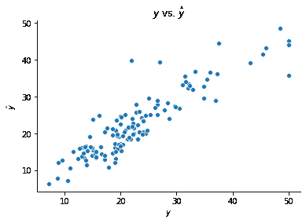
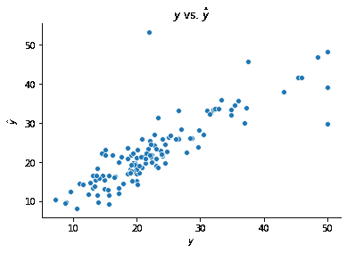

# 构建过程

> 原文：[`dafriedman97.github.io/mlbook/content/c7/construction.html`](https://dafriedman97.github.io/mlbook/content/c7/construction.html)

在本节中，我们构建了两个类来实现一个基本的前馈神经网络。为了简化，这两个类都限制为只有一个隐藏层，尽管输入层、隐藏层和输出层中的神经元数量是灵活的。这两个类的不同之处在于它们如何组合观测值的结果。第一个类通过遍历观测值并累加单个梯度，而第二个类则一次性计算观测值之间的整个梯度。

让我们从导入`numpy`、一些可视化包和两个数据集开始：来自`scikit-learn`的 Boston 住宅数据和乳腺癌数据集。我们将使用前者进行回归，后者进行分类。我们还使用下面的隐藏代码单元格将每个数据集分成训练集和测试集。

```py
## Import numpy and visualization packages
import numpy as np 
import matplotlib.pyplot as plt
import seaborn as sns
from sklearn import datasets

## Import Boston and standardize
np.random.seed(123)
boston = datasets.load_boston()
X_boston = boston['data']
X_boston = (X_boston - X_boston.mean(0))/(X_boston.std(0))
y_boston = boston['target']

## Train-test split
np.random.seed(123)
test_frac = 0.25
test_size = int(len(y_boston)*test_frac)
test_idxs = np.random.choice(np.arange(len(y_boston)), test_size, replace = False)
X_boston_train = np.delete(X_boston, test_idxs, 0)
y_boston_train = np.delete(y_boston, test_idxs, 0)
X_boston_test = X_boston[test_idxs]
y_boston_test = y_boston[test_idxs]

## Import cancer and standardize
np.random.seed(123)
cancer = datasets.load_breast_cancer()
X_cancer = cancer['data']
X_cancer = (X_cancer - X_cancer.mean(0))/(X_cancer.std(0))
y_cancer = 1*(cancer['target'] == 1)

## Train-test split
np.random.seed(123)
test_frac = 0.25
test_size = int(len(y_cancer)*test_frac)
test_idxs = np.random.choice(np.arange(len(y_cancer)), test_size, replace = False)
X_cancer_train = np.delete(X_cancer, test_idxs, 0)
y_cancer_train = np.delete(y_cancer, test_idxs, 0)
X_cancer_test = X_cancer[test_idxs]
y_cancer_test = y_cancer[test_idxs] 
```

在为我们的网络构建类之前，让我们构建我们的激活函数。以下我们实现了 ReLU 函数、sigmoid 函数和线性函数（它简单地返回其输入）。我们还把这些函数组合成一个字典，以便我们可以用字符串参数来识别它们。

```py
## Activation Functions 
def ReLU(h):
    return np.maximum(h, 0)

def sigmoid(h):
    return 1/(1 + np.exp(-h))

def linear(h):
    return h

activation_function_dict = {'ReLU':ReLU, 'sigmoid':sigmoid, 'linear':linear} 
```

## 1. 循环方法

接下来，我们通过遍历观测值来构建一个用于拟合前馈网络的类。这个类通过逐个计算基于一次观测值的梯度，遍历所有观测值，并在调整权重之前对梯度进行求和来执行梯度下降。

一旦实例化，我们使用`fit()`方法拟合一个网络。此方法需要训练数据、隐藏层的节点数、第一和第二层输出的激活函数、损失函数以及梯度下降的一些参数。存储这些值后，该方法随机实例化网络的权重：`W1`、`c1`、`W2`和`c2`。然后，它通过这个网络传递数据以实例化输出值：`h1`、`z1`、`h2`和`yhat`（相当于`z2`）。

然后，我们开始执行梯度下降。在梯度下降过程的每一次迭代中，我们也会遍历观测值。对于每个观测值，我们计算该观测值损失相对于网络权重的导数。然后，我们将这些单独的导数相加，并相应地调整权重，这与梯度下降中的典型做法一致。我们计算的导数在概念部分中有详细说明。

网络拟合完成后，我们可以使用`predict()`方法进行预测。这仅仅是将测试观测值通过网络并返回它们的输出。

```py
class FeedForwardNeuralNetwork:

    def fit(self, X, y, n_hidden, f1 = 'ReLU', f2 = 'linear', loss = 'RSS', lr = 1e-5, n_iter = 1e3, seed = None):

        ## Store Information
        self.X = X
        self.y = y.reshape(len(y), -1)
        self.N = len(X)
        self.D_X = self.X.shape[1]
        self.D_y = self.y.shape[1]
        self.D_h = n_hidden
        self.f1, self.f2 = f1, f2
        self.loss = loss
        self.lr = lr
        self.n_iter = int(n_iter)
        self.seed = seed

        ## Instantiate Weights
        np.random.seed(self.seed)
        self.W1 = np.random.randn(self.D_h, self.D_X)/5
        self.c1 = np.random.randn(self.D_h, 1)/5
        self.W2 = np.random.randn(self.D_y, self.D_h)/5
        self.c2 = np.random.randn(self.D_y, 1)/5

        ## Instantiate Outputs
        self.h1 = np.dot(self.W1, self.X.T) + self.c1
        self.z1 = activation_function_dictf1
        self.h2 = np.dot(self.W2, self.z1) + self.c2
        self.yhat = activation_function_dictf2

        ## Fit Weights
        for iteration in range(self.n_iter):

            dL_dW2 = 0
            dL_dc2 = 0
            dL_dW1 = 0
            dL_dc1 = 0

            for n in range(self.N):

                # dL_dyhat
                if loss == 'RSS':
                    dL_dyhat = -2*(self.y[n] - self.yhat[:,n]).T # (1, D_y)
                elif loss == 'log':
                    dL_dyhat = (-(self.y[n]/self.yhat[:,n]) + (1-self.y[n])/(1-self.yhat[:,n])).T # (1, D_y)

                ## LAYER 2 ## 
                # dyhat_dh2 
                if f2 == 'linear':
                    dyhat_dh2 = np.eye(self.D_y) # (D_y, D_y)
                elif f2 == 'sigmoid':
                    dyhat_dh2 = np.diag(sigmoid(self.h2[:,n])*(1-sigmoid(self.h2[:,n]))) # (D_y, D_y)

                # dh2_dc2
                dh2_dc2 = np.eye(self.D_y) # (D_y, D_y)

                # dh2_dW2 
                dh2_dW2 = np.zeros((self.D_y, self.D_y, self.D_h)) # (D_y, (D_y, D_h)) 
                for i in range(self.D_y):
                    dh2_dW2[i] = self.z1[:,n] 

                # dh2_dz1
                dh2_dz1 = self.W2 # (D_y, D_h)

                ## LAYER 1 ##
                # dz1_dh1
                if f1 == 'ReLU':
                    dz1_dh1 = 1*np.diag(self.h1[:,n] > 0) # (D_h, D_h) 
                elif f1 == 'linear':
                    dz1_dh1 = np.eye(self.D_h) # (D_h, D_h)

                # dh1_dc1 
                dh1_dc1 = np.eye(self.D_h) # (D_h, D_h)

                # dh1_dW1
                dh1_dW1 = np.zeros((self.D_h, self.D_h, self.D_X)) # (D_h, (D_h, D_X))
                for i in range(self.D_h):
                    dh1_dW1[i] = self.X[n]

                ## DERIVATIVES W.R.T. LOSS ## 
                dL_dh2 = dL_dyhat @ dyhat_dh2
                dL_dW2 += dL_dh2 @ dh2_dW2
                dL_dc2 += dL_dh2 @ dh2_dc2
                dL_dh1 = dL_dh2 @ dh2_dz1 @ dz1_dh1
                dL_dW1 += dL_dh1 @ dh1_dW1
                dL_dc1 += dL_dh1 @ dh1_dc1

            ## Update Weights
            self.W1 -= self.lr * dL_dW1
            self.c1 -= self.lr * dL_dc1.reshape(-1, 1)           
            self.W2 -= self.lr * dL_dW2            
            self.c2 -= self.lr * dL_dc2.reshape(-1, 1)                    

            ## Update Outputs
            self.h1 = np.dot(self.W1, self.X.T) + self.c1
            self.z1 = activation_function_dictf1
            self.h2 = np.dot(self.W2, self.z1) + self.c2
            self.yhat = activation_function_dictf2

    def predict(self, X_test):
        self.h1 = np.dot(self.W1, X_test.T) + self.c1
        self.z1 = activation_function_dictself.f1
        self.h2 = np.dot(self.W2, self.z1) + self.c2
        self.yhat = activation_function_dictself.f2        
        return self.yhat 
```

让我们尝试使用这个类和`boston`住宅数据构建一个网络。这个网络在其隐藏层中有 8 个神经元，并在第一层和第二层之后分别使用 ReLU 和线性激活函数。

```py
ffnn = FeedForwardNeuralNetwork()
ffnn.fit(X_boston_train, y_boston_train, n_hidden = 8)
y_boston_test_hat = ffnn.predict(X_boston_test)

fig, ax = plt.subplots()
sns.scatterplot(y_boston_test, y_boston_test_hat[0])
ax.set(xlabel = r'$y$', ylabel = r'$\hat{y}$', title = r'$y$ vs. $\hat{y}$')
sns.despine() 
```



我们还可以构建一个用于二元分类的网络。下面的模型试图预测个体的癌症是恶性还是良性。我们使用对数损失、第二层的 sigmoid 激活函数以及第一层的 ReLU 函数。

```py
ffnn = FeedForwardNeuralNetwork()
ffnn.fit(X_cancer_train, y_cancer_train, n_hidden = 8,
         loss = 'log', f2 = 'sigmoid', seed = 123, lr = 1e-4)
y_cancer_test_hat = ffnn.predict(X_cancer_test)
np.mean(y_cancer_test_hat.round() == y_cancer_test) 
```

```py
0.9929577464788732 
```

## 2\. 矩阵方法

下面是另一个用于拟合神经网络的类，它通过同时计算观测值间的梯度而运行得更快。这些计算背后的数学原理在 概念部分 中概述。这个类的拟合算法与上面的算法相同，只有一个重大例外：我们不需要遍历观测值。

下面的梯度计算大多数都很直接。少数需要张量点积，这可以使用 numpy 很容易地完成。考虑以下梯度：

\[ \frac{\partial \mathcal{L}}{\partial \mathbf{W}^{(L)}_{i, j}} = \sum_{n = 1}^N (\nabla \mathbf{H}^{(L)})_{i, n}\cdot \mathbf{Z}^{(L-1)}_{j, n}. \]

用语言来说，\(\frac{\partial \mathcal{L}}{\partial \mathbf{W}^{(L)}}\) 是一个矩阵，其 \((i, j)^\text{th}\) 个元素等于 \(\nabla \mathbf{H}^{(L)}\) 的第 \(i\) 行元素与 \(\mathbf{Z}^{(L-1)}\) 的第 \(j\) 行元素逐元素相乘后的总和。

这个计算可以用 `np.tensordot(A, B, (1,1))` 来完成，其中 `A` 是 \(\nabla \mathbf{H}^{(L)}\)，而 `B` 是 \(\mathbf{Z}^{(L-1)}\)。`np.tensordot()` 沿指定索引求和 `A` 和 `B` 的元素逐元素乘积。在这里，我们指定索引为 `(1,1)`，表示我们想要对每一列进行求和。

类似地，我们将使用以下梯度：

\[ \frac{\partial \mathcal{L}}{\partial \mathbf{Z}^{(L-1)}_{i, n}} = \sum_{d = 1}^{D_y} (\nabla \mathbf{H}^{(L)})_{d, n}\cdot \mathbf{W}^{(L)}_{d, i}. \]

用 `C` 表示 \(\mathbf{W}^{(L)}\)，我们可以在 numpy 中使用 `np.tensordot(C, A, (0,0))` 来计算这个梯度。

```py
class FeedForwardNeuralNetwork:

    def fit(self, X, Y, n_hidden, f1 = 'ReLU', f2 = 'linear', loss = 'RSS', lr = 1e-5, n_iter = 5e3, seed = None):

        ## Store Information
        self.X = X
        self.Y = Y.reshape(len(Y), -1)
        self.N = len(X)
        self.D_X = self.X.shape[1]
        self.D_Y = self.Y.shape[1]
        self.Xt = self.X.T
        self.Yt = self.Y.T
        self.D_h = n_hidden
        self.f1, self.f2 = f1, f2
        self.loss = loss
        self.lr = lr
        self.n_iter = int(n_iter)
        self.seed = seed

        ## Instantiate Weights
        np.random.seed(self.seed)
        self.W1 = np.random.randn(self.D_h, self.D_X)/5
        self.c1 = np.random.randn(self.D_h, 1)/5
        self.W2 = np.random.randn(self.D_Y, self.D_h)/5
        self.c2 = np.random.randn(self.D_Y, 1)/5

        ## Instantiate Outputs
        self.H1 = (self.W1 @ self.Xt) + self.c1
        self.Z1 = activation_function_dictself.f1
        self.H2 = (self.W2 @ self.Z1) + self.c2
        self.Yhatt = activation_function_dictself.f2

        ## Fit Weights
        for iteration in range(self.n_iter):

            # Yhat #
            if self.loss == 'RSS':
                self.dL_dYhatt = -(self.Yt - self.Yhatt) # (D_Y x N)
            elif self.loss == 'log':
                self.dL_dYhatt = (-(self.Yt/self.Yhatt) + (1-self.Yt)/(1-self.Yhatt)) # (D_y x N)

            # H2 #
            if self.f2 == 'linear':
                self.dYhatt_dH2 = np.ones((self.D_Y, self.N))
            elif self.f2 == 'sigmoid':
                self.dYhatt_dH2 = sigmoid(self.H2) * (1- sigmoid(self.H2))
            self.dL_dH2 = self.dL_dYhatt * self.dYhatt_dH2 # (D_Y x N)

            # c2 # 
            self.dL_dc2 = np.sum(self.dL_dH2, 1) # (D_y)

            # W2 # 
            self.dL_dW2 = np.tensordot(self.dL_dH2, self.Z1, (1,1)) # (D_Y x D_h)

            # Z1 #
            self.dL_dZ1 = np.tensordot(self.W2, self.dL_dH2, (0, 0)) # (D_h x N)

            # H1 #
            if self.f1 == 'ReLU':
                self.dL_dH1 = self.dL_dZ1 * np.maximum(self.H1, 0) # (D_h x N)
            elif self.f1 == 'linear':
                self.dL_dH1 = self.dL_dZ1 # (D_h x N)

            # c1 #
            self.dL_dc1 = np.sum(self.dL_dH1, 1) # (D_h)

            # W1 # 
            self.dL_dW1 = np.tensordot(self.dL_dH1, self.Xt, (1,1)) # (D_h, D_X)

            ## Update Weights
            self.W1 -= self.lr * self.dL_dW1
            self.c1 -= self.lr * self.dL_dc1.reshape(-1, 1)           
            self.W2 -= self.lr * self.dL_dW2            
            self.c2 -= self.lr * self.dL_dc2.reshape(-1, 1)                    

            ## Update Outputs
            self.H1 = (self.W1 @ self.Xt) + self.c1
            self.Z1 = activation_function_dictself.f1
            self.H2 = (self.W2 @ self.Z1) + self.c2
            self.Yhatt = activation_function_dictself.f2  

    def predict(self, X_test):
        X_testt = X_test.T
        self.h1 = (self.W1 @ X_testt) + self.c1
        self.z1 = activation_function_dictself.f1
        self.h2 = (self.W2 @ self.z1) + self.c2
        self.Yhatt = activation_function_dictself.f2        
        return self.Yhatt 
```

我们以与之前相同的方式拟合这个类的网络。下面展示了使用 `boston` 房屋数据进行的回归示例和 `breast_cancer` 数据进行的分类示例。

```py
ffnn = FeedForwardNeuralNetwork()
ffnn.fit(X_boston_train, y_boston_train, n_hidden = 8)
y_boston_test_hat = ffnn.predict(X_boston_test)

fig, ax = plt.subplots()
sns.scatterplot(y_boston_test, y_boston_test_hat[0])
ax.set(xlabel = r'$y$', ylabel = r'$\hat{y}$', title = r'$y$ vs. $\hat{y}$')
sns.despine() 
```



```py
ffnn = FeedForwardNeuralNetwork()
ffnn.fit(X_cancer_train, y_cancer_train, n_hidden = 8,
         loss = 'log', f2 = 'sigmoid', seed = 123, lr = 1e-4)
y_cancer_test_hat = ffnn.predict(X_cancer_test)
np.mean(y_cancer_test_hat.round() == y_cancer_test) 
```

```py
0.9929577464788732 
```

## 1\. 循环方法

接下来，我们通过遍历观测值来构建一个用于拟合前馈网络的类。这个类通过逐个计算基于一次观测值的梯度，遍历所有观测值，并在调整权重之前求和梯度来进行梯度下降。

一旦实例化，我们使用 `fit()` 方法来调整网络。此方法需要训练数据、隐藏层的节点数、第一和第二层输出的激活函数、损失函数以及用于梯度下降的一些参数。存储这些值后，该方法随机实例化网络的权重：`W1`、`c1`、`W2` 和 `c2`。然后它通过这个网络传递数据以实例化输出值：`h1`、`z1`、`h2` 和 `yhat`（相当于 `z2`）。

然后，我们开始进行梯度下降。在梯度下降过程的每次迭代中，我们也会遍历观察值。对于每个观察值，我们计算该观察值的损失相对于网络权重的导数。然后我们累加这些单独的导数，并相应地调整权重，就像在梯度下降中典型的那样。我们计算的导数在 概念部分 中介绍。

一旦网络调整完毕，我们就可以使用 `predict()` 方法形成预测。这仅仅是通过将测试观察值通过网络并返回它们的输出。

```py
class FeedForwardNeuralNetwork:

    def fit(self, X, y, n_hidden, f1 = 'ReLU', f2 = 'linear', loss = 'RSS', lr = 1e-5, n_iter = 1e3, seed = None):

        ## Store Information
        self.X = X
        self.y = y.reshape(len(y), -1)
        self.N = len(X)
        self.D_X = self.X.shape[1]
        self.D_y = self.y.shape[1]
        self.D_h = n_hidden
        self.f1, self.f2 = f1, f2
        self.loss = loss
        self.lr = lr
        self.n_iter = int(n_iter)
        self.seed = seed

        ## Instantiate Weights
        np.random.seed(self.seed)
        self.W1 = np.random.randn(self.D_h, self.D_X)/5
        self.c1 = np.random.randn(self.D_h, 1)/5
        self.W2 = np.random.randn(self.D_y, self.D_h)/5
        self.c2 = np.random.randn(self.D_y, 1)/5

        ## Instantiate Outputs
        self.h1 = np.dot(self.W1, self.X.T) + self.c1
        self.z1 = activation_function_dictf1
        self.h2 = np.dot(self.W2, self.z1) + self.c2
        self.yhat = activation_function_dictf2

        ## Fit Weights
        for iteration in range(self.n_iter):

            dL_dW2 = 0
            dL_dc2 = 0
            dL_dW1 = 0
            dL_dc1 = 0

            for n in range(self.N):

                # dL_dyhat
                if loss == 'RSS':
                    dL_dyhat = -2*(self.y[n] - self.yhat[:,n]).T # (1, D_y)
                elif loss == 'log':
                    dL_dyhat = (-(self.y[n]/self.yhat[:,n]) + (1-self.y[n])/(1-self.yhat[:,n])).T # (1, D_y)

                ## LAYER 2 ## 
                # dyhat_dh2 
                if f2 == 'linear':
                    dyhat_dh2 = np.eye(self.D_y) # (D_y, D_y)
                elif f2 == 'sigmoid':
                    dyhat_dh2 = np.diag(sigmoid(self.h2[:,n])*(1-sigmoid(self.h2[:,n]))) # (D_y, D_y)

                # dh2_dc2
                dh2_dc2 = np.eye(self.D_y) # (D_y, D_y)

                # dh2_dW2 
                dh2_dW2 = np.zeros((self.D_y, self.D_y, self.D_h)) # (D_y, (D_y, D_h)) 
                for i in range(self.D_y):
                    dh2_dW2[i] = self.z1[:,n] 

                # dh2_dz1
                dh2_dz1 = self.W2 # (D_y, D_h)

                ## LAYER 1 ##
                # dz1_dh1
                if f1 == 'ReLU':
                    dz1_dh1 = 1*np.diag(self.h1[:,n] > 0) # (D_h, D_h) 
                elif f1 == 'linear':
                    dz1_dh1 = np.eye(self.D_h) # (D_h, D_h)

                # dh1_dc1 
                dh1_dc1 = np.eye(self.D_h) # (D_h, D_h)

                # dh1_dW1
                dh1_dW1 = np.zeros((self.D_h, self.D_h, self.D_X)) # (D_h, (D_h, D_X))
                for i in range(self.D_h):
                    dh1_dW1[i] = self.X[n]

                ## DERIVATIVES W.R.T. LOSS ## 
                dL_dh2 = dL_dyhat @ dyhat_dh2
                dL_dW2 += dL_dh2 @ dh2_dW2
                dL_dc2 += dL_dh2 @ dh2_dc2
                dL_dh1 = dL_dh2 @ dh2_dz1 @ dz1_dh1
                dL_dW1 += dL_dh1 @ dh1_dW1
                dL_dc1 += dL_dh1 @ dh1_dc1

            ## Update Weights
            self.W1 -= self.lr * dL_dW1
            self.c1 -= self.lr * dL_dc1.reshape(-1, 1)           
            self.W2 -= self.lr * dL_dW2            
            self.c2 -= self.lr * dL_dc2.reshape(-1, 1)                    

            ## Update Outputs
            self.h1 = np.dot(self.W1, self.X.T) + self.c1
            self.z1 = activation_function_dictf1
            self.h2 = np.dot(self.W2, self.z1) + self.c2
            self.yhat = activation_function_dictf2

    def predict(self, X_test):
        self.h1 = np.dot(self.W1, X_test.T) + self.c1
        self.z1 = activation_function_dictself.f1
        self.h2 = np.dot(self.W2, self.z1) + self.c2
        self.yhat = activation_function_dictself.f2        
        return self.yhat 
```

让我们尝试使用 `boston` 房屋数据构建一个具有此类功能的网络。这个网络在其隐藏层中有 8 个神经元，并在第一层和第二层后分别使用 ReLU 和线性激活函数。

```py
ffnn = FeedForwardNeuralNetwork()
ffnn.fit(X_boston_train, y_boston_train, n_hidden = 8)
y_boston_test_hat = ffnn.predict(X_boston_test)

fig, ax = plt.subplots()
sns.scatterplot(y_boston_test, y_boston_test_hat[0])
ax.set(xlabel = r'$y$', ylabel = r'$\hat{y}$', title = r'$y$ vs. $\hat{y}$')
sns.despine() 
```


我们还可以构建一个用于二元分类的网络。下面的模型试图预测一个人的癌症是恶性还是良性。我们使用对数损失、第二层后的 sigmoid 激活函数以及第一层后的 ReLU 函数。

```py
ffnn = FeedForwardNeuralNetwork()
ffnn.fit(X_cancer_train, y_cancer_train, n_hidden = 8,
         loss = 'log', f2 = 'sigmoid', seed = 123, lr = 1e-4)
y_cancer_test_hat = ffnn.predict(X_cancer_test)
np.mean(y_cancer_test_hat.round() == y_cancer_test) 
```

```py
0.9929577464788732 
```

## 2\. 矩阵方法

下面是一个用于调整神经网络的第二个类，它通过同时计算观察值之间的梯度而运行得 *非常快*。这些计算的数学原理在 概念部分 中概述。此类的调整算法与上面的相同，只有一个重大例外：我们不必遍历观察值。

以下的大部分梯度计算都很直接。其中一些需要张量点积，这可以通过 numpy 很容易地完成。考虑以下梯度：

\[ \frac{\partial \mathcal{L}}{\partial \mathbf{W}^{(L)}_{i, j}} = \sum_{n = 1}^N (\nabla \mathbf{H}^{(L)})_{i, n}\cdot \mathbf{Z}^{(L-1)}_{j, n}. \]

用文字来说，\(\partial\mathcal{L}/\partial \mathbf{W}^{(L)}\) 是一个矩阵，其 \((i, j)^\text{th}\) 个条目等于 \(\nabla \mathbf{H}^{(L)}\) 的第 \(i\) 行与 \(\mathbf{Z}^{(L-1)}\) 的第 \(j\) 行逐元素相乘后的总和。

这个计算可以通过 `np.tensordot(A, B, (1,1))` 完成，其中 `A` 是 \(\nabla \mathbf{H}^{(L)}\)，而 `B` 是 \(\mathbf{Z}^{(L-1)}\)。`np.tensordot()` 沿指定索引求 `A` 和 `B` 的元素级乘积之和。在这里，我们指定索引为 `(1,1)`，表示我们想要对每一列进行求和。

同样，我们将使用以下梯度：

\[ \frac{\partial \mathcal{L}}{\partial \mathbf{Z}^{(L-1)}_{i, n}} = \sum_{d = 1}^{D_y} (\nabla \mathbf{H}^{(L)})_{d, n}\cdot \mathbf{W}^{(L)}_{d, i}. \]

令 `C` 代表 \(\mathbf{W}^{(L)}\)，我们可以使用 `np.tensordot(C, A, (0,0))` 在 numpy 中计算这个梯度。

```py
class FeedForwardNeuralNetwork:

    def fit(self, X, Y, n_hidden, f1 = 'ReLU', f2 = 'linear', loss = 'RSS', lr = 1e-5, n_iter = 5e3, seed = None):

        ## Store Information
        self.X = X
        self.Y = Y.reshape(len(Y), -1)
        self.N = len(X)
        self.D_X = self.X.shape[1]
        self.D_Y = self.Y.shape[1]
        self.Xt = self.X.T
        self.Yt = self.Y.T
        self.D_h = n_hidden
        self.f1, self.f2 = f1, f2
        self.loss = loss
        self.lr = lr
        self.n_iter = int(n_iter)
        self.seed = seed

        ## Instantiate Weights
        np.random.seed(self.seed)
        self.W1 = np.random.randn(self.D_h, self.D_X)/5
        self.c1 = np.random.randn(self.D_h, 1)/5
        self.W2 = np.random.randn(self.D_Y, self.D_h)/5
        self.c2 = np.random.randn(self.D_Y, 1)/5

        ## Instantiate Outputs
        self.H1 = (self.W1 @ self.Xt) + self.c1
        self.Z1 = activation_function_dictself.f1
        self.H2 = (self.W2 @ self.Z1) + self.c2
        self.Yhatt = activation_function_dictself.f2

        ## Fit Weights
        for iteration in range(self.n_iter):

            # Yhat #
            if self.loss == 'RSS':
                self.dL_dYhatt = -(self.Yt - self.Yhatt) # (D_Y x N)
            elif self.loss == 'log':
                self.dL_dYhatt = (-(self.Yt/self.Yhatt) + (1-self.Yt)/(1-self.Yhatt)) # (D_y x N)

            # H2 #
            if self.f2 == 'linear':
                self.dYhatt_dH2 = np.ones((self.D_Y, self.N))
            elif self.f2 == 'sigmoid':
                self.dYhatt_dH2 = sigmoid(self.H2) * (1- sigmoid(self.H2))
            self.dL_dH2 = self.dL_dYhatt * self.dYhatt_dH2 # (D_Y x N)

            # c2 # 
            self.dL_dc2 = np.sum(self.dL_dH2, 1) # (D_y)

            # W2 # 
            self.dL_dW2 = np.tensordot(self.dL_dH2, self.Z1, (1,1)) # (D_Y x D_h)

            # Z1 #
            self.dL_dZ1 = np.tensordot(self.W2, self.dL_dH2, (0, 0)) # (D_h x N)

            # H1 #
            if self.f1 == 'ReLU':
                self.dL_dH1 = self.dL_dZ1 * np.maximum(self.H1, 0) # (D_h x N)
            elif self.f1 == 'linear':
                self.dL_dH1 = self.dL_dZ1 # (D_h x N)

            # c1 #
            self.dL_dc1 = np.sum(self.dL_dH1, 1) # (D_h)

            # W1 # 
            self.dL_dW1 = np.tensordot(self.dL_dH1, self.Xt, (1,1)) # (D_h, D_X)

            ## Update Weights
            self.W1 -= self.lr * self.dL_dW1
            self.c1 -= self.lr * self.dL_dc1.reshape(-1, 1)           
            self.W2 -= self.lr * self.dL_dW2            
            self.c2 -= self.lr * self.dL_dc2.reshape(-1, 1)                    

            ## Update Outputs
            self.H1 = (self.W1 @ self.Xt) + self.c1
            self.Z1 = activation_function_dictself.f1
            self.H2 = (self.W2 @ self.Z1) + self.c2
            self.Yhatt = activation_function_dictself.f2  

    def predict(self, X_test):
        X_testt = X_test.T
        self.h1 = (self.W1 @ X_testt) + self.c1
        self.z1 = activation_function_dictself.f1
        self.h2 = (self.W2 @ self.z1) + self.c2
        self.Yhatt = activation_function_dictself.f2        
        return self.Yhatt 
```

我们以与之前相同的方式拟合此类网络。以下展示了使用 `boston` 房屋数据进行的回归示例和 `breast_cancer` 数据进行的分类示例。

```py
ffnn = FeedForwardNeuralNetwork()
ffnn.fit(X_boston_train, y_boston_train, n_hidden = 8)
y_boston_test_hat = ffnn.predict(X_boston_test)

fig, ax = plt.subplots()
sns.scatterplot(y_boston_test, y_boston_test_hat[0])
ax.set(xlabel = r'$y$', ylabel = r'$\hat{y}$', title = r'$y$ vs. $\hat{y}$')
sns.despine() 
```


```py
ffnn = FeedForwardNeuralNetwork()
ffnn.fit(X_cancer_train, y_cancer_train, n_hidden = 8,
         loss = 'log', f2 = 'sigmoid', seed = 123, lr = 1e-4)
y_cancer_test_hat = ffnn.predict(X_cancer_test)
np.mean(y_cancer_test_hat.round() == y_cancer_test) 
```

```py
0.9929577464788732 
```
