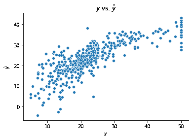

# 实现

> [`dafriedman97.github.io/mlbook/content/c7/code.html`](https://dafriedman97.github.io/mlbook/content/c7/code.html)

几个 Python 库允许轻松高效地实现神经网络。在这里，我们将使用非常流行的`tf.keras`子模块来展示示例。此子模块将用户友好的高级 API Keras 集成到较低级别的后端 Tensorflow 中。让我们首先加载 Tensorflow、我们的可视化包以及从`scikit-learn`加载的 Boston 住房数据集。

```py
import tensorflow as tf
from sklearn import datasets
import matplotlib.pyplot as plt
import seaborn as sns

boston = datasets.load_boston()
X_boston = boston['data']
y_boston = boston['target'] 
```

Keras 中的神经网络可以通过两种 API 之一进行拟合：*顺序*或*功能*API。对于本章讨论的模型类型，两种方法都适用。

## 1. 顺序 API

使用 Keras 顺序 API 拟合网络可以分为四个步骤：

1.  实例化模型

1.  添加层

1.  编译模型（并总结）

1.  拟合模型

下面展示了这些四个步骤的代码示例。我们首先使用`tf.keras.models.Sequential()`实例化网络。

接下来，我们向网络中添加层。具体来说，我们必须添加我们喜欢的任何隐藏层，然后是一个单独的输出层。本章涵盖的网络类型仅使用`Dense`层。一个“密集”层是指每个神经元都是前一层中所有其他神经元的函数。我们使用`units`参数标识层中的神经元数量，使用`activation`参数标识应用于层的激活函数。对于第一层，我们还必须标识`input_shape`，即输入层中的神经元数量。如果我们的预测变量长度为`D`，则输入形状将为`(D, )`（这是单个观察值的形状，正如我们通过`X[0].shape`可以看到的）。

下一步是编译模型。编译确定了模型的配置；我们指定要使用的优化器和损失函数以及我们想要监控的任何指标。编译后，我们还可以使用`model.summary()`预览我们的模型。

最后，我们拟合模型。在这里，我们实际上提供了我们的训练数据。另外两个重要的参数是`epochs`和`batch_size`。Keras 中的模型使用*小批量梯度下降*进行拟合，其中训练数据的样本被循环遍历，并单独用于计算和更新梯度。`batch_size`确定这些样本的大小，而`epochs`确定每个样本计算梯度的次数。

```py
## 1\. Instantiate
model = tf.keras.models.Sequential(name = 'Sequential_Model')

## 2\. Add Layers
model.add(tf.keras.layers.Dense(units = 8,
                                activation = 'relu',
                                input_shape = (X_boston.shape[1], ),
                                name = 'hidden'))
model.add(tf.keras.layers.Dense(units = 1,
                                activation = 'linear',
                                name = 'output'))

## 3\. Compile (and summarize)
model.compile(optimizer = 'adam', loss = 'mse')
print(model.summary())

## 4\. Fit
model.fit(X_boston, y_boston, epochs = 100, batch_size = 1, validation_split=0.2, verbose = 0); 
```

```py
Model: "Sequential_Model"
_________________________________________________________________
Layer (type)                 Output Shape              Param #   
=================================================================
hidden (Dense)               (None, 8)                 112       
_________________________________________________________________
output (Dense)               (None, 1)                 9         
=================================================================
Total params: 121
Trainable params: 121
Non-trainable params: 0
_________________________________________________________________
None 
```

使用上述构建的模型进行的预测如下所示。

```py
# Create Predictions
yhat_boston = model.predict(X_boston)[:,0]

# Plot
fig, ax = plt.subplots()
sns.scatterplot(y_boston, yhat_boston)
ax.set(xlabel = r"$y$", ylabel = r"$\hat{y}$", title = r"$y$ vs. $\hat{y}$")
sns.despine() 
```


## 2. 功能 API

使用功能 API 拟合模型也可以再次分解为四个步骤，如下所示。

1.  定义层

1.  定义模型

1.  编译模型（并总结）

1.  拟合模型

虽然顺序方法首先定义模型然后添加层，但功能方法则相反。我们首先使用 `tf.keras.Input()` 添加一个输入层。接下来，我们使用 `tf.keras.layers.Dense()` 添加一个或多个隐藏层。请注意，在这个方法中，我们直接链接层。例如，我们通过在其定义末尾添加 `(inputs)` 来指示下面的 `hidden` 层跟随 `inputs` 层。

在创建层之后，我们可以定义我们的模型。我们通过使用 `tf.keras.Model()` 并标识输入和输出层来实现这一点。最后，我们像在顺序 API 中一样编译和拟合我们的模型。

```py
## 1\. Define layers
inputs = tf.keras.Input(shape = (X_boston.shape[1],), name = "input")
hidden = tf.keras.layers.Dense(8, activation = "relu", name = "first_hidden")(inputs)
outputs = tf.keras.layers.Dense(1, activation = "linear", name = "output")(hidden)

## 2\. Model
model = tf.keras.Model(inputs = inputs, outputs = outputs, name = "Functional_Model")

## 3\. Compile (and summarize)
model.compile(optimizer = "adam", loss = "mse")
print(model.summary())

## 4\. Fit
model.fit(X_boston, y_boston, epochs = 100, batch_size = 1, validation_split=0.2, verbose = 0); 
```

```py
Model: "Functional_Model"
_________________________________________________________________
Layer (type)                 Output Shape              Param #   
=================================================================
input (InputLayer)           [(None, 13)]              0         
_________________________________________________________________
first_hidden (Dense)         (None, 8)                 112       
_________________________________________________________________
output (Dense)               (None, 1)                 9         
=================================================================
Total params: 121
Trainable params: 121
Non-trainable params: 0
_________________________________________________________________
None 
```

使用此模型形成的预测如下。

```py
# Create Predictions
yhat_boston = model.predict(X_boston)[:,0]

# Plot
fig, ax = plt.subplots()
sns.scatterplot(y_boston, yhat_boston)
ax.set(xlabel = r"$y$", ylabel = r"$\hat{y}$", title = r"$y$ vs. $\hat{y}$")
sns.despine() 
```



## 1. 顺序 API

使用 Keras 顺序 API 拟合网络可以分为四个步骤：

1.  实例化模型

1.  添加层

1.  编译模型（并总结）

1.  拟合模型

这四个步骤的代码示例如下。我们首先使用 `tf.keras.models.Sequential()` 实例化网络。

接下来，我们将层添加到网络中。具体来说，我们必须添加我们喜欢的任何隐藏层，然后是一个单独的输出层。本章涵盖的网络类型仅使用 `Dense` 层。一个“密集”层是其中每个神经元都是前一层中所有其他神经元的函数。我们使用 `units` 参数标识层的神经元数量，并使用 `activation` 参数标识应用于层的激活函数。对于第一层，我们还必须标识 `input_shape`，即输入层的神经元数量。如果我们的预测变量长度为 `D`，则输入形状将是 `(D, )`（这是单个观察值的形状，正如我们通过 `X[0].shape` 所见）。

下一步是编译模型。编译确定了模型的配置；我们指定要使用的优化器和损失函数，以及我们想要监控的任何指标。编译后，我们还可以使用 `model.summary()` 预览我们的模型。

最后，我们拟合模型。在这里，我们实际上提供了我们的训练数据。另外两个重要的参数是 `epochs` 和 `batch_size`。在 Keras 中，模型通过 *小批量梯度下降* 来拟合，其中训练数据的样本被循环遍历，并单独用于计算和更新梯度。`batch_size` 决定了这些样本的大小，而 `epochs` 决定了每个样本计算梯度的次数。

```py
## 1\. Instantiate
model = tf.keras.models.Sequential(name = 'Sequential_Model')

## 2\. Add Layers
model.add(tf.keras.layers.Dense(units = 8,
                                activation = 'relu',
                                input_shape = (X_boston.shape[1], ),
                                name = 'hidden'))
model.add(tf.keras.layers.Dense(units = 1,
                                activation = 'linear',
                                name = 'output'))

## 3\. Compile (and summarize)
model.compile(optimizer = 'adam', loss = 'mse')
print(model.summary())

## 4\. Fit
model.fit(X_boston, y_boston, epochs = 100, batch_size = 1, validation_split=0.2, verbose = 0); 
```

```py
Model: "Sequential_Model"
_________________________________________________________________
Layer (type)                 Output Shape              Param #   
=================================================================
hidden (Dense)               (None, 8)                 112       
_________________________________________________________________
output (Dense)               (None, 1)                 9         
=================================================================
Total params: 121
Trainable params: 121
Non-trainable params: 0
_________________________________________________________________
None 
```

以下展示了使用上述构建的模型进行的预测。

```py
# Create Predictions
yhat_boston = model.predict(X_boston)[:,0]

# Plot
fig, ax = plt.subplots()
sns.scatterplot(y_boston, yhat_boston)
ax.set(xlabel = r"$y$", ylabel = r"$\hat{y}$", title = r"$y$ vs. $\hat{y}$")
sns.despine() 
```


## 2. 功能 API

使用功能 API 拟合模型又可以分解为四个步骤，如下所示。

1.  定义层

1.  定义模型

1.  编译模型（并总结）

1.  拟合模型

虽然顺序方法首先定义模型然后添加层，而函数式方法则相反。我们首先使用 `tf.keras.Input()` 添加一个输入层。接下来，我们使用 `tf.keras.layers.Dense()` 添加一个或多个隐藏层。注意，在这个方法中，我们直接链接层。例如，我们通过在其定义的末尾添加 `(inputs)` 来表明下面的 `hidden` 层跟随 `inputs` 层。

在创建层之后，我们可以定义我们的模型。这是通过使用 `tf.keras.Model()` 并标识输入和输出层来完成的。最后，我们像在顺序 API 中一样编译和调整我们的模型。

```py
## 1\. Define layers
inputs = tf.keras.Input(shape = (X_boston.shape[1],), name = "input")
hidden = tf.keras.layers.Dense(8, activation = "relu", name = "first_hidden")(inputs)
outputs = tf.keras.layers.Dense(1, activation = "linear", name = "output")(hidden)

## 2\. Model
model = tf.keras.Model(inputs = inputs, outputs = outputs, name = "Functional_Model")

## 3\. Compile (and summarize)
model.compile(optimizer = "adam", loss = "mse")
print(model.summary())

## 4\. Fit
model.fit(X_boston, y_boston, epochs = 100, batch_size = 1, validation_split=0.2, verbose = 0); 
```

```py
Model: "Functional_Model"
_________________________________________________________________
Layer (type)                 Output Shape              Param #   
=================================================================
input (InputLayer)           [(None, 13)]              0         
_________________________________________________________________
first_hidden (Dense)         (None, 8)                 112       
_________________________________________________________________
output (Dense)               (None, 1)                 9         
=================================================================
Total params: 121
Trainable params: 121
Non-trainable params: 0
_________________________________________________________________
None 
```

使用此模型形成的预测结果如下。

```py
# Create Predictions
yhat_boston = model.predict(X_boston)[:,0]

# Plot
fig, ax = plt.subplots()
sns.scatterplot(y_boston, yhat_boston)
ax.set(xlabel = r"$y$", ylabel = r"$\hat{y}$", title = r"$y$ vs. $\hat{y}$")
sns.despine() 
```


