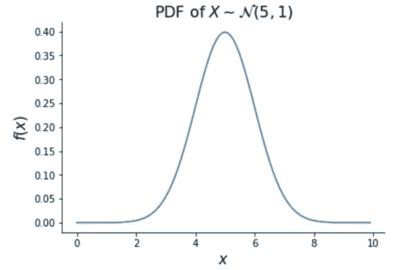

# 概率

> 原文：[`dafriedman97.github.io/mlbook/content/appendix/probability.html`](https://dafriedman97.github.io/mlbook/content/appendix/probability.html)

许多机器学习方法都根植于概率论。本书中的概率方法包括线性回归、贝叶斯回归和生成分类器。本节涵盖了理解这些方法所需的概率论。

## 1. 随机变量和分布

### 随机变量

**随机变量**是一个值随机确定的变量。随机变量可以取的可能值的集合被称为变量的**支撑集**。一个随机变量的例子是掷骰子的值。这个变量的支撑集是 \(\{1, 2, 3, 4, 5, 6\}\)。随机变量将用大写字母表示，其支撑集中的值用小写字母表示。例如 \(X = x\) 意味着随机变量 \(X\) 偶然取了值 \(x\)。让 \(X\) 表示掷骰子的值，\(X = 4\) 表示骰子落在 4 上。

### 密度函数

随机变量取特定值的可能性是通过其密度函数确定的。对于离散随机变量（可以取有限集合中的值），这个密度函数被称为**概率质量函数**（PMF）。随机变量 \(X\) 的 PMF 给出 \(X\) 等于某个值 \(x\) 的概率。我们将其写作 \(f_X(x)\) 或简写为 \(f(x)\)，其定义如下

\[ f(x) = P(X = x). \]

对于连续随机变量（可以取无限多个值），密度函数被称为**概率密度函数**（PDF）。连续随机变量 \(X\) 的 PDF \(f_X(x)\) 并不给出 \(P(X = x)\)，但它确实确定了 \(X\) 落在某个范围内的概率。具体来说，

\[ P(a \leq X \leq b) = \int_{x = a}^b f(x) dx. \]

即，将 \(f(x)\) 在某个范围内积分给出 \(X\) 落在该范围内的概率。虽然 \(f(x)\) 并不给出 \(X\) 等于某个特定值的概率，但它确实表明它将“**大约**”在该值周围的相对可能性。例如，如果 \(f(a) > f(b)\)，我们可以说 \(X\) 更有可能位于值 \(a\) 附近的任意小区域内，而不是值 \(b\) 附近。

### 分布

随机变量的**分布**由其密度函数决定。具有相同密度函数的变量被认为遵循相同的分布。某些分布族在概率和机器学习中非常常见。以下给出两个例子。

**伯努利**分布是最简单的概率分布，它描述了二元事件的结局的可能性。设 \(X\) 是一个随机变量，以概率 \(p\) 等于 1（代表“成功”），以概率 \(1-p\) 等于 0（代表“失败”）。那么，\(X\) 被说成是服从概率参数 \(p\) 的伯努利分布，记作 \(X \sim \text{Bern}(p)\)，其概率质量函数（PMF）由以下公式给出

\[ f_X(x) = p^x(1-p)^{(1-x)}. \]

我们可以检查，对于 \(X\) 的支持集内的任何有效值 \(x\)（即 1 或 0），\(f(x)\) 给出 \(P(X = x)\)。

**正态**分布非常常见，本书将广泛使用。如果随机变量 \(X\) 的概率密度函数定义为具有均值参数 \(\mu \in \R\) 和方差参数 \(\sigma² > 0\)，则 \(X\) 服从正态分布，记作 \(X \sim \mathcal{N}(\mu, \sigma²)\)。

\[ f(x) = \frac{1}{\sqrt{2\pi\sigma²}}e^{-\frac{(x-\mu)²}{2\sigma²}}. \]

正态随机变量的密度函数的形状使得这种分布被称为“钟形曲线”，如下所示。最接近 \(\mu\) 的值最有可能，密度在 \(\mu\) 周围是对称的。

### 独立性

到目前为止，我们讨论了单个随机变量的密度。当我们想要同时研究多个随机变量的行为时，情况会变得更加复杂。独立性假设大大简化了问题。让我们首先从离散情况定义独立性。

两个离散随机变量 \(X\) 和 \(Y\) 是**独立的**当且仅当

\[ P(X = x, Y = y) = P(X = x)P(Y = y), \]

对于所有 \(x\) 和 \(y\)。这表示如果 \(X\) 和 \(Y\) 是独立的，那么 \(X = x\) 和 \(Y = y\) 同时发生的概率就是 \(X = x\) 和 \(Y = y\) 分别发生的概率的乘积。

为了将这个定义推广到连续随机变量，让我们首先介绍**联合密度函数**。简单地说，两个随机变量 \(X\) 和 \(Y\) 的联合密度，记作 \(f_{X, Y}(x, y)\)，给出了 \(X\) 和 \(Y\) 分别在 \(x\) 和 \(y\) 处同时评估的概率密度。然后我们可以这样说，\(X\) 和 \(Y\) 是独立的当且仅当

\[ f_{X, Y}(x, y) = f_X(x) f_Y(y), \]

对于所有 \(x\) 和 \(y\)。

## 2. 最大似然估计

最大似然估计用于理解导致观察数据的分布的参数。为了模拟数据生成过程，我们通常假设它来自某些分布族，例如伯努利分布或正态分布。这些分布由某些参数索引（伯努利分布的 \(p\)，正态分布的 \(\mu\) 和 \(\sigma²\)）——最大似然估计评估哪些参数与我们观察到的数据最一致。

具体来说，最大似然估计找到使观察到的数据的概率最大化的未知参数值。基本最大似然估计可以分为三个步骤：

1.  找到观察数据的联合密度，也称为*似然*

1.  对似然取对数，得到*对数似然*。

1.  通过将导数设为 0 来找到使对数似然（因此也是似然）最大化的参数值。

通过找到使对数似然最大化的参数值而不是似然值，可以使数学更容易，并给出相同的解。

让我们通过一个例子来解释。假设我们感兴趣的是计算吉娃娃的平均体重。我们假设任何给定吉娃娃的体重是*独立地*以 \(\sigma² = 1\) 正态分布，但均值 \(\mu\) 未知。因此，我们收集了 10 只吉娃娃并称重。用 \(W_j \sim \mathcal{N}(\mu, 1)\) 表示第 \(j\) 只吉娃娃的体重。对于第 1 步，让我们计算我们数据（即 10 只吉娃娃的体重）的概率密度。由于假设体重是独立的，密度相乘。令 \(L(\mu)\) 为 \(\mu\) 的似然，我们有

\[\begin{split} \begin{align} L(\mu) &= f_{W_1, \dots, W_{10}}(w_1, \dots, w_{10}) \\ &= f_{W_1}(w_1)\cdot...\cdot f_{W_{10}}(w_{10}) \\ &= \prod_{j = 1}^{10} \frac{1}{\sqrt{2\pi\cdot 1}}\exp\left(-\frac{(w_j - \mu)²}{2} \right) \\ &\propto \exp\left(-\sum_{j = 1}^{10}\frac{(w_j - \mu)²}{2} \right). \\ \end{align} \end{split}\]

注意，我们可以一直工作到比例常数，因为使 \(L(\mu)\) 最大的 \(\mu\) 值也会使任何与 \(L(\mu)\) 成比例的东西最大。对于第 2 步，取对数：

\[ \log L(\mu) = -\sum_{j = 1}^{10}\frac{(w_j - \mu)²}{2} + c, \]

其中 \(c\) 是某个常数。对于第 3 步，求导数：

\[ \begin{align} \frac{\partial}{\partial \mu}\log L(\mu) = -\sum_{j = 1}^{10}(w_j - \mu). \end{align} \]

将其设为 0，我们发现（对数）似然在以下情况下达到最大：

\[ \hat{\mu} = \frac{1}{10}\sum_{j = 1}^{10} w_j = \bar{w}. \]

我们在 \(\mu\) 上加一个帽子来表示它是我们对真实 \(\mu\) 的*估计*。注意合理的结果——我们估计吉娃娃体重分布的真实均值为我们观察数据的样本均值。

## 3. 条件概率

概率机器学习方法通常考虑目标变量在给定一个或多个预测变量值条件下的分布。为了理解这些方法，让我们介绍一些条件概率的基本原理。

考虑两个事件，\(A\) 和 \(B\)。\(A\) 在 \(B\) 发生的条件下的**条件概率**是 \(A\) 在 \(B\) 发生的情况下发生的概率，写作 \(P(A|B)\)。与之密切相关的是 \(A\) 和 \(B\) 的**联合概率**，即 \(A\) 和 \(B\) 同时发生的概率，写作 \(P(A, B)\)。我们通过以下方式在条件概率和联合概率之间进行转换

\[ P(A, B) = P(A|B)P(B). \]

上述方程导出了一个在条件概率中极为重要的原理：贝叶斯定理。**贝叶斯定理**指出

\[ P(A|B) = \frac{P(B|A)P(A)}{P(B)}. \]

上述两个表达式对随机变量和事件都适用。对于任何两个离散随机变量 \(X\) 和 \(Y\)

\[\begin{split} \begin{align} P(X = x, Y = y) &= P(X = x|Y = y)P(Y = y) \\ P(X = x|Y = y) &= \frac{P(Y = y|X = x)P(X = x)}{P(Y = y)}. \end{align} \end{split}\]

对于连续随机变量也是如此，用 PMF 代替 PDF。

## 1. 随机变量和分布

### 随机变量

**随机变量**是一个值随机确定的变量。随机变量可以取的可能值的集合称为变量的**支撑集**。一个随机变量的例子是掷骰子的值。这个变量的支撑集是 \(\{1, 2, 3, 4, 5, 6\}\)。随机变量将用大写字母表示，其支撑集中的值用小写字母表示。例如 \(X = x\) 意味着随机变量 \(X\) 偶然取了值 \(x\)。如果让 \(X\) 表示掷骰子的值，\(X = 4\) 表示骰子落在 4 上。

### 密度函数

随机变量取特定值的可能性是通过其密度函数确定的。对于一个离散随机变量（可以取有限个值的变量），这个密度函数被称为**概率质量函数**（PMF）。随机变量 \(X\) 的 PMF 给出了 \(X\) 等于某个值 \(x\) 的概率。我们将其写作 \(f_X(x)\) 或简写为 \(f(x)\)，其定义如下

\[ f(x) = P(X = x). \]

对于一个连续随机变量（可以取无限多个值的变量），其密度函数被称为**概率密度函数（PDF）**。连续随机变量 \(X\) 的 PDF \(f_X(x)\) 并不给出 \(P(X = x)\)，但它确实确定了 \(X\) 落在某个范围内的概率。具体来说，

\[ P(a \leq X \leq b) = \int_{x = a}^b f(x) dx. \]

即，将 \(f(x)\) 在某个范围内积分给出 \(X\) 落在该范围内的概率。虽然 \(f(x)\) 并不给出 \(X\) 等于某个特定值的概率，但它确实表明它将“在”该值周围的相对可能性。例如，如果 \(f(a) > f(b)\)，我们可以说 \(X\) 更有可能在值 \(a\) 附近的任意小区域内，而不是在值 \(b\) 附近。

### 分布

一个随机变量的 **分布** 由其密度函数确定。具有相同密度函数的变量被认为遵循相同的分布。某些分布族在概率和机器学习中非常常见。以下给出两个例子。

**伯努利** 分布是最简单的概率分布，它描述了二元事件的结局可能性。设 \(X\) 是一个随机变量，以概率 \(p\) 等于 1（代表“成功”），以概率 \(1-p\) 等于 0（代表“失败”）。那么，\(X\) 被说成是服从概率参数 \(p\) 的伯努利分布，记作 \(X \sim \text{Bern}(p)\)，其概率质量函数（PMF）如下所示

\[ f_X(x) = p^x(1-p)^{(1-x)}. \]

我们可以检查，对于 \(X\) 支持集中的任何有效值 \(x\)（即 1 或 0），\(f(x)\) 给出 \(P(X = x)\)。

**正态** 分布非常常见，本书中将广泛使用。一个随机变量 \(X\) 如果其概率密度函数（PDF）定义为

\[ f(x) = \frac{1}{\sqrt{2\pi\sigma²}}e^{-\frac{(x-\mu)²}{2\sigma²}}. \]

正态随机变量的密度函数的形状使得这个分布被称为“钟形曲线”，如下所示。最接近 \(\mu\) 的值最有可能，密度在 \(\mu\) 周围是对称的。

### 独立性

到目前为止，我们讨论了单个随机变量的密度。当我们想要同时研究多个随机变量的行为时，情况可能会变得更加复杂。独立性假设大大简化了问题。让我们首先在离散情况下定义独立性。

两个离散随机变量 \(X\) 和 \(Y\) 是 **独立的** 当且仅当

\[ P(X = x, Y = y) = P(X = x)P(Y = y), \]

对于所有 \(x\) 和 \(y\)。这意味着如果 \(X\) 和 \(Y\) 是独立的，\(X = x\) 和 \(Y = y\) 同时发生的概率就是 \(X = x\) 和 \(Y = y\) 单独发生的概率的乘积。

为了将这个定义推广到连续随机变量，我们首先介绍 *联合密度函数*。简单来说，两个随机变量 \(X\) 和 \(Y\) 的联合密度，记作 \(f_{X, Y}(x, y)\)，给出了 \(X\) 和 \(Y\) 同时在 \(x\) 和 \(y\) 处的概率密度。然后我们可以说，\(X\) 和 \(Y\) 是独立的当且仅当

\[ f_{X, Y}(x, y) = f_X(x) f_Y(y), \]

对于所有 \(x\) 和 \(y\).

### 随机变量

**随机变量**是一个值随机确定的变量。随机变量可以取的可能值的集合称为变量的**支持集**。一个随机变量的例子是掷骰子的值。这个变量的支持集是 \(\{1, 2, 3, 4, 5, 6\}\)。随机变量将用大写字母表示，其支持集中的值用小写字母表示。例如 \(X = x\) 意味着随机变量 \(X\) 偶然取了值 \(x\)。让 \(X\) 表示掷骰子的值，\(X = 4\) 表示骰子落在 4 上。

### 概率密度函数

随机变量取特定值的可能性是通过其密度函数确定的。对于离散随机变量（可以取有限个值的随机变量），这个密度函数称为**概率质量函数**（PMF）。随机变量 \(X\) 的 PMF 给出 \(X\) 等于某个值 \(x\) 的概率。我们将其写作 \(f_X(x)\) 或简写为 \(f(x)\)，其定义为

\[ f(x) = P(X = x). \]

对于连续随机变量（可以取无限多个值的随机变量），其密度函数称为**概率密度函数（PDF）**。连续随机变量 \(X\) 的 PDF \(f_X(x)\) 不给出 \(P(X = x)\)，但它确实确定了 \(X\) 落在某个特定范围内的概率。具体来说，

\[ P(a \leq X \leq b) = \int_{x = a}^b f(x) dx. \]

即，对 \(f(x)\) 在某个范围内的积分给出 \(X\) 在该范围内的概率。虽然 \(f(x)\) 不给出 \(X\) 等于某个特定值的概率，但它确实表明它将“**大约**”在该值周围的相对可能性。例如，如果 \(f(a) > f(b)\)，我们可以说 \(X\) 在值 \(a\) 附近的任意小区域内比在值 \(b\) 附近的区域内更有可能。

### 分布

随机变量的**分布**由其密度函数确定。具有相同密度函数的变量被认为遵循相同的分布。某些分布族在概率和机器学习中非常常见。以下给出两个例子。

**伯努利分布**是最简单的概率分布，它描述了二元事件的结局的可能性。设 \(X\) 是一个随机变量，以概率 \(p\) 等于 1（代表“成功”），以概率 \(1-p\) 等于 0（代表“失败”）。那么，\(X\) 被说成是遵循概率参数 \(p\) 的伯努利分布，记作 \(X \sim \text{Bern}(p)\)，其 PMF 如下所示

\[ f_X(x) = p^x(1-p)^{(1-x)}. \]

我们可以检查，对于 \(X\) 的支持集中任何有效的值 \(x\)（即 1 或 0），\(f(x)\) 给出 \(P(X = x)\)。

**正态分布**极为常见，本书将贯穿使用。一个随机变量 \(X\) 服从均值为 \(\mu \in \R\) 和方差参数 \(\sigma² > 0\) 的正态分布，记作 \(X \sim \mathcal{N}(\mu, \sigma²)\)，如果其概率密度函数定义为

\[ f(x) = \frac{1}{\sqrt{2\pi\sigma²}}e^{-\frac{(x-\mu)²}{2\sigma²}}. \]

正态随机变量的密度函数的形状使得这个分布被称为“钟形曲线”，如下所示。最接近 \(\mu\) 的值最有可能，密度在 \(\mu\) 周围是对称的。

### 独立性

到目前为止，我们讨论了单个随机变量的密度。当我们想要同时研究多个随机变量的行为时，情况可能会变得非常复杂。独立性假设大大简化了问题。让我们首先在离散情况下定义独立性。

两个离散随机变量 \(X\) 和 \(Y\) 是**独立的**当且仅当

\[ P(X = x, Y = y) = P(X = x)P(Y = y), \]

对于所有 \(x\) 和 \(y\)。这意味着如果 \(X\) 和 \(Y\) 是独立的，那么 \(X = x\) 和 \(Y = y\) 同时发生的概率就是 \(X = x\) 和 \(Y = y\) 单独发生的概率的乘积。

为了将这个定义推广到连续随机变量，我们首先介绍**联合密度函数**。简单来说，两个随机变量 \(X\) 和 \(Y\) 的联合密度，记作 \(f_{X, Y}(x, y)\)，给出了 \(X\) 和 \(Y\) 在 \(x\) 和 \(y\) 处同时评估的概率密度。然后我们可以这样说，如果 \(X\) 和 \(Y\) 是独立的，那么 \(X = x\) 和 \(Y = y\) 同时发生的概率就是 \(X = x\) 和 \(Y = y\) 单独发生的概率的乘积。

\[ f_{X, Y}(x, y) = f_X(x) f_Y(y), \]

对于所有 \(x\) 和 \(y\)。

## 2. 最大似然估计

最大似然估计用于理解导致观察数据的分布的参数。为了模拟数据生成过程，我们通常假设它来自某些分布族，例如伯努利分布或正态分布。这些分布由某些参数索引（伯努利分布的 \(p\)，正态分布的 \(\mu\) 和 \(\sigma²\)）——最大似然估计评估哪些参数与我们观察到的数据最一致。

具体来说，最大似然估计找到未知参数的值，以最大化观察到的数据的概率。基本最大似然估计可以分为三个步骤：

1.  找到观察数据的联合密度，也称为**似然**

1.  对似然取对数，得到**对数似然**。

1.  通过将导数设为 0 来找到使对数似然（因此也是似然）最大化的参数值。

通过最大化对数似然而不是似然来找到参数值，这使得数学更容易，并且给出了相同的解。

让我们通过一个例子来讲解。假设我们想要计算吉娃娃的平均体重。我们假设任何一只吉娃娃的体重都是独立地服从均值为 \(\mu\)、方差为 \(\sigma² = 1\) 的正态分布。因此，我们收集了 10 只吉娃娃并称量它们的体重。用 \(W_j\) 表示第 \(j\) 只吉娃娃的体重，\(W_j \sim \mathcal{N}(\mu, 1)\)。对于第一步，让我们计算我们的数据（即 10 只吉娃娃的体重）的概率密度。由于假设体重是独立的，密度相乘。令 \(L(\mu)\) 为 \(\mu\) 的似然函数，我们得到

\[\begin{split} \begin{align} L(\mu) &= f_{W_1, \dots, W_{10}}(w_1, \dots, w_{10}) \\ &= f_{W_1}(w_1)\cdot...\cdot f_{W_{10}}(w_{10}) \\ &= \prod_{j = 1}^{10} \frac{1}{\sqrt{2\pi\cdot 1}}\exp\left(-\frac{(w_j - \mu)²}{2} \right) \\ &\propto \exp\left(-\sum_{j = 1}^{10}\frac{(w_j - \mu)²}{2} \right). \\ \end{align} \end{split}\]

注意，我们可以计算出比例常数，因为最大化 \(L(\mu)\) 的 \(\mu\) 值也将最大化与 \(L(\mu)\) 成比例的任何值。对于第二步，取对数：

\[ \log L(\mu) = -\sum_{j = 1}^{10}\frac{(w_j - \mu)²}{2} + c, \]

其中 \(c\) 是某个常数。对于第三步，求导：

\[ \begin{align} \frac{\partial}{\partial \mu}\log L(\mu) = -\sum_{j = 1}^{10}(w_j - \mu). \end{align} \]

将其设为 0，我们发现（对数）似然函数在

\[ \hat{\mu} = \frac{1}{10}\sum_{j = 1}^{10} w_j = \bar{w}. \]

我们在 \(\mu\) 上加一个帽子来表示它是我们对真实 \(\mu\) 的估计。注意这个合理的结果——我们估计吉娃娃体重分布的真实均值为我们观察到的数据的样本均值。

## 3. 条件概率

概率机器学习方法通常考虑目标变量在给定一个或多个预测变量值条件下的分布。为了理解这些方法，让我们介绍一些条件概率的基本原理。

考虑两个事件 \(A\) 和 \(B\)。\(A\) 在 \(B\) 发生的条件下的**条件概率**是 \(A\) 发生在 \(B\) 发生的条件下的概率，表示为 \(P(A|B)\)。与之密切相关的是 \(A\) 和 \(B\) 的**联合概率**，即 \(A\) 和 \(B\) 同时发生的概率，表示为 \(P(A, B)\)。我们通过以下方式在条件概率和联合概率之间进行转换

\[ P(A, B) = P(A|B)P(B). \]

上述方程导出了条件概率中的一个极其重要的原理：贝叶斯定理。**贝叶斯定理**指出

\[ P(A|B) = \frac{P(B|A)P(A)}{P(B)}. \]

上述两个表达式同样适用于随机变量以及事件。对于任何两个离散随机变量 \(X\) 和 \(Y\)

\[\begin{split} \begin{align} P(X = x, Y = y) &= P(X = x|Y = y)P(Y = y) \\ P(X = x|Y = y) &= \frac{P(Y = y|X = x)P(X = x)}{P(Y = y)}. \end{align} \end{split}\]

对于连续随机变量也是如此，用概率密度函数替换概率质量函数。
