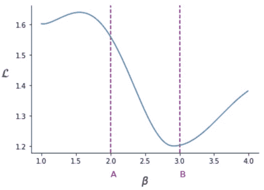

# 常见方法

> 原文：[`dafriedman97.github.io/mlbook/content/appendix/methods.html`](https://dafriedman97.github.io/mlbook/content/appendix/methods.html)

$$ \newcommand{\sumN}{\sum_{n = 1}^N} \newcommand{\sumn}{\sum_n} \newcommand{\prodN}{\prod_{n = 1}^N} \newcommand{\by}{\mathbf{y}} \newcommand{\bX}{\mathbf{X}} \newcommand{\bx}{\mathbf{x}} \newcommand{\bbeta}{\boldsymbol{\beta}} \newcommand{\btheta}{\boldsymbol{\theta}} \newcommand{\bbetahat}{\boldsymbol{\hat{\beta}}} \newcommand{\bthetahat}{\boldsymbol{\hat{\theta}}} \newcommand{\bSigma}{\boldsymbol{\Sigma}} \newcommand{\bphi}{\boldsymbol{\phi}} \newcommand{\bPhi}{\boldsymbol{\Phi}} \newcommand{\bT}{\mathbf{T}} \newcommand{\dadb}[2]{\frac{\partial #1}{\partial #2}} \newcommand{\iid}{\overset{\small{\text{i.i.d.}}}{\sim}} $$

本节将回顾两种用于拟合各种机器学习模型的方法：*梯度下降*和*交叉验证*。这些方法将在本书的整个过程中反复使用。

## 1. 梯度下降

几乎本书中讨论的所有模型都旨在找到一组参数，以最小化所选的损失函数。有时我们可以通过对损失函数求导，将其设为 0 并求解来找到最优参数。然而，在无法得到封闭形式解的情况下，我们可能会转向梯度下降。**梯度下降**是一种迭代方法，用于逼近最小化可微损失函数的参数。

### 设置

首先介绍梯度下降的一个典型设置。假设我们有 $N$ 个观测值，其中每个观测值都有预测变量 $\bx_n$ 和目标变量 $y_n$。我们决定用 $\hat{y}_n = f(\bx_n, \bbetahat)$ 来近似 $y_n$，其中 $f()$ 是某个可微函数，$\bbetahat$ 是一组参数估计。接下来，我们引入一个可微损失函数 $\mathcal{L}$。为了简单起见，我们假设我们可以将模型的整个损失写成观测值之间个别损失的加和。也就是说，

$$ \mathcal{L} = \sumN g(y_n, \hat{y}_n), $$

其中 $g()$ 是表示观测值个别损失的某个可微函数。

为了拟合这个通用模型，我们希望找到使 $\mathcal{L}$ 最小的 $\bbetahat$ 的值。我们可能会从以下导数开始：

$$\begin{split} \begin{align} \dadb{\mathcal{L}}{\bbetahat} &= \sumN\dadb{g(y_n, \hat{y}_n)}{\bbetahat} \\ &= \sumN\dadb{g(y_n, \hat{y}_n)}{\hat{y}_n}\cdot\dadb{\hat{y}_n}{\bbetahat}. \\ \end{align} \end{split}$$

理想情况下，我们可以将上述导数设为 0 并求解 $\bbetahat$，从而得到最优解。如果这不可能，我们可以迭代地寻找使 $\mathcal{L}$ 最小的 $\bbetahat$ 的值。这就是梯度下降的过程。

### 直观介绍



为了直观地理解这个过程，考虑上面的图像，它显示了模型损失作为单个参数 $\beta$ 的函数。我们通过随机选择一个值来开始寻找最优的 $\beta$。假设我们从点 $A$ 开始 $\beta$。从点 $A$ 我们问“如果增加或减少 $\beta$，损失函数会减少吗？”为了回答这个问题，我们计算 $\beta = A$ 时 $\mathcal{L}$ 对 $\beta$ 的导数。由于这个导数是负的，我们知道增加 $\beta$ 一些小量将减少损失。

现在我们知道我们想要增加 $\beta$，但增加多少呢？直观上，导数越负，随着 $\beta$ 的增加，损失将减少得越多。所以，让我们以与导数负值成比例的量增加 $\beta$。让 $\delta$ 为导数，$\eta$ 为一个小常数学习率，我们可能会用以下方式增加 $\beta$：

$$ \beta \gets \beta - \eta\delta. $$

$\delta$ 越负，我们增加 $\beta$ 的幅度就越大。

现在假设我们进行了增加，最终得到 $\beta = B$。再次计算导数，我们得到一个略微正的数。这告诉我们我们走得太远了：增加 $\beta$ 将会增加 $\mathcal{L}$。然而，由于导数只是 *略微* 正的，我们只想进行轻微的修正。让我们再次使用相同的调整，$\beta \gets \beta - \eta\delta$。由于 $\delta$ 现在略微为正，$\beta$ 将略微减少。我们将重复这个过程固定次数或直到 $\beta$ 几乎没有变化。这就是梯度下降！

### 步骤

我们可以用以下步骤更具体地描述梯度下降。注意，这里 $\bbetahat$ 可以是一个向量，而不仅仅是单个参数。

1.  选择一个小的学习率 $\eta$

1.  随机实例化 $\bbetahat$

1.  对于固定的迭代次数或直到达到某个停止规则：

    1.  计算 $\boldsymbol{\delta} = \partial \mathcal{L}/\partial \bbetahat$

    1.  用以下方式调整 $\bbetahat$

        $$ \bbetahat \gets \bbetahat - \eta \boldsymbol{\delta}. $$

一个潜在的停止规则可能是一个 $\bbetahat$ 大小变化的最小值或损失函数 $\mathcal{L}$ 的最小减少。

### 一个例子

作为梯度下降作用的一个简单例子，让我们推导普通最小二乘法（OLS）回归估计。（这个问题确实有一个闭式解，但我们将使用梯度下降来展示这种方法）。如第一章中所述，线性回归模型 $\hat{y}_n$ 与

$$ \hat{y}_n = \bx_n^\top \bbetahat, $$

其中 $\bx_n$ 是一个带有前导 1 的预测变量向量，$\bbetahat$ 是一个系数向量。OLS 损失函数定义为

$$ \mathcal{L}(\bbetahat) = \frac{1}{2}\sumN(y_n - \hat{y}_n)² = \frac{1}{2}\sumN (y_n - \bx^\top_n \bbetahat)². $$

在选择 $\eta$ 并随机实例化 $\bbetahat$ 后，我们迭代地计算损失函数的梯度：

$$ \boldsymbol{\delta} = \dadb{\mathcal{L}(\bbetahat)}{\bbetahat} = -\sumN(y_n - \bx^\top_n \bbetahat)\cdot\bphi_n^\top, $$

and adjust with

$$ \bbetahat \gets \bbetahat - \eta\boldsymbol{\delta}. $$

这可以通过以下代码实现。注意，我们还可以计算 $\boldsymbol{\delta} = -\bX^\top(\by - \hat{\by})$，其中 $\bX$ 是 特征矩阵，$\by$ 是目标向量，$\hat{\by}$ 是拟合值向量。

```py
import numpy as np

def OLS_GD(X, y, eta = 1e-3, n_iter = 1e4, add_intercept = True):

  ## Add Intercept
  if add_intercept:
    ones = np.ones(X.shape[0]).reshape(-1, 1)
    X = np.concatenate((ones, X), 1)

  ## Instantiate
  beta_hat = np.random.randn(X.shape[1])

  ## Iterate
  for i in range(int(n_iter)):

    ## Calculate Derivative
    yhat = X @ beta_hat
    delta = -X.T @ (y - yhat)
    beta_hat -= delta*eta 
```

## 2\. 交叉验证

本书讨论的几个模型需要选择*超参数*（即在模型拟合之前）。这些超参数的值会影响模型拟合的质量。那么我们如何在不拟合模型的情况下选择这些值呢？最常见的答案是交叉验证。

假设我们在几个超参数值之间进行选择，从而产生多个竞争模型。选择我们模型的一种方法是将我们的数据分为一个*训练集*和一个*验证集*，在每个训练集上构建每个模型，并查看哪个在验证集上的表现更好。通过将数据分为训练集和验证集，我们避免了基于模型在样本内表现来评估模型。

这种设置的明显问题是，我们只是在*一个*数据集上比较模型的性能。相反，我们可能会选择使用**K 折交叉验证**来比较竞争模型，如下所述。

1.  将原始数据集分为$K$个*折*或子集。

1.  对于 $k = 1, \dots, K$，将折$k$作为验证集。在每个其他$K-1$折的数据上训练每个竞争模型，并在第$k^\text{th}$的数据上评估它。

1.  选择平均验证性能最佳的模型。

例如，让我们使用交叉验证来选择第二章中讨论的 岭回归 模型的惩罚值。该模型限制了回归系数的大小；惩罚项越高，系数的约束就越大。

下面的示例使用来自`scikit-learn`的`Ridge`类，该类使用`alpha`参数定义惩罚项。我们将使用 波士顿住房 数据集。

```py
## Import packages 
import numpy as np
from sklearn.linear_model import Ridge
from sklearn.datasets import load_boston

## Import data
boston = load_boston()
X = boston['data']
y = boston['target']
N = X.shape[0]

## Choose alphas to consider
potential_alphas = [0, 1, 10]
error_by_alpha = np.zeros(len(potential_alphas))

## Choose the folds 
K = 5
indices = np.arange(N)
np.random.shuffle(indices)
folds = np.array_split(indices, K)

## Iterate through folds
for k in range(K):

  ## Split Train and Validation
    X_train = np.delete(X, folds[k], 0)
    y_train = np.delete(y, folds[k], 0)
    X_val = X[folds[k]]
    y_val = y[folds[k]]

  ## Iterate through Alphas
    for i in range(len(potential_alphas)):

        ## Train on Training Set
        model = Ridge(alpha = potential_alphas[i])
        model.fit(X_train, y_train)

        ## Calculate and Append Error
        error = np.sum( (y_val - model.predict(X_val))**2 )
        error_by_alpha[i] += error

error_by_alpha /= N 
```

然后，我们可以检查`error_by_alpha`并选择对应于最低平均错误的`alpha`！

## 1\. 梯度下降

本书讨论的大多数模型旨在找到一组参数，这些参数可以最小化所选的损失函数。有时我们可以通过对损失函数求导，将其设置为 0，并求解来找到最优参数。然而，在无法获得闭式解的情况下，我们可能会转向梯度下降。**梯度下降**是一种迭代方法，用于逼近最小化可微损失函数的参数。

### 设置

让我们先介绍梯度下降的一个典型设置。假设我们有 $N$ 个观察值，其中每个观察值都有预测变量 $\bx_n$ 和目标变量 $y_n$。我们决定用 $\hat{y}_n = f(\bx_n, \bbetahat)$ 来近似 $y_n$，其中 $f()$ 是某个可微函数，$\bbetahat$ 是一组参数估计。接下来，我们引入一个可微损失函数 $\mathcal{L}$。为了简单起见，让我们假设我们可以将模型的整个损失写成观察到的单个损失的加权和。也就是说，

$$ \mathcal{L} = \sumN g(y_n, \hat{y}_n), $$

其中 $g()$ 是表示观察到的单个损失的某个可微函数。

为了拟合这个通用模型，我们想要找到使 $\mathcal{L}$ 最小的 $\bbetahat$ 的值。我们可能会从以下导数开始：

$$\begin{split} \begin{align} \dadb{\mathcal{L}}{\bbetahat} &= \sumN\dadb{g(y_n, \hat{y}_n)}{\bbetahat} \\ &= \sumN\dadb{g(y_n, \hat{y}_n)}{\hat{y}_n}\cdot\dadb{\hat{y}_n}{\bbetahat}. \\ \end{align} \end{split}$$

理想情况下，我们可以将上述导数设为 0 并求解 $\bbetahat$，从而得到最优解。如果这不可能，我们可以迭代搜索使 $\mathcal{L}$ 最小的 $\bbetahat$ 的值。这就是梯度下降的过程。

### 直观介绍


为了直观理解这个过程，考虑上面的图像，它显示了模型损失作为单个参数 $\beta$ 的函数。我们通过随机选择一个值来开始寻找最优的 $\beta$。假设我们从点 $A$ 的 $\beta$ 开始。从点 $A$ 我们会问：“如果增加或减少 $\beta$，损失函数会减少吗？”为了回答这个问题，我们计算 $\beta = A$ 时 $\mathcal{L}$ 对 $\beta$ 的导数。由于这个导数是负的，我们知道增加 $\beta$ 一些小的量会减少损失。

现在我们知道我们想要增加 $\beta$，但增加多少呢？直观上，导数越负，随着 $\beta$ 的增加，损失会减少得越多。所以，让我们以与导数的负值成比例的量增加 $\beta$。设 $\delta$ 为导数，$\eta$ 为一个小常数学习率，我们可能会用以下方式增加 $\beta$：

$$ \beta \gets \beta - \eta\delta. $$

负的 $\delta$ 越大，我们增加 $\beta$ 的幅度就越大。

现在假设我们增加 $\beta$ 并最终得到 $\beta = B$。再次计算导数，我们得到一个略微正的数。这告诉我们我们走得太远了：增加 $\beta$ 将会增加 $\mathcal{L}$。然而，由于导数只是*略微*正的，我们只想进行轻微的修正。让我们再次使用相同的调整，$\beta \gets \beta - \eta\delta$。由于 $\delta$ 现在略微正，$\beta$ 将略微减少。我们将重复这个过程固定次数或直到 $\beta$ 几乎没有变化。这就是梯度下降！

### 步骤

我们可以用以下步骤更具体地描述梯度下降。注意，这里 $\hat{\beta}$ 可以是一个向量，而不仅仅是单个参数。

1.  选择一个小的学习率 $\eta$

1.  随机实例化 $\hat{\beta}$

1.  对于固定次数的迭代或直到达到某个停止规则：

    1.  计算 $\boldsymbol{\delta} = \frac{\partial \mathcal{L}}{\partial \hat{\beta}}$

    1.  用以下方式调整 $\hat{\beta}$

        $$ \hat{\beta} \gets \hat{\beta} - \eta \boldsymbol{\delta}. $$

一种可能的停止规则可能是 $\hat{\beta}$ 的幅度变化的最小值或损失函数 $\mathcal{L}$ 的最小减少。

### 示例

作为梯度下降的一个简单示例，让我们推导普通最小二乘法（OLS）回归估计。（这个问题确实有一个闭式解，但我们将使用梯度下降来展示方法）。如第一章中讨论的，线性回归模型 $\hat{y}_n$ 与

$$ \hat{y}_n = \bx_n^\top \hat{\beta}, $$

其中 $\bx_n$ 是一个向量，它以一个前置的 1 结尾，而 $\hat{\beta}$ 是一个系数向量。最小二乘法损失函数定义为

$$ \mathcal{L}(\hat{\beta}) = \frac{1}{2}\sum_{n=1}^{N}(y_n - \hat{y}_n)² = \frac{1}{2}\sum_{n=1}^{N} (y_n - \bx_n^\top \hat{\beta})². $$

在选择 $\eta$ 和随机实例化 $\hat{\beta}$ 之后，我们迭代地计算损失函数的梯度：

$$ \boldsymbol{\delta} = \frac{\partial \mathcal{L}(\hat{\beta})}{\partial \hat{\beta}} = -\sum_{n=1}^{N}(y_n - \bx_n^\top \hat{\beta})\cdot\bphi_n^\top, $$

并调整

$$ \hat{\beta} \gets \hat{\beta} - \eta\boldsymbol{\delta}. $$

这可以通过以下代码实现。注意，我们还可以计算 $\boldsymbol{\delta} = -\bX^\top(\by - \hat{\by})$，其中 $\bX$ 是特征矩阵，$\by$ 是目标向量，$\hat{\by}$ 是拟合值向量。

```py
import numpy as np

def OLS_GD(X, y, eta = 1e-3, n_iter = 1e4, add_intercept = True):

  ## Add Intercept
  if add_intercept:
    ones = np.ones(X.shape[0]).reshape(-1, 1)
    X = np.concatenate((ones, X), 1)

  ## Instantiate
  beta_hat = np.random.randn(X.shape[1])

  ## Iterate
  for i in range(int(n_iter)):

    ## Calculate Derivative
    yhat = X @ beta_hat
    delta = -X.T @ (y - yhat)
    beta_hat -= delta*eta 
```

### 设置

让我们先介绍梯度下降的一个典型设置。假设我们有 $N$ 个观察值，其中每个观察值都有预测变量 $\bx_n$ 和目标变量 $y_n$。我们决定用 $\hat{y}_n = f(\bx_n, \bbetahat)$ 来近似 $y_n$，其中 $f()$ 是某个可微函数，$\bbetahat$ 是一组参数估计。接下来，我们引入一个可微损失函数 $\mathcal{L}$。为了简单起见，让我们假设我们可以将模型的整个损失写成观察到的单个损失的总和。也就是说，

$$ \mathcal{L} = \sumN g(y_n, \hat{y}_n), $$

其中 $g()$ 是表示观察到的单个损失的某个可微函数。

为了拟合这个通用模型，我们想要找到使 $\mathcal{L}$ 最小的 $\bbetahat$ 的值。我们可能会从以下导数开始：

$$\begin{split} \begin{align} \dadb{\mathcal{L}}{\bbetahat} &= \sumN\dadb{g(y_n, \hat{y}_n)}{\bbetahat} \\ &= \sumN\dadb{g(y_n, \hat{y}_n)}{\hat{y}_n}\cdot\dadb{\hat{y}_n}{\bbetahat}. \\ \end{align} \end{split}$$

理想情况下，我们可以将上述导数设为 0 并解出 $\bbetahat$，得到我们的最优解。如果这不可能，我们可以迭代地寻找使 $\mathcal{L}$ 最小的 $\bbetahat$ 的值。这就是梯度下降的过程。

### 直观介绍


为了直观地理解这个过程，考虑上面显示的模型损失作为单个参数 $\beta$ 的函数的图像。我们开始寻找最优 $\beta$ 的值，通过随机选择一个值。假设我们从点 $A$ 的 $\beta$ 开始。从点 $A$ 我们会问：“如果增加或减少 $\beta$，损失函数会减少吗？”为了回答这个问题，我们计算在 $\beta = A$ 时 $\mathcal{L}$ 对 $\beta$ 的导数。由于这个导数是负的，我们知道增加 $\beta$ 一些小的量会减少损失。

现在我们知道我们想要增加 $\beta$，但增加多少呢？直观上，导数越负，随着 $\beta$ 的增加，损失会减少得越多。所以，让我们以与导数的负值成比例的量增加 $\beta$。让 $\delta$ 表示导数，$\eta$ 表示一个小的常数学习率，我们可能会用以下方式增加 $\beta$：

$$ \beta \gets \beta - \eta\delta. $$

$\delta$ 越负，我们增加 $\beta$ 的量就越大。

现在假设我们增加（beta）并最终得到 $\beta = B$。再次计算导数，我们得到一个略微正数。这告诉我们我们做得太过了：增加 $\beta$ 将会增加 $\mathcal{L}$。然而，由于导数只是 *略微* 正的，我们只想进行轻微的修正。让我们再次使用相同的调整，$\beta \gets \beta - \eta\delta$。由于 $\delta$ 现在略微为正，$\beta$ 将会略微减少。我们将重复这个过程固定次数或直到 $\beta$ 几乎没有变化。这就是梯度下降！

### 步骤

我们可以用以下步骤更具体地描述梯度下降。注意，$\bbetahat$ 可以是一个向量，而不仅仅是单个参数。

1.  选择一个小的学习率 $\eta$

1.  随机实例化 $\bbetahat$

1.  对于固定次数的迭代或直到达到某个停止规则：

    1.  计算 $\boldsymbol{\delta} = \partial \mathcal{L}/\partial \bbetahat$

    1.  使用以下方式调整 $\bbetahat$

        $$ \bbetahat \gets \bbetahat - \eta \boldsymbol{\delta}. $$

一个可能的停止规则可能是 $\bbetahat$ 的幅度变化的最小值或损失函数 $\mathcal{L}$ 的最小减少。

### 示例

作为梯度下降实际应用的简单例子，让我们推导普通最小二乘法（OLS）回归估计。（这个问题确实有一个闭式解，但我们将使用梯度下降来展示方法）。如第一章中所述，线性回归模型 $\hat{y}_n$ 使用

$$ \hat{y}_n = \bx_n^\top \bbetahat, $$

其中 $\bx_n$ 是一个向量，包含预测变量并附加一个前导的 1，$\bbetahat$ 是一个系数向量。OLS 损失函数定义为

$$ \mathcal{L}(\bbetahat) = \frac{1}{2}\sumN(y_n - \hat{y}_n)² = \frac{1}{2}\sumN (y_n - \bx^\top_n \bbetahat)². $$

在选择 $\eta$ 并随机实例化 $\bbetahat$ 后，我们迭代地计算损失函数的梯度：

$$ \boldsymbol{\delta} = \dadb{\mathcal{L}(\bbetahat)}{\bbetahat} = -\sumN(y_n - \bx^\top_n \bbetahat)\cdot\bphi_n^\top, $$

并进行调整

$$ \bbetahat \gets \bbetahat - \eta\boldsymbol{\delta}. $$

这可以通过以下代码实现。注意，我们也可以计算 $\boldsymbol{\delta} = -\bX^\top(\by - \hat{\by})$，其中 $\bX$ 是 特征矩阵，$\by$ 是目标向量，$\hat{\by}$ 是拟合值向量。

```py
import numpy as np

def OLS_GD(X, y, eta = 1e-3, n_iter = 1e4, add_intercept = True):

  ## Add Intercept
  if add_intercept:
    ones = np.ones(X.shape[0]).reshape(-1, 1)
    X = np.concatenate((ones, X), 1)

  ## Instantiate
  beta_hat = np.random.randn(X.shape[1])

  ## Iterate
  for i in range(int(n_iter)):

    ## Calculate Derivative
    yhat = X @ beta_hat
    delta = -X.T @ (y - yhat)
    beta_hat -= delta*eta 
```

## 2\. 交叉验证

本书涵盖的几个模型需要选择 *超参数*，这些超参数在模型拟合之前外生选择（即，在模型拟合之前）。这些超参数的值会影响模型拟合的质量。那么我们如何在不拟合模型的情况下选择这些值呢？最常见的答案是交叉验证。

假设我们正在决定几个超参数值，从而产生多个竞争模型。选择我们的模型的一种方法是将我们的数据分为一个**训练集**和一个**验证集**，在每个训练集上构建每个模型，并查看哪个在验证集上表现更好。通过将数据分为训练集和验证集，我们避免了基于模型在样本内性能来评估模型。

这种设置的一个明显问题是，我们只是在比较模型在一个数据集上的性能。相反，我们可能会选择使用**K 折交叉验证**来比较竞争模型，如下所述。

1.  将原始数据集分为 $K$ 个**折叠**或子集。

1.  对于 $k = 1, \dots, K$，将折叠 $k$ 作为验证集。在每个其他 $K-1$ 折叠的数据上训练每个竞争模型，并在第 $k$ 个折叠的数据上评估它。

1.  选择平均验证性能最好的模型。

例如，让我们使用交叉验证来为第二章中讨论的 岭回归 模型选择一个惩罚值。该模型限制了回归系数的大小；惩罚项越高，系数的约束就越大。

下面的示例使用来自 `scikit-learn` 的 `Ridge` 类，该类使用 `alpha` 参数定义惩罚项。我们将使用 波士顿住房 数据集。

```py
## Import packages 
import numpy as np
from sklearn.linear_model import Ridge
from sklearn.datasets import load_boston

## Import data
boston = load_boston()
X = boston['data']
y = boston['target']
N = X.shape[0]

## Choose alphas to consider
potential_alphas = [0, 1, 10]
error_by_alpha = np.zeros(len(potential_alphas))

## Choose the folds 
K = 5
indices = np.arange(N)
np.random.shuffle(indices)
folds = np.array_split(indices, K)

## Iterate through folds
for k in range(K):

  ## Split Train and Validation
    X_train = np.delete(X, folds[k], 0)
    y_train = np.delete(y, folds[k], 0)
    X_val = X[folds[k]]
    y_val = y[folds[k]]

  ## Iterate through Alphas
    for i in range(len(potential_alphas)):

        ## Train on Training Set
        model = Ridge(alpha = potential_alphas[i])
        model.fit(X_train, y_train)

        ## Calculate and Append Error
        error = np.sum( (y_val - model.predict(X_val))**2 )
        error_by_alpha[i] += error

error_by_alpha /= N 
```

然后，我们可以检查 `error_by_alpha` 并选择对应于最低平均错误的 `alpha`！
