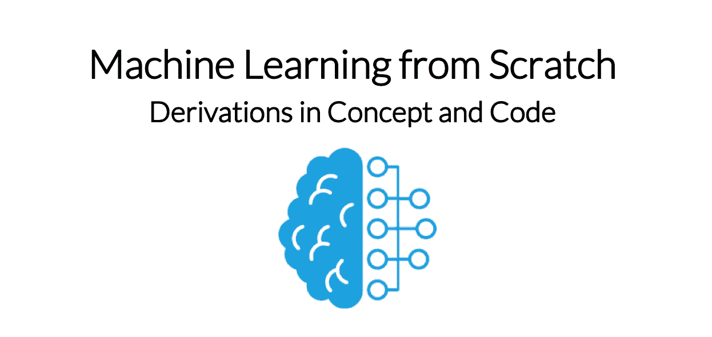

# 引言

> 原文：[`dafriedman97.github.io/mlbook/content/introduction.html`](https://dafriedman97.github.io/mlbook/content/introduction.html)

## 本书涵盖内容

本书涵盖了机器学习中最常见方法的构建块。这一系列方法就像机器学习工程师的工具箱。那些进入机器学习领域的人应该熟悉这个工具箱，以便他们能够为各种任务找到合适的工具。本书的每一章都对应于单个机器学习方法或一组方法。换句话说，每一章都专注于 ML 工具箱中的单个工具。

根据我的经验，最舒适地掌握这些方法的方式是看到它们从头开始推导，无论是在理论上还是在代码中。本书的目的是提供这些推导。每一章都被分为三个部分。*概念*部分从概念上介绍方法并推导其结果。*构建*部分展示了如何使用 Python 从头开始构建这些方法。*实现*部分演示了如何使用 Python 中的包（如`scikit-learn`、`statsmodels`和`tensorflow`）应用这些方法。

## 为什么写这本书

有许多关于机器学习的优秀书籍，由更博学的作者撰写，覆盖了更广泛的主题。特别是，我建议阅读[统计学习引论](http://faculty.marshall.usc.edu/gareth-james/ISL/)、[统计学习元素](https://web.stanford.edu/~hastie/ElemStatLearn/)和[模式识别与机器学习](https://www.microsoft.com/en-us/research/publication/pattern-recognition-machine-learning/)，这些书籍都可以在线免费获取。

虽然那些书籍提供了机器学习及其方法背后的理论的概念性概述，但本书专注于机器学习算法的精髓。其主要目的是为读者提供独立构建这些算法的能力。继续使用工具箱的类比，本书旨在作为用户指南：它不是设计来教授用户该领域的广泛实践，而是如何从微观层面了解每个工具的工作原理。

## 这本书是为谁而写

本书是为那些想要学习新的机器学习算法或更深入地理解算法的读者而写的。具体来说，它是为那些想要从头到尾看到机器学习算法推导的读者而写的。看到这些推导可能有助于以前不熟悉常见算法的读者直观地理解它们是如何工作的。或者，看到这些推导可能有助于有建模经验的读者理解不同的算法是如何创建它们的模型以及每种算法的优点和缺点。

本书对有基本建模实践经验的读者最有帮助。它不涉及最佳实践——例如特征工程或平衡响应变量——也不深入讨论在某些情况下某些模型比其他模型更合适的情况。相反，它专注于这些模型的基本要素。

## 读者应了解的内容

本书的概念部分主要需要微积分知识，尽管一些部分需要理解概率（例如最大似然和贝叶斯定理）和基本的线性代数（例如矩阵运算和点积）。附录回顾了理解本书所需的数学和概率内容。概念部分还引用了一些常见的机器学习方法，这些方法在附录中也有介绍。概念部分不需要任何编程知识。

本书的构建和代码部分使用了一些基本的 Python。构建部分需要理解相应的内容部分，并熟悉在 Python 中创建函数和类。代码部分则不需要。

## 哪里可以提问或提供反馈

您可以在[这里](https://github.com/dafriedman97/mlbook/issues)提出问题，或者通过电子邮件 dafrdman@gmail.com 联系我。您也可以在[这里](https://twitter.com/dafrdman)或[这里](https://www.linkedin.com/in/daniel-friedman-36b1b2139/)上与我建立联系。

## 本书涵盖的内容

本书涵盖了机器学习中最常见方法的构建块。这一系列方法就像是机器学习工程师的工具箱。那些进入机器学习领域的人应该对这个工具箱感到舒适，以便他们能够为各种任务找到合适的工具。本书的每一章都对应于单个机器学习方法或一组方法。换句话说，每一章都专注于 ML 工具箱中的单个工具。

根据我的经验，最舒适地掌握这些方法的方式是看到它们从头开始推导，无论是在理论上还是在代码上。本书的目的是提供这些推导。每一章分为三个部分。概念部分从理论上介绍方法并推导其结果。构建部分展示了如何使用 Python 从头开始构建这些方法。实现部分演示了如何使用 Python 中的`scikit-learn`、`statsmodels`和`tensorflow`等包来应用这些方法。

## 为什么选择这本书

有许多由知识渊博的作者撰写的关于机器学习的优秀书籍，涵盖了更广泛的主题范围。特别是，我建议阅读[统计学习引论](http://faculty.marshall.usc.edu/gareth-james/ISL/)、[统计学习元素](https://web.stanford.edu/~hastie/ElemStatLearn/)和[模式识别与机器学习](https://www.microsoft.com/en-us/research/publication/pattern-recognition-machine-learning/)，这些书籍都可以免费在线获取。

虽然那些书籍提供了机器学习及其方法背后的理论概念概述，但本书专注于机器学习算法的骨架。其主要目的是为读者提供独立构建这些算法的能力。继续工具箱的类比，本书旨在作为用户指南：它不是设计来教授用户领域的广泛实践，而是如何从微观层面了解每个工具的工作原理。

## 本书面向对象

本书面向希望学习新的机器学习算法或更深入理解算法的读者。具体来说，本书旨在面向那些对从始至终推导机器学习算法感兴趣的读者。看到这些推导可能有助于之前不熟悉常见算法的读者直观地理解它们是如何工作的。或者，看到这些推导可能有助于有建模经验的读者理解不同算法如何创建模型以及每种算法的优点和缺点。

对于在基本建模方面有实践经验的读者来说，本书将非常有帮助。它不回顾最佳实践——例如特征工程或平衡响应变量——也不深入讨论何时某些模型比其他模型更合适。相反，它专注于这些模型的基本要素。

## 读者应了解的内容

本书的概念部分主要需要微积分知识，尽管一些部分需要理解概率（例如最大似然和贝叶斯定理）以及基本的线性代数（例如矩阵运算和点积）。附录回顾了理解本书所需的数学和概率内容。概念部分还引用了一些常见的机器学习方法，这些方法在附录中也有介绍。概念部分不需要任何编程知识。

本书的建设和代码部分使用了一些基本的 Python。建设部分需要理解相应的内容部分，并熟悉在 Python 中创建函数和类。代码部分则不需要。

## 哪里可以提问或提供反馈

你可以在[这里](https://github.com/dafriedman97/mlbook/issues)提出问题，或者通过电子邮件 dafrdman@gmail.com 联系我。你还可以在[这里](https://twitter.com/dafrdman)或[这里](https://www.linkedin.com/in/daniel-friedman-36b1b2139/)上与我建立联系。
