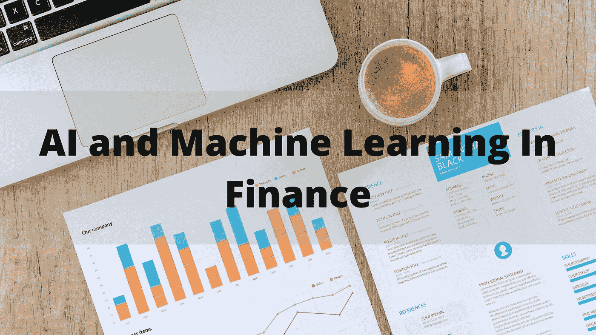
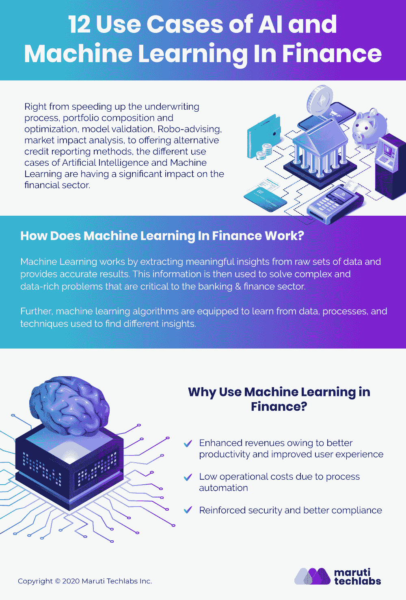
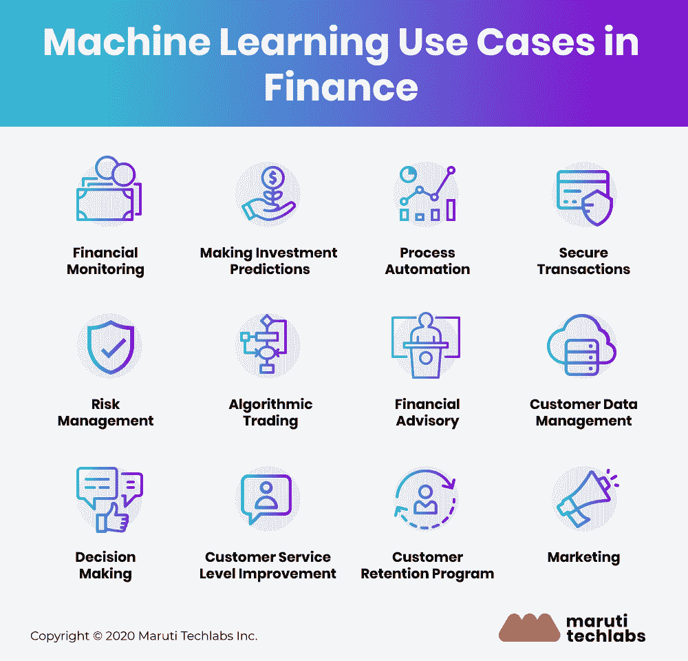
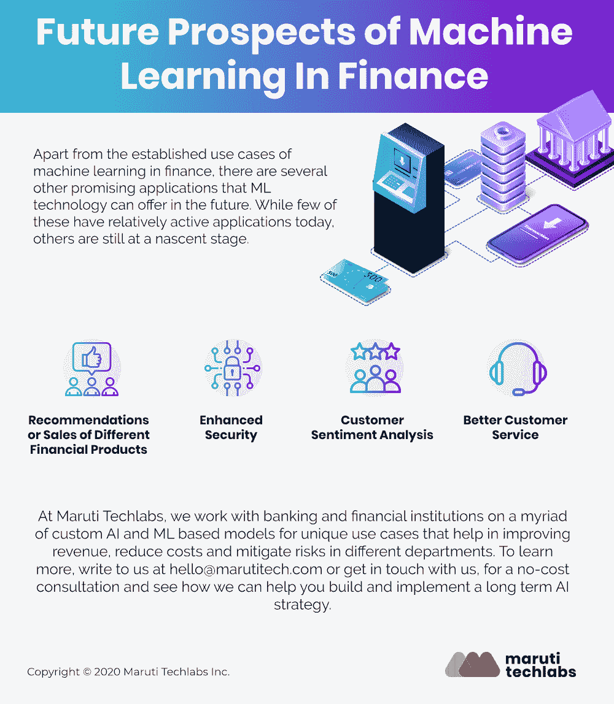

# 人工智能和机器学习在金融领域的 12 个用例

> 原文：<https://medium.com/mlearning-ai/12-use-cases-of-ai-and-machine-learning-in-finance-775339ef9027?source=collection_archive---------0----------------------->

毫无疑问，金融业正在经历一场转型变革。为了向客户提供优质服务并在竞争中胜出，金融机构正在使用最新技术来了解客户需求、发现机会、保持竞争力、解决业务问题并简化后台操作，

近年来，由于软件和硬件的改善，人工智能和金融机器学习等颠覆性技术的步伐迅速加快。特别是金融领域，机器学习应用程序的使用案例急剧增加，为消费者和企业带来了更好的结果。

# 金融中的机器学习

直到最近，只有对冲基金是人工智能和人工智能在金融领域的主要用户，但在过去几年中，人工智能的应用扩展到了其他各个领域，包括银行、金融科技、监管机构和保险公司等。

从加快承保流程、投资组合构成和优化、模型验证、机器人建议、市场影响分析，到提供替代的信用报告方法，人工智能和机器学习在金融领域的不同[用例](https://marutitech.com/machine-learning-services/)正在对这一领域产生重大影响。

包括银行、贸易和金融科技公司在内的金融行业正在快速部署机器算法来自动化耗时的日常流程，并提供更加简化和个性化的客户体验。

# 金融中的机器学习是如何工作的？

机器学习通过从原始数据集中提取有意义的见解来工作，并提供准确的结果。然后，这些信息被用于解决对银行和金融部门至关重要的复杂且数据丰富的问题。

此外，机器学习算法被配备为从用于找到不同见解的数据、过程和技术中学习。

# 金融公司在实施机器学习解决方案时面临的挑战

在开发机器学习解决方案时，金融服务公司通常会遇到下面讨论的一些常见问题

*   **对业务 KPI 缺乏了解**

金融服务公司希望利用这个巨大的机会，但由于不切实际的期望以及对人工智能和机器学习如何工作(以及为什么需要它)缺乏清晰的认识，他们经常在这方面失败。

*   **研发成本高&研发成本高**

金融服务公司通常难以管理存储在不同位置(如报告软件、区域数据中心、CRM 等)的零散数据。对于公司来说，为数据科学项目准备这些数据既耗时又昂贵。

所有这些挑战的组合导致了不切实际的估计，并耗尽了项目的整个预算。这就是为什么金融公司需要根据其特定的业务目标，为每个[机器学习服务项目](https://marutitech.com/machine-learning-services/)设定现实的预期。

# 为什么要在金融中使用机器学习？

尽管存在上述挑战，但银行和金融服务公司仍应考虑使用机器学习的一些原因如下

*   由于生产率提高和用户体验改善，收入增加
*   流程自动化带来的低运营成本
*   增强的安全性和更好的合规性

# 金融领域的机器学习用例

这里有一些机器学习算法可以/正在金融领域使用的用例

**1。财务监控**

机器学习算法可用于显著增强网络安全性。数据科学家总是致力于训练系统，以检测洗钱技术等标志，这些标志可以通过金融监控来防止。未来机器学习技术很有可能为最先进的网络安全网络提供动力。

**2。进行投资预测**

与传统投资模型相比，[机器学习技术提供了先进的市场洞察力](https://www.jpmorgan.com/global/cib/research/investment-decisions-using-machine-learning-ai)这一事实使基金经理能够更早地识别特定的市场变化。

随着美国银行、摩根大通和摩根士丹利等知名公司大举投资于 ML 技术以开发自动化投资顾问，投资银行业的混乱是显而易见的。

**3。过程自动化**

机器学习驱动的解决方案允许金融公司通过智能流程自动化[自动化重复性任务来完全取代人工工作](https://marutitech.com/rpa-in-banking-and-finance/)以提高业务生产力。聊天机器人、文书工作自动化和员工培训游戏化是使用机器学习的金融流程自动化的一些例子。这使得金融公司能够改善客户体验、降低成本并扩大服务规模。

此外，机器学习技术可以轻松地访问数据，解释行为，遵循和识别模式。这可以很容易地用于客户支持系统，该系统可以像真人一样工作，并解决所有客户的独特查询。

这方面的一个例子是[富国银行通过 Facebook Messenger 使用 ML 驱动的聊天机器人](https://newsroom.wf.com/press-release/community-banking-and-small-business/wells-fargo-testing-bot-messenger-featuring-new)与其用户有效沟通。聊天机器人帮助客户获得他们需要的关于他们的账户和密码的所有信息。

**4。安全交易**

机器学习算法在通过分析数百万往往被人类忽视的数据点来检测交易欺诈方面表现出色。此外，ML 还减少了错误拒绝的数量，并有助于提高实时批准的精确度。这些模型通常基于客户在互联网上的行为和交易历史。

除了以高准确度发现欺诈行为之外，ML-powered 技术还能够识别可疑的账户行为，并实时防止欺诈，而不是在犯罪发生后才发现。

根据研究，几乎每因欺诈损失 1 美元，金融机构承担的[恢复成本就接近 2.92 美元](https://www.digitaltransactions.net/financial-institutions-costs-increase-to-2-92-for-every-dollar-of-fraud-says-lexisnexis/)。

ML 最成功的应用之一是信用卡欺诈检测。银行通常配备有监控系统，这些系统根据历史支付数据进行培训。算法训练、验证和回溯测试基于信用卡交易数据的庞大数据集。ML 支持的分类算法可以轻松地将事件标记为欺诈或非欺诈，以实时阻止欺诈交易。

**5。风险管理**

使用机器学习技术，银行和金融机构可以通过分析大量数据源来显著降低风险水平。与通常局限于基本信息(如信用评分)的传统方法不同，ML 可以分析大量个人信息以降低风险。

机器学习技术收集的各种见解也为银行和金融服务组织提供了可操作的情报，以帮助他们做出后续决策。这方面的一个例子可能是机器学习程序为申请贷款的客户挖掘不同的数据源，并为他们分配风险分数。然后，ML 算法可以很容易地预测那些面临贷款违约风险的客户，以帮助公司重新思考或调整针对每个客户的条款。

**6。算法交易**

交易中的机器学习是金融行业中有效用例的另一个优秀例子。事实上，算法交易已经成为全球金融市场的主导力量。

基于 ML 的解决方案和模型允许交易公司通过实时密切监控交易结果和新闻来检测能够使股票价格上涨或下跌的模式，从而做出更好的交易决策。

机器学习算法还可以同时分析数百个数据源，使交易员比市场平均水平具有明显优势。算法交易的其他一些好处包括

1.  提高准确性，减少出错几率
2.  AT 允许以尽可能好的价格进行交易
3.  人为错误可能会大大减少
4.  支持自动和同时检查多个市场条件

**7。财务顾问**

有各种由机器学习支持的预算管理应用程序，可以为客户提供高度专业化和有针对性的财务建议和指导。机器学习算法不仅允许客户使用这些应用程序跟踪他们每天的支出，还可以帮助他们分析这些数据，以确定他们的支出模式，然后确定他们可以节省的领域。

在这种情况下，另一个迅速出现的趋势是机器人顾问。他们像普通顾问一样工作，专门针对希望管理自己基金的资源有限的投资者(个人和中小型企业)。这些基于人工智能的机器人顾问可以应用传统的数据处理技术来创建金融投资组合和解决方案，如交易、投资、退休计划等。为他们的用户。

**8。客户数据管理**

对于银行和金融机构来说，数据是最重要的资源，因此高效的数据管理是业务发展和成功的核心。

从移动通信、社交媒体活动到交易细节和市场数据，金融数据的巨大数量和结构多样性使其即使对于金融专家来说也是一个巨大的挑战。

集成机器学习技术来管理如此大量的数据，可以带来流程效率和从数据中提取真正智能的好处。AI 和 ML 工具，如数据分析、数据挖掘和自然语言处理，有助于从数据中获得有价值的见解，以提高业务盈利能力。

一个很好的例子是机器学习算法，用于从客户的金融数据中分析市场发展和特定金融趋势的影响。

**9。决策**

银行和金融机构可以使用机器学习算法来分析结构化和非结构化数据。例如，客户请求、社交媒体交互和公司内部的各种业务流程，并发现趋势(有用的和潜在危险的)以评估风险并帮助客户准确地做出明智的决策。

10。客户服务水平提高

使用一个[智能聊天机器人](https://marutitech.com/make-intelligent-chatbot/)，客户可以解决他们所有的疑问，如了解他们的每月费用、贷款资格、负担得起的保险计划等等。

此外，有几个基于 ML 的应用程序，当连接到支付系统时，可以分析帐户，让客户节省和增加他们的钱。复杂的最大似然算法可用于分析用户行为，并开发定制产品。例如，在 ML 算法分析他/她的现有财务状况之后，寻求投资于财务计划的客户可以从个性化的投资报价中受益。

**11。客户维系计划**

信用卡公司可以使用 ML 技术来预测有风险的客户，并特别从这些客户中挑选出一些。根据用户人口统计数据和交易活动，他们可以轻松预测用户行为，并专门为这些客户设计产品。

这里的应用程序包括一个预测性的二进制分类模型，用于找出处于风险中的客户，然后利用推荐模型来确定最适合的信用卡优惠，以帮助留住这些客户。

12。营销

人工智能和机器学习模型根据过去的行为做出准确预测的能力使它们成为一种伟大的营销工具。通过分析移动应用的使用情况、网络活动以及对之前广告活动的回应，机器学习算法可以帮助金融公司制定稳健的营销战略。

# 机器学习在金融领域的未来展望

虽然机器学习在银行和金融领域的一些应用是众所周知的，如聊天机器人和移动银行应用程序，但 ML 算法和技术现在也逐渐用于创新的未来应用，通过准确提取客户的历史数据并预测他们的未来。

除了机器学习在金融领域的既定用例之外，正如上一节所讨论的，ML 技术在未来还可以提供其他一些有前途的应用。虽然其中很少有相对活跃的应用程序，但其他应用程序仍处于萌芽阶段。

*   **不同金融产品的推荐或销售**

尽管即使在今天也存在各种自动化金融产品销售/推荐的应用，但是其中一些应用涉及基于规则的系统(而不是机器学习),其中数据仍然需要通过人工资源才能向客户推荐交易或投资。

未来，保险推荐网站将积极利用人工智能和人工智能技术向客户推荐特定的房屋或车辆保险政策。此外，未来值得关注的一个有趣趋势是机器人顾问建议投资组合的变化，以及基于 ML 的个性化应用和个人助理的快速崛起，为客户提供更客观可靠的咨询服务。

*   **加强安保**

银行和金融中的数据安全是一个至关重要的领域。随着所有信息在线可用，组织发现保护所有用户名、密码和安全问题变得越来越困难。在接下来的几年里，这个领域将会发生巨大的变化，密码、用户名和安全问题可能不再是用户安全的标准。

通过采用语音识别、面部识别或其他类似的生物识别数据，机器学习应用程序将安全性提升一个档次，从而改变行业内的未来安全性。

[Adyen](https://www.adyen.com/?gclid=EAIaIQobChMIqZWw9-DY6AIVx4yPCh2UhAjnEAAYASAAEgII6fD_BwE) ， [Payoneer](https://www.payoneer.com/) ， [Paypal](https://www.paypal.com/in/home) ， [Stripe](https://stripe.com/en-in?utm_campaign=paid_brand-IN_en_Search_Brand_Stripe-1455531110&utm_medium=cpc&utm_source=google&ad_content=301661944508&utm_term=stripe&utm_matchtype=e&utm_adposition=&utm_device=c&gclid=EAIaIQobChMI7-a2meHY6AIVyhErCh1OQwEmEAAYASAAEgJ79vD_BwE) ， [Skrill](https://www.skrill.com/en/pay-online/?gclid=EAIaIQobChMI_Mrcn-HY6AIVEiUrCh3PXQM8EAAYASAAEgL5nPD_BwE&gclsrc=aw.ds) 发生在一些在安全机器学习上投入巨大的公司身上。

*   **客户情绪分析**

在分析当前市场趋势、预测变化以及每个客户的社交媒体使用情况时，机器学习模型可以为金融公司提供很大的帮助。

因为人的因素主要驱动股票市场，企业需要不断地从用户的金融活动中学习。此外，消费者情绪分析还可以补充不同类型的商业和经济发展的当前信息。

*   **更好的客户服务**

出于显而易见的原因，越来越多的金融机构开始优先考虑客户参与。除了帮助他们提高保留率，它还帮助他们了解用户行为和他们不断变化的关注和需求。一个很好的例子就是用于与客户进行即时交流的聊天机器人。

未来将会看到这些聊天助手被构建成具有丰富的金融专用客户交互工具和健壮的自然语言处理引擎，以允许快速交互和查询。

虽然这种专门的聊天机器人体验在今天的银行或金融行业中并不常见，但它在未来具有巨大的潜力。这是一个超越金融领域机器学习的应用，很可能会出现在其他各种领域和行业。

# 金融领域的机器学习——下一步是什么？

今天，机器学习在金融生态系统的不同方面发挥着至关重要的作用，从管理资产、评估风险、提供投资建议、处理金融欺诈、文件认证等等。

虽然 ML 算法正在处理无数的任务，但它们不断从大量数据中学习，并通过使世界更接近完全自动化的金融系统来弥合差距。

对于大多数金融公司来说，需要从与[经验丰富的机器学习服务合作伙伴](https://marutitech.com/machine-learning-services/)一起确定正确的用例集开始，他们可以在彻底了解将从不同来源提取的预期输出后，通过专注于特定数据和业务领域来开发和实施正确的模型，对其进行转换，并获得所需的结果。

在马鲁蒂技术实验室，我们与银行和金融机构合作，开发各种定制的基于人工智能和人工智能的模型，用于帮助不同部门提高收入、降低成本和减轻风险的独特用例。要了解更多信息，请给我们 hello@marutitech.com 写信或与我们联系，进行免费咨询，看看我们如何帮助您建立和实施长期的人工智能战略。