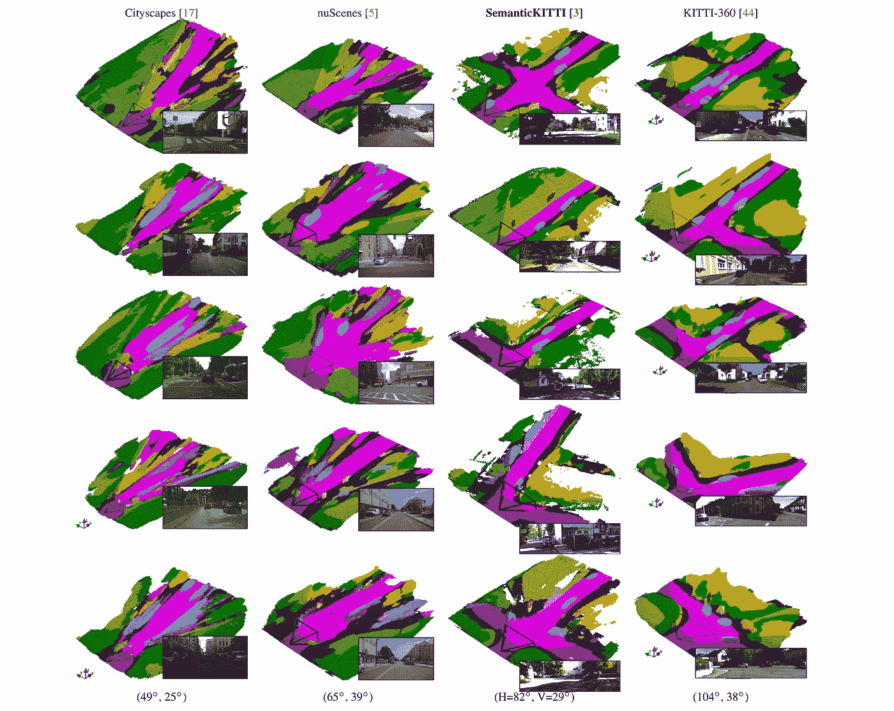

# 从单幅图像的 2D 到三维场景重建。演示

> 原文：<https://medium.com/mlearning-ai/2d-to-3d-scene-reconstruction-from-a-single-image-demo-c3c81ef28608?source=collection_archive---------0----------------------->

## [机器学习艺术](https://mlearning.substack.com)

## 摄像机视野之外的幻觉场景

[https://mlearning.substack.com](https://mlearning.substack.com)

**从一张图片中估计 3D 图像**是计算机视觉领域的一个基本挑战。而我们，作为人类，本能地从单一图像中感知场景，同时思考几何和语义…