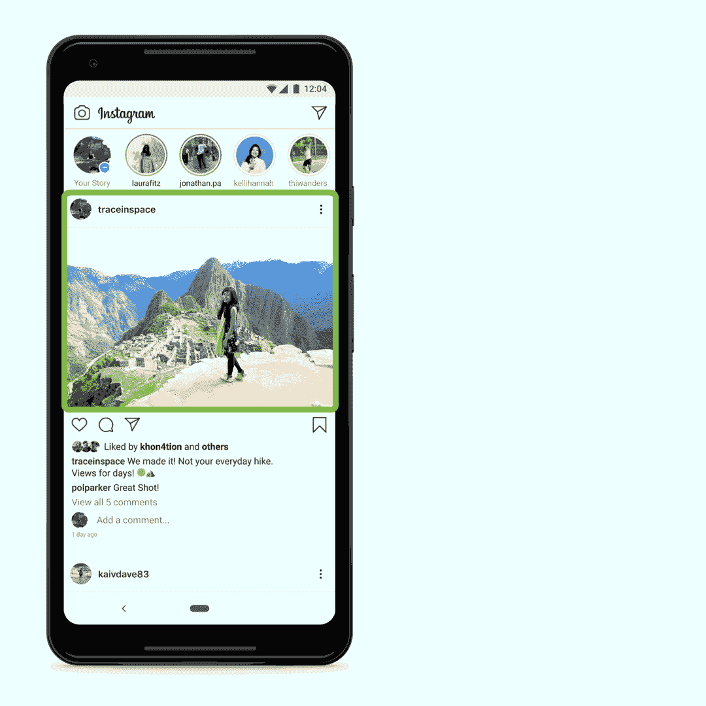

# 迁移学习的 3 个令人敬畏的工业应用

> 原文：<https://medium.com/mlearning-ai/3-awesome-industrial-applications-of-transfer-learning-d2a1e72a07d9?source=collection_archive---------11----------------------->

## 一瞥迁移学习通向有效深度学习的重要旅程

训练模特并不容易。从收集数据、预处理、分析数据、创建模型、培训、测试和部署数据的阶段开始，整个过程都是一个乏味的过程。尤其是收集数据和训练模型的阶段是复杂和耗时的。

source: [https://unsplash.com/photos/wO42Rmamef8](https://unsplash.com/photos/wO42Rmamef8)

# 背后的想法

为了加快它们的速度，我们开发了像高级**GPU 和 TPUs** 这样的硬件，使得在几天或几周内训练具有甚至十亿个参数的深度神经网络成为可能。但是，仍然有很多每天训练的模型仍然**消耗大量的时间和精力**导致资源的低效使用。但是领域中的大多数模型处理相似的数据——图像识别、自然语言处理、音频数据中相似任务的解决方案**使用相似类型的数据**。

比方说，我们正在开发一个花卉分类模型。已经有一些模型是在有很多类的图像分类数据集上训练的。我们试图利用这个模型来完成花卉分类这一较窄的任务，最终我们采用了迁移学习技术。

# 什么是迁移学习？

迁移学习**不是某种算法或神经网络架构**。这只是一种做**有效、高效的深度学习**的技术。

> 获取一些现成的知识，并尝试将其重新用于另一项任务。

简单到容易理解。

具体来说，我们将在同一个领域任务上训练的一般化模型复用到该领域的特定任务中。考虑到我们的示例情况，我们正在尝试重用在图像分类任务上训练的模型，该任务具有用于我们手头的花卉分类任务的 1000 个类的数据集。前者是图像识别中的**广义任务**，后者是**指定任务**。

正式的定义是，

> 迁移学习是将在一项任务中获得的知识重新用于另一项不同但相关的任务的技术。

通过使用在一般任务上训练过的模型，它将学习许多**低级特征**，例如，在 1000 个类中训练的模型具有许多关于边缘、曲线等的知识。现在你可以继续前进，使用**现成可用的知识**并改变模型的某些部分来为你的任务工作。你不必从头开始训练。

# 迁移学习的类型

有两种方法可以重用现有的知识。当我们有一些现有的模型，并且新任务有很多数据要训练时，我们可以使用这些数据来**重新训练我们旧模型中的所有层**。现在，我们可以说这个模型已经用前一个任务中的知识预先初始化了。所以我们可以说它是一个**预训练模型**。现在应用新的输入并训练它们为新的任务工作被称为**微调**。

当新任务的数据相对较少时，我们就不能重新训练整个模型。我们可以**冻结所有层，除了最后一两层**。最后一两层主要是前馈层和 softmax 层，用于计算输出类的概率。我们可以**为我们更小的数据集随机初始化和重新训练**这些层。有时，**从模型中选择一些层**也是有意义的，基于它们在旧模型中描述了什么**特征**并且**单独重新训练那些**。

让我们看看迁移学习的 3 个令人敬畏的工业应用。

# 脸书为视障人士生成图像描述的人工智能

source: [https://tech.fb.com/how-facebook-is-using-ai-to-improve-photo-descriptions-for-people-who-are-blind-or-visually-impaired/](https://tech.fb.com/how-facebook-is-using-ai-to-improve-photo-descriptions-for-people-who-are-blind-or-visually-impaired/)

**自动替代文本** AI 为 Instagram 帖子生成**替代文本**以帮助盲人和视障人士。这始于在 100 个类的数据集上训练的相对较小的深度卷积神经网络。但这并不适用于真实世界的数据，因为 Instagram 帖子可以有山脉、汽车、食物、来自不同文化的人等。因此，他们没有为如此庞大的数据创建标签数据，而是最终使用了来自现有帖子的带有标签的**图像数据，并对旧模型进行了微调。现在，它能够识别性别、肤色、炒饭、薯条、国家纪念碑、自拍等。**

更多详情:[**脸书的博客**](https://tech.fb.com/how-facebook-is-using-ai-to-improve-photo-descriptions-for-people-who-are-blind-or-visually-impaired/)

# 15 .艾的声音克隆器

source: [https://unsplash.com/photos/OKLqGsCT8qs](https://unsplash.com/photos/OKLqGsCT8qs)

该应用程序接受**短文本输入，并为该文本合成卡通人物的语音**。它可以在 **DeepMoji** 模型的帮助下生成带有高度准确**情感**的语音。它的灵感来自于基于这篇 [**论文**](https://arxiv.org/pdf/1806.04558.pdf) 的**文本到语音模型**的迁移学习技术。虽然该项目的完整细节没有公布，但在他们的官方网页上已经提到，

> 15 秒的音频数据足以克隆出符合人类标准的声音。

创作者将这种模型命名为 DeepThroat，这是一件大事，因为用如此小的数据合成语音可以在语音配音行业产生巨大的生产力(人工智能再次接管人类的工作)。

更多详情在此: [**15.ai 的页面**](https://15.ai/about)

# 环境友好型学习

source: [https://unsplash.com/photos/yZygONrUBe8](https://unsplash.com/photos/yZygONrUBe8)

正如已经看到的，使用基于迁移学习的技术大大减少了培训时间，这意味着硬件资源的使用更少，电力消耗更低，碳足迹**也更少**。这不是机器学习更环保的唯一途径。但是，当我们在培训中减少一些层次，或者通过重用现有模型并对其进行微调时，它会显著减少碳排放。随着人工智能产业的发展，人们也有责任关注能源效率。

# 结论

迁移学习被证明是深度学习中的革命性的，因为它的可重用性和通过提供良好学习的知识来帮助用户快速训练过程。恰当地利用它可以为新的问题带来非凡的模型。此外，值得注意的是，它有助于实现更大的节能和更少的碳排放。

感谢阅读这篇文章！请随时分享您的评论/想法！

让我们一起让学习变得有趣！

 [## Mlearning.ai 提交建议

### 如何成为 Mlearning.ai 上的作家

medium.com](/mlearning-ai/mlearning-ai-submission-suggestions-b51e2b130bfb)