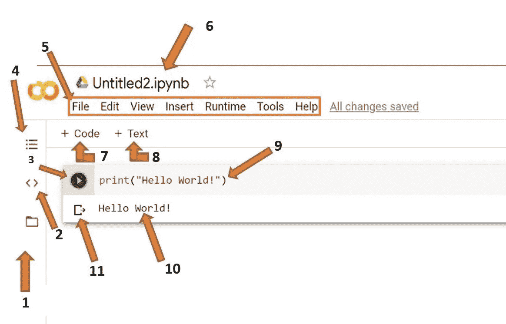

# 你可能错过的 3 个很酷的 Google Colab 功能

> 原文：<https://medium.com/mlearning-ai/3-cool-google-colab-features-you-may-have-missed-65daadb8bcf6?source=collection_archive---------0----------------------->

## 机器学习

## 交互式表格、草稿单元格、命令调板

Image from Google ([Source](https://runestone.academy/runestone/books/published/httlads/PythonReview/google_colab.html))

你好。在本帖中，我们将看到谷歌 Colab 中你可能不知道的 3 个很酷的特性。首先，我将向您展示如何使用交互式表格功能动态浏览 pandas 数据框。然后我们将看到如何使用 colab 执行…