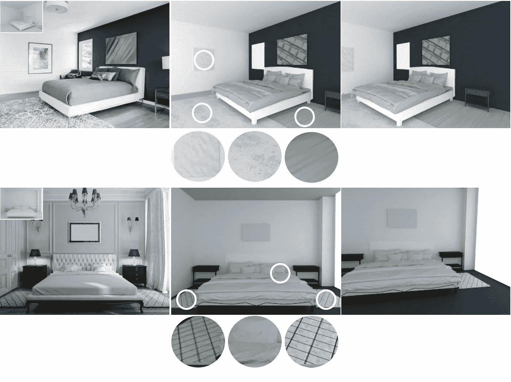

# 照片中的 3D 数字双胞胎

> 原文：<https://medium.com/mlearning-ai/3d-digital-twins-from-photographs-7189a28df5bb?source=collection_archive---------5----------------------->

## [机器学习艺术](https://mlearning.substack.com)

## HQ 真实感数字孪生——室内场景三维重建

[https://mlearning.substack.com](https://mlearning.substack.com)

## 什么是 AI 中的数字孪生？

数字双胞胎是真实资产、系统或流程的虚拟副本，数据科学家和 IT 专业人员可以使用它们来运行模拟。数字双胞胎是为了…