# 400 鸟类物种分类

> 原文：<https://medium.com/mlearning-ai/400-birds-species-classification-f4de768aac4?source=collection_archive---------0----------------------->

一种用于鸟类分类的深度学习方法🐦


Photo by [Dmitry Chernyshov](https://unsplash.com/@oneor0?utm_source=medium&utm_medium=referral) on [Unsplash](https://unsplash.com?utm_source=medium&utm_medium=referral)

**目录**

1.  介绍
2.  商业问题
3.  机器学习问题
4.  加载数据
5.  电子设计自动化(Electronic Design Automation)
6.  数据管道创建和图像增强
7.  深度学习模型
8.  使用 Flask API 部署
9.  未来的工作
10.  我的外卖
11.  参考
12.  我的个人资料

## **1。简介**

这实际上是一个名为 [400 种鸟类分类](https://www.kaggle.com/gpiosenka/100-bird-species)的 Kaggle 数据集，该数据集的所有者是 Gerry。本案例研究的目的是对数据集中提供的多种鸟类进行分类。

## 2.**商业问题**

2.1.**问题陈述**

这类问题对于像森林部门这样的机构，或者对于整天都在研究各种动植物的人来说是很重要的。根据[这个资源](https://ourworldindata.org/birds#how-many-bird-species-are-there)在**我们的世界在**的数据，显然，到目前为止已经发现了超过 11000 种不同的鸟类。

现在对人类来说，很难看到和分析一只鸟属于哪个物种，特别是当遇到非常稀有的物种时。这就是机器/计算机来救援的地方。

这个数据集总共包含 400 种不同的鸟类。任务是使用一种算法来训练一台关于所有这些不同物种的机器，以便在需要时尽可能减少对人类干预的需要。

2.2.**业务约束**

*   没有严格的等待时间限制:没有人会急于鉴定一个物种。但是，是的，不应该是这样的，培训总共需要几周/几个月。花几天时间当然不错，但如果训练需要几个小时，那最好不过了。但是，通过一个训练过的模型进行预测应该足够快，最好是在毫秒或秒的范围内。
*   有可解释性是件好事:我们可以用机器认为某只鸟属于物种“A”的概率来理解机器的想法。
*   模型简单:物种分类一类的东西主要用于基于研究的活动。我们的模型将用于为研究而制造的适当系统中。因此，即使模型有点重，也不会有问题。
*   最小化多类错误:虽然这不是一个问题，如果模型预测不正确，会有一些危及生命的机会，但尽可能低的多类错误仍然是好的。

## 3.**机器学习问题**

3.1.**数据**

*   该数据集总共包含 58388 张鸟类图像(jpg 格式)。
*   这些被细分为 3 个单独的目录→一个用于 58388 个训练图像，一个用于 2000 个测试图像，一个用于 2000 个验证图像。测试和验证目录中每个物种有 5 张图片)。
*   所有图像的形状都是 224x224x3 →即所有图像都是 RGB 格式(即具有红色、绿色和蓝色通道)。
*   每组(训练、验证、测试)有 400 个不同物种的 400 个目录。
*   每个物种(此处为目录)至少有 120 张该类型的图片。
*   每幅图像都是这样的，鸟占据了整个图像的至少 50%。
*   每个图像文件从 1 或 001 开始按顺序编号。

3.2.**将现实世界问题映射到 ML 问题**

*   问题类型→多类分类任务
*   我们需要分类什么→从提供的 400 种不同种类的鸟中选出不同种类的鸟。
*   我们的目标/类别标签→400 个不同的目录名表示 400 个不同的物种(我们的目标变量)

3.3.**绩效指标**

*   我对这个数据集的初步调查显示，这个数据集是不平衡的。所有的物种(类)至少有 120 个图像，有些有更多的图像(如 140，160)，有些有 240 个图像。
*   分类交叉熵➡我们的业务约束要求我们的模型给出某种程度的预测概率。因此，我们可以利用这个来计算分类交叉熵损失。由于这是一个多类分类，该模型需要使用“分类交叉熵”损失进行优化，该损失是该多类分类任务的多类对数损失等价物。众所周知，对数损失本身就是一个非常好的指标。
*   因此，**分类交叉熵是我们将在这里使用的度量**。

## 4.**加载数据**

我只是使用 Kaggle 的 API 将这个数据集的数据放入我的系统。

这会将所有 3 个数据集下载到您的系统中。将有 3 个文件夹，分别用于培训、测试和验证。您可以选择忽略随此 API 一起下载的其他文件/文件夹。

## 5. **EDA**

让我们讨论一下已经完成的探索性数据分析。我使用了下面的函数来掌握这个数据集的基本细节。

下图说明了每个目录中的图片数量(即每个物种的图片数量)。

```
# TRAIN
train_species_names,train_species_image_count,
train_images_heights,train_images_widths = get_counts(dataset_path=”/content/train/”,dataset_type=”train”)
```

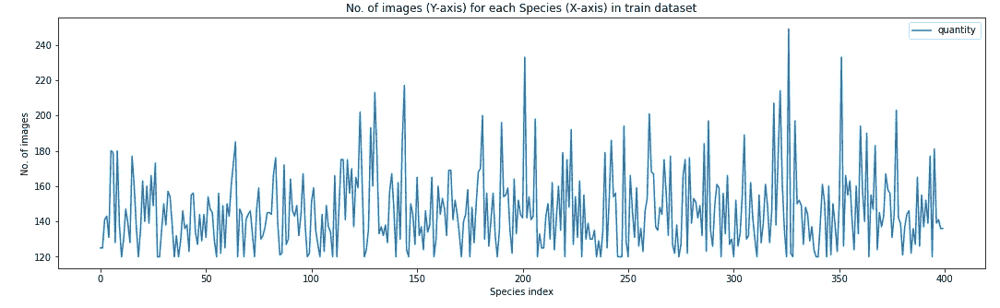

Image by Author

所有物种至少有 120 张图片，这是一个不平衡的数据集(有些物种有 120-160 张图片，有些甚至更多)。

上面的图证实了所有图像都是 224x224 大小。

让我们看看验证数据集的类似情况:-

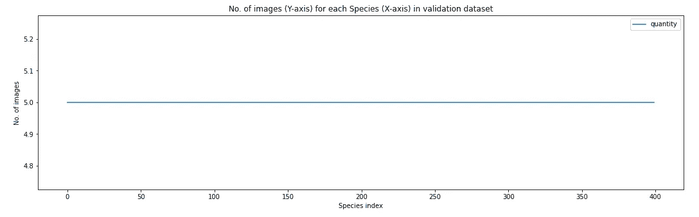

Image by Author

这表明验证数据集在每个物种目录中有 5 个图像，并且每个图像都具有相同的大小:224x224。所有这些观察结果在测试数据集的情况下也是一样的。

接下来，我对所有 3 个数据集中的物种名称进行了健全性检查。我发现了一个有趣的观察。

在所有 3 个数据集上，所有物种的名称并不相同。让我们更深入地挖掘。

因此，物种名称“黑黄嘴”在训练数据集中获得了额外的空间，这就是为什么我们在检查所有物种名称是否相同时得到了 False。解决办法？

如果您正在处理此数据集，请确保选中此项。只需通过删除多余的空间来重命名文件夹。

现在，所有的物种名称是真实的:—

让我们看看这个数据集中随机选择的 25 只鸟。为此，我使用了下面的代码片段

```
# PRINT SOME RANDOMLY SELECTED 25 IMAGES FROM THE TRAIN FOLDER
parent_dir = “/content/train/”
all_subdirs = os.listdir(parent_dir)
plt.subplots(figsize=(20,17))for col in range(1,26):
  plt.subplot(5,5,col)
  chosen_species_dir = all_subdirs[random.randint(0,401)]
  chosen_dir = parent_dir + chosen_species_dir
  all_images_in_chosen_dir = os.listdir(chosen_dir)
  chosen_img = chosen_dir + “/” +
all_images_in_chosen_dir[random.randint(0,len(all_images_in_chosen_dir)-1)]
  image = imread(chosen_img)
  plt.title(chosen_species_dir)
  plt.imshow(image)
```

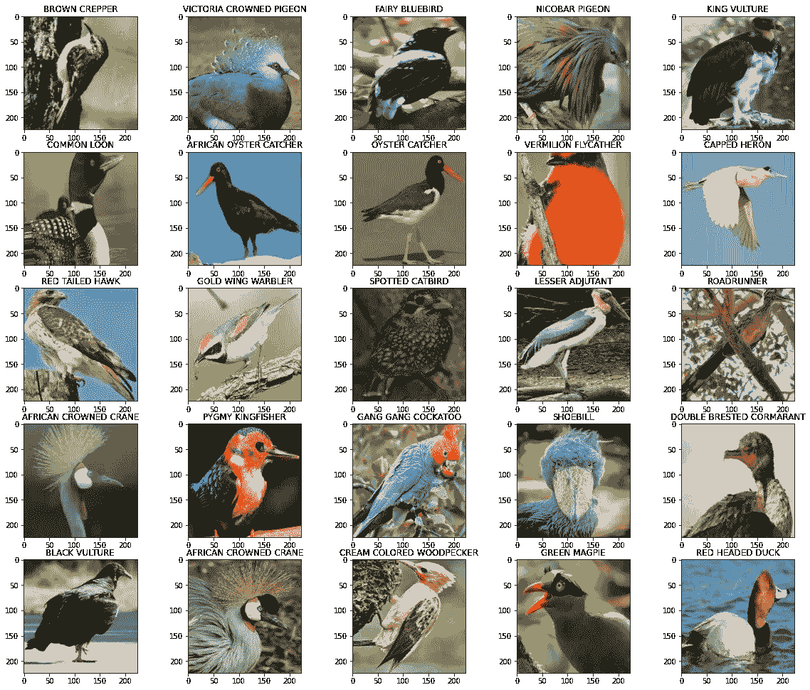

Image by Author

正如你可能已经注意到的，所有的图像都是 RGB 的&占据了整个 224x224 图像的至少 50%。

## 6.**数据管道创建&图像增强**

为了避免过度拟合，可以使用许多技术，如使用一个漏失、批量归一化或其他 L1/L2 正则化技术。但是在图像的情况下，避免/控制过度拟合的最佳方式是图像放大。这只是一种在旅途中创建人工训练数据点的方法，以帮助模型很好地推广到新的/测试数据点。可以使用 Tensorflow 的 [ImageDataGenerator](https://www.tensorflow.org/api_docs/python/tf/keras/preprocessing/image/ImageDataGenerator) 类来实现这一点。


Original Image

让我们来看看某种图像增强看起来会是什么样子

一、**宽度偏移**

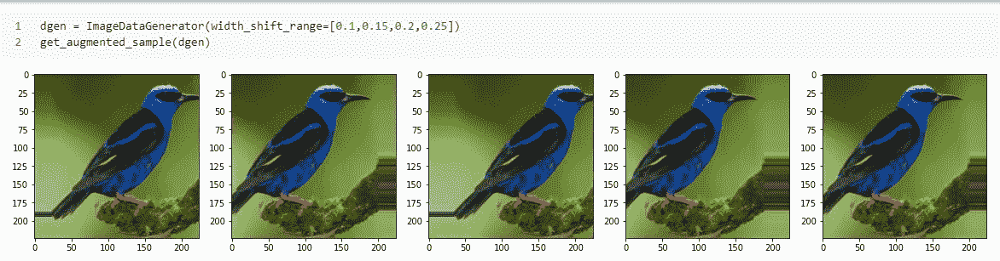

二。**高度变化**

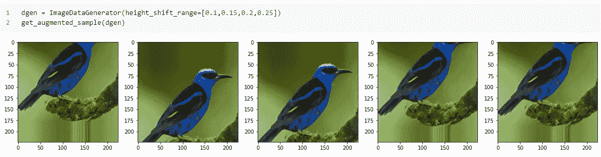

三。**随机旋转**

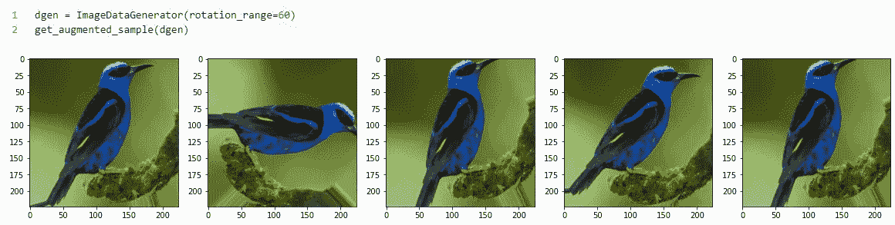

四。**随机亮度(变暗/变亮)**

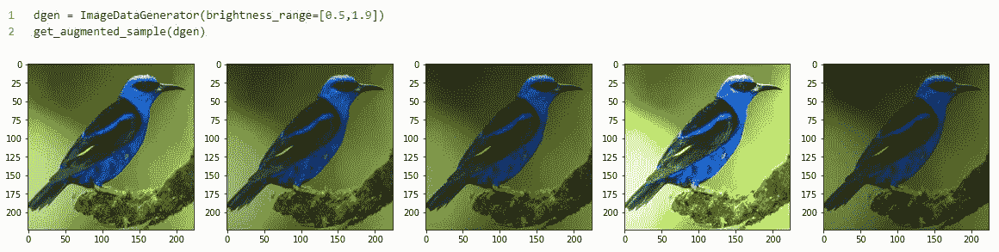

动词 （verb 的缩写）**水平翻转**

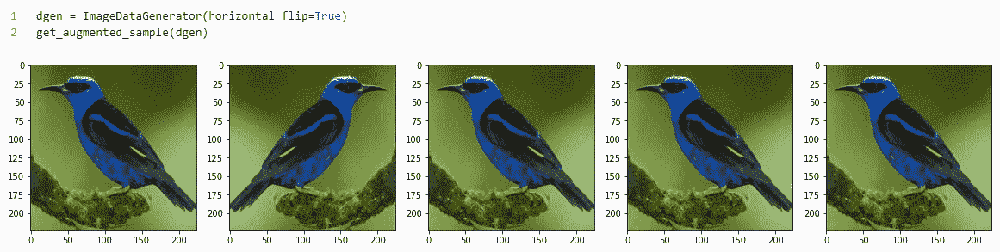

不及物动词**垂直翻转**

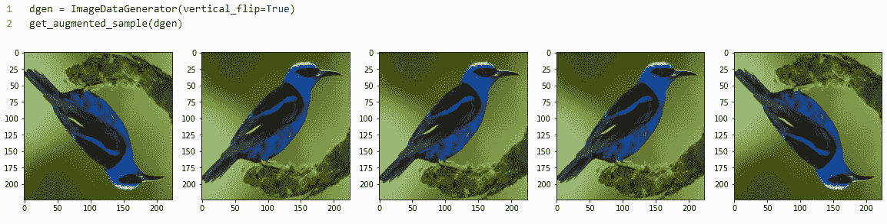

七。**剪切**

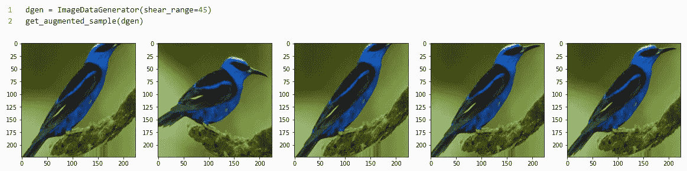

八。**随机缩放**

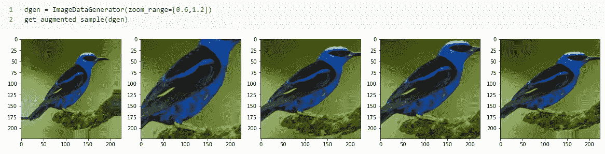

考虑到我们这里的问题，几乎所有这些增强技术都是有用的。

*注意:仅在训练数据集上执行增强。从不在验证/测试数据集中。“通过训练数据集学习”并在应用于测试数据时很好地概括自己是你的模型的责任。*

```
# A SIMPLE IMAGE DATA GENERATOR WITHOUT ANY AUGMENTATION; JUST SCALING PIXELS WITHIN 0–1 datagen1 = ImageDataGenerator(rescale=1/255)#A MORE COMPLEX IMAGE DATA GENERATOR WITH DIFFERENT KINDS OF AUGMENTATION ALONG WITH PIXEL SCALING LIKE ABOVE.
NOTE --> THIS WILL BE ONLY USED FOR TRAINING DATASETdatagen2 = ImageDataGenerator(rescale=1/255,width_shift_range=[0.1,0.15,0.2,0.25],height_shift_range=[0.1,0.15,0.2,0.25],
rotation_range=60,brightness_range=[0.5,1.9],horizontal_flip=True,shear_range=45,zoom_range=[0.6,1.2])
```

我使用了 [flow_from_directory](https://www.tensorflow.org/api_docs/python/tf/keras/preprocessing/image/ImageDataGenerator#flow_from_directory) 方法来为模型创建数据管道。你可以通过我的这个案例研究的 Github repo 参考详细的代码片段。(链接在本文末尾)

## 7.深度学习模型

我从一些非常基本的卷积架构开始。第一个架构只有 2 个卷积+最大池模块，后面是扁平化和密集层。我想用可分离卷积进行实验(它有一个特殊的属性，计算需求低，但结果相似)。你可以在奇-汪锋的博客中了解更多关于可分卷积的知识。这种架构导致在完全看不见的测试图像上损失了 ***3.26*** 。

下一个模型也很简单，只有 2 个 2xConv+Maxpool 模块。在这里，我在第二个 conv 块中试验了 [GlobalMaxPooling](https://www.tensorflow.org/api_docs/python/tf/keras/layers/GlobalMaxPool2D) 。在这种模式下损失下降到 ***2.07*** 。

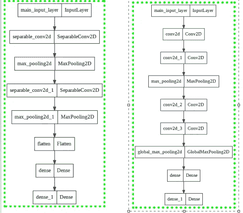

Left (1st model) ; Right (2nd model) (Image by Author)

*注意:第一个模型在没有任何增强的情况下被训练，每个图像的大小被减小到 96×96，而第二个模型在图像大小被减小到 32×32 的情况下被训练。看到了吗？这就是增强的魔力！它有助于您的模型在训练时学习如此多的额外/不同的功能，即使您缩小图像大小。*

继续下一个模型。我将图像尺寸保持为 128x128，使用了 dropout &没有进行任何放大。该架构比前两个稍微复杂一点(但并不复杂)。我使用了 3 块(2xConv + Pooling ),最后一块是 GlobalMaxPooling，后面是通常的密集层。测试损耗为 ***1.16*** ，与前两者相比，该损耗明显较低。

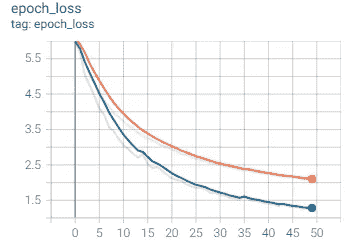

Train Loss(orange) & Validation Loss (blue) (Image by Author)

看看损失是如何改变的。没有过度拟合。

现在进入深度学习的传说——[迁移学习](https://www.tensorflow.org/tutorials/images/transfer_learning)。我用了卷积神经网络领域的多个图例，从 VGG16，ResNet，InceptionNet 到 EfficientNet，VGG19。一些我根据数据集进行了微调，一些用于特征提取&一些我从头开始训练。让我们一个一个地看看我是如何利用迁移学习的。

**TL 方法-1:用我自己的分类器进行特征提取的 VGG16 最后:-**

```
input_layer = Input(shape=(img_width,img_height,3), name=”main_input_layer”)
# pre-trained model → VGG16
model = VGG16(include_top=False,weights=”imagenet”,input_shape=(img_width,img_height, 3))
model.trainable = False# our new classifier starts here
glob = GlobalAveragePooling2D()(model.layers[-1].output)
drp = Dropout(rate=0.4)(glob)
dense = Dense(units=1024,activation=”relu”,kernel_initializer=”he_uniform”)(drp)
output_layer = Dense(units=400,activation=”softmax”,name=”main_output_layer”)(dense)# final definition of our model
model4 = Model(inputs=model.inputs,outputs=output_layer)
```

我用 Imagenet 权重初始化了每个模型，并在最后添加了自己的分类器(并且不包括原始 VGG16 模型的顶部)。

下一个方法是相似的，只是在某种意义上略有不同，我使用了增强&没有退出。在这两种方法中，我都使用了 [GlobalAvgPooling](https://www.tensorflow.org/api_docs/python/tf/keras/layers/GlobalAveragePooling2D) 。

**TL 方法-2: ResNet50 从零开始微调**

```
# pre-trained model → ResNet50
model = ResNet50(include_top=False,weights=”imagenet”,input_shape=(img_width,img_height,3),pooling=”avg”)# our new classifier starts here
dense = Dense(units=128,activation=”relu”,kernel_initializer=”he_uniform”)(model.layers[-1].output)
output_layer = Dense(units=400,activation=”softmax”,name=”main_output_layer”)(dense)# final definition of our model
model6 = Model(inputs=model.inputs,outputs=output_layer)
opt = Adam(learning_rate=0.0001,beta_1=0.9,beta_2=0.999,epsilon=1e-07)
```

*注意，如果你想从头开始训练一个预训练的模型，并使用一些权重进行初始化，保持学习率非常低。例如:每当我从头开始训练预训练模型时，我就把学习率降低到 0.0001。这样做是为了那些“良好的预训练重量”不会在训练时被破坏。*

你想知道这个模型表现如何吗？

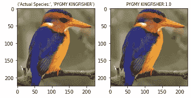

A pigmy kingfsher predicted with 100% surity (Image by Author)

**TL 方法-3: EfficientNetB0，从头开始微调**

```
# pre-trained model → EfficientNetB0
model = EfficientNetB0(include_top=False,weights=”imagenet”,input_shape=(img_width,img_height,3),pooling=”avg”)# our new classifier starts here
dense = Dense(units=128,activation=”relu”,kernel_initializer=”he_uniform”)(model.layers[-1].output)
output_layer = Dense(units=400,activation=”softmax”,name=”main_output_layer”)(dense)# final definition of our model
model7 = Model(inputs=model.inputs,outputs=output_layer)
opt = Adam(learning_rate=0.0001,beta_1=0.9,beta_2=0.999,epsilon=1e-07)
```

**TL 方法-4:从头开始微调的 InceptionV3】**

```
# pre-trained model → InceptionV3
model = InceptionV3(include_top=False,weights=”imagenet”,input_shape=(img_width,img_height,3),pooling=”avg”)# our new classifier starts here
dense = Dense(units=128,activation=”relu”,kernel_initializer=”he_uniform”)(model.layers[-1].output)
output_layer = Dense(units=400,activation=”softmax”,name=”main_output_layer”)(dense)# final definition of our model
model8 = Model(inputs=model.inputs,outputs=output_layer)
```

**TL 方法-5:用于特征提取的 VGG19】**

```
# pre-trained model → VGG19
model = VGG19(include_top=False,weights=”imagenet”,input_shape=(img_width,img_height,3))
model.trainable = False# our new classifier starts here
flat = Flatten()(model.layers[-1].output)
dense = Dense(units=1024,activation=”relu”,kernel_initializer=”he_uniform”)(flat)
dense = Dense(units=1024,activation=”relu”,kernel_initializer=”he_uniform”)(dense)
output_layer = Dense(units=400,activation=”softmax”,name=”main_output_layer”)(dense)# final definition of our model
model9 = Model(inputs=model.inputs,outputs=output_layer)
opt = Adam(learning_rate=0.001,beta_1=0.9,beta_2=0.999,epsilon=1e-07)
```

最后，我在分类器前使用了展平图层。

**TL Approach-6: VGG16 冻结前 11 层&微调其余**

你也可以选择微调一些图层，冻结其余的图层。在这种方法中，我冻结了原始 VGG16 网络的前 11 层。

```
# pre-trained model → VGG16
model = VGG16(include_top=False,weights=”imagenet”,input_shape=(img_width,img_height,3),pooling=”avg”)
for layer in model.layers[:11]:
  layer.trainable = False
```

您可以训练，即微调其余的层，包括最后添加的最后一个分类器。

```
# our new classifier starts here
dense = Dense(units=128,activation=”relu”,kernel_initializer=”he_uniform”)(model.layers[-1].output)
drp = Dropout(0.25)(dense)
dense = Dense(units=128,activation=”relu”,kernel_initializer=”he_uniform”)(drp)
output_layer = Dense(units=400,activation=”softmax”,name=”main_output_layer”)(dense)# final definition of our model
model10 = Model(inputs=model.inputs,outputs=output_layer)
opt = Adam(learning_rate=0.0001,beta_1=0.9,beta_2=0.999,epsilon=1e-07)
```

**TL Approach-7: VGG19 冻结前 17 层&微调其余**

```
# pre-trained model → VGG19
model = VGG19(include_top=False,weights=”imagenet”,input_shape=(img_width,img_height,3))
for layer in model.layers[:17]:
  layer.trainable = False# our new classifier starts here
glob = GlobalAveragePooling2D()(model.layers[-2].output)
dense = Dense(units=128,activation=”relu”,kernel_initializer=”he_normal”)(glob)
dense = Dense(units=128,activation=”relu”,kernel_initializer=”he_normal”)(dense)
output_layer = Dense(units=400,activation=”softmax”,name=”main_output_layer”)(dense)# final definition of our model
model11 = Model(inputs=model.inputs,outputs=output_layer)
opt = Adam(learning_rate=0.0001,beta_1=0.9,beta_2=0.999,epsilon=1e-07)
```

我用的是 Adam optimizer，学习率=0.0001，保持图片尺寸不变:224x224，最后用了增广，无脱落和 GlobalAvgPool。下面是一段代码，显示了我使用的增强功能

```
ImageDataGenerator(rescale=1/255, width_shift_range=[0.1,0.15,0.2,0.25], height_shift_range=[0.1,0.15,0.2,0.25],
rotation_range=60, brightness_range=0.5,1.9], horizontal_flip=True, shear_range=45, zoom_range=0.6,1.2], preprocessing_function=prep_func)
```

这里 prep_func 对应的是我使用的预训练模型，即 VGG19 的预处理函数。你可以在这里找到关于这个[的更多细节。这种方法被证明是最好的。导致 ***最低测试损耗 0.1426*** 。](https://www.tensorflow.org/api_docs/python/tf/keras/applications/vgg19/preprocess_input)

这是我使用的所有模型的总结

该模型被保存下来，并继续进行部署。

## 8.使用 Flask API 部署

我使用 Flask API & basic HTML、CSS & jQuery 创建了一个 web 应用程序，并将其部署在本地。您也可以将其部署在 AWS 或任何其他基于 cloude 的平台上。这是我的网络应用的一个短片

400 Birds web-app

## 9.未来的工作

如果您希望进一步研究这个案例，您可以尝试自己的一些更复杂的架构(如 VGG、ResnEt 和 Inception 块的一些组合)，或者如果您有足够的计算资源，甚至可以使用 VGG19 从头开始训练一切。

## 10.我的外卖

我想提一下我在解决这个问题时观察到的一些非常有趣的事情

*   虽然可分离卷积由于训练较少数量的参数而需要较少的计算资源，但是结果不如卷积给出的那样好(这是明显的，因为它们需要训练更多数量的参数)。
*   GlobalAvgPooling 和 GlobalMaxPooling 是展平卷积输出并最终馈入全连接层的密集层的两种最佳方式。展平图层不必要地增加了参数的数量。
*   如果计算资源相对较少，那么与从头开始训练复杂模型相比，最好对预训练模型的最后几层进行微调。例如:我的情况是 VGG19。亏损 0.14 就足够好了。如果整个 VGG19 从零开始训练，它甚至可能减少到 10^-2 周围的某个地方。
*   图像增强是高泛化的关键。始终执行增强。

感谢您的阅读！😄如果你喜欢这个博客，请点击拍手图标！👏 😃

还有，一定要访问这个项目的 GitHub Repo。

链接:[https://github . com/toushalipal 6991/400-鸟类-物种-分类](https://github.com/toushalipal6991/400-Birds-Species-Classification)

## 11.参考

首先，非常感谢[应用人工智能课程](https://www.appliedaicourse.com/)带给我的所有收获。

[如何在 KERAS 中配置图像数据增强](https://machinelearningmastery.com/how-to-configure-image-data-augmentation-when-training-deep-learning-neural-networks/)

研究论文:-

[用于大规模图像识别的超深度卷积网络](https://arxiv.org/pdf/1409.1556.pdf)

[用回旋加深](https://www.cv-foundation.org/openaccess/content_cvpr_2015/papers/Szegedy_Going_Deeper_With_2015_CVPR_paper.pdf)

[用于图像识别的深度残差学习](https://www.cv-foundation.org/openaccess/content_cvpr_2016/papers/He_Deep_Residual_Learning_CVPR_2016_paper.pdf)

## 12.我的个人资料

[](https://www.linkedin.com/in/toushali-pal-099799146/) [## TOUSHALI PAL - Kolkata，西孟加拉邦，印度|职业简介| LinkedIn

### 查看 TOUSHALI PAL 在 LinkedIn 上的职业资料。LinkedIn 是世界上最大的商业网络，帮助…

www.linkedin.com](https://www.linkedin.com/in/toushali-pal-099799146/) [](https://github.com/toushalipal6991) [## toushalipal6991 -概述

### 此时您不能执行该操作。您已使用另一个标签页或窗口登录。您已在另一个选项卡中注销，或者…

github.com](https://github.com/toushalipal6991) [](/mlearning-ai/mlearning-ai-submission-suggestions-b51e2b130bfb) [## Mlearning.ai 提交建议

### 如何成为 Mlearning.ai 上的作家

medium.com](/mlearning-ai/mlearning-ai-submission-suggestions-b51e2b130bfb)