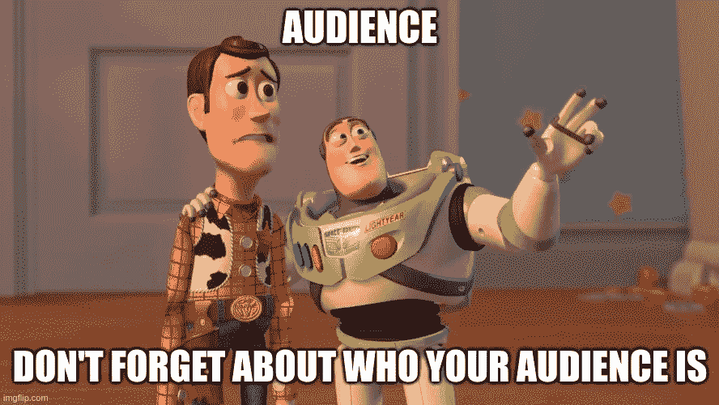
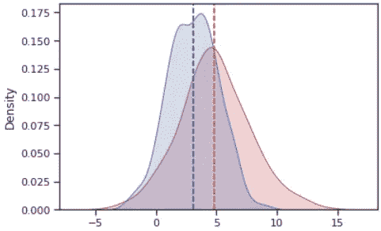

# 改善图表的 5 个技巧📊

> 原文：<https://medium.com/mlearning-ai/5-tips-to-improve-your-graphs-54dfeb2553de?source=collection_archive---------6----------------------->

# **1。根据你的听众制作图表。🎒**

在学校，我被告知要给我的实验报告贴上“自变量 X 和因变量 Y 之间的关系”的标签。这很好，但有时你不是向技术人员展示数据，而是试图描绘一个故事，以说服某种决策。

相反，只需在标题中直接陈述图表试图描绘的内容。比如说，X 和 Y 之间可能有一个反比关系，所以类似于“X 和 Y 之间有一点反比关系”，这样就很清楚这个图试图描绘的是什么。

# **2。一致的配色方案💥**

这里有一个网站可以帮助挑选一些漂亮的颜色用于可视化效果👈

颜色可以描绘上下文信息。例如，通常红色是更醒目的颜色，因此可以使用红色来显示两组之间的差异。

需要注意的是，如果你正在向任何潜在的色盲者展示。尤其是当图表被展示给很多人时，确保不使用红色和绿色作为最常见的色盲是值得的。

# 3.什么类型的图表？😤

你知道条形图和柱状图的区别吗？是..我也不知道。但是，在显示数字变量和分类变量之间关系的条形图中有明显的区别。而直方图是被分成几个箱的唯一的数字数据。

在决定使用何种图表来可视化数据集的过程中，了解这些区别非常重要。我将在下面提供一个很棒的链接，可以帮助你完成这种决策过程。

1.  可视化的目的。
2.  您正在处理哪些类型的数据(数值型、分类型、二进制等)

有时候，当我们决定用什么样的图表来可视化数据时，我们被选择宠坏了。然而，这归结于可视化的对象是什么，以及它试图传达什么。我发现了这个神奇的[网站](https://www.data-to-viz.com/)👈这可以作为一个很好的指导。它还包含代码。

# **4。向图表中添加单位和图例😶**

Where are the units? No legends to try to explain the context.

这可能是我心中的物理人。一定要确保你有单位，否则谁知道你的 x 或 y 轴是什么，或者你的图表是关于什么的。尽可能消除猜测或假设。查看器没有像你一样浏览整个数据集，甚至可能不知道要查找什么，因此你为什么要这样做，所以要尽可能清楚。

# 5.简单通常更好😅

> "如果你的实验需要一个统计学家，你需要一个更好的实验."
> ― **欧内斯特·卢瑟福**

以上都只是软规则，当然，如果有足够的背景，可能会有所不同。没有制作完美图表这样的事情，因为它们都依赖于所描绘的背景。

当你有疑问的时候，试着做一个尽可能简单的图表来表达你的想法。您肯定不希望在诚实对待数据的同时，用不重要的乏味信息淹没任何人。

如果你一路走到这里，谢谢你！😃

你可能也会对我写的另一篇关于统计学的文章感兴趣。👇

 [## 数据科学中 5 个有用的统计测试

### 如何用测试来检验你的数据假设

medium.com](/mlearning-ai/5-useful-statistical-tests-in-data-science-3bd622028bae) 

# 来源:

 [## 色盲的类型

### 如果你有完全的色盲，你根本看不到颜色。这也叫单色，挺…

www.nei.nih.gov](https://www.nei.nih.gov/learn-about-eye-health/eye-conditions-and-diseases/color-blindness/types-color-blindness)  [## 从数据到 Viz |找到您需要的图形

### 按照输入数据格式分类的所有可能图表类型的分类。

www.data-to-viz.com](https://www.data-to-viz.com/)  [## Mlearning.ai 提交建议

### 如何成为 Mlearning.ai 上的作家

medium.com](/mlearning-ai/mlearning-ai-submission-suggestions-b51e2b130bfb)