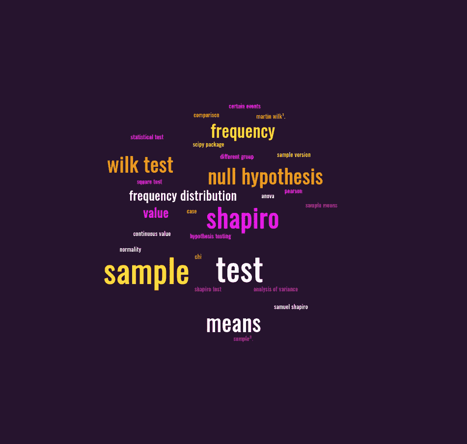
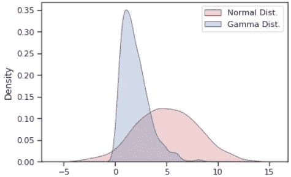
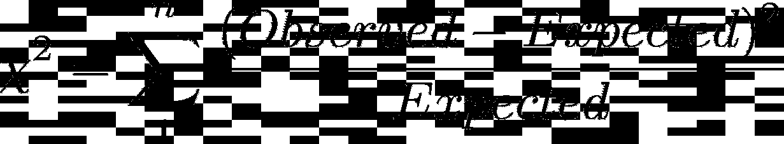

# 数据科学中 5 个有用的统计测试📊

> 原文：<https://medium.com/mlearning-ai/5-useful-statistical-tests-in-data-science-3bd622028bae?source=collection_archive---------3----------------------->

Word Cloud Generated from [https://monkeylearn.com/word-cloud](https://monkeylearn.com/word-cloud)

## **两个样本 z 检验 2️⃣**

> 两个样本的均值如何不同？

The density function of two normally distributed samples with the mean being shown with the dotted vertical line.

**零假设:**两个样本的样本均值相同。

当您想要比较两个不同组的平均值(连续值)时。这就是 Z 检验派上用场的地方，你可以在证明两个样本的均值是否相似的背后有一些严格性。

Code for graphing the density function of two normally distributed samples — [https://www.statsmodels.org/dev/generated/statsmodels.stats.weightstats.ztest.html](https://www.statsmodels.org/dev/generated/statsmodels.stats.weightstats.ztest.html)

## 秩和检验(曼-惠特尼)💁

> 这两个样本的分布是一样的吗？

Normal distribution with mean=5, std=3, samples=1000 & Gamma Distribution with alpha=2 and default beta

**零假设:**两个样本的分布相同。

**例子:**美国的山的高度分布与山脉相似吗🗻在日本？

当观察不同的样本时，人们自然会问这些是相同的分布吗？在本例中，红色来自正态分布，蓝色来自伽玛分布。因此测试应该产生一个 p 值为< 0.05 rejecting the null hypothesis.

Generates two separate samples one forming a gamma and the other a normal distribution and plots the density function for both samples.

## Pearson’s Chi-Square test 🍵

> Does the frequency distribution between the two samples differ?

The formula for calculating the chi-squared test statistic.* [4]

**的零假设:**两个分布之间的频率是相同的。

一种统计测试，用于评估与另一个样本相比，某些事件的发生频率是否更高。这种检验在生物学中经常被用来检验两个变量是否相互独立。

**示例:**确定不同类别的消费者购买产品 a 的频率(消费者的类别最初可以通过类似 K-Means 的某种聚类算法进行分类)

## 二项检验👬

> 对照组和治疗组的成功率有差异吗？

**无效假设:**两个样本的成功率相同。

**举例:**看到促销广告的治疗组是否比没有看到的对照组更有可能购买星巴克咖啡☕️？

*注:二项式检验与卡方检验相似，不同之处在于二项式检验仅处理 2 个类别，即对照组和治疗组，而卡方检验可以处理许多类别。此外，二项式检验通常用于较小的样本，而不是大样本。*

## 夏皮罗-维尔克试验💠

> 样本是否正态分布？

**零假设:**样本呈正态分布。

这是本·夏皮罗-..我是说夏皮罗-维尔克试验。1965 年，萨缪尔·夏皮罗和马丁·维尔克发表了一项测试。

像所有假设检验一样，如果 p 值低于 0.05，那么我们拒绝零，在夏皮罗-维尔克检验中，这意味着样本不是正态分布的。

W 统计值的范围从 0 到 1，表示样本的正态性 0 表示完全不正态性，1 表示完全正态性。

How to conduct a shapiro test using scipy

一路走到了🔚？如果你想看更多我的帖子，一定要关注我😄。

## 引文

[1][https://en.wikipedia.org/wiki/Shapiro%E2%80%93Wilk_test](https://en.wikipedia.org/wiki/Shapiro%E2%80%93Wilk_test)

[2][https://www . ITL . NIST . gov/div 898/handbook/PRC/section 2/PRC 213 . htm](https://www.itl.nist.gov/div898/handbook/prc/section2/prc213.htm)

[3]https://en.wikipedia.org/wiki/Pearson%27s_chi-squared_test

[4][https://homes . cs . Washington . edu/~ suin lee/genome 560/lecture 7 . pdf](https://homes.cs.washington.edu/~suinlee/genome560/lecture7.pdf)

 [## Mlearning.ai 提交建议

### 如何成为 Mlearning.ai 上的作家

medium.com](/mlearning-ai/mlearning-ai-submission-suggestions-b51e2b130bfb)