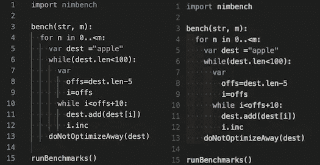

# Visual Studio 代码的 9 个有用的 Python 扩展

> 原文：<https://medium.com/mlearning-ai/9-useful-python-extensions-for-visual-studio-code-bf749d809855?source=collection_archive---------1----------------------->

***从文本编辑器到 IDE 的旅程***

> 然后，我将向你展示 9 个最有价值的扩展，它们将改善你的工作流程，提高工作效率，并且有助于编写干净和更好的 python 代码*。*

# 我的观点。

*当一名* [***计算机视觉开发者***](https://github.com/Asadullah-Dal17) *，大多是用 python 写代码。我的旅程始于 2020 年，基于两年的烧烤。现在在这里分享一下* ***在编写 Python 代码时利用这些扩展来改进 VS cod 工作流程和生产力的经验*** *。事实是我写不出* ***干净的*** *，更有* ***可读性的*** *和* ***更好的 python 代码*** *没有这些扩展(有点苛刻但真实😎).*

## 没有任何扩展的 VS 代码

Visual Studio 代码是一个文本/代码编辑器。它包含了代码编辑的基本功能。VS 代码可以变成大多数语言的 IDE，比如 python，C++，Go，Arduino 等等。，借助扩展的力量。

Visual Studio Code without any Extensions

# 1.VS 代码的 Python 扩展

由**微软**

*Python 扩展提供 Python 语言对 Vs 代码的核心支持，像，运行代码▭，林挺(需要选择)，调试🐞、代码格式化(需要选择)、代码重构等。*

1.  它允许运行 python 文件并调试它们。
2.  从可用的 Python 虚拟/conda 环境中选择 **Python 解释器**。
3.  提供选择**棉绒**和**代码格式的选项。**
4.  代码测试
5.  该扩展作为一个包提供两个以上的扩展。

*   挂架
*   Jupyter 笔记本

 [## Python - Visual Studio 市场

### 一个对 Python 语言有丰富支持的 Visual Studio 代码扩展(对于所有积极支持的版本…

marketplace.visualstudio.com](https://marketplace.visualstudio.com/items?itemName=ms-python.python) 

***Visual Studio 中的 Python 扩展代码***

# 2.挂架

由**微软**

Python 的快速、功能丰富的语言支持

Pylance 是一个扩展，它与 Python 一起在 Visual Studio 代码中提供性能语言支持。在引擎盖下，Pylance 由微软的静态类型检查工具 [Pyright](https://github.com/microsoft/pyright) 驱动。使用黄铁矿，Pylance 可以用丰富的类型信息增强您的 Python IntelliSense 体验，帮助您更快地编写更好的代码。

***签名帮助*** *【带类型信息】* ***参数建议*******代码补全*** *，As-you-type 报告代码错误和警告(诊断)* ***类型检查模式*** *，兼容* ***智能代码*** *和**

**查看更多信息**

** [## Pylance - Visual Studio 市场

### Pylance 是一个扩展，它与 Python 一起在 Visual Studio 代码中提供性能语言支持。在…下面

marketplace.visualstudio.com](https://marketplace.visualstudio.com/items?itemName=ms-python.vscode-pylance) 

***Visual Studio 代码中的 Pylance 扩展***

# 3.路径智能感知

克里斯蒂安·科勒

它允许我们有效地添加文件的路径，正如名字本身“路径智能感知”所反映的那样。

 [## 路径智能感知- Visual Studio 市场

### 自动完成文件名的 Visual Studio 代码插件

marketplace.visualstudio.com](https://marketplace.visualstudio.com/items?itemName=christian-kohler.path-intellisense) 

***Visual Studio 中的路径智能感知扩展代码***

# 4.Jupyter 笔记本

由**微软**

它使 vs 代码能够与 Jupyter notebook 一起工作，拥有安装在 VS 代码中的所有扩展的能力。

***Jupyter 笔记本在 Visual Studio 中的扩展代码***

# 5.智能代码

由**微软**

当你在 visual Studio 代码中编写代码时，它会自我训练，以帮助和改善你的编码体验。

 [## IntelliCode - Visual Studio 市场

### Visual Studio 代码的扩展-人工智能辅助开发

marketplace.visualstudio.com](https://marketplace.visualstudio.com/items?itemName=VisualStudioExptTeam.vscodeintellicode) 

***Visual Studio 中的 IntelliCode 扩展代码***

# 6.黑色格式化程序

由**微软**

它提供了 VS Code echo 系统中所有的**黑色格式化程序**特性，无需在每个 python 环境中手动安装。它只是一个独立的扩展。

 [## 黑色格式化程序- Visual Studio 市场

### 支持黑色格式化程序的 Visual Studio 代码扩展。扩展配有黑色=22.3.0。注意:这个…

marketplace.visualstudio.com](https://marketplace.visualstudio.com/items?itemName=ms-python.black-formatter) 

***Visual Studio 代码中的黑色格式化程序扩展***

# 7.自动文档字符串

尼尔斯·沃纳

它允许您为 python 函数编写更好更快的 Doc 字符串。

 [## autoDocstring - Python Docstring 生成器- Visual Studio 市场

### Visual Studio 代码扩展，用于快速生成 python 函数的文档字符串。快速生成文档字符串片段…

marketplace.visualstudio.com](https://marketplace.visualstudio.com/items?itemName=njpwerner.autodocstring) 

***Visual Studio 代码中的自动 DocString 扩展***

# 8.代码拼写检查器

通过街边软件

它对纠正变量、函数、类名和注释等的拼写有很大帮助。在 python 脚本中。

 [## 代码拼写检查器- Visual Studio 市场

### Visual Studio 代码扩展-源代码拼写检查器

marketplace.visualstudio.com](https://marketplace.visualstudio.com/items?itemName=streetsidesoftware.code-spell-checker) 

***Visual Studio 中代码拼写检查器扩展*代码**

# 9.缩进彩虹

按...订购

通过为每个缩进提供不同的颜色，有助于一眼就找到缩进。

除了 python 扩展，我希望❤能在 Visual Studio 代码中使用它们。

# 远程开发

它是一个由三个扩展组成的包，允许您将设备远程连接到本地计算机上的 Visual Studio 代码。我经常使用它将我的 ***Raspberry pi*** 连接到我本地机器上的 vs 代码开发环境，它处理开发环境并允许我访问 Raspberry pi 上的文件、文件夹和代码。它节省了大量时间，并且开发环境处理能力由本地机器处理，这是完全不可避免的，因为 ***Raspberry Pi*** 根本不能在本地处理那么多处理。

如果你正在做 ***树莓派*** 项目，那就试试吧。

 [## 远程开发- Visual Studio 市场

### 远程开发扩展包允许您打开容器中的任何文件夹，在远程机器上，或在…

marketplace.visualstudio.com](https://marketplace.visualstudio.com/items?itemName=ms-vscode-remote.vscode-remote-extensionpack) 

# **表情符号**

如果你想在 GitHub 自述文件中添加更多表情符号，我强烈建议你安装这个扩展**表情符号**，因为它为表情符号提供了智能感知。

 [## :emojisense: - Visual Studio 市场

### 将表情符号的建议和自动完成添加到 VS 代码中。灵感来自 Atom 自动完成+表情符号建议插件…

marketplace.visualstudio.com](https://marketplace.visualstudio.com/items?itemName=bierner.emojisense) 

这些是在 Vs 代码中编写代码时使用的扩展，希望对你有所帮助。

***现在就这样👋。***

非常感谢。

在这里你可以看看我的计算机视觉项目。[阿萨杜拉-达尔 17 (Asadullah Dal) GitHub](https://github.com/Asadullah-Dal17)

 [## Mlearning.ai 提交建议

### 如何成为 Mlearning.ai 上的作家

medium.com](/mlearning-ai/mlearning-ai-submission-suggestions-b51e2b130bfb)**