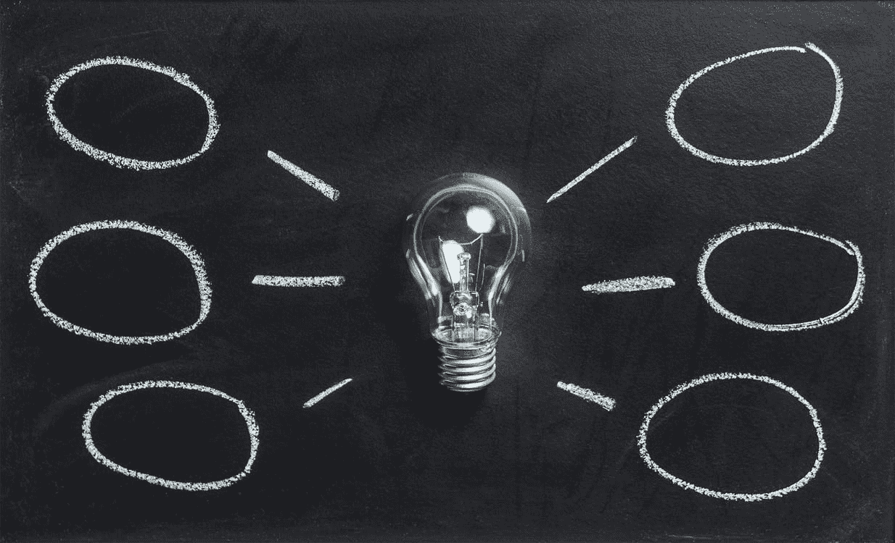

# 每个 Azure 认知服务的一句话介绍

> 原文：<https://medium.com/mlearning-ai/a-brief-introduction-to-azure-cognitive-services-f2e000091636?source=collection_archive---------4----------------------->

Azure 认知服务提供了对强大人工智能功能的简化访问。只需几次 API 调用，您就可以开始识别图片中的人或转录文本！

[(image credit)](https://www.pexels.com/photo/clear-light-bulb-355948/)

此外，Azure 上的认知服务资源可以用作消费的中心点:你可以单独提供每个人工智能服务，或者从一个统一的端点消费多个服务。例如，如果你只想使用翻译，那么你可以提供一个单一的翻译服务；但是，如果您想使用语言理解和文本到语音转换，那么您可以考虑一个单一的认知服务资源，并使用统一的端点调用相应的服务。

本文的目标是给你一个简短的介绍，让你知道哪些服务是可用的，哪些是你想进一步研究的！如您所知，这是 AI-102 认证学习路径中内容的浓缩版，因此，有关该主题的更多信息，请阅读 [this](https://docs.microsoft.com/en-us/learn/certifications/exams/ai-102) 。

一般来说，以下 Azure 认知服务可以分为三类:语言、语音和视觉。

# 语言认知服务

语言类别包括文本挖掘和文本对话服务。它还包括提取关键短语、翻译和对话机器人。

**文本分析**对于语言工作负载来说，简直就是一把瑞士军刀。它可以用于检测语言、提取关键短语、检测实体和执行情感分析。

另一方面，**翻译器**服务提供了更具体的任务:不仅是语言检测和文本翻译，还包括文本音译，即使用特定的字母表书写输入文本的语音。

语言理解服务通常与其他认知服务集成在一起。它实现了一个模型来理解自然语言用户输入的意图，但也具有情感分析和拼写纠正的功能。因此，这有可能集成到支持语音输入或直接从文本对话中理解意图的应用程序中。

QnA Maker 做到了它所说的:建立一个应用于对话的自然语言理解模型，在这个例子中，这个模型可以从知识库中回答用户的问题。你可以把 QnA Maker 想象成一个机器人。

# 言语认知服务

语音分析和合成是**语音**类别的核心。它包括文本和音频流之间的转换服务，还支持实时翻译。

**语音转文本**和**文本转语音**执行相反的任务:前者将音频输入转换成文本，后者进行相反的转换。

**语音翻译**是**语音转文本**与翻译功能的结合，允许人工智能进行实时语音翻译。

# 视觉认知服务

**视觉**类别是关于使用计算机视觉模型进行图像分析。这包括识别物体、标记、生成描述、识别人等等。

当然还有一种通用的计算机视觉服务。主要目标是从图像中提取信息，包括对象检测、图像描述、分类、调节等。但是还有一个**定制视觉**服务，为图像分类或物体检测构建定制的计算机视觉模型。

**人脸 API** 服务专门用于从图像中提取人脸的详细信息。与计算机视觉相比，这个可以执行面部识别，检测情绪状态，头发颜色等。

最后，**媒体视频分析器**是视频分析的一站式商店。它可以用来检测人脸，转录语音，识别关键话题，按场景细分，等等！

# 附加阅读

如果你对在 Azure 中构建人工智能解决方案感兴趣，我强烈建议你查看 Microsoft Learn 上的免费学习路径，特别是针对 [AI-900](https://docs.microsoft.com/en-us/learn/certifications/exams/ai-900) 和 [AI-102](https://docs.microsoft.com/en-us/learn/certifications/exams/ai-102) 认证。与那里提供的信息和实践练习相比，这篇博文的内容只是冰山一角！