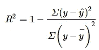
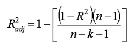

# 回归模型评估指标完全指南

> 原文：<https://medium.com/mlearning-ai/a-complete-guide-to-evaluation-metrics-for-regression-models-776e0ea6ba87?source=collection_archive---------8----------------------->


Photo by [Chris Liverani](https://unsplash.com/@chrisliverani?utm_source=unsplash&utm_medium=referral&utm_content=creditCopyText) on [Unsplash](https://unsplash.com/@chrisliverani?utm_source=unsplash&utm_medium=referral&utm_content=creditCopyText)

在[之前的帖子](https://swagata1506.medium.com/a-gentle-introduction-to-linear-regression-a0315bbc3532)中，我谈到了线性回归及其工作原理。既然我们已经了解了它是如何工作的，那么重要的是了解如何使用一些评估指标来查看模型的执行情况。

以下是用于回归问题的评估指标-

1.  **平均绝对误差**

MAE 计算观测值与回归预测值的绝对距离，取所有观测值的平均值。因为我们使用的是绝对值，所以正面和负面都考虑在内。

这可以使用以下代码来计算-

```
from sklearn.metrics import mean_absolute_error# predicting stock prices
predicted_stock_prices = model.predict(X)
mean_absolute_error(y, predicted_stock_prices)
```

**2。均方差**

尽管 MAE 是一个很好的指标，但有时 MSE 可能是一个更好的指标，因为它是使用实际值和预测值之间的平方差的平均值来计算的。在这种情况下，由于我们正在平方，所有值都保持为正。这确保我们惩罚高误差(当预测值和实际值之间的距离很大时)。

```
from sklearn.metrics import mean_squared_erroractual_values = [6, -1.5, 2, 7]
predicted_values = [5.5, 0.0, 2, 8]mean_squared_error(actual_values, predicted_values)
```

MSE 中的一个反弹是，度量单位也是平方的，因此如果模型试图以美元预测价格，MSE 将产生一个没有意义的单位(美元)数。

这就是为什么我们可以使用下一个公制 RMSE。

**3。均方根误差**

通过取 MSE 的下根值来计算 RMSE，同时保持惩罚较高误差的特性。

```
from sklearn.metrics import mean_squared_error
import numpy as npmse = mean_squared_error(actual_values, predicted_values)
rmse = np.sqrt(mse)
```

**4。均方根对数误差**

这是通过取均方根误差的对数来计算的。采用 RMSE 度量的对数减缓了误差的规模。当您正在开发一个可以大规模输出的模型时，该指标非常有用。

```
from sklearn.metrics import mean_squared_log_error = np.sqrt(mean_squared_log_error( actual_values, predicted_values ))
```

**5。r 的平方**

该指标反映了模型的性能，而不是像我们在之前的指标中计算的损失。在这里，没有对上下文的依赖。

假设我们用所有数据点的平均值构建了一条线。这个模型显然可以被视为最差的模型。我们使用 R 平方方法将这条平均线与实际回归线进行比较。计算方法如下-



现在让我们假设，如果 R2 分数是 0，那么上面的回归线的平均值= 1，所以 1–1 是 0。因此，在这种情况下，两条线重叠意味着模型性能最差。

第二种情况是当 R2 分数为 1 时，这意味着当除法项为零时，这将发生在回归线没有任何错误时，这是完美的。在现实世界中，这是不可能的。

因此，我们可以得出结论，随着我们的回归线向完美移动，R2 分数向 1 移动。

```
from sklearn.metrics import r2_score
r2 = r2_score(actual_values, predicted_values)
```

**6。调整后的 R 平方**

r 平方度量显示了模型的表现或数据点与线的拟合程度，但它不考虑模型中的要素数量。如果我们增加更多的特性，它会增加或保持 R 的平方值不变，永远不会减少。

这就是调整后的 R 的平方发挥作用的时候。调整后的 R 平方度量不仅表示数据点与线的拟合程度，还会根据模型中的要素数量进行调整。如果你给一个模型添加越来越多无用的特征，调整后的 r 平方将会减少。如果添加更多有用的功能，调整后的 r 平方将会增加。
调整后的 R2 将永远小于或等于 R2。

调整后的 R 平方度量计算如下:

[](/mlearning-ai/mlearning-ai-submission-suggestions-b51e2b130bfb) [## Mlearning.ai 提交建议

### 如何成为 Mlearning.ai 上的作家

medium.com](/mlearning-ai/mlearning-ai-submission-suggestions-b51e2b130bfb)