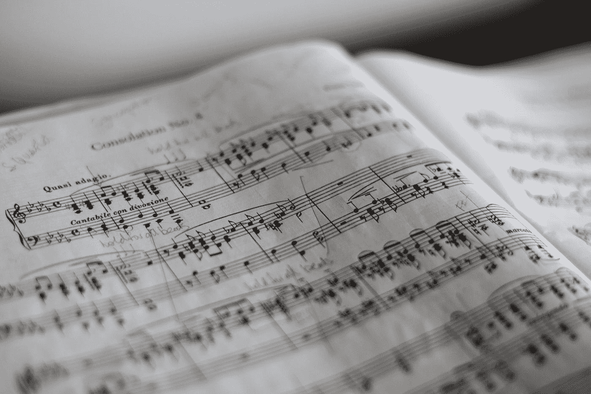

# 不存在的歌曲列表

> 原文：<https://medium.com/mlearning-ai/a-list-of-songs-that-dont-exist-5cdd1f688b93?source=collection_archive---------5----------------------->

## 人工智能如何作曲、混音和设计未来的音乐。

# ***什么是从头音乐？***

还记得弗兰克·辛纳屈的那首经典歌曲*《热水浴时间》*吗？没有吗？太奇怪了。这是世界上众所周知的乙烯基收藏的主要部分。不相信我？点击下面橙色按钮播放。

**弗兰克·辛纳特拉——热水浴时间**

Photo by [Marius Masalar](https://unsplash.com/@marius?utm_source=medium&utm_medium=referral) on [Unsplash](https://unsplash.com?utm_source=medium&utm_medium=referral)