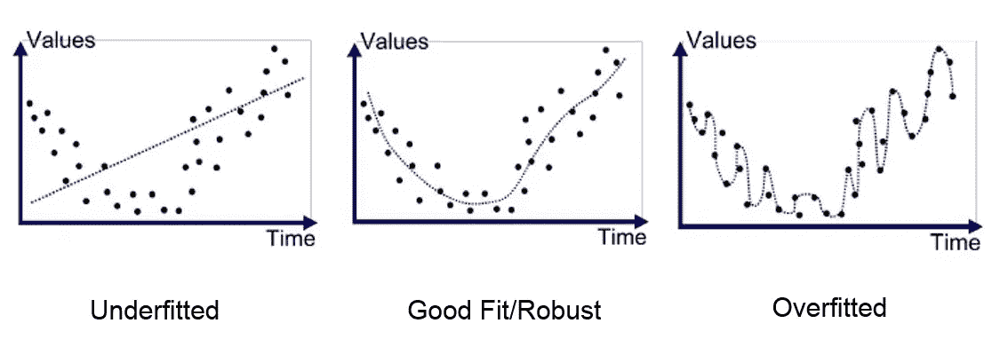
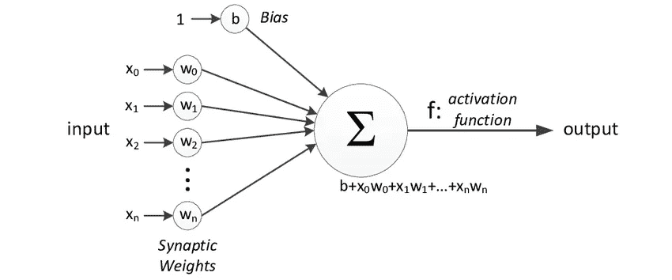
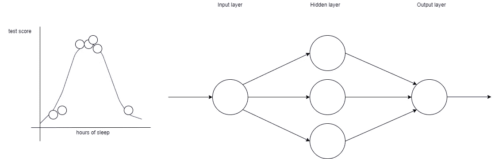
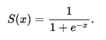
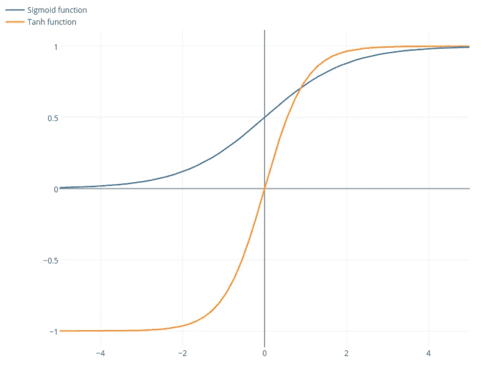
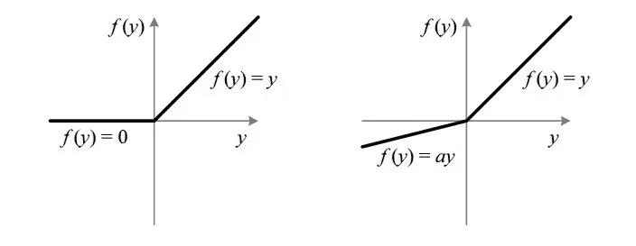

# 一点关于感知器和激活函数

> 原文：<https://medium.com/mlearning-ai/a-little-about-perceptrons-and-activation-functions-aed19d672656?source=collection_archive---------4----------------------->

通常情况下，科学突破和工程壮举的灵感来源于自然界早已存在的东西，远在我们想到它们之前。从类似的鸟和飞机到象鼻启发的机器人手臂，我们不需要更多的证据就可以同意自然是我们今天所拥有的东西的主要灵感来源。

计算机科学当然也不例外。尽管对人脑的研究已经有很长时间了，但在 1943 年，沃伦麦卡洛克和沃尔特皮茨推出了第一个使用电路的神经网络模型。神经网络的工作非常像人脑，其中它们的*感知器*类似于我们的*神经元，*因此得名。

当开始研究机器学习时，大多数人首先会了解过度拟合和欠拟合的概念，显然这两者都是我们希望在我们的模型中避免的。我们想要的是一个能很好地/恰当地适合我们的数据的模型。

Underfit, Good fit, and Overfit example. Image retrieved from julienharbulot.com

在回归问题中，我们希望能够在给定输入的情况下预测输出的值。神经网络能够用它们的感知器做到这一点。

The simplest mathematical model of a neuron called the Perceptron. Image retrieved from researchgate.com uploaded by Zafeirios Fountas

假设我们在 X-Y 平面上有一组点，假设 X 代表每周平均睡眠时间，Y 是相应学生的测试分数。如果我们找出了这个模式，我们就可以根据一个学生每周的平均睡眠时间来预测他的考试成绩。

现在我们来谈谈感知器。它们类似于人脑内部的神经元，基本上是构建回归线的构件。假设我们有一个简单的神经网络，有一个隐藏层，也就是感知机所在的层，有三个感知机。一个感知器接受输入(可能不止一个)，每个输入乘以一个叫做*权重的因子*加在一起，再加上一个叫做*偏差*的数字。将加权和与偏差相加后，该值被插入到*激活函数中。这个激活函数的结果实际上就是感知器的输出。对于具有一个隐藏层的神经网络，然后将每个感知器的所有输出值加在一起，作为原始输入的预测值。*

在我们的睡眠分数示例中，神经网络接受学生每周平均睡眠时间的值作为输入，每个感知器将该值乘以每个感知器的相应权重，并通过将已经相乘的输入求和并添加偏差值来预测该学生的考试分数。

To create a prediction as depicted with the blue line in the graph, a neural network with 3 perceptrons in a single hidden layer is constructed

计算出正确的权重和偏差是创建准确的回归模型所必需的，这由反向传播算法来完成。但是本文不会讨论该算法的工作原理和机制。相反，我们将更多地讨论激活函数的种类。

# 激活功能

大多数时候，我们的数据点在 X-Y 平面上形成的模式可能不是直线模式。如果是这种情况，一个简单的直线线性回归的形式

> y = mx + b

不足以预测 x 的值。如果我们强迫自己在这样的情况下使用线性回归，我们会有一个不适合的模型。

在这种情况下，我们需要一个工具来模拟我们的数据点，使我们能够弯曲回归线。我们使用激活函数来实现。简而言之，激活函数使我们的回归变得非线性。一些常用的激活功能如下。

## Sigmoid 激活函数

sigmoid 函数的图形如下所示。

Sigmoid function. Image retrieved from wikipedia.com

我们的 sigmoid 函数的“S”形图形的方程式如下。

由于 sigmoid 函数的范围仅从 0 到 1，因此它通常用于预测概率。sigmoid 函数也是可微的，这意味着可以计算导数。然而，当它接近正负无穷大时，导数越来越接近 0。小梯度值不适合反向传播。此外，逻辑 sigmoid 函数会导致神经网络在训练时停滞。

**Softmax 激活函数**另一方面，是用于多类分类的更一般化的逻辑激活函数。这意味着 softmax 可用于解决涉及两个或更多类别的分类问题。

## 双曲正切激活函数

双曲正切函数与 sigmoid 函数非常相似。tanh 激活函数也具有 S 形，但不同之处在于 tanh 的范围是从-1 到 1。与 sigmoid 激活函数并排比较的 tanh 激活函数的图形和方程如下。

Sigmoid and Tanh compared side by side. Image retrieved from https://stats.stackexchange.com answer by ekoulier

Tanh 通常应用于两个类之间的分类问题。像 sigmoid 激活函数一样，双曲正切函数是可微分的，但结果是，当梯度值越来越接近两个无限末端时，梯度值也越来越接近 0，这对于反向传播来说是不希望的。当人们必须在乙状结肠和 Tanh 之间做出选择时，tanh 是有利的。双曲正切函数的公式如下。

## ReLU 和泄漏 ReLU 激活功能

ReLU 代表整流线性单元，是神经网络中最常用的激活函数。ReLU 激活函数的范围从 0 到无穷大，0 表示小于等于 0 的值，即 0 表示负值。总的来说，ReLU 激活功能比 Sigmoid 和 Tanh 更有利。但是，它可能仍然不能正确地映射负值，因为它会立即将负值转换为 0。

这就是漏 ReLU 的用武之地。泄漏的 ReLU 是作为一种尝试，以解决垂死的 ReLU 问题。Leaky ReLU 不会将负值设置为零，而是遵循一个带有梯度的线性方程，通常为 0.01。当梯度不为 0.01 时，称为随机化 ReLU。

ReLU vs Leaky ReLU graph. Image retrieved from towardsdatascience.com by Sagar Sharma

# 参考

 [## 机器学习中的欠适应和过适应

### 让我们考虑我们正在设计一个机器学习模型。一个模型被认为是一个好的机器学习模型，如果…

www.geeksforgeeks.org](https://www.geeksforgeeks.org/underfitting-and-overfitting-in-machine-learning/)  [## 支持向量机——机器学习算法简介

### 从零开始的 SVM 模式

towardsdatascience.com](https://towardsdatascience.com/support-vector-machine-introduction-to-machine-learning-algorithms-934a444fca47)  [## 提高神经网络的性能

### 神经网络是机器学习算法，提供许多用例的准确性状态。但是，很多…

www.kdnuggets.com](https://www.kdnuggets.com/2018/05/improving-performance-neural-network.html)  [## 张量流-单层感知器

### Tensorflow 教程要理解单层感知器，理解人工神经网络很重要…

www.hebergementwebs.com](https://www.hebergementwebs.com/tensorflow-tutorial/tensorflow-single-layer-perceptron)  [## Menilik 激活函数

### 我的生活充满了希望。Sayyidina Ali bin Abi Thalib 公司

medium.com](/@opam22/menilik-activation-functions-7710177a54c9)  [## 神经网络中的激活函数

### Sigmoid，tanh，Softmax，ReLU，Leaky ReLU 解释！！！

towardsdatascience.com](https://towardsdatascience.com/activation-functions-neural-networks-1cbd9f8d91d6)