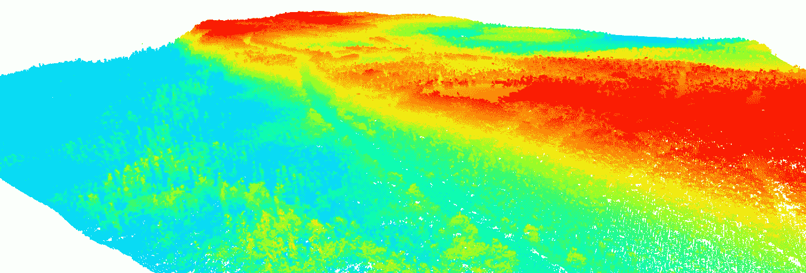
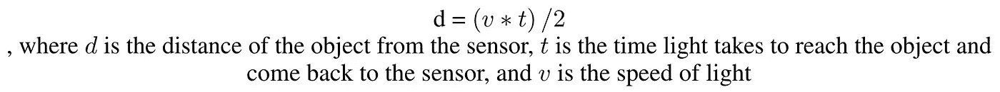
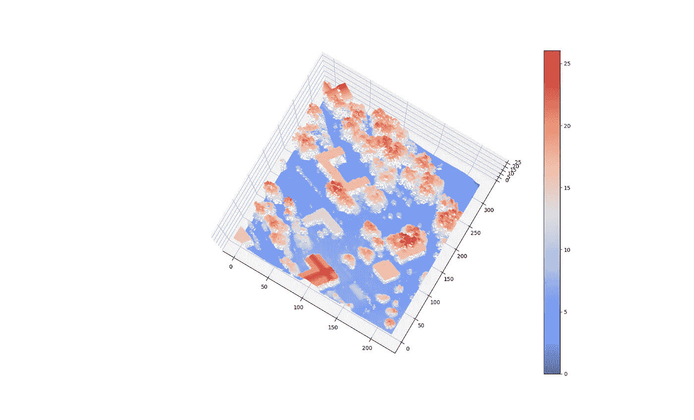
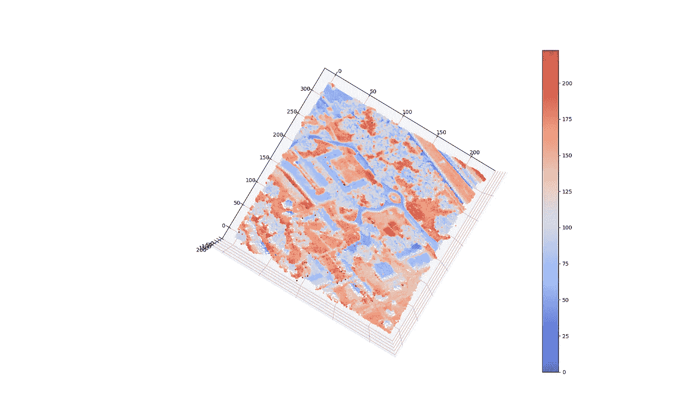
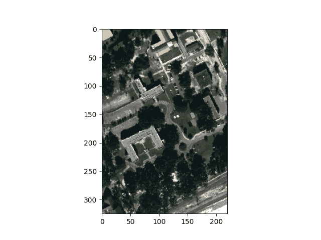
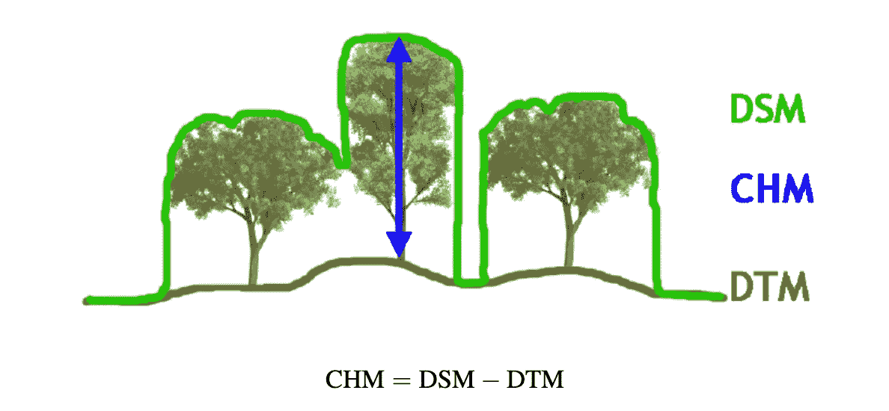
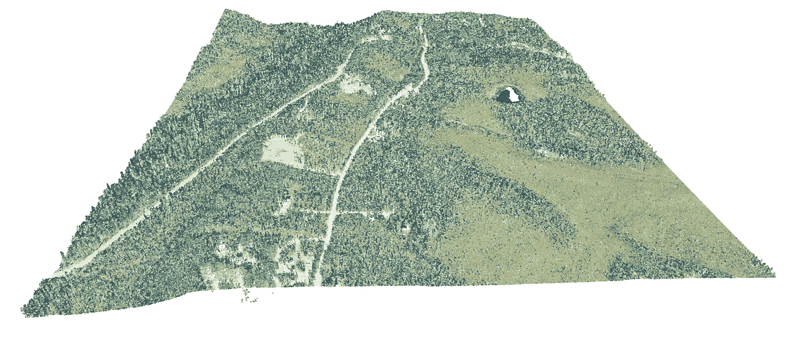
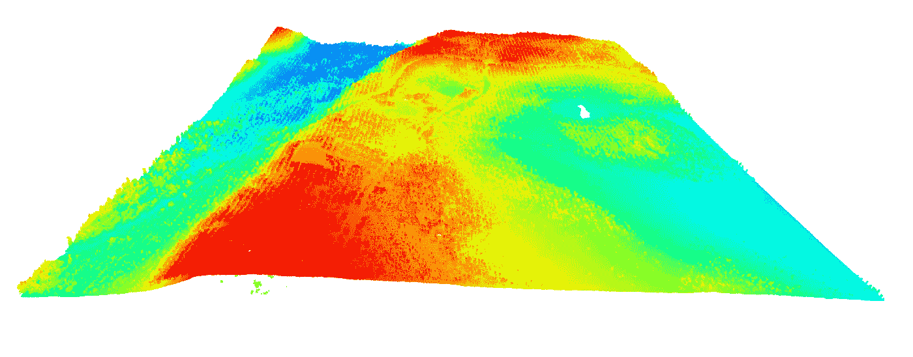

# 激光雷达快速指南:第 1 部分-理论

> 原文：<https://medium.com/mlearning-ai/a-quick-guide-to-lidar-part-1-theory-7c8ff48af0b9?source=collection_archive---------2----------------------->

一篇关于激光雷达的重要概念和术语的简明文章，对于理解其工作和使用是必要的。

Image by Author

# **什么是激光雷达？**

**LiDAR 代表光探测和测距。**它是一种测量地球表面物体精确距离的遥感方法。激光雷达使用脉冲激光来计算物体离地球表面的可变距离。

激光雷达有 3 个主要组件—

1.  扫描仪
2.  激光
3.  gps 接收机

# **激光雷达是如何工作的？**

激光雷达的工作原理是向地球表面发射激光脉冲，并计算返回所需的时间。激光击中地球表面的物体，被它们反射，并被传感器记录下来。该距离通过以下公式计算:

Formula to compute the distance of the target from the sensor

# **激光雷达系统的类型**

激光雷达系统有两种类型:

## 1.机载激光雷达

顾名思义，在机载系统中，激光雷达安装在直升机或无人机上收集数据。它又分为两个子类别:

**a)拓扑激光雷达** —用于导出表面模型，如数字地形模型(DTM)、数字表面模型(DSM)等。

**b)测深激光雷达** —用于分析海岸高程，探测水深物体。测深激光雷达使用波长为 *532 纳米*的绿光，因为激光雷达激光(红外线)无法穿透水。

## 2.地面激光雷达

地面激光雷达系统可以是移动的或静态的。移动式激光雷达安装在移动的交通工具上，如汽车、船等。而静态激光雷达是固定的，安装在三脚架上。

# 激光雷达如何测量树木、建筑物和地面？

当激光射向地球表面时，会碰到树叶、树枝和其他物体。一些光被它们反射，而一些光传播到地面。**因此，一个单脉冲有多个返回。**最后一次返回用于计算地面的标高。第一次返回给我们地面上物体的高度。

物体的高度是通过从地面的高度减去物体的高度来计算的。在建筑物或平坦表面的情况下，所有的激光脉冲被反射回一次，并且它们的标准偏差几乎为零。但是建筑的标高比地面的标高要大。这种差异用于区分表面是地面还是建筑物的屋顶。如果建筑物周围的地面不是平坦的表面，那么我们考虑地面高程点的最大值或者取这些点的平均值来计算地面高程值。在树的情况下，有多个回报，它们的标准差是一个很大的值。因此，我们可以区分树木、建筑物和地表。

此外，返回到激光雷达的能量会产生强度波形。光的强度随着物体表面的不同而不同。例如，水吸收了几乎所有的光。因此，它表现出很低的强度。

下面是来自 [MUUFL Gulfport 数据集](https://github.com/GatorSense/MUUFLGulfport)的激光雷达高度和强度示例。

LiDAR Height from MUUFL Gulfport data (Image by Author)

LiDAR intensity from MUUFL Gulfport data (Image by Author)

RGB Image from MUUFL Gulfport data (Image by Author)

# 激光雷达的规格

1.  激光雷达的波长位于电磁波谱的红外范围，即 *780 nm- 1mm* 。大多使用 *1064 nm* 的波长。
2.  激光雷达的脉冲重复频率(PRF)可以高达 *100 kHz* 或 *150 kHz* 甚至更高。PRF 定义为激光器每秒发射的脉冲数。
3.  激光雷达在地面以上 *152 米至 914 米*或 *914 米至 2438 米*的高度范围内工作。
4.  空间分辨率是每个像素或点代表的最小区域。例如，假设有两个激光雷达传感器，第一个传感器的空间分辨率为 *1m* ，第二个传感器的空间分辨率为 *5m* 。于是，与第二传感器相比，第一传感器具有更高的分辨率。
5.  角度扫描的值介于-90°和 90°之间。

LiDAR working explained (Image by Author)

# 高程模型

有 3 种高程模型或数字高程模型(DEM)

**1。DSM(数字表面模型)**

数字表面模型捕捉地球表面的所有自然和人造特征。简而言之，DSM 扫描表面的每一个特征。DSM 是通过考虑来自激光器的所有第一次返回来计算的。它基本上给出了所有物体的表面。

**2。DTM(数字地形模型)**

数字地形模型捕捉除建筑物、树木和其他特征之外的地面。它会过滤掉地球表面的所有非地面特征。DTM 是通过考虑激光的所有最后返回来计算的。

**3。CHM(树冠高度模型)**

从 DSM 中减去 DTM 给出了冠层高度模型。它给出了树木离地面的高度。

[Image taken from Perko, Roland, et al., 2011](https://www.mdpi.com/2072-4292/3/4/792)

# 激光雷达数据是如何存储的？

**激光雷达数据以标准 LAS 格式存储在文件中**。

> LAS 文件是用于存储机载激光雷达数据的行业标准二进制格式。

它是由美国摄影测量与遥感学会( [ASPRS](https://www.asprs.org/) )维护的。ASPRS 代码可在此处找到:

 [## 激光雷达点分类-ArcMap |文档

### 每个激光雷达点都可以分配有一个分类，该分类定义了反射激光的对象的类型…

desktop.arcgis.com](https://desktop.arcgis.com/en/arcmap/latest/manage-data/las-dataset/lidar-point-classification.htm) 

LAS 文件在文件头中包含激光雷达测量的数据。标题包含以下内容:*点格式、创建日期、点数、刻度、偏移量、最大值、最小值、返回的点数。*

点格式包含以下: *X，Y，Z，强度，return_number，返回次数，扫描方向标志，飞行线边缘，分类，合成，关键点，保留，扫描角度等级，用户数据，点源 id，gps 时间，红，绿，蓝，可逆索引*。

如果数据是彩色的，那么 RGB(红、绿、蓝)值也会出现。

以下是从[霓虹灯数据门户](https://data.neonscience.org/data-products/DP3.30024.001)获取的激光雷达 las 文件数据示例。

Colorized LiDAR data using RGB value (Image by Author)

Uncolorized data (Image by Author)

# 结论

在这篇文章中，我简明扼要地介绍了激光雷达的所有理论方面。这些信息可以为初学者提供开始使用激光雷达所需的背景知识。

# 后续步骤

在第 1 部分中，我谈到了激光雷达的所有理论细节。在第 2 部分中，我将讨论使用 python 可视化和分析激光雷达。我将讨论如何使用 Open3D 显示点云，并使用 LiDAR 数据对景观进行分类。

> 感谢阅读！我希望这篇文章对你有所帮助。
> 
> 加油鳄鱼队！🐊

# 参考

 [## GitHub-gator sense/muuflgulport:MUUFL gulf port 超光谱和激光雷达数据:该数据集…

### MUUFL Gulfport 超光谱和激光雷达数据:该数据集包括 HSI 和激光雷达数据，评分代码，照片…

github.com](https://github.com/GatorSense/MUUFLGulfport)  [## 霓虹灯|数据产品

### 编辑描述

data.neonscience.org](https://data.neonscience.org/data-products/DP3.30024.001)  [## 存储激光雷达数据-ArcGIS Pro |文档

### 最初，激光雷达数据仅以 ASCII 格式传输。随着大规模的激光雷达数据收集，一个二元…

pro.arcgis.com](https://pro.arcgis.com/en/pro-app/2.8/help/data/las-dataset/storing-lidar-data.htm)  [## 使用激光雷达数据创建树冠高度模型

### 完成本教程后，您将能够:定义林冠高度模型(CHM)，数字高程模型(DEM)…

www.earthdatascience.org](https://www.earthdatascience.org/courses/earth-analytics/lidar-raster-data-r/lidar-chm-dem-dsm/)  [## 图一。机载激光雷达插图

### 从出版物下载科学图表|机载激光雷达插图:激光雷达和 IFSAR 的集成…

www.researchgate.net](https://www.researchgate.net/figure/Illustration-of-Airborne-LiDAR_fig1_32894099) 

使用 X 波段高分辨率合成孔径雷达数据进行森林评估。*遥感*3.4(2011):792–815。

 [## Mlearning.ai 提交建议

### 如何成为 Mlearning.ai 上的作家

medium.com](/mlearning-ai/mlearning-ai-submission-suggestions-b51e2b130bfb)