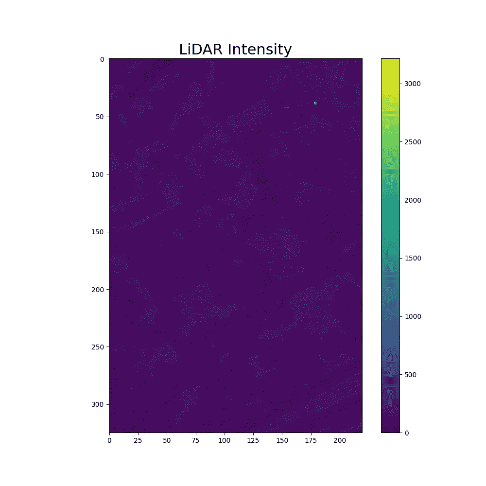
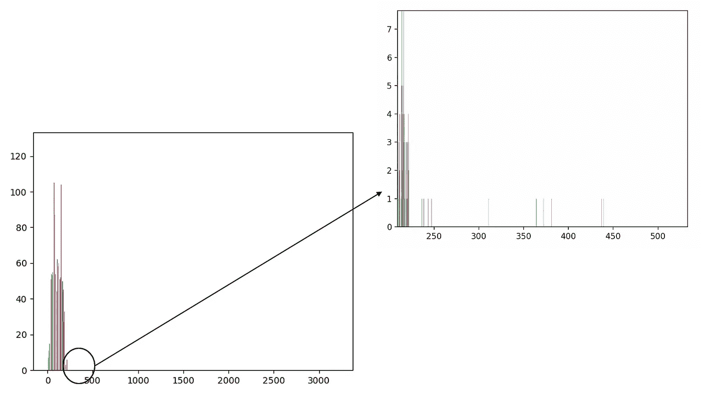
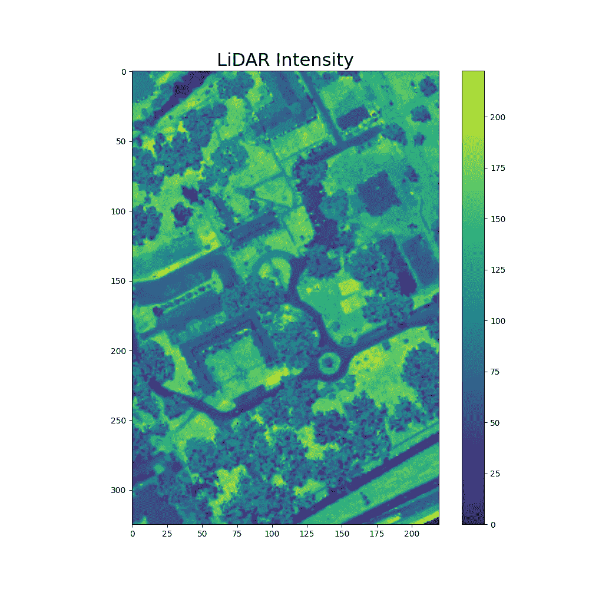
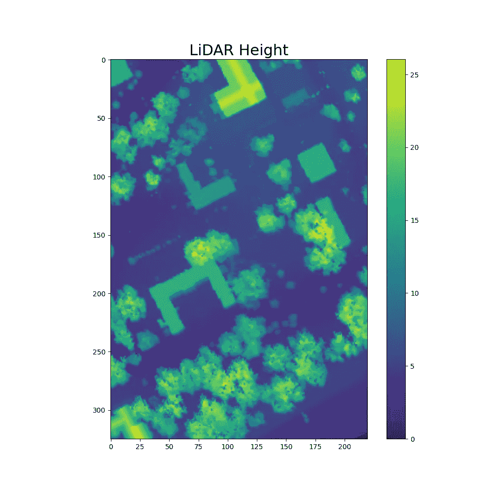
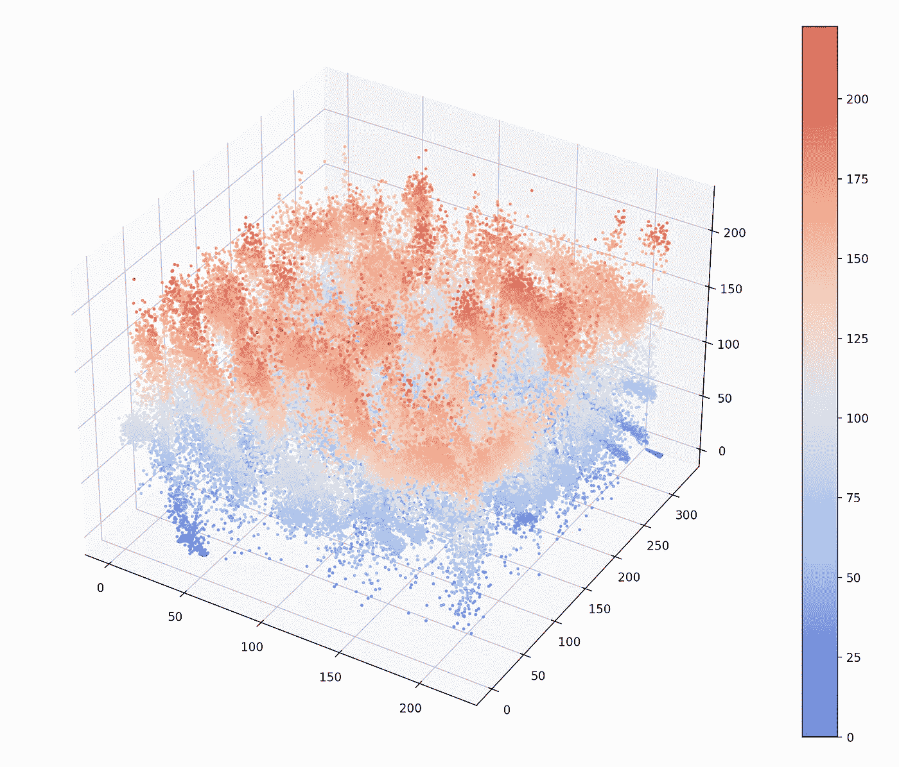
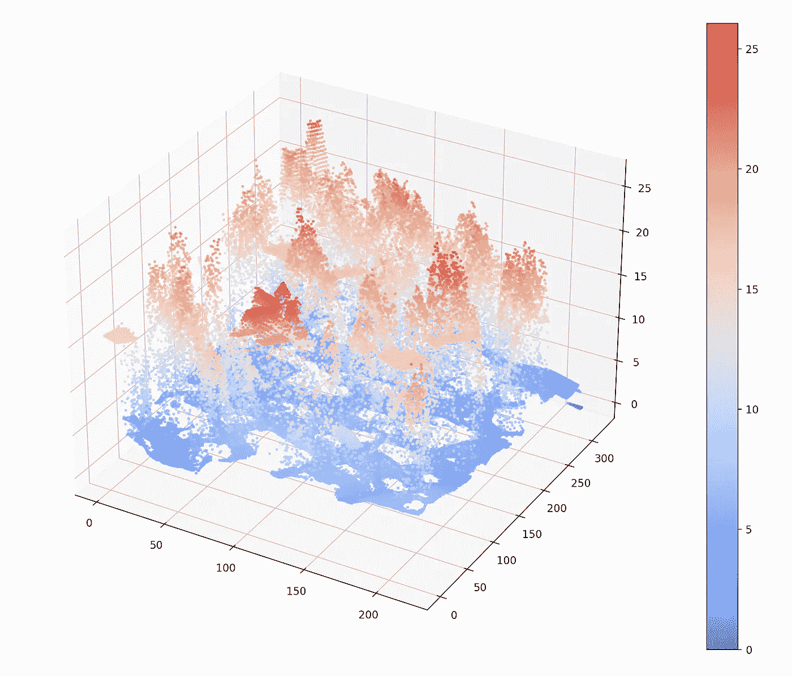
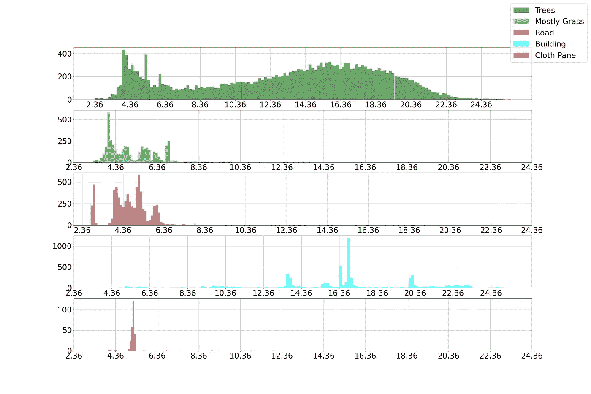
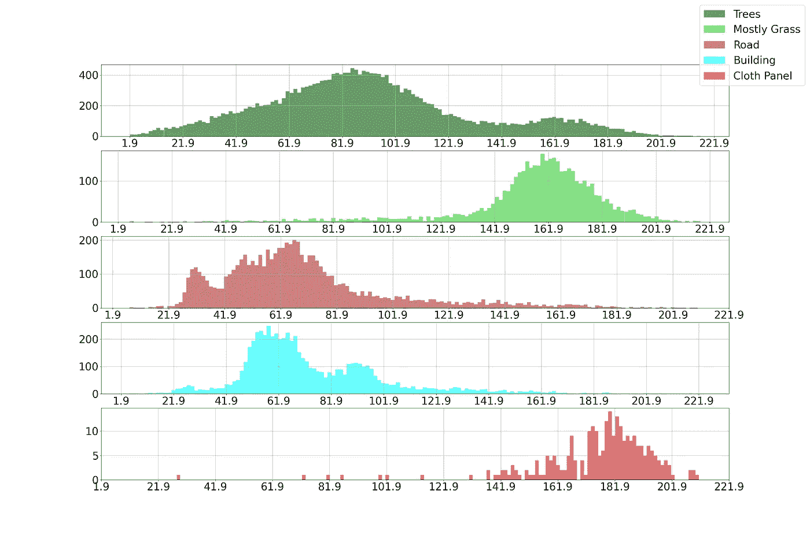
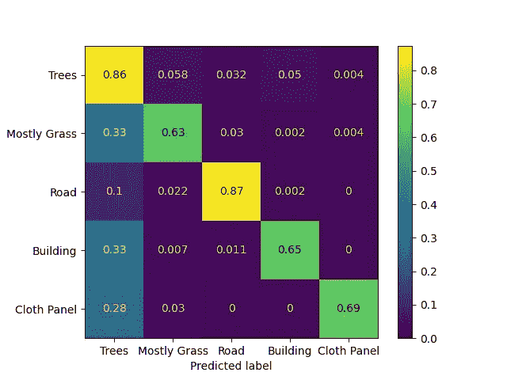

# 激光雷达快速指南:第 2 部分

> 原文：<https://medium.com/mlearning-ai/a-quick-guide-to-lidar-part-2-cd2dcd2e60fd?source=collection_archive---------3----------------------->

## 了解如何使用 python 可视化激光雷达数据并使用高度和强度执行分类。

这一部分将演示如何使用激光雷达数据对不同的土地覆盖类别进行分类。我们将使用 [**MUUFL Gulfport 数据集**](https://github.com/GatorSense/MUUFLGulfport/tree/master/MUUFLGulfportSceneLabels) 来可视化激光雷达数据，并基于高度和强度执行分类。我们使用的数据集是一个*。mat* 文件。我们可以读一下*。使用 S *cipy* 库的 python 中的 mat* 文件。

## 步骤 1:导入库

## 步骤 2:读取文件并提取激光雷达数据和地面实况

*。mat* 文件包含几个 MATLAB struct 字段名。名为' *hsi'* 的字段包含地面实况、激光雷达数据等。的描述。mat 文件可以在这里读取[。我们将从各自的 MATLAB 结构字段中提取激光雷达数据、地面实况和 RGB 图像。](https://github.com/GatorSense/MUUFLGulfport/tree/master/MUUFLGulfportSceneLabels)

## 步骤 3:绘制强度和高度(去除噪声，如果有的话)

现在，我们已经提取了激光雷达的高度和强度。**当我们绘制强度图时，我们会发现，由于噪声的存在，该图看起来很糟糕。为了去除噪声，我们首先需要绘制强度直方图，以找出是什么值导致了噪声。**

在直方图中，我们可以看到在图的末端有非常小的值。因此，我们必须检查这个长尾在直方图中的起始位置。

在我们的代码中，这个长尾从值 *223 开始。*因此，我们需要移除任何高于 223 的东西。为了消除噪声，我们可以用均值/中值或零来代替它们。用均值代替噪声是更好的选择。去除噪声后，我们得到一个更清晰的强度图。高度不包含任何噪声。

LiDAR Intensity before noise removal (Image by Author)

Histogram of Intensity showing noise (Image by Author)

LiDAR Intensity after noise removal (Image by Author)

LiDAR Height (Image by Author)

Histogram of Height (Image by Author)

## 步骤 4:强度和高度的 3D 可视化

3D Visualization of Intensity (Image by Author)

3D Visualization of Height (Image by Author)

## 步骤 5:绘制各等级的高度和强度直方图

我们可以绘制不同类别的强度和高度，并观察每个类别如何不同。尽管仅使用高度或强度无法区分某些类别。但是使用高度和强度的组合，我们可以正确地对大多数样本进行分类。

为了以相同的比例绘制每个直方图，我们将所有类别的全局最小值和最大值设置为高度和强度的组合。该数据集中有许多类，但对于本教程，我们只使用了几个类:

> 树木(标签= 1)，主要是草(标签=2)，道路(标签=5)，建筑(标签=8)，布面板(标签=11)。

Histograms of Height for different classes (Image by Author)

Histograms of Height for different classes (Image by Author)

## 第六步:使用 KNN 分类

现在到了分类部分。我们将使用 KNN 来完成分类任务。我们将 K 的值设为 9。您可以试验不同的 K 值，并选择 K 的最佳值。我们实现了 80 *.17%* 的准确度，混淆矩阵如下所示。

Confusion Matrix (Image by Author)

在这个混淆矩阵中，我们可以看到许多建筑物被归类为树，那是因为它们的高度相似。有时沥青被用于建筑和道路，因此一些建筑由于相似的强度被归类为道路。

> 完整的代码可以在 GitHub [这里](https://github.com/namratadutt/LiDARTutorial)获得。

## 结论

在本教程中，我们演示了如何可视化激光雷达数据并使用 KNN 对其进行分类。我们观察了不同土地覆盖类型的高度和强度是如何变化的。您还可以使用更复杂的分类器来获得更好的准确性。

在第 3 部分中，我将演示如何使用来自相邻像素的信息进行更好的分类。**目前，我们正在对单个像素进行分类，因此分类器无法区分几个高度相同的建筑物和树木样本。但是如果我们将(NxN)区域考虑在内，我们也可以使用标准差作为分类的重要特征**。在建筑物的情况下，标准偏差几乎为零，而在树木的情况下，由于高度的可变性，标准偏差是一个很大的值。

> 希望这篇文章对你有用！
> 
> 加油鳄鱼队！*🐊*

## 参考

页（page 的缩写）Gader，a .扎雷亚，r .克洛斯，J. Aitken，G. Tuell，“MUUFL Gulfport 超光谱和激光雷达机载数据集”，佛罗里达大学，盖恩斯维尔，佛罗里达州，技术。REP . REP-2013–570，2013 年 10 月。

X.杜和，“技术报告:MUUFL Gulfport 数据集的场景标签地面真值图”，佛罗里达大学，盖恩斯维尔，佛罗里达州，技术。代表 20170417，2017 年 4 月。

 [## GitHub-gator sense/muuflgulport:MUUFL gulf port 超光谱和激光雷达数据:该数据集…

### MUUFL Gulfport 超光谱和激光雷达数据:该数据集包括 HSI 和激光雷达数据，评分代码，照片…

github.com](https://github.com/GatorSense/MUUFLGulfport)  [## Mlearning.ai 提交建议

### 如何成为 Mlearning.ai 上的作家

medium.com](/mlearning-ai/mlearning-ai-submission-suggestions-b51e2b130bfb)