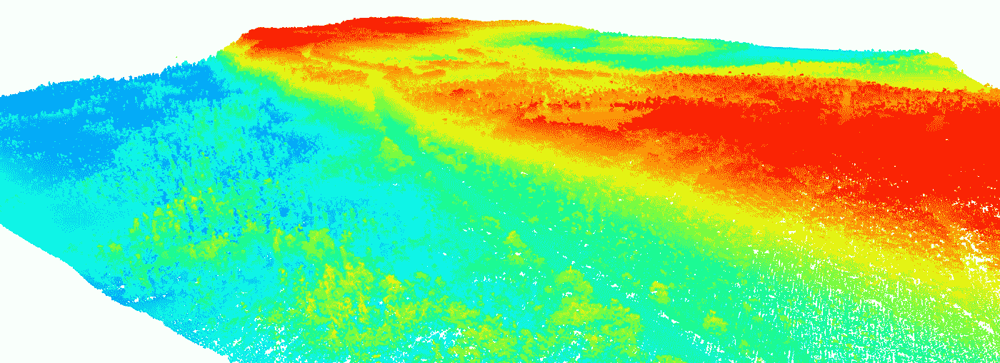
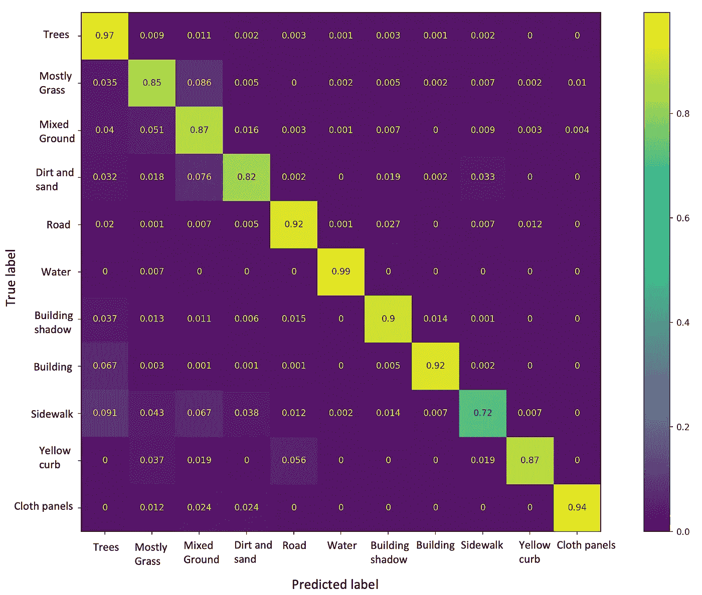

# 激光雷达快速指南:第 3 部分

> 原文：<https://medium.com/mlearning-ai/a-quick-guide-to-lidar-part-3-7871ed6c3f2c?source=collection_archive---------3----------------------->

学习使用像素周围的 NxN 邻域执行稳健的土地覆盖分类。

# 介绍

在最后的[部分](/mlearning-ai/a-quick-guide-to-lidar-part-2-cd2dcd2e60fd)，我们学习了如何使用高度和强度进行土地覆盖可视化和分类。在这一部分中，我们将探索如何在考虑像素周围的 N×N 邻域的同时执行更稳健的分类。邻近区域将使我们对该点周围的高度和强度变化有更好的了解。如果像素属于草地或道路，则邻域中的高度变化将较小。然而，如果像素属于树木，那么高度变化将会非常大。这样，我们可以更好地估计某个特定对象属于哪个类。

# 数据

我们使用了 [MUUFL Gulfport](https://github.com/GatorSense/MUUFLGulfport) 数据集。数据在一个*里。垫*档。我们可以阅读*。使用 S *cipy* 库在 python 中创建 mat* 文件。在这一部分中，我们将学习如何使用像素周围的 NxN 邻域进行土地覆盖分类。我们开始吧！

# 履行

## 步骤 1:导入库

## 步骤 2:读取文件并提取激光雷达数据和地面实况

*。mat* 文件包含几个 MATLAB struct 字段名。名为' *hsi'* 的字段包含地面实况、激光雷达数据等。的描述。mat 文件可以在这里读取[。我们将从各自的 MATLAB 结构字段中提取激光雷达数据、地面实况和 RGB 图像。](https://github.com/GatorSense/MUUFLGulfport/tree/master/MUUFLGulfportSceneLabels)

## 步骤 3:找到每个像素周围的 NxN 邻域

## 步骤 4:修改地面实况

我们在一个像素周围取一个 11×11 的邻域。地面真相包含标签- *1，1，2，…，11* 。 *'-1'* 为未标注数据。我们需要标签 1，2，…，和 11 。现在，我们需要从 0 到 10 对标签进行编码。为此，我们只需从基本事实标签中减去 *1* 。

## 步骤 5:将数据分割成 train-test，保存在 npz 文件中并加载文件

我们将数据分为训练和测试，并对训练-测试数据进行混洗，因此我们可以获得一组随机的训练和样本。

稍后，我们将执行蒙特卡罗实验，并最终报告平均准确度。为此，我们需要在每个实验中随机训练和测试样本。

## 步骤 6:标准化训练和测试数据

## 步骤 7:平衡训练数据

由于数据不平衡，我们打印所有标签及其样本数。我们设定一个 *4000* 的门槛。重复所有频率小于 *4000* 的标签，检查它们是否超过 *4000* 。如果某些标签的频率小于 *4000* ，则它们的索引被重复并添加到*有用 _ 索引*中，如果它们已经大于 *4000* ，则它们仅仅被添加到*有用 _ 索引*中。

## 第八步:对标签进行一次性编码

## 步骤 9:为分类定义一个 CNN 模型

## 步骤 8:训练模型，根据测试数据进行预测，并报告准确性

我们用相同的代码进行了 7 次蒙特卡罗迭代。每次我们随机抽取一组训练和测试样本。我们取得了 87.65%±3.08 的平均准确率。最佳精度的混淆矩阵如下所示:

Confusion matrix (Image by the Author)

> 完整的代码可以在 GitHub [*这里*](https://github.com/namratadutt/LiDAR) 获得。

# 结论

在这一部分中，我们学习了使用 11x11 邻域对土地覆盖类进行分类。相邻像素给出了感兴趣区域周围的高度和强度变化的更好的概念。我们可以试验不同的补丁大小，因为补丁大小的函数是广义的。考虑小块比单个像素更准确。我们仍然会混淆“主要是草”和“混合地面”、“建筑物阴影”和“树木”、“人行道”和“道路”等。但是，这些困惑都很小。

> *希望这篇文章对你有用！*
> 
> 加油鳄鱼队！🐊

# 参考

页（page 的缩写）Gader，a .扎雷亚，r .克洛斯，J. Aitken，G. Tuell，“MUUFL Gulfport 超光谱和激光雷达机载数据集”，佛罗里达大学，盖恩斯维尔，佛罗里达州，技术。REP . REP-2013–570，2013 年 10 月。

X.杜和，“技术报告:MUUFL Gulfport 数据集的场景标签地面真值图”，佛罗里达大学，盖恩斯维尔，佛罗里达州，技术。代表 20170417，2017 年 4 月。

 [## GitHub-gator sense/muuflgulport:MUUFL gulf port 超光谱和激光雷达数据:该数据集…

### MUUFL Gulfport 超光谱和激光雷达数据:该数据集包括 HSI 和激光雷达数据，评分代码，照片…

github.com](https://github.com/GatorSense/MUUFLGulfport)  [## Mlearning.ai 提交建议

### 如何成为 Mlearning.ai 上的作家

medium.com](/mlearning-ai/mlearning-ai-submission-suggestions-b51e2b130bfb)