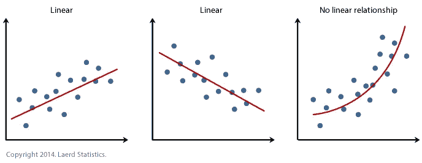

# 所有时间序列/回归模型统计的单一函数

> 原文：<https://medium.com/mlearning-ai/a-single-function-for-all-time-series-regression-model-stats-e0821b651f93?source=collection_archive---------6----------------------->

在过去的几周里，我一直在做一个回归分析项目。我从别人那里接手了这个项目，我被赋予了一个目标，那就是使代码库可复制且整洁。我通过做两件事达到了这个目的。从上到下重写脚本
2。编写函数以避免重复

我得到了两个脚本，我发现它们之间有相似之处，所以这样做是有意义的，这样我就可以创建一个整洁的单一脚本来完成任务。

由于这是一个回归分析项目，我注意到我们需要大量的诊断图来判断模型的性能和有效性。在我做 STATA 的时候，我会单独调用每个测试，因为每个人都这么做。然而，用 python 做这件事感觉有点“过时”,所以我决定为此写一个函数。

def run_model_diagnostic_test(y，y_pred):
#检查模型诊断状态以确保模型符合

PLT . fig size =(10，10))
plt.scatter(y.to_numpy()，y_pred，c = ' crimson ')
PLT . yscale(' log ')
PLT . xscale(' log ')

P1 = max(max(y _ pred)，max(y.toAvF —真实 vs 模拟图")
PLT . show()

df _ pred = PD . concat([y _ pred，y]，axis = 1)
df _ pred = df _ pred . rename({ 0:'预测'，'销售 _ 总 _ 无炒作':'实际' }，axis = 1)
df _ pred[' resid ']= df _ pred . predicted—df _ pred . actual

PLT . plot(df _ pred 线性度—目视检查目标变量与预测值之间的线性度")
PLT . show()

fig = sm . QQ plot(df _ pred . resid，fit=True，line="45")
plt.title("2。误差的正态性—目视检查残差以确认正态性")
PLT . show()

SNS . kdeplot(df _ pred . resid，label = ' '，shade = True)
plt.xlabel('模型残差')；plt.ylabel('密度')；plt.title(“残差分布”)；
PLT . show()

PLT . plot(df _ pred . resid，' o '，alpha=0.5)
plt.title("4。同质性-目视检查残差以确认恒定方差")
PLT . show()

from stats models . stats . stat tools import Durbin _ Watson
dw = Durbin _ Watson(df _ pred . resid)
print(' Durbin-Watson '，dw)

if dw<1.5:
print('正自相关'，' \ n)
elif dw>2

plt.plot( df_pred.predicted，df_pred.resid，' o '，alpha=0.5)
plt.title("6。残差与预测值")
plt.show()

[https://medium . com/mlearning-ai/mlearning-ai-submission-suggestions-b 51e 2b 130 bfb](/mlearning-ai/mlearning-ai-submission-suggestions-b51e2b130bfb)