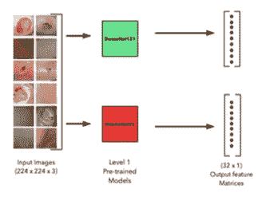
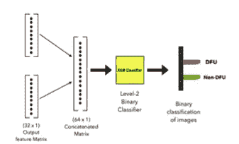

# 一种用于 DFU 检测的堆叠集成技术

> 原文：<https://medium.com/mlearning-ai/a-stacked-ensemble-technique-for-dfu-detection-3d5aa855f991?source=collection_archive---------13----------------------->

糖尿病足溃疡早期检测堆叠集合模型开发的详细综述(DFU)

这是指我与他人合著的一项研究，旨在对 DFU 进行早期检测，以防止重大截肢和缺乏临床勤奋。

合著者— [普里扬什·凯迪亚](https://medium.com/u/939b9b5620ad?source=post_page-----3d5aa855f991--------------------------------)

**大纲—**

1.  介绍
2.  问题陈述和方法
3.  数据收集和预处理
4.  一些预先训练的架构
5.  模型性能
6.  堆叠系综技术
7.  结论

*~好的*

# 1.介绍

随着人口和压力水平的增加，糖尿病是一种比以往增长更快的医学疾病。糖尿病是当代最致命的疾病之一，全世界有超过 5 . 37 亿人患有糖尿病。

再加上缺乏疾病早期发现的诚意，截肢率非常高。因此，不能仅仅依靠临床措施，因为它们缺乏时间严重性、高诊断成本等等。

而这里就是**深度学习来玩**的时候了。

# 2.问题陈述和方法

*   **问题陈述—** 给定健康足图像和 DFU 感染足图像，我们如何提出一种对 DFU 和健康足图像进行分类的方法。
*   **方法—** 我们可以将图像输入到一个卷积神经网络(CNN)中，该网络具有一些池层或其他层，我们可以从这些图像中生成特征，然后将这些特征输入到某个 softmax 层进行分类。

这种方法似乎是可行的。这种分类器可以帮助我们将图像样本分为 DFU 和健康样本，或者其他疾病类型。这可以帮助我们找到一个比手动临床监测更好的有效解决方案，让每个患者都能识别 DFU 或其他疾病类型。

但是我们需要数据。

# 3.数据收集和预处理

## 数据收集

互联网上用于研究 DFU 图像样本的数据是私人的，只能通过大学和私人医疗机构获得。在这里的 Kaggle [上可以找到为数不多的开源 DFU 图像数据集之一。](https://www.kaggle.com/datasets/laithjj/diabetic-foot-ulcer-dfu)

DFU 上最受欢迎的数据集之一是 [DFUC](https://www.touchendocrinology.com/diabetes/journal-articles/the-dfuc-2020-dataset-analysis-towards-diabetic-foot-ulcer-detection/) 数据集。
糖尿病足溃疡大挑战(DFUC)是由医学图像计算和计算机辅助干预(MICCAI)主办的医学图像分类竞赛。该数据集包含大约 4000 幅 DFU 和健康足部图像，这些图像被分成训练集和测试集。

DFUC 数据集仅供非商业研究目的公开使用，可通过发送电子邮件到 [m.yap@mmu.ac.uk](mailto:m.yap@mmu.ac.uk) 获取正式请求

## 数据预处理

如果我们受限于较少的数据，我们可以执行**数据扩充**来防止模型过度拟合，从而为模型生成更多的数据进行训练。

# 4.一些预先训练的架构

在数据收集和预处理之后，我们最终可以继续在一些分类器上训练处理过的数据来进行预测。

迁移学习允许深度学习架构在之前作为输入传递的数十亿数据图像上进行训练，然后将预训练的模型用于我们自己的问题陈述。这有助于模型使用大量数据更有效地学习低级特征。我们可以根据我们的便利和数据集，通过塑造模型的一些更深的层，将模型的预训练特征用于我们自己的数据集。

由于深度学习的这一优势，我们可以使用一些最常用的预训练深度 CNN 模型[这里](https://keras.io/api/applications/)。这些是:

1.例外
2。VGG
3。ResNet
4。盗梦空间
5。MobileNet
6。DenseNet
7。纳斯网
8。效率网

在这些模型上训练我们的数据可以产生一些很好的结果。

# 5.模型性能

从这些预训练架构中获得的结果可以基于下面提到的[评估指标](/p/7c3fe3b0119b#6692):

1.  准确(性)
2.  精确
3.  回忆
4.  f1-分数

这些指标帮助我们根据问题类型评估模型的表现。对于医疗问题，**召回比其他评估指标更重要**。这是因为我们希望尽可能降低任何疾病检测的假阴性率，因此我们**优先考虑提高召回率，同时平衡精确度**。

但是我们能比一个预先训练好的模型做得更好吗？

# 6.堆叠系综技术

*   **堆叠建模—** 这是一种将一个模型的输出堆叠到另一个模型的输出上以形成编译输出矩阵的技术。该矩阵然后可以被馈送到一些分类器中用于预测。这是有帮助的，因为它使用从两个模型生成的特征，然后将这些组合的特征馈送到另一个模型(分类器)。
    关于堆叠造型的更多细节，可以访问[这个](/geekculture/how-to-use-model-stacking-to-improve-machine-learning-predictions-d113278612d4)。
*   **集成建模—** 是一种将多个弱学习器(模型)组合起来生成单一输出的技术。这个输出一般比个别弱学习者给出的输出要好。
    关于集成学习的更多细节，可以访问[这个](https://en.wikipedia.org/wiki/Ensemble_learning)。

**模型方法—**

1.  从预训练架构中选择 2 个模型，其中**精度高**且**模型尺寸较小**。
2.  用我们的 DFU 数据集训练这两个 DCNNs。
3.  我们没有将 Softmax 层作为最后一层，而是将这两个模型的输出堆叠成一个单一的特征矩阵(比如 M)
4.  该特征矩阵 M 具有在我们的 DFU 数据集上从 2 个性能最佳的尺寸有效的预训练模型中训练的特征
5.  **将该特征矩阵 M 作为输入馈入 ML 分类器**。使用 **XGBoost 分类器**进行分类可以达到最佳效果。

该模型**优于预训练架构**，因为使用了输出特征堆叠，使得特征矩阵高度密集，从而给出更好的结果。

提议模型的两级架构如下所示:

Level-1 architechture

Level-2 architecture

# 7.结论

通过堆叠来自两个预训练模型的特征并将它们作为输入馈送到单独的分类器，我们可以为 DFU 图像分类的检测产生更好的结果。

我们提出的模型能够以较高的准确率和召回率将 DFU 图像与健康皮肤图像进行分类。

该研究已被 2022 年 12 月 14-15 日举行的第 4 届 IEEE ICAC3N-22 会议接受。

> **如果你喜欢，可以分享，也可以看看这些—**

 [## 支持向量机的一站式服务

### 支持向量？机器？为什么奥斯华·莫斯利没有死？

medium.com](/@priyanshsoni761/a-one-stop-for-support-vector-machine-2b9f26b3f247)  [## 分类—评估指标

### 评估指标是让机器学习模型显示它在幕后有多邪恶的东西。

medium.com](/@priyanshsoni761/classification-evaluation-metrics-7c3fe3b0119b)  [## 逻辑回归的一站式服务

### 逻辑回归？为什么叫回归？是线性的吗？为什么这么受欢迎？对数概率是什么？

medium.com](/@priyanshsoni761/one-stop-for-logistic-regression-ee3d0d96b48f)  [## 去 KNN 的一站

### 最近的邻居？这些邻居有多近？嗯，希望他们不要咬人！

medium.com](/@priyanshsoni761/k-nearest-neighbors-knn-1606989b7ee0)  [## MLearning.ai 艺术

### 创意经济的人工智能艺术解决方案🟠最先进的机器学习演示，快速易用🔵…

mlearning.substack.com](https://mlearning.substack.com)