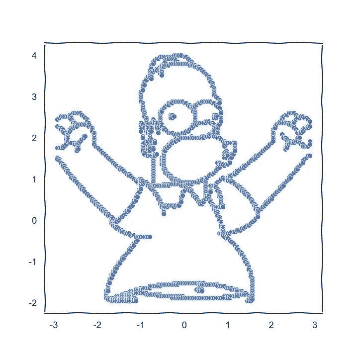
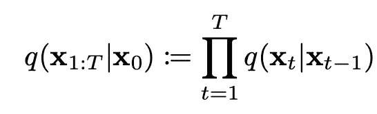
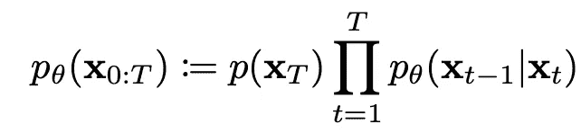
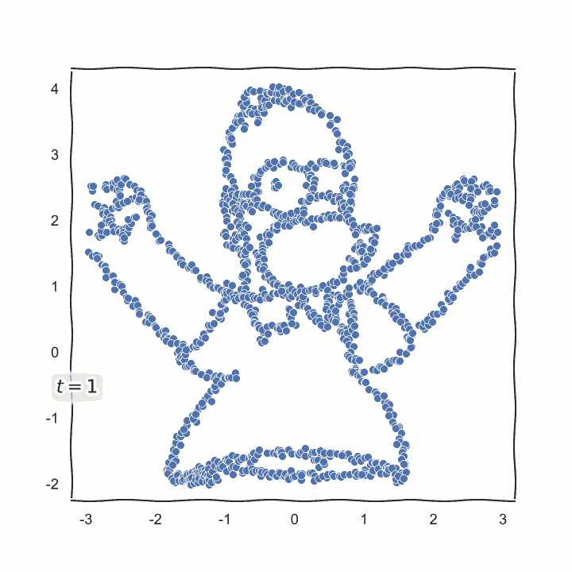
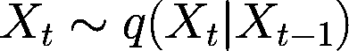
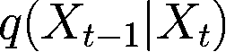

# 一个可以在笔记本电脑上运行的玩具扩散模型

> 原文：<https://medium.com/mlearning-ai/a-toy-diffusion-model-you-can-run-on-your-laptop-20e9e5a83462?source=collection_archive---------0----------------------->

人工智能领域的小众新进展闯入主流媒体，并用深度学习可以实现的惊人事情让外行和从业者眼花缭乱，这似乎变得越来越常见。

最近的一次是 OpenAI 的惊人的 DALLE-2，这种文本到图像的模型能够为你能想象到的几乎任何东西生成图像，因为它可以用文本来描述。

在这篇文章中，我将编写一个玩具模型来代表这个神奇系统的一部分。基于扩散的解码器。我将专注于用 Python 实现它，并尽量少用数学符号。这篇文章旨在帮助人们理解这个模型的技术方面，而不是它背后令人惊奇的数学。

## 如果你只是想要这个模型的参考资料和数学解释，我在下一节提供了链接。如果你只是想看看和运行代码，直接去我的[回购](https://github.com/ThiagoLira/ToyDiffusion)。

"Nietzsche and Jesus do a rap battle in the middle of a crowd" (Image generated with Dalle-2 by me)

即使在现场工作，有时我也不得不通过自己编写某个版本的代码来说服自己某事是真的，尽管非常简单。这就是了。

有许多[极好的资源可以学习 Dalle-2 是如何工作的。在这篇文章中，我将重点介绍 Dalle-2 所基于的一种叫做**扩散模型**的数学。这是一个学习辨别添加到数据中的噪声(如图像的哪一部分模糊)的模型，并且令人惊讶的是，可以学习消除这种噪声！更令人惊讶的是，我们可以使用一个经过训练的扩散模型来消除图像中的噪声，通过一次又一次地消除噪声中的噪声，并在图像外观的某种嵌入(即数字表示)的指导下，从零开始创建新的图像。同样，这是相当复杂的，我认为其他资源可以比我更好地解释这个从文本创建和嵌入并将其转换为图像嵌入的过程。](https://www.assemblyai.com/blog/how-dall-e-2-actually-works/)

在 DALLE-2 管道上，这部分正好在末端。其中该模型具有图像嵌入，并使用基于扩散的模型来引导纯噪声逐步变成表示该嵌入的图像。

# 什么**是* *扩散模型？

这篇文章的其余部分将基于最初提出的扩散模型，由[这个作品](https://arxiv.org/abs/1503.03585)完成。以及本次[其他工作](https://arxiv.org/abs/2006.11239)提出的培养目标的改进。如果你想深入了解这个模型背后的数学原理，请观看[这些](https://www.youtube.com/watch?v=fbLgFrlTnGU) [精彩的](https://www.youtube.com/watch?v=344w5h24-h8)视频。

# 我们的目标:让一个模型学会从纯噪声开始制作一个看起来像荷马辛普森的散点图！

Our initial data.

## 没有太多数学符号的大画面:

整个过程由 2 个步骤组成:

a)我们向数据添加 T 个“步骤”的噪声(例如，将每个点乘以一个随机数)，并训练模型尝试预测您向数据添加了多少个步骤 T，并使用许多许多的 T 进行许多反向传播迭代。我们将有一个时间表，显示我们将在每一步中添加多少随机性，这样我们就可以直接从数据中计算出每一步。尽管我们使用的是随机数，但被 50 阶噪声破坏的数据看起来与被相同数量噪声破坏的其他数据相似。

我们选择您可以添加到数据中的最大噪声级数。通常在 1000 左右(我们称这个数为 N)。在这一点上，我们有一些很好的数学性质，因为我们可以假设，我们把我们的数据变成了与纯噪声无法区分的东西。

我们称之为**前进过程**。

b)在模型擅长任务 a)后，你可以给模型纯噪声，让它从中去除 N 步噪声。理想情况下，模型将获得纯噪声，看起来像您在第一个任务中使用的原始数据。

我们称之为**逆向过程。**

## 一个数学插曲使事情稍微形式化:

(如果你愿意，你可以跳过这一部分，我会在下面的部分尽量少用数学符号)

正向和反向过程是马尔可夫链。

The Forward Process

给定初始数据 X_0，我们通过应用多个高斯转换来产生 X_T(噪声)(下一节将详细介绍)。每次跃迁都会在 X_t 上施加一点高斯噪声，以生成 X_t+1。

相反的过程就没那么容易了。我们有一些分布 p_theta 会做相反的事情。我们将尝试寻找参数(θ)使这个函数逐渐从纯噪声 X_T 中恢复出数据 X_0。

The Reverse Process

每个 *p* 和 *q* 将被定义为多元高斯函数。这是下一节的主题。我们的目标是学习逆向过程分配的方法 *p* ！

# 前进的过程:

我们首先需要一个函数将噪声添加到初始数据分布中。这基本上意味着我们将得到所有的数据点，并以一个随机数摆动每一个数据点。这在 Python 中是什么意思？让我们先熟悉一个多元正态分布。如果您已经知道这样的发行版是如何工作的，请跳过下面几段。

让我们从平面上的一个点开始。

假设我们想取一个点，在 2D 平面上随机移动一点。如果该点在坐标(x1，y1)上，我们采样 2 个小随机数𝜀_1 和𝜀_2，我们将该点移动到它的新位置(x1 + 𝜀_1，x2 + 𝜀_2).

多元正态分布就是这样一种分布，它可以对我们拥有的数据点进行尽可能多的𝜀's 采样。我们将使用我们的起点作为分布的平均值，这意味着(哈哈)对于每个点(x_n，y_n ),它的新位置将类似于(x_n + 𝜀_1，y_n + 𝜀_2).)𝜀来自哪里？从我们的协方差矩阵，这是一个有趣的名字，到一个大矩阵，它对我们分布中的每个点都有一个方差，即每个𝜀可能有多大或多小。

第一个函数将获取我们的数据，对每个点的𝜀's 进行采样，并返回被这些𝜀's.破坏的结果数据

这个 *list_bar_alphas* 自变量就是我们在扩散的每一步 T 都会添加的噪声量，这是这个函数的另一个自变量。对于一些 *t* ，我们将从*list _ bar _ alpha，*中得到相应的 *alpha* ，并使用这个 *alpha* 来计算我们的噪声*的方差。*对于扩散的每一步，我们预先固定添加到模型中的噪声参数！这些值来自原始论文。

现在来看一些实际数据。假设我们想要扩散荷马·辛普森的散点图。如果我们对一些步数 *t* 应用扩散，这就是图的样子。

See how the more steps of noise we add to poor Homer, the more he looks like pure noise.

## 计算后验分布:

这部分在数学细节上会变得有点技术性。代码很容易阅读，但理论上确实有很多东西。我们有一个破坏数据的正向过程，在数学符号中是这样的:

For every step t we will sample a more corrupted sample from this distribution. This is a Markov Chain generating new corrupted X’s from the original data X_0

这种分布是**固定的**。对于任何一个 *t* ，我们可以从下式精确地知道样本 X_t+1 的分布。但是记住我写的，我们将尝试每一步来预测添加了多少噪声，对吗？所以，和我一起呆在这里，我们要预测**意味着**的**T21*q*的后验分布。换句话说，**中心**，或者我们所拥有的原始数据，就像我们是否在后退并去除噪声。**

Pay attention to the indexes! Our model will try to predict the mean of this distribution.

这是**而不是**相反的过程！如果 *q* 是我们参数化的破坏数据的分布， *p* 将是恢复数据的分布，我们的模型！我之前链接的论文中的聪明的数学见解是，我们可以假设我们的反向分布将具有正向过程的相同函数形式。我们把它定义为简单！因此，对于我们的模型来说，在训练期间尝试匹配 *q* 的后验概率输出的函数就足够了。这正是培训循环中正在发生的事情:

The training loop, reproduced here in it's entirety.

重要的是要明白，我们的前向过程的后验分布 q(x_t-1 | x_t)是**已知的**！我们只需要一些代数运算来计算它。肯定不知道的是另一个分布 *p* ，反向过程。破坏数据是很容易的，从纯粹的噪音中恢复数据一点也不容易。这里我不会试图形式化的见解是，逆向过程的函数形式紧密遵循 q(x_t-1 | x_t)，我们可以很容易地计算它。所以我们可以假设它也是高斯分布的。(*)

(*)对于你们当中热衷于数学的人来说，本文确实使用了 KL 散度项来将反向过程分布 *p* 近似为已知的正向过程分布 *q.* ，并且通过一些巧妙的操作，我们从中获得了一个简单的损失目标。

# 相反的过程:

现在是有趣的部分:我们训练了一个模型，它非常善于从已知的高斯分布产生的损坏样本中识别噪声。让我们给它一些随机噪声，看看它是否能在其中找到类似我们训练数据的东西！我们将运行一个循环，从随机噪声( *t* =N)开始，在步骤 *t* -1 计算数据，直到我们应该得到原始数据( *t* =0)。

这是在这个循环中完成的函数，我们只是从一个多元正态分布中采样，用模型预测的过程的下一个平均值，就像我在上一节解释的那样。我们的模型给出的只是平均值，也就是我们定义的与正向过程完全相同的方差！

# 结果:

所以从纯高斯噪声的 2D 散点图开始，我制作了模型学习的反向扩散过程的动画！这是这个过程的完整的 GIF 图片。不错吧？

The model finds something similar to the original data in pure Gaussian noise!

Our initial data.

如果你想玩代码，就克隆我的 [repo](https://github.com/ThiagoLira/ToyDiffusion) ，运行笔记本 RunDiffusion.ipynb 上的每一个单元格！

 [## Mlearning.ai 提交建议

### 如何成为 Mlearning.ai 上的作家

medium.com](/mlearning-ai/mlearning-ai-submission-suggestions-b51e2b130bfb)