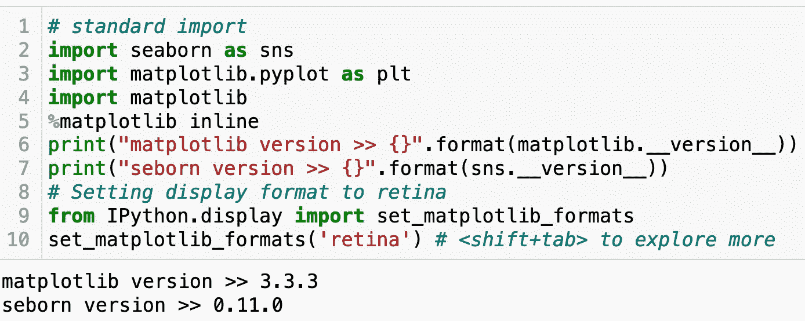
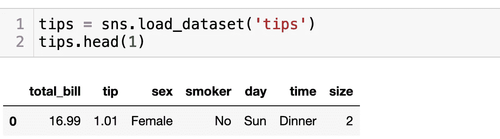
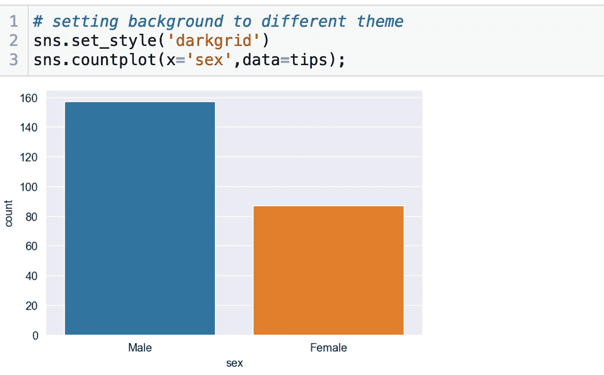
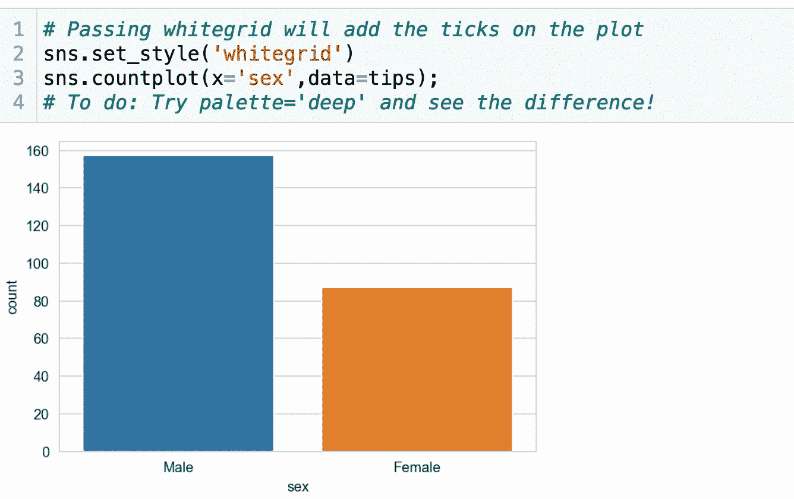
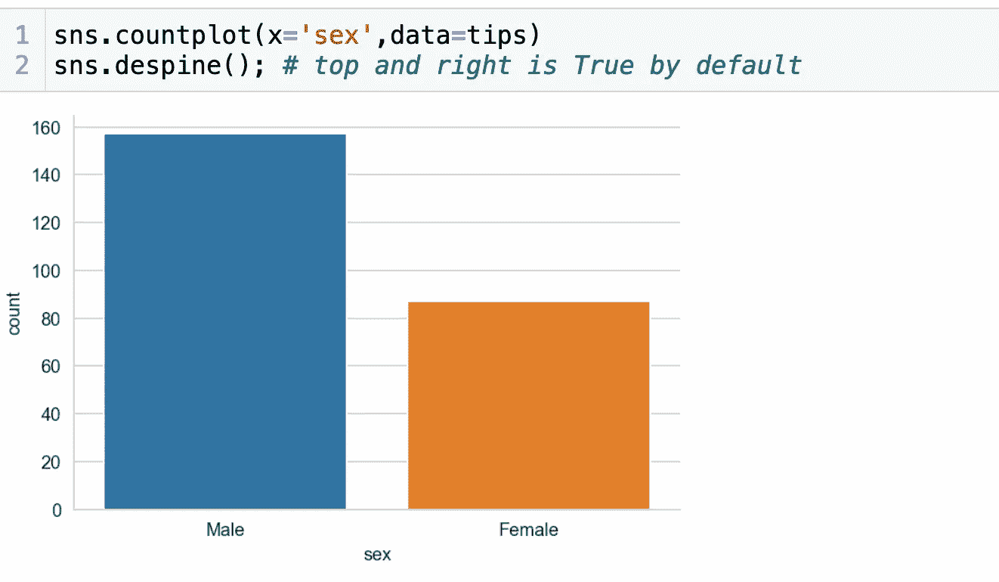
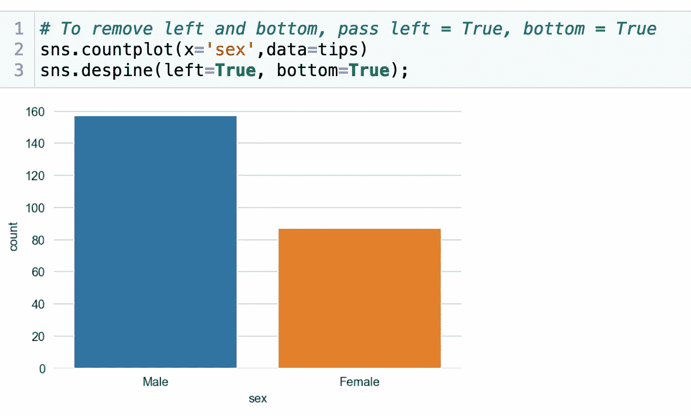
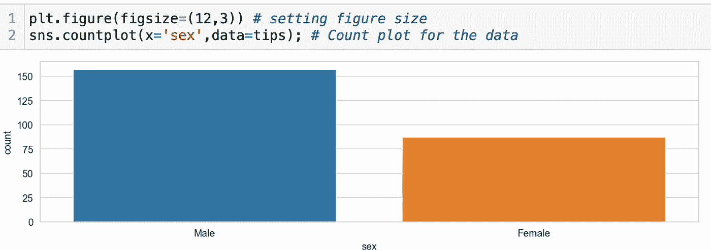
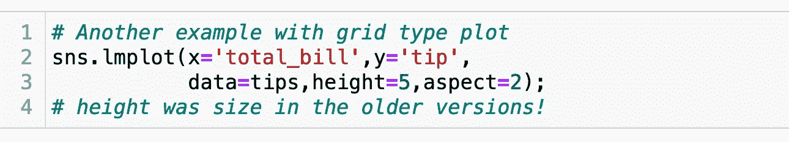
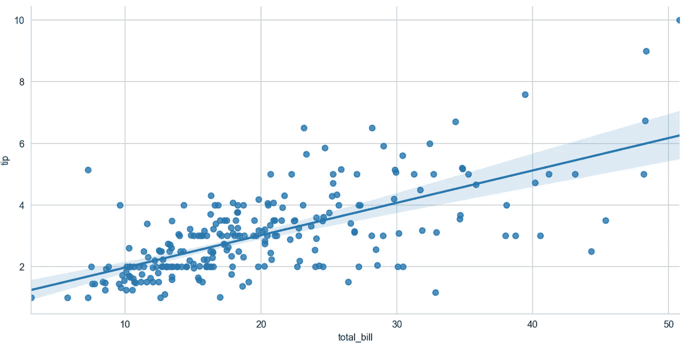
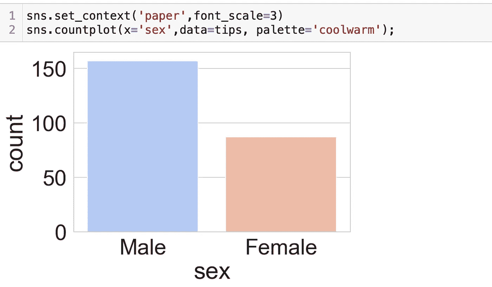

# A20: Seaborn(第五部分):统计数据可视化(控制图形美学)

> 原文：<https://medium.com/mlearning-ai/a20-seaborn-part-5-statistical-data-visualization-controlling-figure-aesthetics-5e52928faa23?source=collection_archive---------6----------------------->

> *本文是**[***数据科学从无到有——我能我能***](https://leanpub.com/u/junaidsqazi)**系列丛书的一篇讲义。(* [*)今天点击这里领取你的文案*](https://leanpub.com/u/junaidsqazi) *！)***
> 
> **[*点击此处查看之前的文章/讲座“A19: Seaborn (Part-4):统计数据可视化(矩阵和回归图)”。*](https://junaidsqazi.medium.com/a19-seaborn-part-4-statistical-data-visualization-matrix-and-regression-plots-7a2aa23d00f1)**

****✅一个建议:** *打开一个新的 jupyter 笔记本，边打代码边读这篇文章，边做边学，是的，“* ***请阅读评论，它们很有用…..!"*****

> **[💐点击这里关注我的新内容💐](https://junaidsqazi.medium.com)**

**是时候谈谈数据展示、报告写作和讲故事中最重要的一个方面了，那就是图形美学。**如果早期阶段的数据科学家普遍忽略了这一非常重要的方面，最终可能会显著降低您所有努力的影响。**时刻关注身材审美！**

**虽然，在之前的讲座中，我们已经看到了(至少几次)如何在 seaborn 中控制图形美学，但现在让我们正式回顾一下。**

********

# **Seaborn 人物造型**

## **`set_style()`**

**我们可以使用`set_style()`设置特定的样式。`<shift+tab>`对于 doc string
你可以尝试不同的 seaborn 的`themes: darkgrid, whitegrid, dark, white, and/or ticks`。它们分别适合不同的应用和个人偏好。**

********

**Setting background to different theme**

****

**Passing whitegrid will add the ticks on the plot**

# **移除轴棘**

## **`despine()`**

**我们可以使用`**despine()**`方法移除脊椎。
默认:
`top=True, right=True, left=False, bottom=False`**

********

**To remove left and bottom spines, pass left = True, bottom = True**

# **图形大小和外观**

**我们可以简单地使用 matplotlib 的`***plt.figure(figsize=(width,height)***`来改变 seaborn 的大部分地块的大小。**

**我们可以通过传入参数:`size`和`aspect`来控制大多数 seaborn 网格图的大小和纵横比。例如:**

**☚**须知:** *在下面的第 2 行代码中，当* `*seaborn*` *调用* `*matplotlib*` *时，它实际上将图形尺寸设置为给定尺寸为* `*seaborn*` *。所以，我们其实可以用我们的* `*matplotlib*` *知识结合* `*seaborn*` *来设定图* `*size*` *和* `*aspect*` *的比例。***

************

# **缩放绘图元素**

## **`set_context()`**

**`set_context()`允许我们覆盖默认参数:
参数上下文:`dict, None, or one of {paper, notebook, talk, poster}`，你的演示风格！**

****

**☚*更多关于控制身材美学的内容，查看 seaborn 官方文档* [*小妞这里*](http://seaborn.pydata.org/tutorial/aesthetics.html#aesthetics-tutorial) *。* ☚*更多调色板选项，探索* [*matplotlib 颜色贴图*](https://matplotlib.org/2.0.2/examples/color/colormaps_reference.html)**

> **[💐点击这里关注我的新内容💐](https://junaidsqazi.medium.com)**
> 
> *****坚持练习来温习和添加新技能。*****

# **干得好！**

> *****你的鼓掌和分享*** *可以帮助我们接触到正在努力学习这些概念的人。***

**祝你好运！**

> ***见* ***下期讲座*** *关于****A19:……………………。！！!"。*****
> 
> *****注:*** *这个完整的课程，包括视频讲座和 jupyter 笔记本，可以从以下链接获得:***

*   **[关于 leanpub 的书籍](https://leanpub.com/u/junaidsqazi)**
*   **[*【SkillShare link(新用户两个月免费)*](https://www.skillshare.com/r/user/junaidqazi)**
*   **[在 YouTube 上免费](https://www.youtube.com/channel/UCtIt7JGL70p7nq-EetIrtwQ)**
*   **科学院**

**[***关于朱奈德·卡齐博士:***](https://www.linkedin.com/in/jqazi/)**

> **[***Junaid Qazi***](https://www.linkedin.com/in/jqazi/)*博士是一名学科专家，数据科学&机器学习顾问，团队建设者。他是职业发展蔻驰、导师、作家和特邀演讲人。* ***他可以通过***[***LinkedIn***](https://www.linkedin.com/in/jqazi/)***获得咨询项目和/或职业发展培训。*****

****** [## Mlearning.ai 提交建议

### 如何成为 Mlearning.ai 上的作家

medium.com](/mlearning-ai/mlearning-ai-submission-suggestions-b51e2b130bfb)**