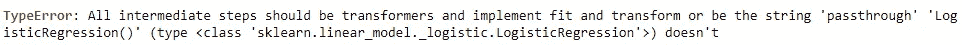
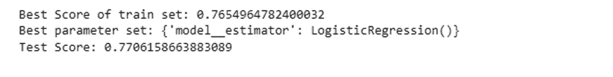
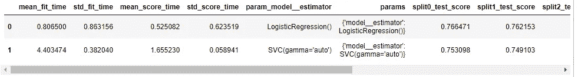

# 添加自定义转换&通过机器学习管道找到最佳的机器学习模型

> 原文：<https://medium.com/mlearning-ai/add-custom-transformation-find-the-best-machine-learning-model-3d1c40a97639?source=collection_archive---------7----------------------->


Photo by [Possessed Photography](https://unsplash.com/@possessedphotography?utm_source=unsplash&utm_medium=referral&utm_content=creditCopyText) on [Unsplash](https://unsplash.com/s/photos/robot-finger?utm_source=unsplash&utm_medium=referral&utm_content=creditCopyText)

搜索最佳的机器学习模型可能是一项耗时的任务。管道可以使这项任务更加方便，这样您就可以缩短模型训练和评估循环。

# 📖先决条件

要理解这篇文章，你应该知道管道和网格搜索的概念。你可以阅读下面两篇文章的内容。如果你也熟悉 Python 中的类，那就太好了。

**基本管线**

[](/mlearning-ai/neat-data-preprocessing-with-pipeline-and-columntransformer-2a0468865b6b) [## 使用管道和 ColumnTransformer 进行整洁的数据预处理

### 创建一个管道，您可以在其中输入任何数据，这些数据将在训练机器学习之前进行转换…

medium.com](/mlearning-ai/neat-data-preprocessing-with-pipeline-and-columntransformer-2a0468865b6b) 

**网格搜索**

[](/mlearning-ai/find-the-best-data-preparation-method-and-model-using-a-pipeline-9677f68c35e9) [## 使用管道找到最佳的数据准备方法和模型

### 管道不仅使你的代码更整洁，它还可以帮助超参数调优和数据准备…

medium.com](/mlearning-ai/find-the-best-data-preparation-method-and-model-using-a-pipeline-9677f68c35e9) 

# 📔本文内容

*   向机器学习管道添加自定义转换
*   找到最好的机器学习模型

# 🔨向机器学习管道添加自定义转换

除了标准的数据转换函数(如 sklearn 的 MinMaxScaler)之外，您还可以为您的数据创建转换。

在这个例子中，我将创建一个类方法，使用映射将分类特征转换成数字特征，从而对顺序特征进行编码。
(简单的词:从文字变成数字)

这是回归模型训练前所需的数据处理。

```
from sklearn.base import TransformerMixinclass Encode(TransformerMixin):

    def __init__(self):
        # Making Dictionaries of ordinal features
        self.rel_exp_map = {
            'Has relevent experience': 1,
            'No relevent experience': 0}def fit(self, df, y = None):
        return self

    def transform(self, df, y = None):
        df_pre = df.copy()
        df_pre.loc[:,'rel_exp'] = df_pre['rel_exp']\
                               .map(self.rel_exp_map)
        return df_pre
```

**代码解释:**

*   创建一个名为 Encode 的类，它继承了 sklearn 中名为 TransformerMixin 的基类。
*   在该类中，有 3 个必要的方法:__init__、fit 和 transform
*   创建管道时将调用 **__init__** 。这是我们在类中定义变量的地方。我创建了一个变量“rel_exp_map ”,这是一个将类别映射到数字的字典。
*   **装配**将在装配管道时被调用。这个案子我留了空白。
*   使用管道转换时，将调用**转换**。这个方法需要一个 dataframe (df)作为输入，而 y 默认设置为 None(它被强制使用 y 参数，但我无论如何也不会使用它)。
*   在**转换**中，数据帧列‘rel _ exp’将与 rel_exp_map 进行映射。

**注意:** \只是将代码继续到新的一行。

接下来，添加这个编码类作为管道步骤。

```
pipeline = Pipeline(steps=[
    ('Encode', Encode()),
    ('col_trans', col_trans),
    ('model', LogisticRegression())
])
```

然后，您可以像普通管道一样拟合、转换或网格化搜索管道。

# 🤖找到最好的机器学习模型

我想到的第一个解决方案是在管道中添加许多模型步骤，并通过在网格搜索中将步骤值更改为“通过”来跳过一个步骤，就像在寻找最佳数据准备方法时一样(在上面的网格搜索文章链接中阅读更多信息)。

```
temp_pipeline = Pipeline(steps=[
    ('model1', LogisticRegression()),
    ('model2',SVC(gamma='auto'))
])
```

但是，我看到了这样的错误。



> 管道中不能有两个分类模型！！

这个问题的解决方案是创建一个定制的转换，它接收一个模型作为输入，并通过网格搜索来找到最佳的模型。

## **1。创建一个接收模型作为输入的类**

```
from sklearn.base import BaseEstimator
from sklearn.linear_model import LogisticRegression
from sklearn.svm import SVCclass ClfSwitcher(BaseEstimator):def __init__(self, estimator = LogisticRegression()):
        self.estimator = estimatordef fit(self, X, y=None, **kwargs):
        self.estimator.fit(X, y)
        return selfdef predict(self, X, y=None):
        return self.estimator.predict(X)def predict_proba(self, X):
        return self.estimator.predict_proba(X)def score(self, X, y):
        return self.estimator.score(X, y)
```

**代码解释:**

*   创建一个名为 ClfSwitcher 的类，它继承了 sklearn 中名为 BaseEstimator 的基类。
*   在类中，有 5 个必要的方法，如分类模型:_init__、fit、predict、predict_proba 和 score
*   **__init__** 接收评估者(模型)作为输入。我将 LogisticRegression()声明为默认模型。
*   **拟合**用于模型拟合。没有返回值。
*   其他方法是模拟模型。它会像模型本身一样返回结果。

## **2。将 1 号中的类添加到管道**

```
clf_pipeline = Pipeline(steps=[
    ('Encode', Encode()),
    ('col_trans', col_trans),
    ('model', ClfSwitcher())
])
```

## **3。网格搜索**

在网格搜索参数中有两种情况使用不同的分类模型，包括逻辑回归和支持向量机。

```
from sklearn.model_selection import GridSearchCVgrid_params = [
    {'model__estimator': [LogisticRegression()]},
    {'model__estimator': [SVC(gamma='auto')]}
]gs = GridSearchCV(clf_pipeline, grid_params, scoring='accuracy')
gs.fit(X_train, y_train)print("Best Score of train set: "+str(gs.best_score_))
print("Best parameter set: "+str(gs.best_params_))
print("Test Score: "+str(gs.score(X_test,y_test)))
```



Grid Search Result

结果表明，逻辑回归的结果最好。

## **4。将网格搜索结果打印成表格**

```
pd.DataFrame(gs.cv_results_)
```



Grid Search Result Table

逻辑回归比 SVC 的精度稍高，但速度更快(拟合时间更短)

另外，你也可以为每个模型应用不同的数据准备方法。

# 结论

在本文中，您将学习如何通过从 TransformerMixin 创建一个类来将自定义转换添加到机器学习管道中。然后，您将学习应用这个自定义转换来执行网格搜索，以获得最佳分类模型。

如果您觉得这篇文章有用，请关注我以获取更多数据科学文章。如果你有任何反馈，请在下面评论。

## 参考

[](https://stackoverflow.com/questions/50285973/pipeline-multiple-classifiers) [## 管道:多分类器？

### 这里有一个简单的方法来优化任何分类器和每个分类器的任何参数设置。来自…

stackoverflow.com](https://stackoverflow.com/questions/50285973/pipeline-multiple-classifiers) [](/mlearning-ai/mlearning-ai-submission-suggestions-b51e2b130bfb) [## Mlearning.ai 提交建议

### 如何成为 Mlearning.ai 上的作家

medium.com](/mlearning-ai/mlearning-ai-submission-suggestions-b51e2b130bfb)