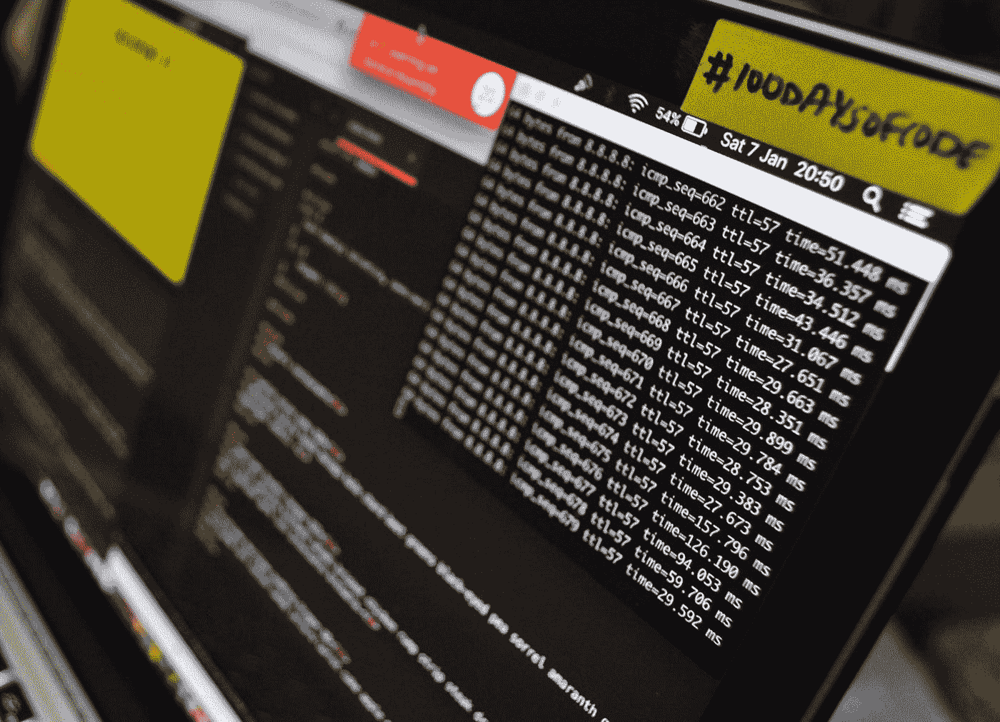

# 对抗性机器学习——对抗攻击者

> 原文：<https://medium.com/mlearning-ai/adversarial-machine-learning-fight-against-attackers-e38d5f0917f6?source=collection_archive---------8----------------------->

在这篇文章中，你将概述什么是**对抗性机器学习**以及如何在具体案例中实现它。

Photo by [Lewis Kang'ethe Ngugi](https://unsplash.com/@ngeshlew?utm_source=medium&utm_medium=referral) on [Unsplash](https://unsplash.com?utm_source=medium&utm_medium=referral)

应用机器学习模型的现实世界案例必须应对它们用于学习的数据的变化。事实上，模型从训练数据集**中学习的规则随着时间的推移**会有所不同。此训练数据集必须更新以保持相关性，并允许模型在其预测工作中有效。

对抗性机器学习就是在这种背景下出现的。随着每天都有新的创新出现，迫使公司专注于它们与市场的相关性，机器学习模型面临着类似的事情，因为它们最有价值的支持，**使它们产生的数据**，是**不稳定**和**变化**。

然而，在机器学习中，这种使模型过时的数据转换可能不是自然或偶然的，而是来自我们所谓的**攻击者**。这个想法是，人类知道面对一个有缺陷的模型，将通过转换数据集或简单地通过理解它正在做什么来最终摆脱它来找到缺陷。

**对抗性机器学习**的概念可以看做:

> 一个最小最大博弈，其中攻击者的目标是最大化其欺骗分类器的可能性，而分类器的目标是最小化其在这种最坏情况下的风险。

在任何矛盾的情况下，**防守方**面对试图欺骗模型的**进攻方**。

最后，我们可以通过其目标来描述对抗性 ML，其目标是:

> *正式调查在敌对环境中使用机器学习技术引入的问题，在这种环境中，聪明的对手试图利用这些技术中的弱点。*

现在，让我们举例说明在不同类型的问题中…

# 对抗性机器学习的例子

在进入攻击者和防御者的现有方法之前，让我们看看机器学习的主要子领域中的敌对上下文是什么样的:监督、非监督和强化。

## 在监督学习问题中

**监督学习问题**是那些利用标签的帮助，在这些标签上进行模型化训练的问题。这些模型由与每个数据样本相关联的标签来支持，这就是为什么我们称它们为受监督的。主要有两种，其中最常见的一种:**回归**问题和**分类**。如果你对这些主题感兴趣，我为每一个主题写了一篇文章[这里](/mlearning-ai/the-well-known-regression-what-is-it-6dbe5e0b2cd1)和[这里](/mlearning-ai/understand-classification-problems-in-less-than-5-minutes-712244d259c8)。

在**回归**中，当预测的目标可以被控制或操纵时，会出现敌对的环境。例如，如果在短时间内大量买入或卖出，股票的价格就会发生变化。这个过程可以导致一个模型，基于股票价格演变的某些特征，来决定购买或出售所讨论的股票。然而，模型和它实现的动作都被欺骗了，因为攻击者可以预测这次购买或销售。这显然是一个**对抗性的机器学习问题**，因为**攻击者会识别出一个模型是如何工作的，并通过操纵股票市场**来触发它。

在**分类**问题中，这样的上下文是众所周知的，例如，**垃圾邮件**或**恶意软件** **检测**，其中的想法是通过查看使用的单词(垃圾邮件)或程序的行为(恶意软件)来识别新的攻击。在这两种情况下，我们面对的是一个面对攻击者的模型。**信用卡欺诈检测**是另一种类型的分类对抗示例，其中一些个人制造漏洞，试图不被训练有素的模型检测到。

## 在无监督学习问题中

与有监督的问题相比，**无监督的**问题不使用标签来学习模型，而是旨在识别模式或对数据样本进行分组，以便回答问题或获得分析元素。

我们发现像**群集** **恶意软件**这样的问题，例如能够发现一个程序是否接近任何类别的恶意软件。**异常** **检测**是另一个无监督对抗环境的例子，其想法是有一个系统来检查行为是正常的还是有分歧的。这可以应用于各种领域。

## 在强化学习问题中

**强化** **学习**是一个机器学习子领域，其思想是拥有一个通过犯错来学习的模型。事实上，这是一个有奖励和约束的博弈情况，允许模型(也称为代理)知道什么是好的或坏的，以便解决问题。它从行动中获得的回报越多，它就越能推进解决方案并学到更多东西。因此，它将学习人类无法识别的模式，这就是强化学习的全部力量。

强化学习问题是对抗性机器学习环境的明显例子，因为该模型面临惩罚。更准确地说， **Self** **Driving** 问题是模型针对攻击者的情况的很好的例子，因为汽车中的模型看到的任何未被识别的元素都可能与攻击相关联。在这些问题中，试图预测这种不可预测的情况是防御方必须实施的防御策略。

让我们深入具体问题，看看如何从攻击者和防御者两方面来描述对抗性问题…

# 进攻与防守策略

攻击策略是何时以及如何开发的？防御者如何反击这些攻击？

## 攻击策略

在文献中，不同的策略通过它们的维度来区分。其中一些攻击的特征是攻击模型的时间，另一些攻击的特征是攻击目标系统的信息，最后，还有一些攻击的目的是不同的。

1.  **计时** **区别**:攻击计数的时刻。我们从本质上根据对算法的攻击的时间来区分对模型的**攻击和对算法**的**攻击。事实上，对模型的攻击也被称为对决策时间的**攻击**，因为这是模型实际进行预测的时刻:例如，预测电子邮件是否是垃圾邮件的垃圾邮件检测器在接收电子邮件时起作用。大多数情况下，这些攻击也被称为**规避攻击**。
    换句话说，**对算法的攻击**是对训练数据的攻击，因此是在模型被训练之前进行的。因此，学习被破坏，并且最终模型结合了坏的模式(*训练数据的对抗性破坏*)。**投毒攻击**或**标签翻转** **攻击**都是攻击算法的例子。**
2.  **信息** **区别**:攻击者所拥有的关于其目标模型/算法的信息。**白盒攻击**与**黑盒** **黑盒** **攻击**并行。第一组代表完全了解模型(特征、参数……)的攻击，而第二组代表几乎没有信息的攻击。
3.  **目标区分**:攻击的目的可以根据目标的不同而不同。的确，我们谈论的是**有针对性的**和**无针对性的** **攻击**。一方面，攻击者的目标是改变模型本身的预测。他们知道新的输出，例如，如果一个应用程序正在对汽车图像进行分类，攻击将改变图像，使其被分类到特定的汽车。对于无目标攻击，对图像执行的扰动将使得模型是错误的，但是没有有意的标签。

## 防御策略

对所有类型模型的大量攻击的到来迫使防御措施的发展。这是一项非常困难的任务，因为攻击者有各种各样的可能性。以下是我们可以在文献中找到的一些防御策略:

*   **鲁棒性**:给模型方程增加约束，使得学习变得不那么复杂，最终由领域内的专家指导。这种防御面临着会改变模型学习内容的中毒攻击。这些约束(*正则化*)提供了一种平滑效果，防止攻击者利用复杂的模式。
*   **检测攻击**:顾名思义，这个想法是建立测试集来验证模型的分类，并在异常时发出警告。
*   **虚假信息**:向攻击者发送嘈杂的信息以制造混乱，阻止他们理解分类器的实际工作原理。我们可以讨论蜜罐，它可以检测攻击者并为防御方提供优势。
*   **随机化**:将目标分类器的决策边界随机化，这样攻击者每次运行流程时都必须理解模型。

# 结论

机器学习模型的真实世界实现是**许多攻击的目标**只要模型有所了解。这创造了对抗性机器学习的环境，其中攻击者试图操纵和破坏 ML 系统的功能。

这在许多领域都有发现，例如异常检测、自动驾驶系统、欺诈检测等等。由于攻击策略的想象力丰富，防守方不得不努力保持其模式不变。

感谢你阅读这篇文章，我希望你喜欢它，并发现什么是对抗性机器学习！如果你对数据科学和机器学习感兴趣，请点击查看我的其他文章[。](https://www.npogeant.com/#articles)

## 资源

 [## [PDF]安全问题:对抗性机器学习的调查|语义学者

### 本文旨在全面介绍对抗性深度学习主题的一系列方面

www.semanticscholar.org](https://www.semanticscholar.org/paper/Security-Matters%3A-A-Survey-on-Adversarial-Machine-Li-Zhu/6ede8b02b817a1354b8bde1ab7af07b0ddb02acf)  [## 机器学习能安全吗？2006 年美国计算机学会信息、计算机…

### 机器学习系统在处理各种应用程序中不断变化的输入方面提供了无与伦比的灵活性，例如…

dl.acm.org](https://dl.acm.org/doi/10.1145/1128817.1128824)  [## 对抗性机器学习

### 大型高质量数据集的日益丰富，加上过去几年的重大技术进步…

www.morganclaypool.com](https://www.morganclaypool.com/doi/abs/10.2200/S00861ED1V01Y201806AIM039)  [## Mlearning.ai 提交建议

### 如何成为 Mlearning.ai 上的作家

medium.com](/mlearning-ai/mlearning-ai-submission-suggestions-b51e2b130bfb)