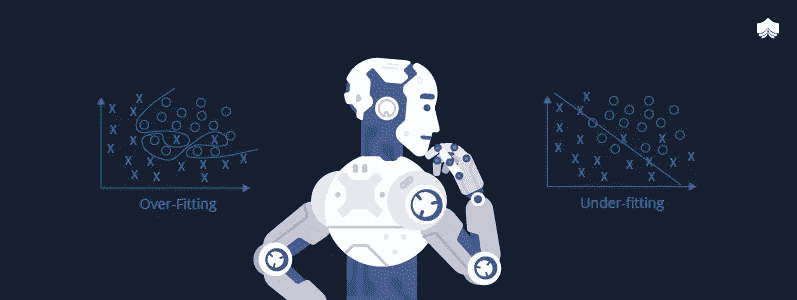
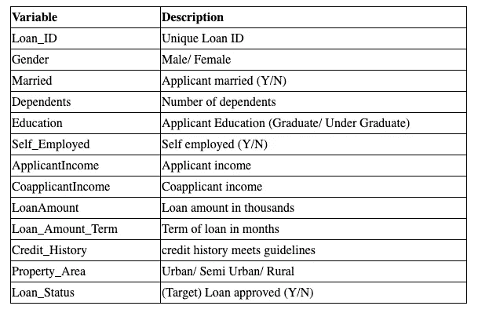
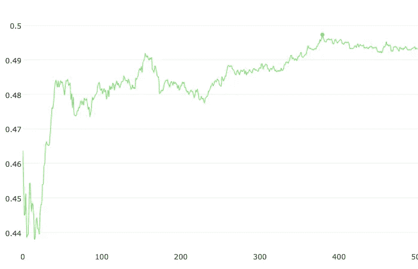
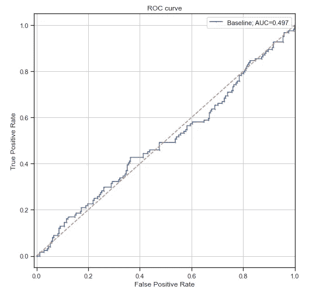
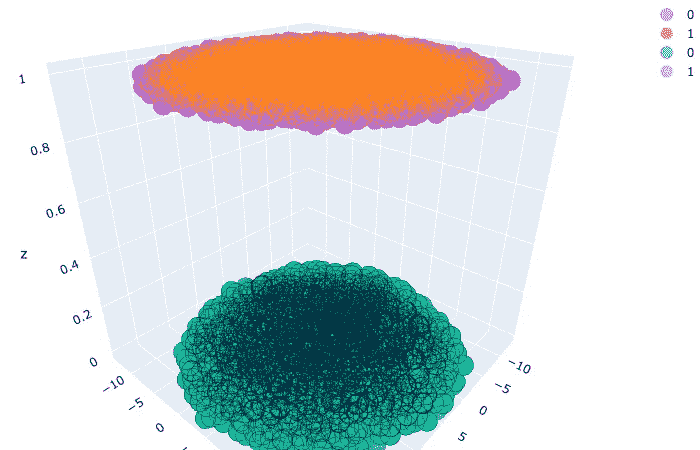
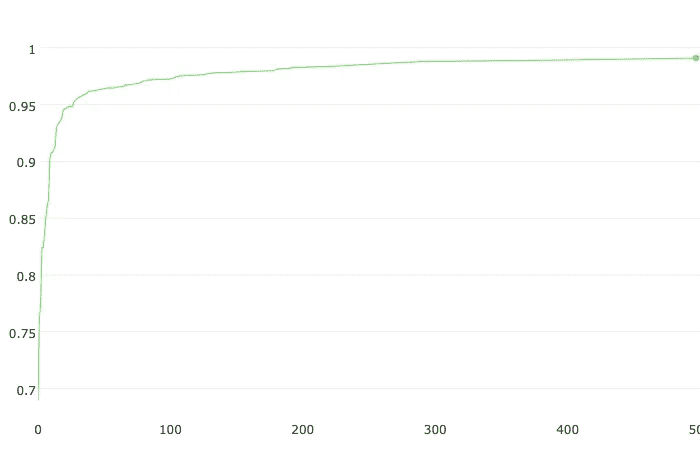
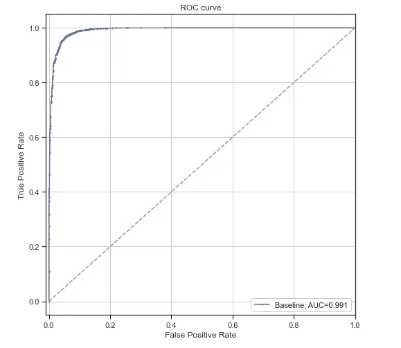

# 对抗验证:对抗过度拟合

> 原文：<https://medium.com/mlearning-ai/adversarial-validation-battling-overfitting-334372b950ba?source=collection_archive---------1----------------------->

# 介绍

在建立模型的过程中，过度拟合会耗费大量精力。当您的训练数据性能远远好于验证时，诊断数据中的过度拟合有时会很明显，但并不总是如此。尤其是在生产环境中，理解失败的根本原因变得非常紧张和耗时。我们尝试了许多技术来确保我们不会过度拟合训练数据，并通过检查交叉验证数据的模型性能来很好地进行归纳。
在高水平上过度拟合意味着我们的模型从训练数据中学习特征，这在测试数据上不能很好地概括。模型过度拟合数据有很多原因。在监督学习中，**过度拟合**发生在我们的模型捕捉到数据中的噪声和潜在模式时，或者可能它没有从训练和测试场景中获得充分的变化。
但是考虑这样一个场景，您有来自不同时期的测试数据，其中许多模式已经改变。在信用卡欺诈检测中，欺诈者可能已经完全改变了他们的欺诈行为模式。在价格预测用例中，市场可能已经改变。从长远来看，当您构建模型时，这些都是非常有效的因素。

考虑这种情况:训练和测试示例来自相同的分布，因此验证误差应该给出测试误差的良好估计，并且分类器应该很好地推广到看不见的测试示例。

训练示例不同于测试示例的问题在于，验证对于比较模型没有任何好处。这是因为验证示例源自训练集。因此，我们的交叉验证分数可能会显示模型的稳健性，这将是一种错觉。

# **解决方案**

Photo by [Olav Ahrens Røtne](https://unsplash.com/@olav_ahrens?utm_source=medium&utm_medium=referral) on [Unsplash](https://unsplash.com?utm_source=medium&utm_medium=referral)

解决方案是**对抗验证**。这是一个奇特的术语，在 Kaggle 竞赛中非常流行，但它是一种相当简单的技术，可以避免过度拟合，更重要的是了解数据集中的哪些变量导致了这个问题。

**什么是对抗性验证？**

**对抗性验证**，受 FastML 启发:**对抗性验证**。总的想法是根据特征分布检查训练和测试之间的相似程度:如果它们难以区分，则分布可能是相似的，并且通常的**验证**技术应该起作用。情况似乎并非如此，所以我们可以怀疑他们完全不同。这种直觉可以通过组合训练和测试集、分配 0/1 标签(0-训练，1-测试)以及评估二进制分类任务来量化。对于对抗性验证，我们希望学习一个模型来预测哪些行在训练数据集中，哪些行在测试集中。因此，我们创建了一个新的目标列，其中测试样本被标记为`1`，训练样本被标记为`0.
Note: The Performance of this model will be indicator of how big the problem is.`

## 案例 1:贷款预测数据集

在这种情况下，我们以来自 [Analytics Vidhya 的贷款预测数据集为例。](https://datahack.analyticsvidhya.com/contest/practice-problem-loan-prediction-iii/)数据集是关于预测梦想住房金融公司的贷款资格。

Data Set Description

我们将从 Train 和 Test 数据框架中删除 ID 列和 Loan Status 列，并将它们连接起来，创建一个主数据框架，并再添加一列“dataset_label”。

UMAP plot for Master DataFrame

我试图通过 UMAP 图来查看训练集和测试集的数据分布。从图中可以清楚地看出，训练集和测试集来自相似的分布。因此，理想情况下，模型很难从主数据中区分训练集和测试集。

从我们创建的主数据中创建对抗性验证数据。

Create Adversarial Data Set for Classification

Create Pool Data For CatBoost Classifier

Train the Catboost Classifier for Master Data

AUC curve for CatBoost Classifier (0.49)

PLot function

ROC Curve for Validation Data

上面的 ROC 曲线是针对验证数据集的，并且值接近 50%，这表明很难区分训练集和测试集，并且它们来自相同的分布。

**因此，在这种情况下，我们常用的分层训练验证分割方法应该工作正常，并且在未知测试集上表现同样出色。**

## **案例 2:** 俄罗斯住房市场价格预测

这是一个用于价格预测的 Kaggle 竞争数据集。在这场竞争中，Sberbank 向 Kagglers 提出挑战，要求他们开发使用广泛特征来预测房地产价格的算法。

数据集:[https://www.kaggle.com/c/sberbank-russian-housing-market](https://www.kaggle.com/c/sberbank-russian-housing-market)

我试图绘制针对标签 1/0 准备的用于训练/测试的对抗数据，我们可以清楚地看到它们属于不同的特征空间，因为它们具有显著的差异。因此，可以合理地假设该模型将很容易区分它们，并且与案例 1 相比具有良好的 AUC。

3-D plot for Adversarial Data Set

我们通过结合训练和测试数据集来训练相似的敌对数据集。下面是模型的训练 ROC 曲线。

AUC curve for Adversarial Validation Dataset

从上面 AUC 值为 0.91 的图中，这意味着分类器很容易区分训练样本和测试样本，它们彼此非常不同，这给我们留下了很高的测试数据性能差的机会。正如博客开头所指出的，我们的数据集中可能存在时间或市场因素，这使得来自训练集和测试集的特征分布彼此非常不同。

## 下一步

但是流程不能做的是告诉我们如何修复它。我们仍然需要在这里运用我们的创造力。下一步，我们可以通过查看特征重要性来分析对抗模型。最重要的特征有助于模型区分标签，因此我们可以放弃这些特征(可以与训练性能进行权衡)，并看到 AUC 值下降。这个想法是*你想删除对预测欺诈/价格/贷款违约不重要，但对分离你的训练和测试集很重要的信息*。正如我所说，在开始时，对抗性模型越大越好是个问题。
*在某些情况下，我们会观察到一个依赖于时间的特性，比如软件版本的发布日期可以用* ***“发布后的天数”来代替。***

**希望思路清晰。**

在下一篇文章中，我将展示 Kaggle 数据集的实践经验，直到那时候*继续阅读，继续练习。*