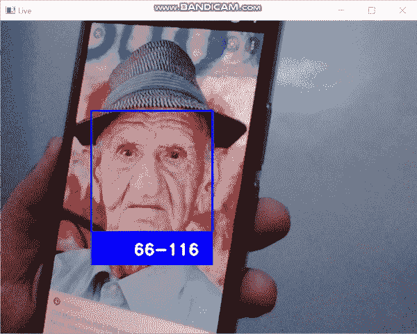
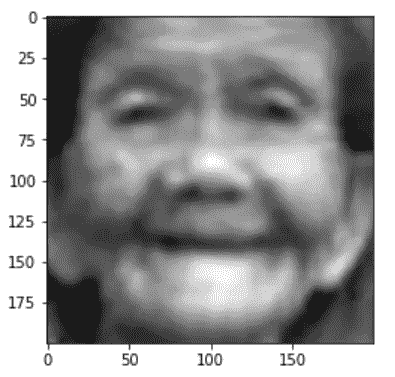
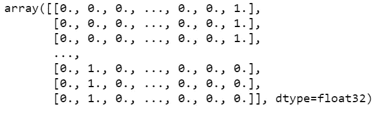
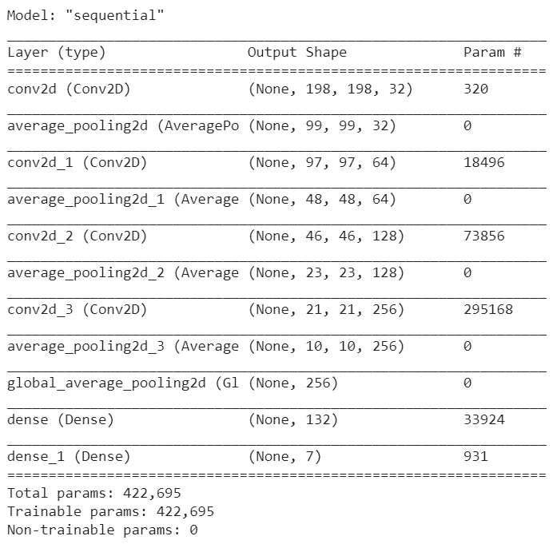
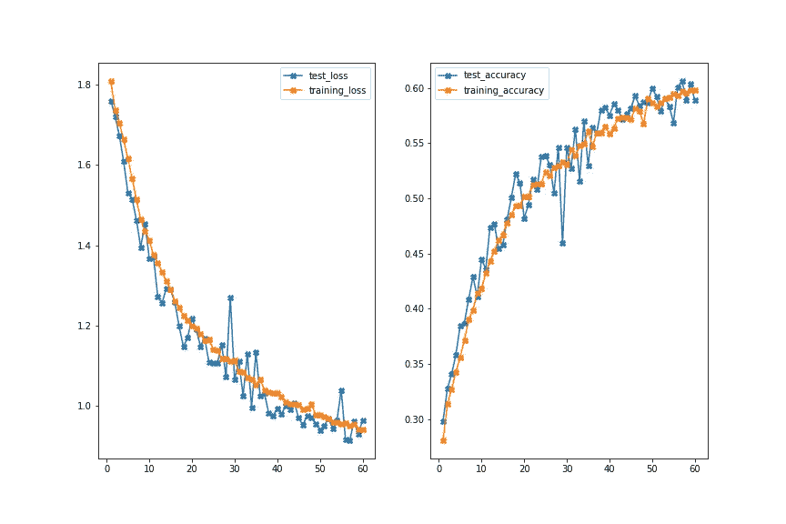

# 年龄检测使用 CNN 与 Keras 与源代码

> 原文：<https://medium.com/mlearning-ai/age-detection-using-cnn-with-keras-with-source-code-easiest-way-easy-implementation-57c107b23bc4?source=collection_archive---------1----------------------->

所以伙计们，在今天的博客中，我们将在 Keras 的帮助下使用 CNN 实现年龄检测。这将是一个非常有趣的项目，所以没有任何进一步的到期。

**在这里阅读带源代码的整篇文章—**[https://machine learning projects . net/age-detection-using-CNN-with-keras/](https://machinelearningprojects.net/age-detection-using-cnn-with-keras/)



# 让我们开始吧…

# 用于训练模型的代码…

## 步骤 1-导入所有必需的库。

```
import cv2
import pandas as pd
import os
import seaborn as sns
import matplotlib.pyplot as plt
from tensorflow.keras.preprocessing.image import ImageDataGenerator
from tensorflow.keras.models import Sequential
from tensorflow.keras.layers import Conv2D, Dense, Dropout, Flatten, AveragePooling2D, GlobalAveragePooling2D
from tensorflow.keras.callbacks import ModelCheckpoint
import numpy as np
from sklearn.model_selection import train_test_split
from keras.utils import np_utils

np.random.seed(42)
tf.random.set_seed(42)
```

## 步骤 2-读取输入图像并提取它们的标签。

```
all_images = os.listdir('combined_faces/')
ranges = ['1-2','3-9','10-20','21-27','28-45','46-65','66-116']

X = []
y = []

l = len(all_images)

for a in range(l):
    X.append(cv2.imread(f'combined_faces/{all_images[a]}',0))
    age = int(all_images[a].split('_')[0])

    if age>=1 and age<=2:
        y.append(0)
    elif age>=3 and age<=9:
        y.append(1)
    elif age>=10 and age<=20:
        y.append(2)
    elif age>=21 and age<=27:
        y.append(3)
    elif age>=28 and age<=45:
        y.append(4)
    elif age>=46 and age<=65:
        y.append(5)
    elif age>=66 and age<=116:
        y.append(6)
    print(str(a)+'/'+str(l))

np.savez_compressed('compressed image data.npz',x=X,y=y)
```

*   在这里，我们以灰度模式读取图像，并将它们存储在 X 数组中。
*   我们将他们的年龄存储在 y 数组中。
*   最后，我们将 X 和 y 数组保存为 [npz 压缩格式](https://numpy.org/doc/stable/reference/generated/numpy.savez_compressed.html)，这样我们就不需要一次又一次地读取图像。

如何加载压缩的 npz 数据…

```
loaded = np.load('compressed image data.npz')

X = loaded['x']
y = loaded['y']
```

## 第三步——想象一幅图像。

```
plt.imshow(X[0],cmap=’gray’)
```



## 步骤 4-一个热编码 y 阵列。

```
y = np_utils.to_categorical(y)
y
```



*   在这里，我们只是使用[NP _ utils . to _ categorial](https://www.tensorflow.org/api_docs/python/tf/keras/utils/to_categorical)对 y 数组进行一次热编码。

## 步骤 5-训练测试使用 CNN 模型分割用于创建年龄检测的数据。

```
X_train, X_test, y_train, y_test = train_test_split(X, y, test_size=0.30, random_state=42)

X_train = np.array(X_train).reshape(-1,200,200,1)
X_test = np.array(X_test).reshape(-1,200,200,1)
```

*   我们正在对这里的数据进行训练测试分割，并以正确的格式对 X 进行整形，以便在后续步骤中将其输入模型。

## 步骤 6 —初始化一些常量。

```
IMG_HEIGHT = 200
IMG_WIDTH = 200
IMG_SIZE = (IMG_HEIGHT,IMG_WIDTH)
batch_size = 128
epochs = 60
```

## 步骤 7-为数据扩充创建 ImageDataGenerator 对象。

```
train_datagen = ImageDataGenerator(rescale=1./255,
                                   horizontal_flip=True,
                                   shear_range=0.2,
                                   zoom_range=0.2,
                                   height_shift_range=0.1,
                                   width_shift_range=0.1,
                                   rotation_range=15)

test_datagen = ImageDataGenerator(rescale=1./255)
```

*   使用 [ImageDataGenerator](https://keras.io/api/preprocessing/image/) 创建数据扩充对象。

## 步骤 8-使用 CNN 模型增加年龄检测的数据。

```
train_data = train_datagen.flow(X_train,y_train,batch_size)
test_data = test_datagen.flow(X_test,y_test,batch_size)
```

*   最后使用[流程](https://keras.io/api/preprocessing/image/)扩充数据。

## 步骤 9 —使用 CNN 模型创建年龄检测。

```
final_cnn = Sequential()

final_cnn.add(Conv2D(filters=32, kernel_size=3, activation='relu', input_shape=(200, 200, 1)))    # 3rd dim = 1 for grayscale images.
final_cnn.add(AveragePooling2D(pool_size=(2,2)))

final_cnn.add(Conv2D(filters=64, kernel_size=3, activation='relu'))
final_cnn.add(AveragePooling2D(pool_size=(2,2)))

final_cnn.add(Conv2D(filters=128, kernel_size=3, activation='relu'))
final_cnn.add(AveragePooling2D(pool_size=(2,2)))

final_cnn.add(Conv2D(filters=256, kernel_size=3, activation='relu'))
final_cnn.add(AveragePooling2D(pool_size=(2,2)))

final_cnn.add(GlobalAveragePooling2D())

final_cnn.add(Dense(132, activation='relu'))

final_cnn.add(Dense(7, activation='softmax'))

final_cnn.compile(loss='categorical_crossentropy', optimizer='adam', metrics=['accuracy'])

final_cnn.summary()
```

*   在这里，我们已经创建并编译了我们的模型。



## 步骤 10——创建一个模型检查点来保存最好的模型。

```
checkpoint = ModelCheckpoint(filepath="final_cnn_model_checkpoint.h5",
                             monitor='val_accuracy',
                             save_best_only=True,
                             save_weights_only=False,
                             verbose=1
                            )
```

*   [模型检查点](https://keras.io/api/callbacks/model_checkpoint/)只是 Keras 中的一个简单回调，它表示只存储最好的模型。
*   这里的最佳模型是指具有最高价值的模型。

## 步骤 11-使用 CNN 模型训练年龄检测。

```
history = final_cnn.fit(train_data,
                    batch_size=batch_size,
                    validation_data=test_data,
                    epochs=epochs,
                    callbacks=[checkpoint],
                    shuffle=False    
                    )
```

## 第 12 步——想象培训过程。

```
plotting_data_dict = history.history

plt.figure(figsize=(12,8))

test_loss = plotting_data_dict['val_loss']
training_loss = plotting_data_dict['loss']
test_accuracy = plotting_data_dict['val_accuracy']
training_accuracy = plotting_data_dict['accuracy']

epochs = range(1,len(test_loss)+1)

plt.subplot(121)
plt.plot(epochs,test_loss,marker='X',label='test_loss')
plt.plot(epochs,training_loss,marker='X',label='training_loss')
plt.legend()

plt.subplot(122)
plt.plot(epochs,test_accuracy,marker='X',label='test_accuracy')
plt.plot(epochs,training_accuracy,marker='X',label='training_accuracy')
plt.legend()

plt.savefig('training.png')
```



# 代码为生活摄像头预测年龄检测使用 CNN…

```
import cv2
import imutils
import numpy as np
from tensorflow.keras.models import load_model

model = load_model('age_detect_cnn_model.h5')

detector = cv2.CascadeClassifier('haarcascade_frontalface_default.xml')

ranges = ['1-2','3-9','10-20','21-27','28-45','46-65','66-116']

cam = cv2.VideoCapture(0)

while 1:
    ret,frame = cam.read()
    if ret:
        faces = detector.detectMultiScale(frame,1.3,5)
        for x,y,w,h in faces:
            face = frame[y:y+h,x:x+w]
            face = cv2.cvtColor(face,cv2.COLOR_BGR2GRAY)
            face = cv2.resize(face,(200,200))
            face = face.reshape(1,200,200,1)
            age = model.predict(face)
            cv2.rectangle(frame,(x,y),(x+w,y+h),(255,0,0),2)
            cv2.rectangle(frame,(x,y+h),(x+w,y+h+50),(255,0,0),-1)
            cv2.putText(frame,ranges[np.argmax(age)],(x+65,y+h+35),cv2.FONT_HERSHEY_DUPLEX,0.8,(255,255,255),2)

        cv2.imshow('Live',frame)

    if cv2.waitKey(1)==27:
        break

cam.release()
cv2.destroyAllWindows()
```

*   第 1–4 行—导入所需的库。
*   第 6 行—加载我们上面训练的年龄检测器模型。
*   第 8 行——使用 Haarcascades 检测帧中的人脸。
*   第 10 行——创建一个年龄范围数组，我们在此数组上训练我们的模型。
*   第 12 行—启动 VideoCapture 对象以访问网络摄像头。
*   第 14–32 行—从网络摄像头读取图像，检测面部，裁剪面部，灰度化面部，调整面部大小，将其整形为 Keras 模型预测所需的(1，200，200，1)格式，然后最终预测年龄范围并显示在最终图像上。
*   第 34–35 行—释放相机对象并销毁所有窗口。

# 使用 CNN 的年龄检测的最终结果…


Live age detection

如果对 CNN 的年龄检测有任何疑问，请通过电子邮件或 LinkedIn 联系我。

***探索更多机器学习、深度学习、计算机视觉、NLP、Flask 项目访问我的博客—*** [***机器学习项目***](https://machinelearningprojects.net/)

**如需进一步的代码解释和源代码，请访问此处**—[https://machine learning projects . net/age-detection-using-CNN-with-keras/](https://machinelearningprojects.net/age-detection-using-cnn-with-keras/)

*所以这就是我写给这个博客的所有内容，感谢你阅读它，我希望你在阅读完这篇文章后会有所收获，直到下一次👋…*

***看我以前的帖子:*** [***CATS 和 DOGS 的量词——最简单的方法***](https://machinelearningprojects.net/cats-and-dogs-classifier/)

[](/mlearning-ai/mlearning-ai-submission-suggestions-b51e2b130bfb) [## Mlearning.ai 提交建议

### 如何成为 Mlearning.ai 上的作家

medium.com](/mlearning-ai/mlearning-ai-submission-suggestions-b51e2b130bfb)