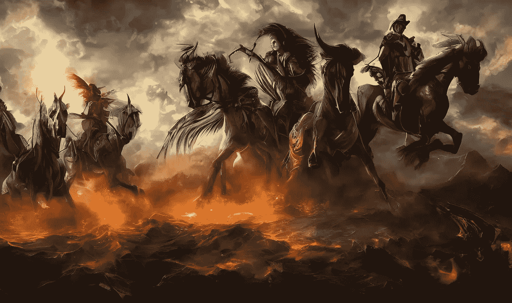

# 艾与圣经:启示录中的四骑士

> 原文：<https://medium.com/mlearning-ai/ai-and-the-bible-the-four-horsemen-of-the-apocalypse-ff5cde48dc77?source=collection_archive---------5----------------------->

我不断尝试艺术、圣经和传统。我有兴趣了解人工智能如何解读天启四骑士。他们是 4 个神话人物，与基督教天启书有关。每个骑士骑着不同颜色的马(白色、红色、黑色和苍白色)。唯一被点名的骑士是第四个，“死神”。每个都有不同的…