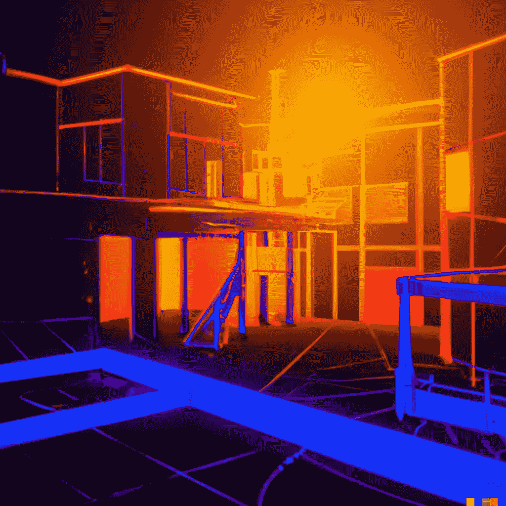

# 人工智能将绘图转换为 3D 模型

> 原文：<https://medium.com/mlearning-ai/ai-converts-drawings-to-3d-models-ce9d42afcdce?source=collection_archive---------0----------------------->

## [机器学习艺术](https://mlearning.substack.com/p/how-does-ai-turn-your-drawing-into?r=z7zu8&s=w&utm_campaign=post&utm_medium=web)

## **ML 生财艺术**

Sketch to 3D | CODE + Blender Scripts

## 🟠 [3D 模型可以从草图自动生成](https://mlearning.substack.com/p/how-does-ai-turn-your-drawing-into?r=z7zu8&s=w&utm_campaign=post&utm_medium=web)

## 什么是一个想法的草图？

概念草图是用短句注释的图画或图表，解释过程、想法和关系…