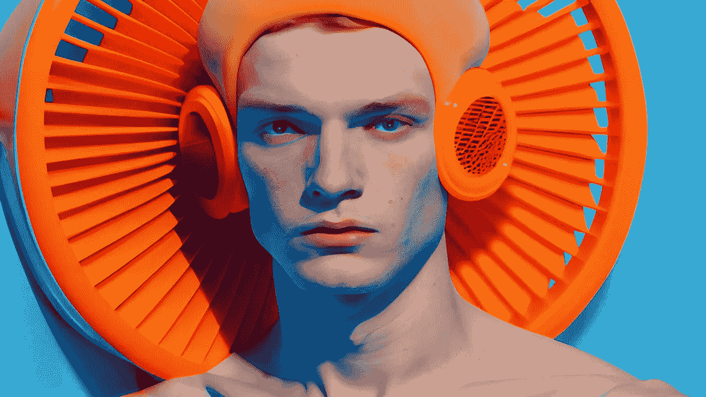

# 所有的艺术都是机器，所有的机器都是艺术

> 原文：<https://medium.com/mlearning-ai/all-art-is-a-machine-and-all-machines-are-art-e787a38fcd97?source=collection_archive---------5----------------------->

## [最新 100%免费演示](https://mlearning.substack.com)

## 艺术在 [AI 研究中的作用是什么？](https://mlearning.substack.com)

[free DEMO of AI Photo Generator — The latest release December 8th 2022](https://open.substack.com/pub/mlearning/p/how-to-teach-chatgpt-to-see?r=z7zu8&utm_campaign=post&utm_medium=web)

**机器可以创造艺术的想法并不新鲜。20 世纪 50 年代，艺术家是第一批尝试计算机的人。纽约的霍华德·怀斯画廊是第一次计算机艺术展览“计算机生成图片”的举办地。**