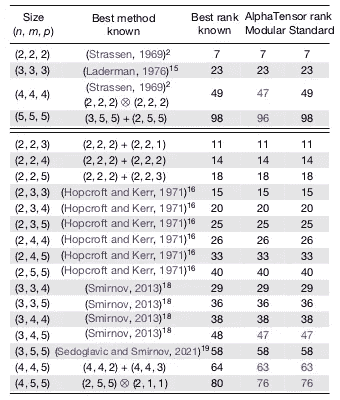

# AlphaTensor: DeepMind 的天才现象

> 原文：<https://medium.com/mlearning-ai/alphatensor-deepminds-ingenious-phenom-2528f990bc65?source=collection_archive---------2----------------------->

## 人工智能再一次改变了世界的进程！

Credits: KGF | Designed by Canva

2022 年 10 月 5 日发生了一件惊人的事情，它将永远改变我们对**算法发现**的看法。deep mind(*Alphabet Inc .*的英国人工智能子公司)的最新研究成果发表在 **Nature** ( *世界领先的多学科科学杂志*)上，题为**“利用强化学习发现更快的矩阵乘法算法”，**就在第二天，这项惊人的工作登上了《自然》周刊的头版。在这篇博客中，我们将更深入地探究这项非凡的工作取得了什么，以及它将如何扩大地球表面上存在的每一种依赖于矩阵乘法基本概念的算法的有用性。

 [## 深度思维

### 人工智能可能是人类最有用的发明之一。我们研究和建造安全的人工…

www.deepmind.com](https://www.deepmind.com/)  [## 利用强化学习性质发现更快的矩阵乘法算法

### 提高基本计算算法的效率可以产生广泛的影响，因为它可以影响到计算机的性能

www.nature.com](https://www.nature.com/articles/s41586-022-05172-4) 

# 什么是 AlphaTensor？

我们中的每一个人，不管我们从事的领域是什么，都遇到过算法，并且我们中的大多数人每天都在使用它们，而没有给予第二个想法。从我们在游戏学校学到的算法，如加减乘除，到帮助许多科学发明成为现实的算法，如快速傅立叶变换(FFT)，这些算法跨越了一些人所谓的“无限空间”，或者换句话说，它们的用例是不可计数的。然而，到目前为止，这些算法主要是由**人类**发现的！

但是现在，有了一个新的竞争者！在他们的论文中，DeepMind 引入了 AlphaTensor，这是第一个用于发现矩阵乘法等基本任务的新颖、高效且可证明正确的算法的人工智能系统。“烹饪”新算法的过程是一项极具挑战性的任务，但 DeepMind 的研究人员已经提出了一个人工智能系统，它不仅能够处理这项艰巨的任务，而且同时发现了一种新的矩阵乘法算法，打破了人类几十年前创造的记录。

Designed by Canva

# 阿尔法张量的关键见解

*   AlphaTensor 是一种基于 [AlphaZero](https://www.deepmind.com/blog/alphazero-shedding-new-light-on-chess-shogi-and-go) 的[深度强化学习(DRL)](https://wiki.pathmind.com/deep-reinforcement-learning) 方法，用于发现任意矩阵乘法的最优(*相对于现有的*)算法。
*   它发现了许多矩阵大小的最佳算法。一个特例是 4 x 4 矩阵，其中发现的算法自问世以来首次改进了 [Strassen 的两级算法](https://www.includehelp.com/algorithms/strassen-matrix-multiplication.aspx)。
*   它具有广泛的适用性。它通过优化实际运行时间，找到适合特定硬件的高效矩阵乘法算法。
*   AlphaTensor 的一个限制是需要预定义一组潜在的因子条目 F，这使搜索空间离散化，但可能导致错过有效的算法。DeepMind 的研究人员期待采用 AlphaTensor 来搜索 f。

# 算法是如何被发现的？

*   矩阵乘法算法发现过程被公式化为一个单人游戏，称为 TensorGame，在每个步骤中，代理(*或玩家*)选择如何组合矩阵的不同条目。
*   基于达到正确乘法结果所需的所选运算的数量，给每一步分配一个分数。
*   一旦张量游戏被开发出来，AlphaTensor ( *一个 DRL 代理*)就被训练来解决这个游戏。与国际象棋和围棋( *~100 个动作*)等传统游戏不同，这款游戏拥有巨大的动作空间( *~10 个动作*)。
*   AlphaTensor 使用一种专门的神经网络架构，该架构利用问题的对称性，并利用综合训练游戏。

# AlphaTensor 所做的改进

Fig. 3 | Borrowed from the Original Paper

*   `Size`表示矩阵乘法问题。例如，(2，2，3)表示需要将(2，2)矩阵与(2，3)矩阵相乘的问题。
*   复杂度由标量乘法的次数来衡量(*或张量分解中的项数*)。
*   `Best rank known`指的是张量秩的已知上界(*至今*),`AlphaTensor Rank`指的是用 AlphaTensor 得到的秩的上界。
*   AlphaTensor 实现的改进以红色显示。

# 结论👋

我写这篇博客的目的是提供这项最新发现的简要总结，它几乎跳过了这项独创性工作背后所有美丽的数学。如果你有兴趣更多地了解幕后发生的事情，请查阅原文(*参考前面的*)。此外，你还可以查阅本博客末尾提到的其他参考资料，以便更好地理解这项研究工作，或许，你最终可以将这项工作融入到自己的工作中，从而在你的领域中实现最先进的性能。

> 我真的希望你喜欢这个博客，如果你喜欢，请把你的手放在一起👏如果你想阅读更多的博客，请点击#StayTuned。在 [LinkedIn](https://www.linkedin.com/in/elemento24/) 和 [Twitter](https://twitter.com/elemento24_) 上与我联系。

# 其他参考文献

 [## 用α张量发现新算法

### 在我们今天发表在《自然》杂志上的论文中，我们介绍了 AlphaTensor，这是第一个用于…

www.deepmind.com](https://www.deepmind.com/blog/discovering-novel-algorithms-with-alphatensor?utm_campaign=AlphaTensor&utm_medium=bitly&utm_source=Twitter+Organic)  [## GitHub - deepmind/alphatensor

### 这是伴随出版物 Fawzi，a .等人的代码，发现更快的矩阵乘法算法与…

github.com](https://github.com/deepmind/alphatensor)  [## Mlearning.ai 提交建议

### 如何成为 Mlearning.ai 上的作家

medium.com](/mlearning-ai/mlearning-ai-submission-suggestions-b51e2b130bfb)