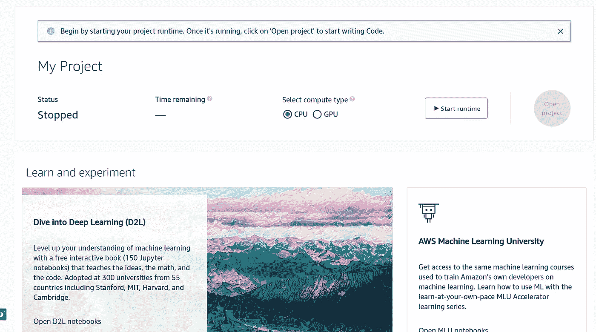

# 亚马逊 Sagemaker 工作室实验室

> 原文：<https://medium.com/mlearning-ai/amazon-sagemaker-studio-lab-86e90a158384?source=collection_archive---------5----------------------->

亚马逊最近为全球的 ML 从业者和学生推出了 Sagemaker studio。借助亚马逊 Sagemaker studio lab，我们可以在我们熟悉的 Jupyter 笔记本环境中访问 GPU 和 CPU 笔记本。

这对想要加入并深入研究机器学习的学生和爱好者来说是有益的，因为它最近推出了 GPU，与谷歌 colab(免费订阅)相比更好(我的第一台笔记本电脑上配有特斯拉 T4😃)

Studio lab 还提供关于深入学习的免费课程，平台上还提供关于 NLP(自然语言处理)、计算机视觉、系综模型等主题的各种课程。

## 如何获得亚马逊 Sagemaker Studio Lab 的账号？

在这项运动中，你不能只是注册，你必须注册，Sagemaker 将在一两天内为你提供帐户

注册链接

[https://studiolab.sagemaker.aws/requestAccount](https://studiolab.sagemaker.aws/requestAccount)

您可以通过上面的链接申请一个帐户

一旦你通过填写所有信息申请一个帐户，你将不得不验证你的电子邮件

然后 Sagemaker 会在几天内给你一个账户:)

使用 Sagemaker Studio 享受您的旅程😸

> 感谢你阅读我的博客:)关注更多，在评论中向我问好，这给了我写更多博客的鼓励:)祝你有美好的一天:)

 [## Mlearning.ai 提交建议

### 如何成为 Mlearning.ai 上的作家

medium.com](/mlearning-ai/mlearning-ai-submission-suggestions-b51e2b130bfb)