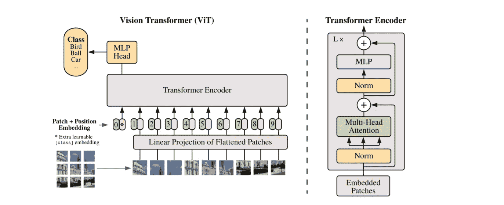
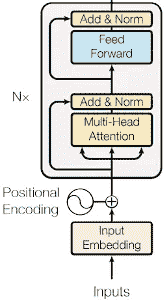
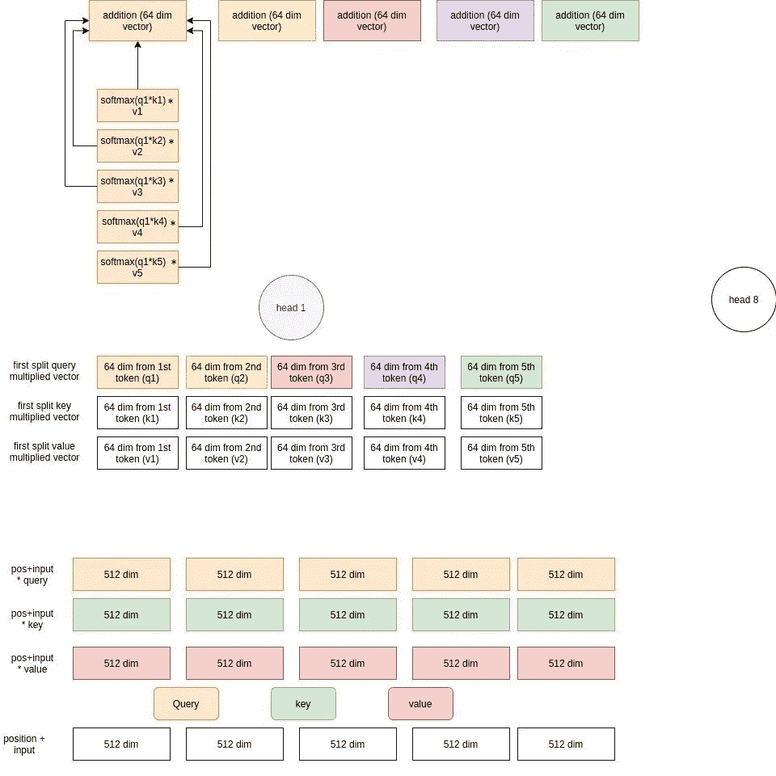
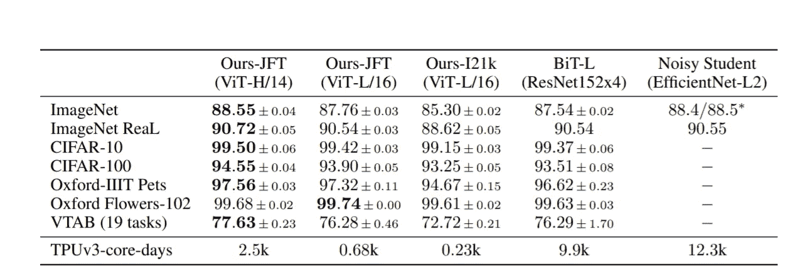

# 一幅图像相当于 16x16 个字:大规模图像识别的变形金刚

> 原文：<https://medium.com/mlearning-ai/an-image-is-worth-16x16-words-transformers-for-image-recognition-at-scale-51f3561a9f96?source=collection_archive---------0----------------------->



ViT architecture presented in the paper

这是谷歌研究的一篇论文。本文的主要观点是

> 直接应用于图像补丁并在大型数据集上进行预训练的转换器在图像分类方面非常有效。

在本帖中，我们将详细讨论视觉变压器(ViT)架构以及论文中发表的结果。

通过使用[这台](https://github.com/souvik3333/medium_blogs/blob/main/transformers/ViT/ViT.ipynb)笔记本来尝试这里使用的实现。点击`Open in Colab`直接在 Colab 上运行。

# ViT 架构🏃

*   ViT 将图像分割成固定数量的面片，并使用它们来创建嵌入，并将它们通过标准的 transformer 编码器。
*   我们先讨论一下 NLP 变压器是如何工作的，然后再和 ViT 进行比较和讨论。

## NLP 变压器编码器🎨



Transformer encoder

*   我们把一个句子作为输入。但是，我们没有发送整个句子，而是使用一个`tokenizer`给每个单词一个`id`。现在，分词器实际上不必像按单词拆分那样简单地进行拆分，而是可以将单词拆分成多个部分并进行赋值。这个要看分词器怎么训练了。例如，一个简单的记号赋予器可以做如下工作

但是另一个人把句子拆成了下面这样:

现在我们有了一个将所有可能的 id 映射到向量表示的矩阵。因此，如果我们使用第二个记号赋予器，如果我们想要为`To`选择嵌入，我们将选择索引 11 处的向量表示。

这些嵌入可以在开始时随机初始化，我们在训练中学习。

## 位置嵌入

*   递归神经网络(RNNs)以连续的方式逐字分析句子。但是变压器架构不使用递归机制，而是支持多头自关注机制。这减少了变形金刚的训练时间，但是模型不知道单词的位置。
*   为了解决这个问题，我们向输入嵌入添加了一条额外的信息(位置编码)。
*   现在一个简单的方法就是给第一个单词赋值 1，给第二个单词赋值 2，依此类推。但在这种方法中，模型在推理过程中可能会得到一个比它在训练中看到的任何句子都长的句子。同样，对于一个较长的句子，会有较大的值需要添加，这会占用更多的内存。
*   我们可以取一个范围，比如第一个作品加 0，最后一个加 1，在两者之间我们分割范围[0，1]并得到值。例如，对于一个 3 个单词的句子，我们可以对第一个单词取 0，对第二个单词取 0.5，对第三个单词取 1；对于一个 4 个单词的句子，它将分别是 0，0.33，0.66，1。这样的问题是位置差δ不是常数。在第一个例子中，它是 0.5，但是在第二个例子中，它是 0.33。
*   使用的位置编码是一个 d 维向量。

*   这就是所有事物的结合

*   接下来，我们将通过多头注意力模块传递这些向量。

## 多头注意力🔥

*   多头注意力有三个矩阵，分别是查询(Q)、键(K)、值(V)矩阵。它们中的每一个都具有与嵌入相同的维数。因此，在我们的例子中，所有 3 个矩阵都是 512x512
*   对于每个令牌嵌入，我们将其与所有三个矩阵(Q，K，V)相乘。因此，对于每个令牌，我们将有 3 个长度为 512 的中间向量。
*   现在，如果我们有`n` 个头，我们把每个向量分成`n`个部分。例如，如果我们有 8 个头，对于单词`Today`，我们将把所有 3 个中间向量分成维数为 64 的小向量。
*   然后，每个头从所有中间向量中取出其对应的段。例如，第一个头将取得所有五个嵌入(对应于五个令牌)的所有三个中间向量(对应于查询、密钥、值乘法结果)的第一个分裂(维度 64)。类似地，第二个头将取第二个段，依此类推。
*   在每个标题中，我们点积查询和键矩阵相乘的向量。在下图中，我们在 q1 和所有关键矩阵相乘的向量(k{i}，i in [1，5])之间做点积。然后，我们将它乘以相应的值向量。最后，我们将它们相加以创建一个结果 64 维向量。这发生在 q2、q3、q4、q5，最后，我们得到维数为 64 的 5 个向量。现在基本上每个结果向量都有所有其他向量的信息。



Attention logic

*   现在我们连接所有头部的结果向量。因此，我们将连接所有 8 个头的第一个结果向量，以创建 512 dim 第一个向量。对于所有其他 4 个向量也是如此。
*   最后我们有 5 个向量，每个都有 512 个维度。

## 添加&诺姆☯

*   这些是正常的批处理规范化和剩余连接，如 Resnet 块。

## 前馈🍀

*   这些是简单的前馈神经网络，应用于每个注意力向量。

这就是一个简单的变压器编码器的工作原理。接下来让我们看看 ViT 架构。同时我们也会看到如何实现。

## ViT 编码器架构

**嵌入补丁的☑️**

*   为了处理 2D 图像，图像被分成几个小块。我们将 2D 面片展平成 1D 矢量。
*   然后，我们将这些向量嵌入到模型维度空间中。在这种情况下，模型将每个向量转换为 768 维向量。

```
import torch
import torch.nn as nn
in_chans = 3 #RGB
embed_dim = 768 # vector dimension in model space
patch_size = 16 # each image patch size 16*16
proj = nn.Conv2d(in_chans, embed_dim, kernel_size=patch_size, stride=patch_size) # this will create the patch in image
img = torch.randn(1, 3, 224,224) # dummy image
x = proj(img).flatten(2).transpose(1, 2) # BCHW -> BNC
print(x.shape)
```

*   在上面的代码中，我们拍摄了大小为 224*224 的图像，并假设每个面片的大小为 16x16。
*   现在这将导致总共(224/16** 224/16)= 14 **14 = 196 个向量。
*   这些向量的大小都是 16*16 = 256。但是，因为我们必须将其转换为模型维度，即 768，所以我们在卷积中使用 768 作为输出通道。最后，我们将它展平为 BNC，其中 B=批次，N=生成的面片，C =模型空间中的向量维度。

**类嵌入🆕**

*   ViT 将一个可学习的嵌入附加到嵌入补丁序列中。

```
cls_token = nn.Parameter(torch.zeros(1, 1, embed_dim)) # create class embeddings without batch
cls_token = cls_token.expand(x.shape[0], -1, -1) # add batch
x = torch.cat((cls_token, x), dim=1) # append class token with linear proj embeddings
x.shape # 196 -> 197
```

**位置嵌入☑️**

*   我们创建一个维数为(num _ patches+1)** embed _ dim(197 **768)矩阵。这些值是在训练过程中学习到的。

```
num_patches = 14*14
pos_embed = nn.Parameter(torch.zeros(1, num_patches + 1, embed_dim)) # +1 for class token
x = x + pos_embed # add position encoding
x.shape
```

**街区☑️**

*   基于该模型，我们有`n`个块。
*   每个区块都一样。每一层包括一个注意层和一个 MLP 层。

**关注层☑️**

*   与之前解释的 NLP 注意力相同。
*   让我们创建中间向量。

```
# Transformation from source vector to query vector
fc_q = nn.Linear(embed_dim, embed_dim)
# Transformation from source vector to key vector
fc_k = nn.Linear(embed_dim, embed_dim)
# Transformation from source vector to value vector
fc_v = nn.Linear(embed_dim, embed_dim)Q = fc_q(x)
K = fc_k(x)
V = fc_v(x)print(Q.shape, K.shape, V.shape)
```

*   分割中间向量以在每个头中处理一个零件。

```
num_heads = 8
batch_size = 1
Q = Q.view(batch_size, -1, num_heads, embed_dim//num_heads).permute(0, 2, 1, 3) # split the Q matrix for 8 head
K = K.view(batch_size, -1, num_heads, embed_dim//num_heads).permute(0, 2, 1, 3) # split the K matrix for 8 head
V = V.view(batch_size, -1, num_heads, embed_dim//num_heads).permute(0, 2, 1, 3) # split the V matrix for 8 head
print(Q.shape, K.shape, V.shape) # batch_size, num_head, num_patch+1, feature_vec dim per head
```

*   注意力矩阵乘法。

```
score = torch.matmul(Q, K.permute(0, 1, 3, 2)) # Q*k
score = torch.softmax(score, dim=-1)
score = torch.matmul(score, V) # normally we apply dropout layer before this
score.shape # batch_size, num_head, num_patches+1, feature_vector_per_head (embed_dim/num_head)
```

*   重塑结果

```
score = score.permute(0, 2, 1, 3).contiguous()
score.shape # batch_size, num_patches+1, num_head, feature_vector_per_head (embed_dim/num_head)
```

*   将向量合并回它们的原始形状

```
score = score.view(batch_size, -1, embed_dim) # merge the vectors back to original shape
score.shape # batch_size, num_patches+1, embed_dim
```

**MLP 负责人☑️**

*   正常多层感知器。

```
act_layer=nn.GELU # activation function
in_features = embed_dim 
hidden_features = embed_dim * 4
out_features = in_features
fc1 = nn.Linear(in_features, hidden_features)
act = act_layer()
drop1 = nn.Dropout(0.5)
fc2 = nn.Linear(hidden_features, out_features)
drop2 = nn.Dropout(0.5)
```

*   从 MLP 图层中获取结果

```
x = fc1(score)
x = act(x)
x = drop1(x)
x = fc2(x)
x = drop2(x)
x.shape
```

*   拿出`cls`令牌特性。

```
cls = x[:,0]
```

**选粉机机头🆕**

*   创建一个简单的分类器头，并传递类令牌特征来获得预测。

```
num_classes = 10 # assume 10 class classification
head = nn.Linear(embed_dim, num_classes) 
pred = head(cls)
pred
```

# 结果发表在论文中📈

> 当在没有强正则化的中型数据集(如 ImageNet)上训练时，这些模型产生的适度精度比可比大小的 ResNets 低几个百分点。
> 
> 变压器缺乏 CNN 固有的一些归纳偏差，如翻译等变和局部性，因此在数据量不足的情况下训练时不能很好地概括。
> 
> 但是，如果模型是在更大的数据集(14M-300M 图像)上训练的，情况就不同了。我们发现大规模训练胜过归纳偏差。

*   作者提到，对于较小的预训练数据集(ImageNet ), ViT-Large 模型的性能低于 ViT-Base 模型。对于大型数据集(JFT-300 米)，ViT-大型模型效果很好。
*   在 JFT-300M 数据集上预训练的 Vision Transformer 模型在所有数据集上都优于基于 ResNet 的基线，而预训练所需的计算资源却少得多。
*   下表显示了用 JFT-300M 数据集和 ImageNet-21k 数据集预处理的 ViT 的结果。这些列显示了用不同数据集预处理的几个模型。这些行是下游任务。



Table 2 from the paper

# 用 PyTorch 闪电和 timm 训练一个简单的 ViT🎆

*   这里让我们使用 [PyTorch Lightning](https://github.com/PyTorchLightning/pytorch-lightning) 和 [timm](https://github.com/rwightman/pytorch-image-models) 训练一个简单的分类器。

```
import timm
import torch
import pytorch_lightning as pl
import torchvision
import torchvision.transforms as transforms
from pytorch_lightning import Trainer, seed_everything
from pytorch_lightning.callbacks import ModelCheckpoint
import torchmetricsseed_everything(42, workers=True)
```

*   让我们创建一个简单的 lightning 模型类。

```
class Model(pl.LightningModule):
    """
    Lightning model
    """
    def __init__(self, model_name, num_classes, lr = 0.001, max_iter=20):
        super().__init__()
        self.model = timm.create_model(model_name=model_name, pretrained=True, num_classes=num_classes)
        self.metric = torchmetrics.Accuracy()
        self.loss = torch.nn.CrossEntropyLoss()
        self.lr = lr
        self.max_iter = max_iter

    def forward(self, x):
        return self.model(x) def shared_step(self, batch, batch_idx):
        x, y = batch
        logits = self(x)
        loss = self.loss(logits, y)
        preds = torch.argmax(logits, dim=1)
        self.metric(preds, y)

        return loss

    def training_step(self, batch, batch_idx):
        loss = self.shared_step(batch, batch_idx)
        self.log('train_loss', loss, on_step=True, on_epoch=True, logger=True, prog_bar=True)
        self.log('train_acc', self.metric, on_epoch=True, logger=True, prog_bar=True)

        return loss

    def validation_step(self, batch, batch_idx):
        loss = self.shared_step(batch, batch_idx)
        self.log('val_loss', loss, on_step=True, on_epoch=True, logger=True, prog_bar=True)
        self.log('val_acc', self.metric, on_epoch=True, logger=True, prog_bar=True)

        return loss

    def configure_optimizers(self):
        optim = torch.optim.Adam(self.model.parameters(), lr=self.lr)
        scheduler = torch.optim.lr_scheduler.CosineAnnealingLR(optimizer=optim, T_max=self.max_iter)

        return [optim], [scheduler]
```

*   接下来，我们将定义转换并下载和加载 CIFAR10 数据集。

```
transform = transforms.Compose(
    [transforms.Resize(224),
     transforms.ToTensor(),
     transforms.Normalize((0.5, 0.5, 0.5), (0.5, 0.5, 0.5))])batch_size = 128trainset = torchvision.datasets.CIFAR10(root='./data', train=True,
                                        download=True, transform=transform)
trainloader = torch.utils.data.DataLoader(trainset, batch_size=batch_size,
                                          shuffle=True, num_workers=8)testset = torchvision.datasets.CIFAR10(root='./data', train=False,
                                       download=True, transform=transform)
testloader = torch.utils.data.DataLoader(testset, batch_size=batch_size,
                                         shuffle=False, num_workers=8)classes = ('plane', 'car', 'bird', 'cat',
           'deer', 'dog', 'frog', 'horse', 'ship', 'truck')
```

*   现在我们将初始化`Model`类。这里，我们使用 ViT 的一个变体，它拍摄大小为 224*224 的图像，面片大小为 16。

```
model = Model(model_name="vit_tiny_patch16_224", num_classes=len(classes), lr = 0.001, max_iter=10)
```

*   让我们创建一个检查点回调来保存最佳检查点。

```
checkpoint_callback = ModelCheckpoint(
    monitor='val_loss',
    dirpath='./checkpoints',
    filename='vit_tpytorch_lightning6_224-cifar10-{epoch:02d}-{val_loss:.2f}-{val_acc:.2f}'
)
```

*   快好了。让我们创建教练。

```
trainer = Trainer(
    deterministic=True, 
    logger=False, 
    callbacks=[checkpoint_callback], 
    gpus=[0], # change it based on gpu or cpu availability
    max_epochs=10, 
    stochastic_weight_avg=True)
```

*   最后，让我们训练模型😃

```
trainer.fit(model=model, train_dataloaders=trainloader, val_dataloaders=testloader)
```

# 相关资源

*   [官方代号](https://github.com/google-research/vision_transformer)
*   [论文](https://arxiv.org/abs/2010.11929)
*   [代码笔记本](https://github.com/souvik3333/medium_blogs/blob/main/transformers/ViT/ViT.ipynb)

特别感谢 [Prakash Jay](https://medium.com/u/bea753eb5d92?source=post_page-----51f3561a9f96--------------------------------) 指导我完成这个项目。

[](/mlearning-ai/mlearning-ai-submission-suggestions-b51e2b130bfb) [## Mlearning.ai 提交建议

### 如何成为 Mlearning.ai 上的作家

medium.com](/mlearning-ai/mlearning-ai-submission-suggestions-b51e2b130bfb)