# 初学者 HR 数据集的分析与预测

> 原文：<https://medium.com/mlearning-ai/analysis-and-prediction-on-hr-data-set-d022ca4ef80e?source=collection_archive---------2----------------------->


Photo by [Campaign Creators](https://unsplash.com/@campaign_creators?utm_source=unsplash&utm_medium=referral&utm_content=creditCopyText) on [Unsplash](https://unsplash.com/s/photos/hr?utm_source=unsplash&utm_medium=referral&utm_content=creditCopyText)

在数据分析和数据建模方面，你是个新手吗？如果是，那么你来对地方了。

在这篇博客中，我们将对 [Kaggle](https://www.kaggle.com/giripujar/hr-analytics) 中的人力资源数据集进行一些探索性的数据分析。我们还将使用 RandomForest 来预测谁离开了他们的公司。这是一个初学者友好的数据集，很容易使用。从盒子里拿出来，让我们进入有趣的东西。

# 进口

当我们开始工作时，我们总是做的第一件事就是导入库。您不需要从一开始就导入笔记本中要使用的每个库。您可以从最低要求开始，包括:

```
import pandas as pd
import numpy as np
import matplotlib.pyplot as plt
import seaborn as sns
%matplotlib inline
```

当你开始解决一个问题时，以上这些就足够了。从那时起，您可以在开始时添加它们，也可以在笔记本中的任何位置导入它们。

现在我们已经完成了导入，让我们加载数据。

```
df = pd.read_csv("../input/hr-analytics/HR_comma_sep.csv")
df.head()
```

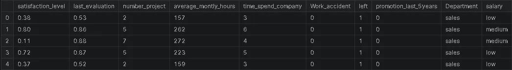

Image by author

# 检查数据是否整洁

现在数据已经加载完毕。让我们看看数据是怎样的，即数据类型、NaN 值的数量等。，我们可以通过使用。信息()方法

```
df.info()
```

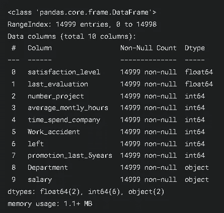

Image by author

正如你在上面看到的，所有的列都没有 NaN 值。float、int 和 object 是列的数据类型。

```
for col **in** df.columns:
    print(f"**{**col**}** - ", df[col].unique())
    print()
```

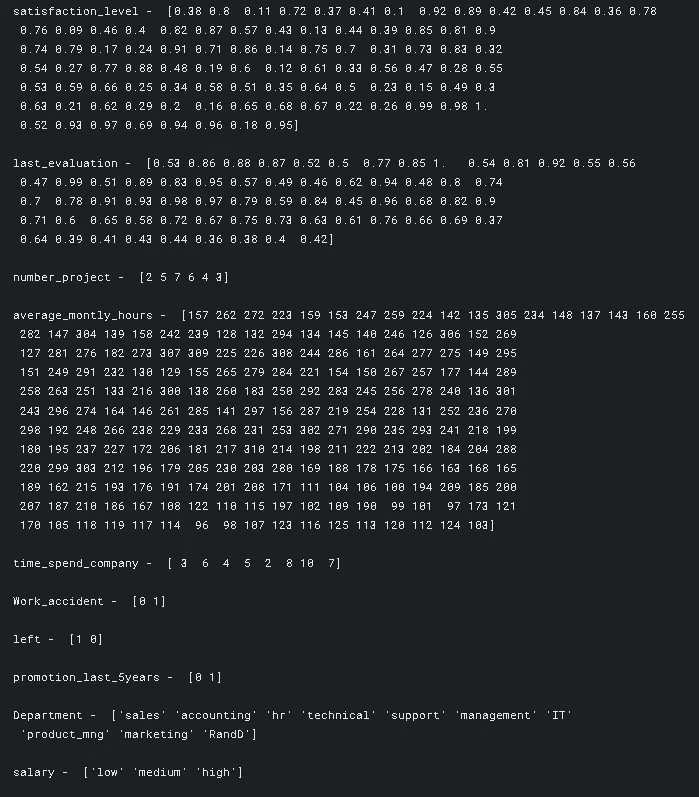

Image by author

数据中似乎没有什么怪异的数值，这很好。让我们看看指标。

```
df.describe()
```

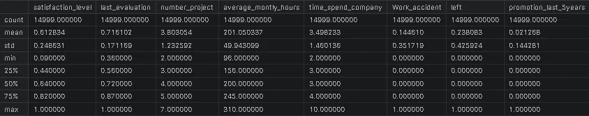

Image by author

现在我们看了一下数据，让我们进入我最喜欢的部分，EDA。

# 探索性数据分析

在这里，我们将可视化数据。通过这样做，我们将能够进一步了解数据的情况，以及是否有任何工作要做。

```
sns.set()#sets the style of the plot.
fig = plt.figure(figsize=(12,6))#Used to display the plot
sns.barplot(x='Department', y='satisfaction_level', hue='salary', data=df, ci=None)
plt.title("Satisfaction_level Vs Department", size=15)
plt.show()
```

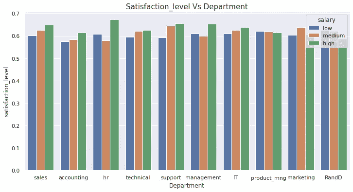

Image by author

薪水高的人更满意。但是 product_mng 说拿着我的杯子。似乎低收入的人比高收入的人更满意。同样是为了土地。

```
fig = plt.figure(figsize=(12,6))
g = sns.barplot(x='Department', y='last_evaluation', data=df, ci=None)
g.bar_label(g.containers[0])
plt.title("Last Evaluation Vs Department", size=15)
plt.show()
```

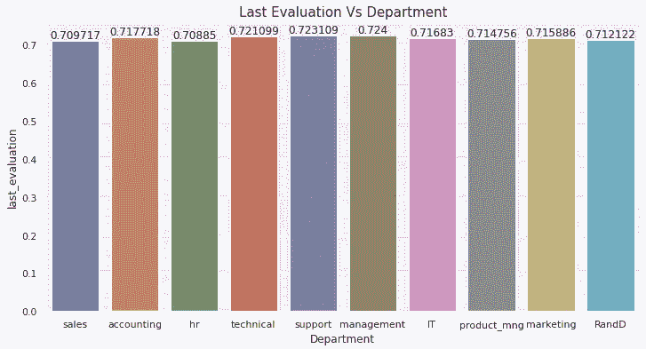

Image by author

每个人都做了类似的评估。

```
fig = plt.figure(figsize=(12,6))
sns.barplot(x='Department', y='number_project', data=df, ci=None)
plt.title("Number Project Vs Department", size=15)
plt.show()
```

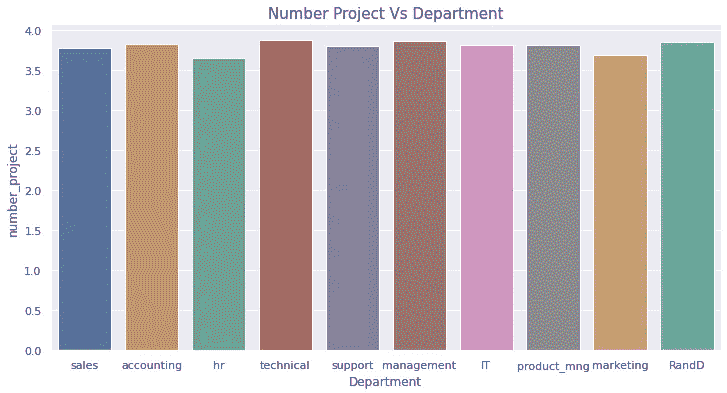

Image by author

```
fig = plt.figure(figsize=(12,6))
g = sns.barplot(x='Department', y='Work_accident', data=df, ci=None)
g.bar_label(g.containers[0])
plt.title("Work Accident Vs Department", size=15)
plt.show()
```

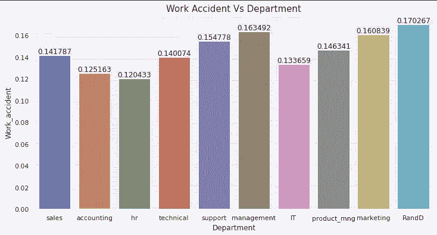

Image by author

```
fig = plt.figure(figsize=(12,6))
g = sns.barplot(x='Department', y='satisfaction_level', hue='left', data=df, ci=None)
g.bar_label(g.containers[0])
g.bar_label(g.containers[1], rotation=90)
plt.title("Left Vs Department with satisfaction level", size=15)
plt.show()
```

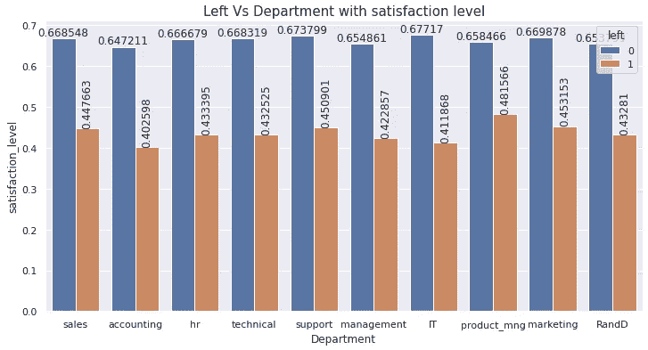

Image by author

```
fig = plt.figure(figsize=(12,6))
sns.lineplot(x='Department', y='time_spend_company', data=df, ci=None, color='r', marker='o')
plt.title("Time spent per each Department", size=15)
plt.show()
```

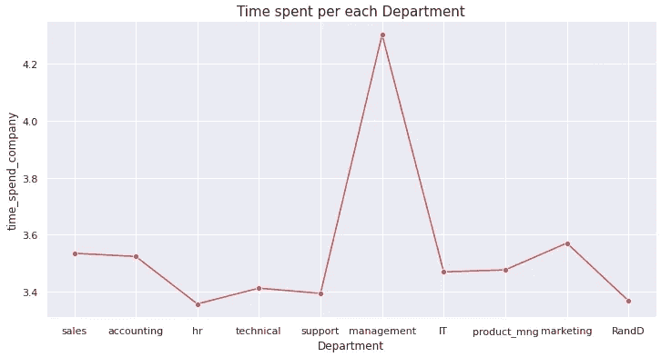

Image by author

```
fig = plt.figure(figsize=(12,6))
sns.lineplot(x='Department', y='average_montly_hours', data=df, ci=None, color='g', marker='o')
plt.title("Avg Hours spent in the company per Department", size=15)
plt.show()
```

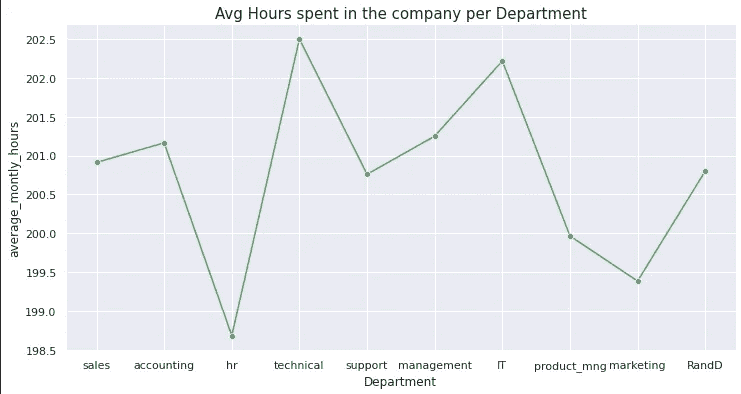

Image by author

图表看起来很搞笑 lol🤣不知道为什么🤷‍♂️

```
fig = plt.figure(figsize=(12,6))
sns.lineplot(x='Department', y='promotion_last_5years', data=df, ci=None, color='black', marker='o')
plt.title("Promotions of Last 5 years in the company per Department", size=15)
plt.show()
```


Image by author

与其他部门相比，管理部门和营销部门有更多的晋升机会。

```
fig = plt.figure(figsize=(12,6))
salary = df['salary'].value_counts()
sns.lineplot(x=salary.values, y=salary.index, ci=None, color='orange', marker='o')
plt.title("Salary (Counts) in the company", size=15)
plt.show()
```

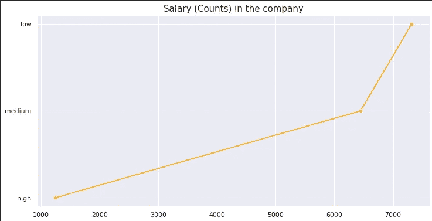

Image by author

现在，我们已经看到了数据是如何，让我们进入建模。

在此之前，我们先来看看相关性。

```
sns.heatmap(df.corr(), center=0, linewidth=1, annot=True, fmt='.2f')
plt.show()
```

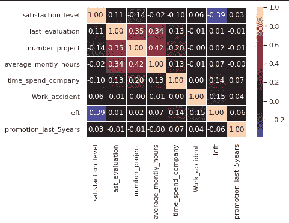

Image by author

在这里，如果我们观察，我们可以看到 satisfaction_level 和左栏高度负相关，我认为这是非常明显的。

# 系统模型化

我们需要将我们的数据分成训练集和测试集，这样模型就不会记住这些数据。在此之前，让我们删除分类栏*【发展】*和*【薪水】。*

```
df = df.drop(['Department', 'salary'], axis=1)
```

在这里，我们传入一个要删除的列名列表。通过指定 *axis=1* ，我们告诉它删除列。

你也可以这样做

```
df.drop(['Department', 'salary'], axis=1, inplace=True)
```

通过这样做，您不需要专门为它分配 df，因为它会在适当的位置执行。

现在，我们摆脱了他们，让我们分裂我们的数据。

首先，将目标 var(我们要预测的那个)和其余的数据分开。

```
X = df.drop('left', axis=1) # we will predict who left
y = df['left']
```

然后我们把 X，y 传递给下面的函数。

```
from sklearn.model_selection import train_test_split
X_train, X_test, y_train, y_test = train_test_split(X, y, test_size=0.3)
```

从函数的名称来看，我们可以说它将把我们的数据分成训练集和测试集。

现在我们只需要将训练数据与我们选择的模型相匹配。因为我们试图预测我们可以选择随机森林

> RandomForest 可以做预测和回归。

我们还将使用 GridSearchCV 为我们的模型寻找最佳参数。

```
from sklearn.ensemble import RandomForestClassifier
from sklearn.model_selection import GridSearchCV
param = [
    {'n_estimators': [100, 200, 300, 400, 450, 500], 
     'max_depth': [3, 4, 6, 8, 10, 12], 
     'max_leaf_nodes': [15, 20, 25]}, 
]
rf = RandomForestClassifier()
gs_rf = GridSearchCV(rf, param, cv = 5, n_jobs = -1, verbose = 1)
gs_rf.fit(X_train, y_train)
rf_best = gs_rf.best_estimator_
pred = gs_rf.predict(X_test)
gs_rf.best_estimator_
```

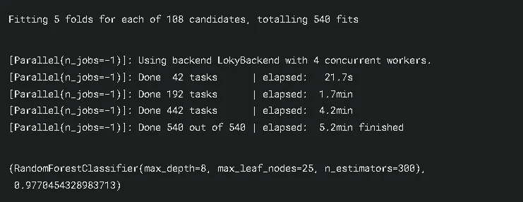

Image by author

所以最终我们完成了建模。随机森林给了我们 98%的准确率。哇，真不错。如果你坚持到最后，那就做得很好。

# 结论

在这篇博客中，我们看到了:

*   事物的基本工作流程
*   如何实现 RandomForest
*   如何实现 GridSearchCV

你可以在这里查看我的 Kaggle 笔记本，如果你觉得有帮助的话，给它一个向上的投票:

[](https://www.kaggle.com/karthikbhandary2/hr-analysis-and-prediction-with-randomforest) [## 用 RandomForest 进行人力资源分析和预测

### 使用 Kaggle 笔记本探索和运行机器学习代码|使用来自 HR Analytics 的数据

www.kaggle.com](https://www.kaggle.com/karthikbhandary2/hr-analysis-and-prediction-with-randomforest) 

我真的希望你觉得这个分析很有帮助和有趣。如果你喜欢我的工作，那么别忘了在 [Medium](https://karthikbhandary2.medium.com/) 和 [YouTube](https://www.youtube.com/channel/UCKplT0-YqAQdCq6Xajcq5Tw) 上关注我，获取更多关于生产力、自我提升、编码和技术的内容。另外，在 [Kaggle](https://www.kaggle.com/karthikbhandary2/code) 上查看我的作品，在 [LinkedIn](https://www.linkedin.com/in/karthik-bhandary-511778214/) 上关注我。我也在 [HackerNoon](https://hackernoon.com/u/karthikbhandary2) 上写文章，你也可以看看。

另外，看看我最近的作品:

[](/mlearning-ai/best-resources-for-learning-data-science-6167e09765dc) [## 学习数据科学的最佳资源

### 你打算学习数据科学吗？🤩却不知道去哪里学，怎么学？😫别担心，因为我有你…

medium.com](/mlearning-ai/best-resources-for-learning-data-science-6167e09765dc) [](https://karthikbhandary2.medium.com/5-programming-languages-to-learn-in-2022-1046ab5fb3c2) [## 2022 年要学的 5 种编程语言

### 这些会在 2022 年流行

karthikbhandary2.medium.com](https://karthikbhandary2.medium.com/5-programming-languages-to-learn-in-2022-1046ab5fb3c2) [](/mlearning-ai/mlearning-ai-submission-suggestions-b51e2b130bfb) [## Mlearning.ai 提交建议

### 如何成为 Mlearning.ai 上的作家

medium.com](/mlearning-ai/mlearning-ai-submission-suggestions-b51e2b130bfb) 

[成为 ML 写手](/mlearning-ai/mlearning-ai-submission-suggestions-b51e2b130bfb)