# 以 88%的准确率分析员工流失

> 原文：<https://medium.com/mlearning-ai/analyzing-ibm-employee-attrition-ec9b8b9f5b0e?source=collection_archive---------4----------------------->

识别影响员工流失的因素


Photo by [Christina @ wocintechchat.com](https://unsplash.com/@wocintechchat?utm_source=medium&utm_medium=referral) on [Unsplash](https://unsplash.com?utm_source=medium&utm_medium=referral)

## 什么是员工流失？

员工流失指的是员工数量的逐渐减少。这表明员工离开的速度比他们被雇佣的速度要快。当员工退休、辞职或根本无人接替时，就会发生员工流失。

员工流失可能有多种原因。其中包括对员工福利或薪酬结构的不满，缺乏员工成长的可能性，甚至糟糕的工作环境。

员工流失并不都是坏事，但可能会带来麻烦，因为它经常会减少组织内的人才和整个劳动力。

因此，预测员工流失变得非常重要。我们将涵盖员工流失预测，即员工将离开(或辞职)当前公司的预测，我们将使用逻辑回归算法进行预测。

[](/codex/retail-analysis-with-walmart-data-part-1-5fe1c81e9617) [## 使用沃尔玛数据的零售分析—第 1 部分

### 沃尔玛 45 家门店的机器学习模型分析与构建

medium.com](/codex/retail-analysis-with-walmart-data-part-1-5fe1c81e9617) [](/codex/retail-analysis-with-walmart-data-part-2-21934aeb0d77) [## 使用沃尔玛数据的零售分析—第二部分

### 为沃尔玛的 45 家商店建立机器学习模型

medium.com](/codex/retail-analysis-with-walmart-data-part-2-21934aeb0d77) 

## 描述

IBM 是一家美国跨国公司，在大约 170 个国家开展业务，主要业务包括计算、软件和硬件。流失是服务提供组织的主要风险，因为训练有素、经验丰富的人员是公司的资产。组织希望确定影响员工流失的因素。

## 统计任务

1.  导入磨损数据集和导入库，如 pandas、matplotlib.pyplot、numpy 和 seaborn。
2.  探索性数据分析
3.  找出 IBM 员工的年龄分布
4.  探索按年龄划分的流失
5.  浏览离职员工的数据
6.  了解教育领域的员工分布情况
7.  给出已婚和未婚员工人数的柱状图
8.  建立一个逻辑回归模型来预测哪些员工可能流失

## **1。导入库**

```
**import** numpy **as** np
**import** pandas **as** pd
**import** sklearn
**import** matplotlib.pyplot **as** plt
**import** seaborn **as** sns
**%matplotlib** inline
```

## 2.找出 IBM 员工的年龄分布

在这种情况下，将使用直方图来确定年龄分布。然后调整图像大小，用 seaborn 库绘制年龄分布图。

**洞察:**34 岁到 35 岁的员工最多。

```
plt**.**figure(figsize**=**(10,6), dpi**=**80)
sns**.**histplot(data**=**df, x**=**'Age', bins**=**42, kde**=True**)**.**set_title
('Age Distribution of Employee');
```

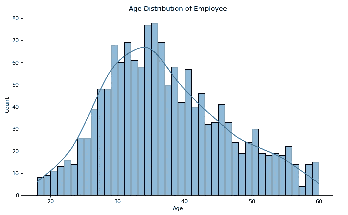

**Age Distribution of Employee**

## 3.探索按年龄划分的流失

现在，为了根据年龄确定流失，我们将根据年龄对其进行分组，流失为“是”接下来，我们将利用计数图来估计有多少员工将离开组织。

**洞察:**29 岁和 31 岁的员工是离开 IBM 最多的

```
*print(df[(df['Attrition'] == 'Yes')].groupby('Age')['Age'].count().sort_values(ascending=False))*

plt**.**figure(figsize**=**(14,6), dpi**=**80)
sns**.**countplot(data**=**df, x**=**'Age', hue**=**'Attrition', order **=** df['Age']**.**value_counts()**.**index, palette**=**'seismic_r')**.**set_title
('Attrition by Age');
```

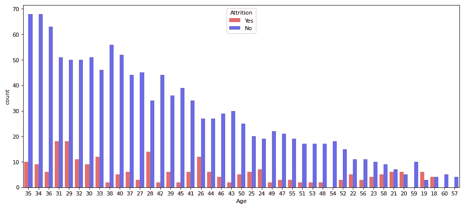

**Attrition by Age**

## 4.浏览离职员工的数据

我们将在这里探索一些事情。

```
print(df**.**groupby('Attrition')['Attrition']**.**count())

plt**.**figure(figsize**=**(5,4), dpi**=**80)
sns**.**countplot(data**=**df, x**=**'Attrition', palette**=**'seismic_r');
```

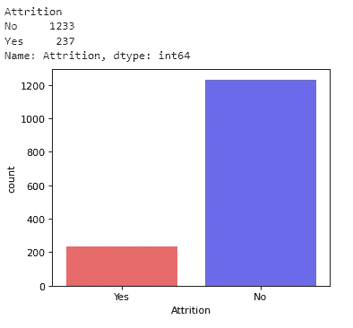

**Attrition**

按部门划分的自然减员—

```
*print(df[(df['Attrition'] == 'Yes')].groupby('Department')['Attrition'].count().sort_values(ascending=False))*

plt**.**figure(figsize**=**(8,5), dpi**=**80)
sns**.**countplot(data**=**df[(df['Attrition'] **==** 'Yes')], x**=**'Department', palette**=**'cubehelix', order **=** df['Department']**.**value_counts()**.**index)**.**set_title('Attrition by Department');
```

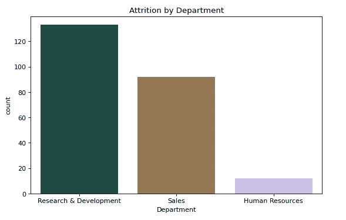

**Attrition by Department**

按年龄组划分的自然减员—

```
agerange **=** []
**for** age **in** df["Age"]:
    **if** age **>=** 18 **and** age **<** 24:
        agerange**.**append("18-24")
    **elif** age **>=** 25 **and** age **<** 31:
        agerange**.**append("25-31")
    **elif** age **>=** 32 **and** age **<** 38:
        agerange**.**append("32-38")
    **elif** age **>=** 39 **and** age **<** 45:
        agerange**.**append("39-45")
    **elif** age **>=** 46 **and** age **<** 52:
        agerange**.**append("46-52")
    **elif** age **>=** 53 **and** age **<** 59:
        agerange**.**append("53-59")
    **else**:
        agerange**.**append("60-66")

df["AgeRange"] **=** agerange*print(df[(df['Attrition'] == 'Yes')].groupby('AgeRange')['AgeRange'].count().sort_values(ascending=False))*

plt**.**figure(figsize**=**(8,5), dpi**=**80)
sns**.**countplot(data**=**df[(df['Attrition'] **==** 'Yes')], x**=**'AgeRange', palette**=**'cubehelix')**.**set_title('Attrition by Age Group');
```

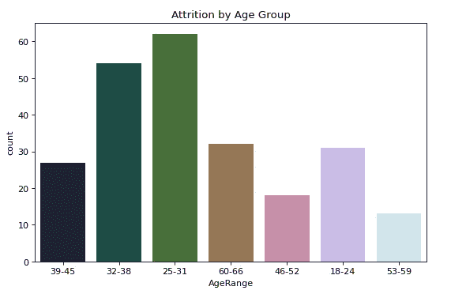

**Attrition by Age Group**

教育造成的损耗—

```
*print(df[(df['Attrition'] == 'Yes')].groupby('Education')['Attrition'].count().sort_values(ascending=False))*

plt**.**figure(figsize**=**(8,5),dpi**=**80)
sns**.**countplot(data**=**df[(df['Attrition'] **==** 'Yes')], x**=**'Education', order**=**df['Education']**.**value_counts()**.**index, palette**=**'cubehelix')**.**set_title('Attrition by Education');
```

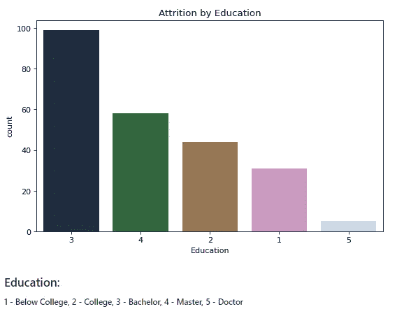

**Attrition by Education**

环境满意度造成的损耗—

```
*print(df[(df['Attrition'] == 'Yes')].groupby('EnvironmentSatisfaction')['Attrition'].count().sort_values(ascending=False))*

plt**.**figure(figsize**=**(8,5),dpi**=**80)
sns**.**countplot(data**=**df[(df['Attrition'] **==** 'Yes')], x**=**'EnvironmentSatisfaction', order**=**df['EnvironmentSatisfaction']**.**value_counts()**.**index, palette**=**'cubehelix')**.**set_title('Attrition by Environment Satisfaction');
```

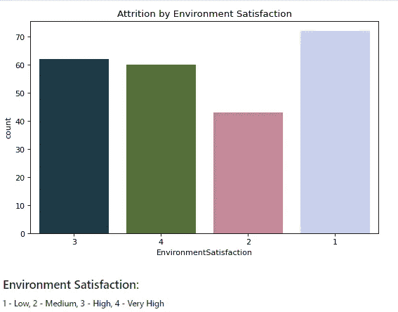

**Attrition by Environment Satisfaction**

工作满意度导致的流失—

```
*print(df[(df['Attrition'] == 'Yes')].groupby('JobSatisfaction')['Attrition'].count().sort_values(ascending=False))*

plt**.**figure(figsize**=**(8,5),dpi**=**80)
sns**.**countplot(data**=**df[(df['Attrition'] **==** 'Yes')], x**=**'JobSatisfaction',order**=**df['JobSatisfaction']**.**value_counts()**.**index, palette**=**'cubehelix');
```

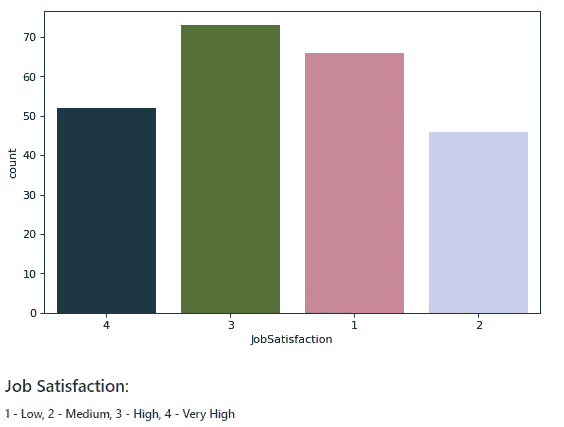

**Attrition by Job Satisfaction**

**洞察力:**

*   237 名工人辞职。(R&D 133 人，销售 92 人，人力资源 12 人)
*   25-31 岁的员工(62 名员工)最有可能离开。
*   那些已经完成学士学位的人更有可能离开。(99 名员工)
*   那些对周围环境不满的人更有可能离开。(72 名员工)
*   那些对工作高度满意的人更有可能辞职。(73 名员工)

## 5.了解教育领域的员工分布情况

为了确定教育领域的员工分布，我们将按教育领域对其进行分组。接下来，我们将绘制直方图。

```
plt**.**figure(figsize**=**(11,6), dpi**=**80)
sns**.**histplot(data**=**df, x**=**'EducationField')**.**set_title('Attrition by Education Field');
```

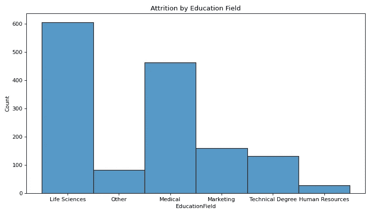

**Attrition by Education Field**

**洞察:**大部分员工(606 人)从事生命科学(教育领域)工作。

## 6.探索婚姻状况的数据

```
*print(df[(df['Attrition'] == 'Yes')].groupby('MaritalStatus')['Attrition'].count().sort_values(ascending=False))*

plt**.**figure(figsize**=**(8,5),dpi**=**80)sns**.**countplot(data**=**df, x**=**'MaritalStatus', hue**=**'Attrition', order**=**df['MaritalStatus']**.**value_counts()**.**index, palette**=**'seismic_r')**.**set_title('Attrition by Marital Status');
```

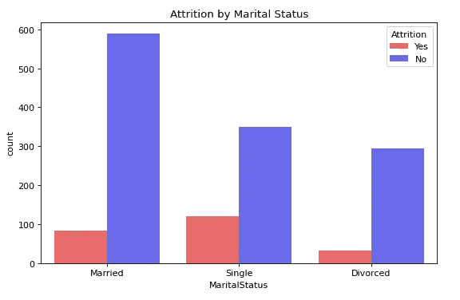

**Attrition by Marital Status**

**洞察:**未结婚的员工(120 名员工)更有可能离职。

我们已经完成了统计目标。还有一些类别变量。因此，为了开发一个逻辑回归模型，我们必须将它们转换成数值。我们只是用数值来代替它。

```
df['Attrition']**.**replace('Yes', 1, inplace**=True**)
df['Attrition']**.**replace('No', 0, inplace**=True**)df['Department']**.**replace('Human Resources', 1, inplace**=True**)
df['Department']**.**replace('Research & Development', 2, inplace**=True**)
df['Department']**.**replace('Sales', 3, inplace**=True**)df['EducationField']**.**replace('Human Resources', 1, inplace**=True**)
df['EducationField']**.**replace('Life Sciences', 2, inplace**=True**)
df['EducationField']**.**replace('Marketing', 3, inplace**=True**)
df['EducationField']**.**replace('Medical', 4, inplace**=True**)
df['EducationField']**.**replace('Other', 5, inplace**=True**)
df['EducationField']**.**replace('Technical Degree', 6, inplace**=True**)df['MaritalStatus']**.**replace('Divorced', 1, inplace**=True**)
df['MaritalStatus']**.**replace('Married', 2, inplace**=True**)
df['MaritalStatus']**.**replace('Single', 3, inplace**=True**)
```

## 7.建立一个逻辑回归模型来预测哪些员工可能流失

```
**from** sklearn.linear_model **import** LogisticRegression
lr **=** LogisticRegression()
lr **=** lr**.**fit(x_train, y_train)

*# check the accuracy on the training set*
print('Accuracy =', lr**.**score(x_train, y_train)*****100,'%');*# predict dependent variable*
lr_y_pred **=** lr**.**predict(x_test)*# find probability*
prob **=** lr**.**predict_proba(x_test)
print(prob)**from** sklearn.metrics **import** accuracy_score, confusion_matrix, classification_report*# Accuracy score*
print('Test Accuracy Score:', accuracy_score(y_test, lr_y_pred)*****100, '%\n')*# Classification report*
print('Classification Report', classification_report(y_test, lr_y_pred))*# Confusion matrix*
print('Confusion Matrix\n', confusion_matrix(y_test, lr_y_pred))
```

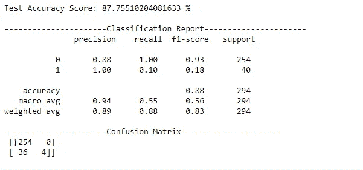

**Model Accuracy**

[](/codex/python-vs-r-72d025abe089) [## Python vs R

### 了解 Python 和 R 之间基本区别的终极指南

medium.com](/codex/python-vs-r-72d025abe089) 

希望你喜欢这个故事。关注我，了解更多类似的故事。[在这里找到我的 Kaggle 笔记本](https://www.kaggle.com/code/dhruvalpatel30/ibm-employee-attrition-for-beginners)。

[](https://mlearning.substack.com) [## MLearning.ai 艺术

### 创意经济的人工智能艺术解决方案🟠最先进的机器学习演示，快速易用🔵…

mlearning.substack.com](https://mlearning.substack.com)