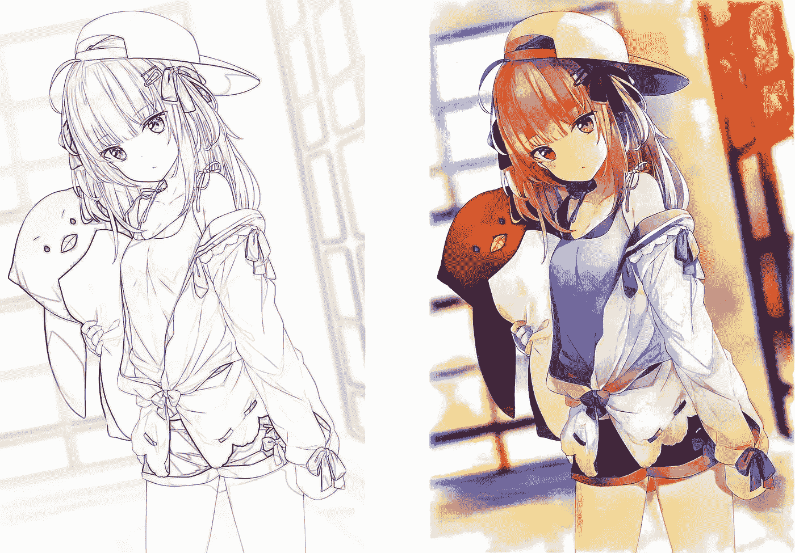

# 深度学习项目—动画插图着色—第 2 部分

> 原文：<https://medium.com/mlearning-ai/anime-illustration-colorization-with-deep-learning-part-2-62b1068ef734?source=collection_archive---------0----------------------->

sketch source (left): [🐧 by Hitsu](https://www.pixiv.net/artworks/71852423)

# 介绍

这是对我之前的文章[深度学习的动画插图着色-第一部分](/mlearning-ai/anime-illustration-colorization-with-deep-learning-9e7d7de7ee0b)的更新。如果你还没有读过，我建议你先读一读，然后再回来。