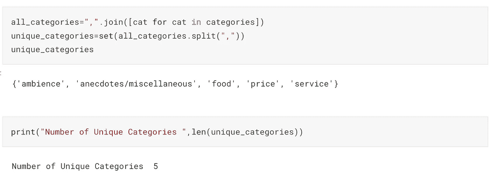
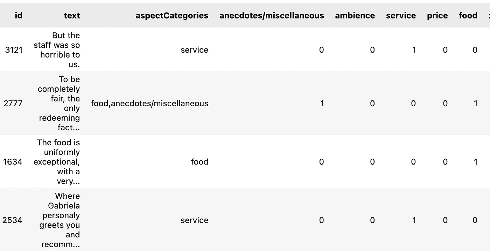
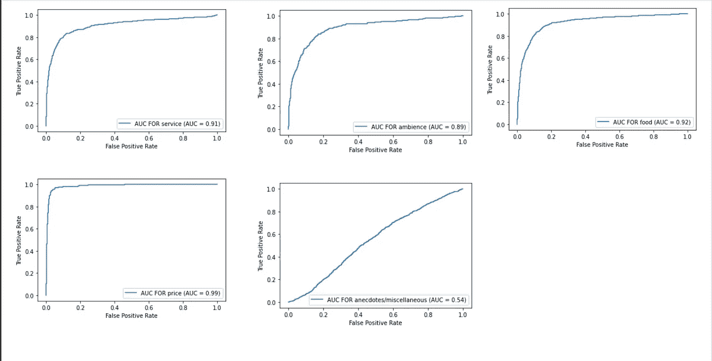

# 使用零镜头分类的方面挖掘

> 原文：<https://medium.com/mlearning-ai/aspect-mining-using-zero-shot-classification-3190e8a89d68?source=collection_archive---------1----------------------->

评估零射击学习如何在不使用标记数据的情况下帮助检测评论中的方面


Image Source: [Freepik](https://www.freepik.com/free-vector/reviews-concept-landing-page_4660575.htm#query=customer%20review&position=13&from_view=search&track=sph)

对任何企业来说，了解客户需求和挑战的主要来源之一是客户评论。虽然简单的情绪分析有助于理解评论是正面还是负面，但它并不能给出评论是关于什么的业务概念。

对于企业来说，解决这个问题的方法之一是手动标记评论，并将它们归类到几个兴趣点。例如，在餐馆设置中，这些类别可以是食物、服务和价格；对于手机来说，这些类别可能是相机质量、电池质量和性价比。这需要一个专门的人来注释数据，并且每次您想要添加新的类别时，都必须重新注释数据并重建模型，这是一项耗时的活动。这对小企业来说是一个挑战。

随着 Transformer 模型的出现，我们能够使用预先训练的模型，并简单地针对我们的任务对它们进行微调，并且在小数据集上也获得了良好的结果。预先训练的模型允许我们利用从许多下游任务(如 NER、机器翻译和文本分类)的庞大数据语料库中学习的知识，而不必从头开始构建模型。在零炮分类中使用预训练模型的一个好处是。零镜头分类的主要目标是能够在没有任何标记数据的情况下将文本分类。

在本文中，我们将看到零镜头分类如何简化从文本数据中识别方面(兴趣点)的过程。

# 零炮分类背后的思想

零镜头分类诞生于一个基于自然语言推理领域的非常简单但非常棒的想法(NLI)。NLI 研究一个假设对于一个给定的前提是真的(蕴涵)，假的(矛盾)，还是不确定的(中性)。

在零距离分类中，假设你想将“我爱冰淇淋”这一陈述分为积极类或消极类。那么前提是“我爱冰淇淋”，假设可以是“这是正面的例子”和“这是负面的例子”。现在，任务是预测假设对于给定的前提是否为真。

# 关于数据

为了理解零镜头分类如何工作来检测方面，让我们考虑已经被标记的餐馆的 Yelp 数据集。Kaggle 数据集可以在这里找到[。](https://www.kaggle.com/datasets/rafay12/yelp-aspect-based-opinion-mining)

该数据集是 XML 格式的，并且包含关于评论句子所属的类别以及与该类别相关联的情感的信息。它还包含方面术语。对于我们的分析，我们将使用类别信息来验证该模型如何使用零镜头分类来执行。

# 方法

此分析的完整代码可以在[这里](https://www.kaggle.com/code/aiswaryaramachandran/aspect-mining-using-zero-shot-classification)找到。

[](https://www.kaggle.com/code/aiswaryaramachandran/aspect-mining-using-zero-shot-classification) [## 使用零镜头分类的方面挖掘

### 使用 Kaggle 笔记本探索和运行机器学习代码|使用基于 Yelp 方面的意见挖掘数据

www.kaggle.com](https://www.kaggle.com/code/aiswaryaramachandran/aspect-mining-using-zero-shot-classification) 

我们读取 XML 并使用 ElementTree 解析它以获得方面类别。一个评论文本可以属于多个类别，使其成为一个多标签分类问题。

评论中有 5 个独特的类别，即氛围、食物、价格、服务、轶事/杂项。



由于这是一个多标签分类问题，我们将为每个类别设置一列，其中 1 表示文本属于该类别。



Sample Data (Image by Author)

现在，我们将使用这 5 个类别作为零射击分类的标签。我们将为此使用的模型是来自为 nli 训练的[拥抱脸](https://huggingface.co/MoritzLaurer/DeBERTa-v3-base-mnli-fever-anli)的“**莫里茨劳勒/德伯塔-v3-base-mnli-fever-anli** ”。由于这是一个多标签分类问题，我们将为我们的零镜头分类器设置 multi-label=True。

此外，零镜头分类的默认假设模板是“这个例子是……”，因为我们使用它来进行方面挖掘，所以我将假设模板设置为“这个评论谈论餐厅的 **{}** 方面”，其中{}可以是我们想要将评论分类到的任何类别。

Code for Zero-Shot Classification

零炮分类器的输出是 JSON 格式的，需要进行处理以提取每个类的概率得分。在下面的图像中，我们可以看到，对于句子“但是员工对我们很可怕”，表示“服务”的概率是 0.98。


Sample output for a text review from Zero shot classifier

以下代码提取与标签相关联的分数，并将它们添加到数据框中。

Code to extract scores

# 验证模型—使用 AUC

因为我们有了基本事实，我们可以计算每个类别的 ROC-AUC。

Code for calculating and plotting ROC-AUC Curve for each category

我们可以看到，除了模型略好于随机猜测(AUC =0.54)的轶事/杂项，模型在检测其他类别或方面(其他类别 AUC≥0.89)表现良好。我们看到该模型在 AUC=0.99 的价格类别中表现非常好。



ROC-AUC Curve for categories (Image by Author)

# 验证模型—使用汉明损失

在多标签分类中，包含实际类别子集的预测应被视为比不包含任何类别的预测更好。这由汉明损失来解决，汉明损失通过在实际和预测标签之间应用 XOR，然后在整个数据集上对其求平均来实现。汉明损失衡量被错误预测的标签的比例。这意味着，汉明损失越低，模型性能越好。

为了应用汉明损失，我们首先设置一个阈值(我认为该阈值为 0.9)，对于分数大于该阈值的任何类别，预测值为 1。

```
from sklearn.metrics import hamming_lossY=np.array(data[zero_shot_classes])
Y_pred=np.array(data[[cat+"_pred" for cat in zero_shot_classes]])
hamming_loss(Y, Y_pred)
```

在计算阈值为 0.9 的所有 5 个类别的汉明损失时，我们得到的损失为 0.21。

掉轶事/杂项类别后的海明损失导致损失 0.15。

我们可以看到，我们的模型在识别方面表现得非常好。即使从汉明损失，我们可以说，模型表现更好，没有轶事/杂项类别。

我认为轶事/杂项类别失败的一个原因可能是因为它更多的是关于陈述的类型，而不是餐馆的方面。

# 结论

使用预先训练好的模型是自然语言处理领域的一个变革者。我们已经看到了零镜头分类如何帮助解决一个问题，这个问题在早期需要大量带标签的数据而不使用任何数据注释。有许多关于零镜头分类的拥抱脸模型——除了选择正确的模型，设置正确的假设模板可以帮助改善预测。

整个分析的代码可以在[这里](https://www.kaggle.com/code/aiswaryaramachandran/aspect-mining-using-zero-shot-classification)找到。

***希望这篇文章对你有用。一如既往，非常感谢您的任何反馈。请在下面分享你的评论。***

[](/mlearning-ai/mlearning-ai-submission-suggestions-b51e2b130bfb) [## Mlearning.ai 提交建议

### 如何成为 Mlearning.ai 上的作家

medium.com](/mlearning-ai/mlearning-ai-submission-suggestions-b51e2b130bfb)