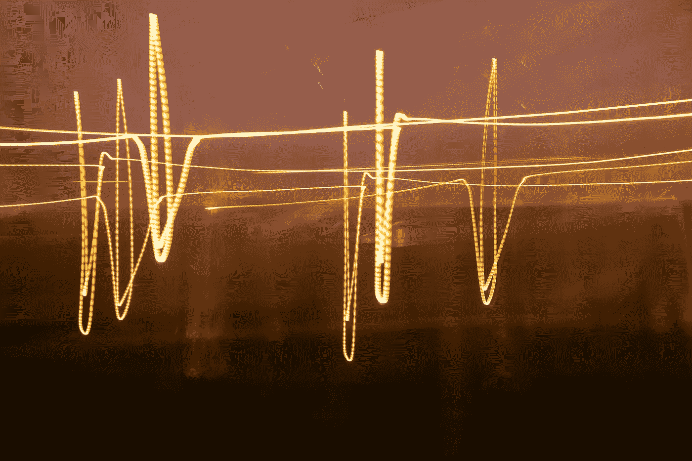
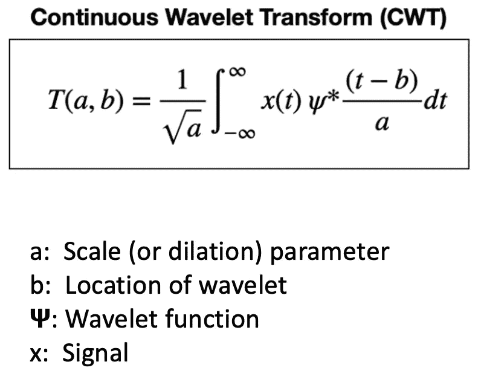
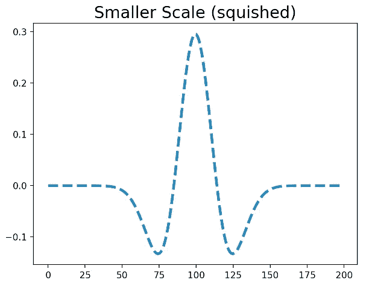
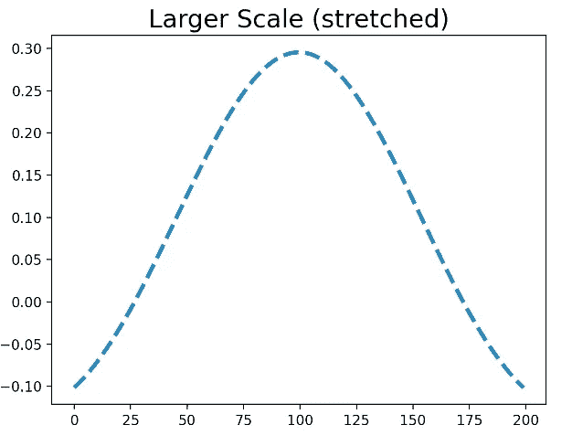
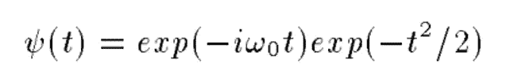
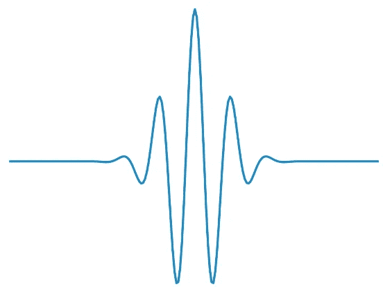
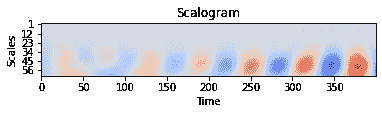
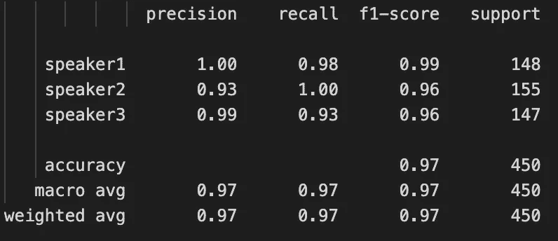

# 基于小波变换和深度学习的音频分类

> 原文：<https://medium.com/mlearning-ai/audio-classification-using-wavelet-transform-and-deep-learning-f9f0978fa246?source=collection_archive---------1----------------------->

使用连续小波变换(CWT)作为特征对音频信号进行分类的逐步实现。

Photo by [Jan Huber](https://unsplash.com/@jan_huber?utm_source=unsplash&utm_medium=referral&utm_content=creditCopyText) on [Unsplash](https://unsplash.com/s/photos/frequency?utm_source=unsplash&utm_medium=referral&utm_content=creditCopyText)

# 介绍

音频分类是一项非常重要的任务。在过去的十年中，已经进行了大量的研究，使用不同种类的特征和神经网络架构对音频进行分类。这方面的一些实际应用是说话人识别、环境声音分类、音乐流派分类和鸟声分类。音频中最常用的功能是 Spectrograms/Mel-spectrograms 和最先进的 MFCCs。然而，研究人员还探索了一些其他方法来对音频数据进行分类。一种这样的方法是小波变换。在本文中，我们将了解小波变换，以及如何将它与机器学习一起用于分类任务。

# 什么是小波？

首先，我们将讨论为什么需要小波。

通常，傅立叶变换用于从信号中提取频率。傅立叶变换使用一系列不同频率的正弦波来分析信号。但是它有一个很大的缺点。它正在选择合适的窗口大小。根据海森堡的测不准原理:

*   窄的窗口将在时间上定位信号，但是在频率上将有显著的不确定性。
*   如果窗口足够宽，那么时间不确定性增加。

这是时间和频率分辨率之间的权衡。

避免这个问题的一种方法是**多分辨率分析(MRA)** 。MRA 的一个例子是小波变换。在 MRA 中，以不同的分辨率水平分析信号。

> 小波是一种在时间上局部化的波状振荡。小波有两个基本属性:尺度和位置。尺度定义了小波的“拉伸”或“压缩”程度。位置是时间上的位置。

下面是小波变换的公式。

The formula of Wavelet Transform

小波变换可以改变“标度”参数，以找到信号中的不同频率及其位置。**所以，现在我们知道时间信号中存在哪些频率，它们存在于哪里**。较小的尺度意味着小波被挤压。因此，它可以捕捉更高的频率。另一方面，较大的音阶可以捕捉较低的频率。你可以在下图中看到一个压缩和拉伸小波的例子。

(Left) Smaller-scale or squished wavelet, (Right) Larger scale or stretched wavelet

**这是小波变换相对于 FFT 的优势。它可以同时捕捉光谱和时间信息**。因此，基本上，一个信号与一组不同尺度和位置的小波进行卷积。被缩放和移位的原始小波被称为“母小波”。有这么多小波可供选择。不同的小波用于不同的应用。

我们将在本教程中使用 Morlet 小波。

> Morlet 小波(或 Gabor 小波)用于听觉和视觉，因为它与人类感知密切相关。它由复数指数乘以一个高斯窗口组成。Morlet 小波的公式如下所示:

Morlet wavelet formula

这是 Morlet 小波的样子:

Morlet wavelet

这里有一篇关于介质的文章，详细讨论了小波。

 [## 什么是小波，我们如何在数据科学中使用它

### 你好，这是我关于信号处理主题的第二篇文章。目前，我有兴趣学习更多关于信号的知识…

towardsdatascience.com](https://towardsdatascience.com/what-is-wavelet-and-how-we-use-it-for-data-science-d19427699cef) 

# 问题陈述

**目标:**我们想用连续小波变换对音频进行分类。我们将使用[自由口语数字数据集(FSDD)](https://github.com/Jakobovski/free-spoken-digit-dataset) 。我们将提取每个样本的小波变换，并尝试使用深度神经网络从该数据集中对说话人进行分类。为了演示这种方法，我们将在本教程中只对 3 个说话者进行分类。

# 数据描述

[**自由口语数字数据集(FSDD)**](https://github.com/Jakobovski/free-spoken-digit-dataset) **:** 一个简单的音频/语音开放数据集，包括在。8kHz 的 wav 文件。录音经过修剪，因此在开始和结束时几乎没有静音。它包含:

*   6 个扬声器
*   3，000 个录音(每个扬声器每个数字 50 个)
*   英语发音

# 履行

我会解释所有的步骤。*最后，GitHub 上还有完整代码的链接。*

## 步骤 1:导入所有库

## 小波变换示例(用于演示目的的可选步骤)

***python 中的 Librosa*** 库用于音乐和音频分析。我们可以使用这个库读取音频文件并提取频谱图。对于小波变换，我们将使用 ***pywt*** 库。

这是来自自由口语数字数据集的样本的小波变换。

在第 7 行，我们将小波类型设置为“Morlet”。第 8 行设置了采样率。在第 9 行，我们已经设置了小波的尺度。在第 17 行，我们已经计算了小波变换。

**输出:**

这些是我们正在使用的标度:*【1 2 3 4 5 6 7 8 9 10 11 12 13 14 15 16 17 18 19 20 21 22 23 24 25 26 27 28 29 30 31 32 34 35 36 37 38 39 40 41 42 43 44 45 46 47 48 49 50 51 52 53 54 56 57 58 59 69 60*

这些是与音阶相关的频率:*【6500。3250.2166.66666667 1625.1300.1083.33333333 928.57142857 812.5 722.22222222 650.590.90909091 541.66666667 500.464.28571429 433.33333333 406.25 382.35294118 361.11111111 342.10526316 325.309.52380952 295.45454545 282.60869565 270.83333333 260.250.240.74074074 232.14285714 224.13793103 216.66666667 209.67741935 203.125 196.96969697 191.17647059 185.71428571 180.55555556 175.67567568 171.05263158 166.66666667 162.5 158.53658537 154.76190476 151.1627907 147.72727273 144.44444444 141.30434783 138.29787234 135.41666667 132.65306122 130.127.45098039 125.122 . 5508772 1110 . 1206586586*

小波变换的形状: *(63，6571)*

Wavelet Transform of a small frame of audio sample

现在让我们读取所有的数据，并提取它们的所有特征。

## 步骤 2:读取音频文件，并将它们分成训练/测试数据

我们在这里只对 3 个扬声器进行分类。因此，我们将从 3 个说话者身上提取样本:乔治、杰克逊和卢卡斯。我们将把所有数据写入一个. npz 文件。

**输出:**

训练数据类分布:(数组([0，1，2])，数组([360，352，338])

测试数据类分布:(数组([0，1，2])，数组([140，148，162])

## **第三步:提取小波变换特征**

让我们创建一个函数来提取小波变换。在计算小波特征之后，**我们将把时间序列分成长度为 400** 的帧。采样速率为 8 kHz。所以，400 帧相当于 50 毫秒。我们还创建了一个带通滤波器。我们将只采用 80Hz 到 1000 kHz 之间的频率。

**人声频率范围:**人耳可以听到 20 到 20，000 赫兹(20 千赫兹)之间的声音，但它对 250 到 5，000 赫兹之间发生的一切最敏感。典型的成年男性的有声语音将具有从 85 到 180 Hz 的基频，而典型的成年女性的有声语音将具有从 165 到 255 Hz 的基频。对于孩子的声音，平均基频是 300 赫兹。辅音占据 2 千赫到 5 千赫之间的空间。元音在 500 赫兹到 2 千赫兹之间很突出。

我们将把所有特性写在一个. npz 文件中，这样我们以后就可以很容易地从那里加载特性。**特征的形状为(76×400)。它的格式是:(Features x timesteps)。**

我们还保存了每个样本的唯一 id。这很重要，因为我们将每个样本分成多个帧，我们需要知道哪个帧属于哪个样本。来自一个样本的所有帧将具有相同的 id。

**提取训练数据的特征:**我们从训练数据中抽取随机样本，并从每个样本中抽取一些随机帧，以减少训练数据。

**提取测试数据的特征:**

训练数据的形状为:(8267 x 76 x 400)。

训练数据的形状为:(12326 x 76 x 400)。

**数据格式为:(数量 _ 样本 x 特征 x 时间步长)。**

## **第四步:构建深度学习模型**

我们将使用扩张 1D 卷积以及批量标准化层。我们使用时间分布 1D 卷积，因为这是一个多变量时间序列。**光谱图和小波变换不是标准图像。在标准图像中，x 轴和 y 轴承载相似的像素内容。但是，在频谱图和小波变换的情况下，x 轴是时间，y 轴是频率。在这里阅读更多关于此******。但是，也可以随意使用 2D 卷积，因为许多人也将 2D 卷积用于频谱图，并取得了良好的效果。****

**无论如何，扩张卷积将有助于增加接收场，同时保持参数数量不变。这将很有帮助，因为我们有一个长度为 400 的多元时间序列。批次标准化层在训练期间标准化小批次，并解决**内部协变量移位**的问题。它使训练更快，模型变得更健壮。我强烈推荐在你的模型中使用这个。**

## **第五步:训练网络**

**我们将使用 5 重交叉验证来训练网络。在开始训练过程之前，我们需要更改数据格式。对于深度学习模型，我们需要格式为:**(Num _ samples x time steps x Features)的数据。****

**首先，我们需要使用标准的定标器来标准化数据。我们将保存训练数据的平均值和标准差。在测试过程中，我们将使用这个平均值和标准差来标准化数据，然后进行预测。**

## **步骤 6:测试模型**

**在测试期间，首先我们将进行预测。但是，我们从一个样本中创建了多个帧。我们将对所有帧进行分类，然后基于帧的多数投票，我们将为样本分配最终类别。**

# **结果**

****

**Classification report**

**我们在测试数据集上获得了 97%的准确率。**

**以下是 GitHub 上完整代码的链接:**

** [## GitHub-AdityaDutt/Audio-class ification-Using-Wavelet-Transform:使用小波对音频进行分类…

### 使用连续小波变换(CWT)作为特征对音频信号进行分类的分步教程。创建一个…

github.com](https://github.com/AdityaDutt/Audio-Classification-Using-Wavelet-Transform) 

# 结论

我们已经学会了如何使用小波变换和机器学习进行分类，并在测试数据集上获得了 97%的准确率。您也可以将它用于其他分类问题。它也可以用于图像分类。可以使用其他神经网络结构。还可以使用 2D 卷积、迁移学习模型等。

这种方法的唯一缺点是需要处理的数据太多。**但是，如果** **您可以将变换保存为图像并缩减采样/缩小图像，那么您将拥有更少的数据。**我不确定这会对信息产生什么影响，因为时间步长也会缩短。但看看它的表现会很有趣。

> 感谢阅读！我希望它是有用的。👋
> 
> 如果你有任何问题让我知道。

# 参考

 [## 基于扩张卷积的多尺度上下文聚合

### 语义分割的最新模型是基于卷积网络的改编，卷积网络具有…

arxiv.org](https://arxiv.org/abs/1511.07122v3)  [## GitHub-Jakobovski/free-口语数字数据集:一个免费的口语数字音频数据集。想想 MNIST…

### 一个简单的音频/语音数据集，由 8kHz 的 wav 文件中的语音数字记录组成。这些录音是…

github.com](https://github.com/Jakobovski/free-spoken-digit-dataset)  [## 批量标准化:通过减少内部协变量转移加速深度网络训练

### 训练深度神经网络是复杂的，因为每层输入的分布在训练过程中会发生变化

arxiv.org](https://arxiv.org/abs/1502.03167)  [## 机器学习中使用小波变换的指南

### 在以前的博客文章中，我们已经看到了如何使用信号处理技术对时间序列进行分类…

ataspinar.com](https://ataspinar.com/2018/12/21/a-guide-for-using-the-wavelet-transform-in-machine-learning/)  [## 什么是小波，我们如何在数据科学中使用它

### 你好，这是我关于信号处理主题的第二篇文章。目前，我有兴趣学习更多关于信号的知识…

towardsdatascience.com](https://towardsdatascience.com/what-is-wavelet-and-how-we-use-it-for-data-science-d19427699cef)  [## spectrograms 和 CNN 做音频处理有什么问题？

### CNN 在图像方面做了惊人的事情，但是为什么它们在声音方面做得不好呢？

towardsdatascience.com](https://towardsdatascience.com/whats-wrong-with-spectrograms-and-cnns-for-audio-processing-311377d7ccd)**