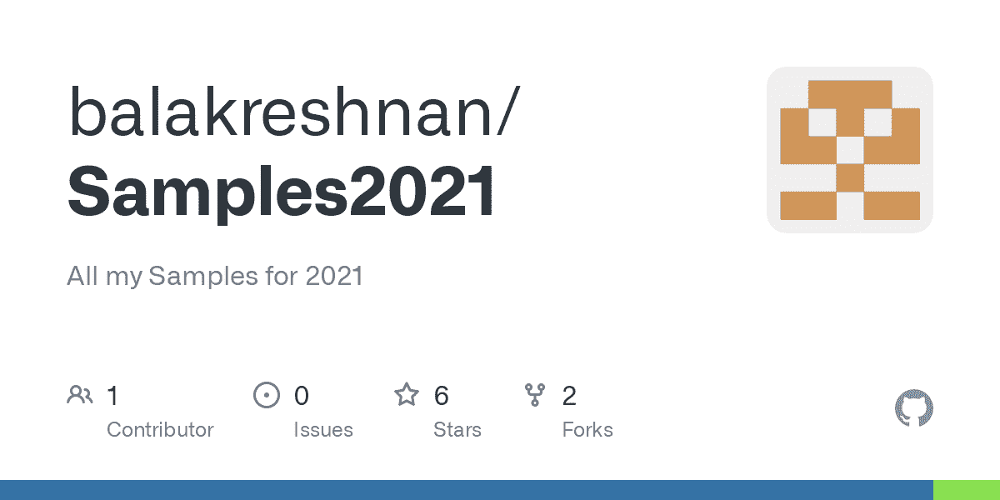

# Azure 机器学习深度强化学习

> 原文：<https://medium.com/mlearning-ai/azure-machine-learning-deep-reinforcement-learning-91fc3e1cd3e1?source=collection_archive---------6----------------------->



# 使用开放式健身房和 Tensorflow，Keras

# 用例

*   使用强化学习并训练深度 RL 模型
*   使用开放式健身房和 Tensorflow
*   使用 Keras
*   安装依赖项
*   原创教程复制自—[https://github . com/nicknochnack/tensorflowceras-reinforcement learning/blob/master/Deep % 20 reinforcement % 20 learning . ipynb](https://github.com/nicknochnack/TensorflowKeras-ReinforcementLearning/blob/master/Deep%20Reinforcement%20Learning.ipynb)
*   本教程是在 Azure 机器学习服务中展示上述作品。

# 安装依赖项

```
!pip install --upgrade tensorflow
!pip install gym
!pip install keras
!pip install keras-rl2!sudo apt-get update
!sudo apt-get install -y xvfb ffmpeg
!pip install 'imageio==2.4.0'
!pip install pyvirtualdisplay
!sudo apt-get install -y python-opengl xvfb
```

*   我测试 tensorflow 的时候版本是 2.6.0
*   虚拟显示是开放式体育馆渲染图像或图形的必要手段
*   我们的想法是展示我们可以在 Azure 机器学习的 jupyter 实验室中运行所有开源代码

# 密码

*   显示张量流版本

```
import tensorflow as tf; 
print(tf.__version__)
```

*   现在进口

```
import gym 
import randomimport os
import io
import base64
from IPython.display import display, HTML
```

*   配置显示器

```
from pyvirtualdisplay import Display
display = Display(visible=0, size=(800, 600))
display.start()import matplotlib.pyplot as plt
%matplotlib inline
from IPython import display
```

*   现在设置开放的健身房环境

```
env = gym.make('CartPole-v0')
states = env.observation_space.shape[0]
actions = env.action_space.nactions
```

*   测试渲染是否正常

```
import gym
env = gym.make('CartPole-v0')
env.reset()
env.render()
```

*   创建剧集

```
episodes = 10
for episode in range(1, episodes+1):
    state = env.reset()
    done = False
    score = 0 

    while not done:
        env.render()
        action = random.choice([0,1])
        n_state, reward, done, info = env.step(action)
        score+=reward
    print('Episode:{} Score:{}'.format(episode, score))
```

*   现在是时候建立模型了

```
import numpy as np
from tensorflow.keras.models import Sequential
from tensorflow.keras.layers import Dense, Flatten
from tensorflow.keras.optimizers import Adam
```

*   定义模型

```
def build_model(states, actions):
    model = Sequential()
    model.add(Flatten(input_shape=(1,states)))
    model.add(Dense(24, activation='relu'))
    model.add(Dense(24, activation='relu'))
    model.add(Dense(actions, activation='linear'))
    return model
```

*   建立模型

```
model = build_model(states, actions)
```

*   显示模型

```
model.summary()
```

*   深度强化学习包括

```
from rl.agents import DQNAgent
from rl.policy import BoltzmannQPolicy
from rl.memory import SequentialMemory
```

*   定义代理

```
def build_agent(model, actions):
    policy = BoltzmannQPolicy()
    memory = SequentialMemory(limit=50000, window_length=1)
    dqn = DQNAgent(model=model, memory=memory, policy=policy, 
                  nb_actions=actions, nb_steps_warmup=10, target_model_update=1e-2)
    return dqn
```

*   构建并运行模型

```
dqn = build_agent(model, actions)
dqn.compile(Adam(lr=1e-3), metrics=['mae'])
dqn.fit(env, nb_steps=50000, visualize=False, verbose=1)
```

*   试验

```
scores = dqn.test(env, nb_episodes=100, visualize=False)
print(np.mean(scores.history['episode_reward']))
```

*   试验

```
_ = dqn.test(env, nb_episodes=15, visualize=True)
```

*   保存评分模型

```
dqn.save_weights('dqn_weights.h5f', overwrite=True)
```

*   删除所有内容

```
del model
del dqn
del env
```

*   现在加载模型
*   用新数据集进行推理测试
*   设置环境并加载保存的模型

```
env = gym.make('CartPole-v0')
actions = env.action_space.n
states = env.observation_space.shape[0]
model = build_model(states, actions)
dqn = build_agent(model, actions)
dqn.compile(Adam(lr=1e-3), metrics=['mae'])
```

*   装载重物

```
dqn.load_weights('dqn_weights.h5f')
```

*   进行评分

```
_ = dqn.test(env, nb_episodes=5, visualize=True)
```

*最初发表于*[T5【https://github.com】](https://github.com/balakreshnan/Samples2021/blob/main/RL/rlcustomtest1.md)*。*

[](/mlearning-ai/mlearning-ai-submission-suggestions-b51e2b130bfb) [## Mlearning.ai 提交建议

### 如何成为 Mlearning.ai 上的作家

medium.com](/mlearning-ai/mlearning-ai-submission-suggestions-b51e2b130bfb)