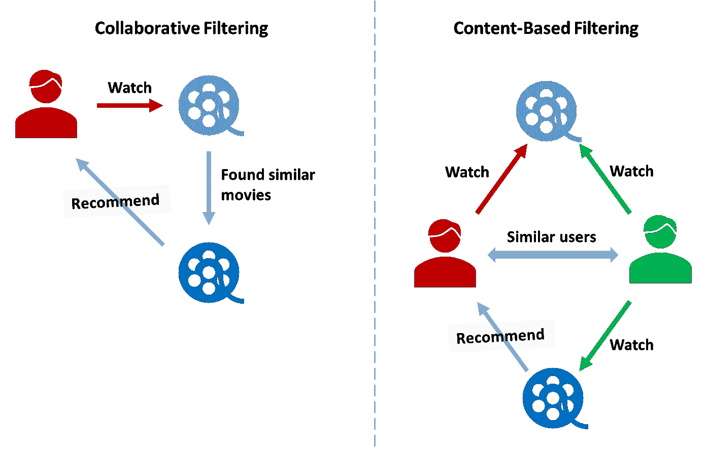
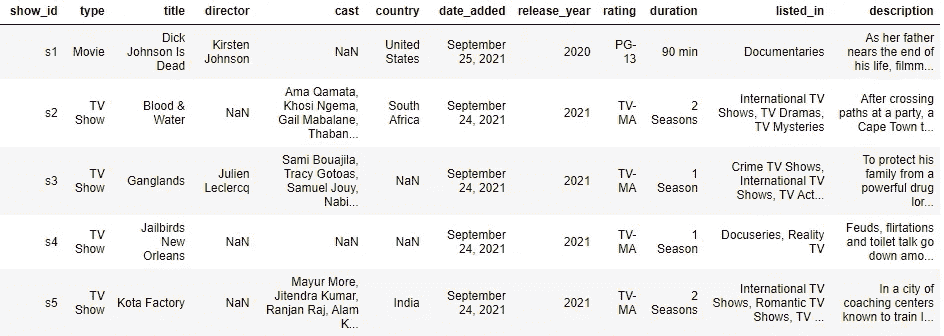
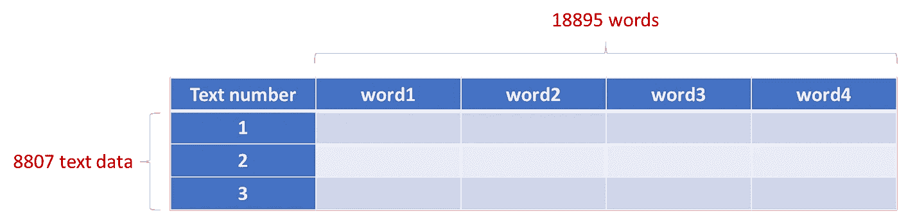
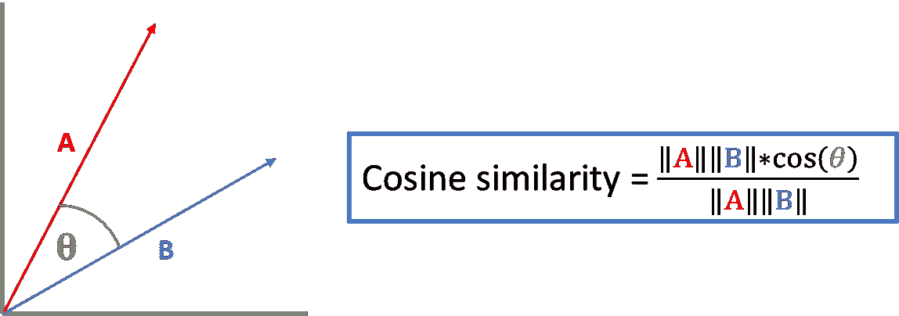
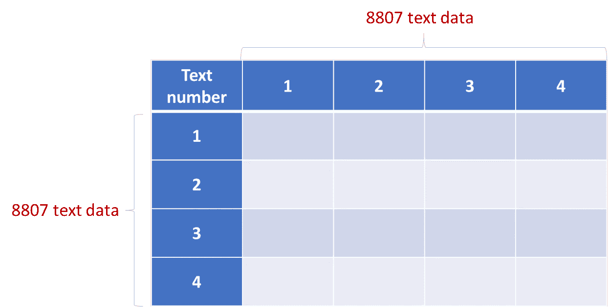
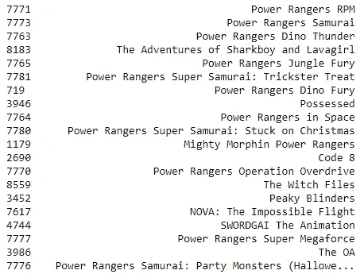

# 用 Python 代码实现的基于内容的基本推荐系统

> 原文：<https://medium.com/mlearning-ai/basic-content-based-recommendation-system-with-python-code-be920b412067?source=collection_archive---------1----------------------->


# ❓什么是推荐系统？

随着在线平台的发展，消费者更有可能在网上购买产品。公司试图了解他们的客户，并利用客户数据来获得更多利润。

实现推荐系统可以提供个性化的报价。与大规模广告相反，个性化的产品会带来更高的客户满意度、参与度和销售额。

**例子** **采用推荐制的公司**

*   网飞:电影/连续剧推荐
*   Spotify:歌曲推荐
*   Goodreads:书籍推荐


Goodreads recommendations

# 🎬推荐系统类型

有两种类型的推荐器:协同过滤和基于内容的过滤。



2 types of recommenders

**协同过滤**

> 推荐类似用户喜欢的产品

这个推荐的想法是，品味相同的人往往喜欢同样的东西。

例如，在网飞上观看“盗梦空间”的用户通常观看“星际”。当另一个用户刚看完《盗梦空间》时，系统会知道这个类型的用户可能也喜欢《星际穿越》，所以会推荐这部电影。

**基于内容的过滤**

> 推荐类似产品

这种方法基于用户可能喜欢与他们刚刚购买的产品相似的产品的概念。

再次以网飞为例。当你观看一部电影时，网飞的推荐器将在其数据库中寻找一部电影，以找到与所观看的电影接近的电影(例如具有相同的导演或相同的流派)。

这种推荐系统不需要其他用户的数据，因此可以在没有数据收集期的情况下应用。

> 介绍够了。开始编码吧！！

# 👞步骤摘要

1.  导入库
2.  输入数据
3.  标记文本数据
4.  计算相似度
5.  创建一个函数
6.  尝试创建的推荐系统

# 1.导入库

有 3 个必需的库。

```
import pandas as pd
from sklearn.feature_extraction.text import TfidfVectorizer
from sklearn.metrics.pairwise import linear_kernel
```

*   熊猫:用于读取 csv 文件
*   TfidfVectorizer:用于文本数据标记化
*   线性 _ 内核:用于相似性计算

# 2.输入数据

我将使用的数据是**网飞电影和电视节目**，它包含了网飞 8807 部电影和电视节目的列表。

您可以从加载数据

 [## 你的数据科学之家

### Kaggle 是世界上最大的数据科学社区，拥有强大的工具和资源来帮助您实现您的数据…

www.kaggle.com](https://www.kaggle.com/datasets/shivamb/netflix-shows/download) 

数据示例如下所示。有趣的列是标题和描述。

对于这个简单的推荐系统，我不会使用其他列(您也可以向推荐引擎添加其他列)。



Netflix data samp

使用 pandas 加载一个 csv 数据文件，并用空格填充缺少的值。

```
df = pd.read_csv('netflix_titles.csv')# Replace NaN with an empty string
df['description'] = df['description'].fillna('')
```

# 2.标记文本数据

要处理文本数据，需要进行标记化。

记号化是一种将文本分解成称为记号的更小单元的方法。本例中的标记是一个单词。

Tfidf 用于标记化描述列。TF-IDF(术语频率-逆文档频率)衡量一个单词与文档集合中的一个文档的相关程度。

```
# Create a TfidfVectorizer and Remove stopwords
tfidf = TfidfVectorizer(stop_words='english')# Fit and transform the data to a tfidf matrix
tfidf_matrix = tfidf.fit_transform(df['description'])# Print the shape of the tfidf_matrix
tfidf_matrix.shape
```

tfidf_matrix 的形状是 8807 行和 18895 列。



如您所见，行数(8807)是我们的数据中电影和电视节目的数量。

列数(18895)是删除停用词后的重要单词数。(停用词是任何语言中的一组常用词。停用词(不重要的词)被删除，以使模型能够专注于重要的词。)

# 3.计算相似度

这一步是了解每部电影的相似之处。

为此，我计算了每对电影的余弦相似度。



这张图片展示了二维余弦相似性。如果两个数据向量是闭合的，则这两个向量之间的角度很小，余弦相似度很高。尽管我们的标记化文本数据有 18895 个维度，但概念仍然是相同的。

```
# Compute the cosine similarity between each movie description
cosine_sim = linear_kernel(tfidf_matrix, tfidf_matrix)
```

使用 linear_kernel 函数计算步骤 3 中 tfidf 矩阵的余弦相似性(计算与其自身的相似性)。

cosine_sim 具有 8807 行和 8807 列，并且每个单元表示两部电影/连续剧描述之间的余弦相似性。



# 4.创建一个函数

在创建函数之前，我创建了一个名为 indices 的熊猫系列。索引将使索引与电影标题相匹配。因为

```
indices = pd.Series(df.index, index=df['title']).drop_duplicates()
```


indices

函数 get_recommendations 将接收电影标题、余弦相似性矩阵和一些推荐的电影作为输入。然后，它会返回一个电影推荐列表。

```
def get_recommendations(title, cosine_sim=cosine_sim, num_recommend = 10):
    idx = indices[title]# Get the pairwsie similarity scores of all movies with that movie
    sim_scores = list(enumerate(cosine_sim[idx]))# Sort the movies based on the similarity scores
    sim_scores = sorted(sim_scores, key=lambda x: x[1], reverse=True)# Get the scores of the 10 most similar movies
    top_similar = sim_scores[1:num_recommend+1]# Get the movie indices
    movie_indices = [i[0] for i in top_similar]# Return the top 10 most similar movies
    return df['title'].iloc[movie_indices]
```

*   该函数将查找所有电影与输入电影的相似性得分(来自余弦 _sim)。
*   然后，它会先对相似度最高的电影进行排序，从第二个开始得到列表，直到想要的推荐电影数(相似度最高的电影本身就是 lol)。
*   最后返回推荐列表。

# 5.尝试创建的推荐系统

现在，是时候在步骤 4 中调用我们的函数了。

```
get_recommendations('Power Rangers Zeo', num_recommend = 20)
```

下面是为《权力流浪者杰欧》推荐的电影。大部分都是 Power Ranger 系列的。然而，有些电影可能不是一个好的推荐选择，如 Peaky Blinder。



# ⭐结论

您可以使用 Python 创建一个简单的基于内容的推荐系统。首先，对文本数据进行标记并计算相似度。然后，将推荐相似度最高的一个。

如果你觉得这篇文章有帮助，请鼓掌并关注我更多关于数据科学的文章。

[](/mlearning-ai/mlearning-ai-submission-suggestions-b51e2b130bfb) [## Mlearning.ai 提交建议

### 如何成为 Mlearning.ai 上的作家

medium.com](/mlearning-ai/mlearning-ai-submission-suggestions-b51e2b130bfb)