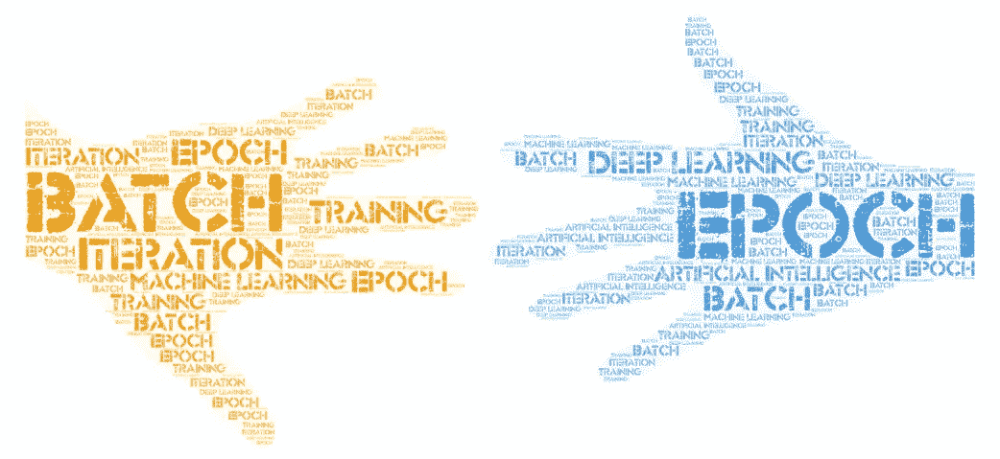

# 深度学习训练中的批量、迭代、纪元概念

> 原文：<https://medium.com/mlearning-ai/batch-iteration-epoch-concepts-in-deep-learning-training-ad8ebedf2408?source=collection_archive---------4----------------------->

这篇文章揭示了这三个词可能会让深度学习世界的新人生活有点艰难。

# 梯度下降

故事从训练神经网络的**梯度下降**优化算法开始。该算法根据训练集改变参数。它有三种变体。第一种是随机梯度下降法( **SGD** )，为每个训练**样本**一次更新一个参数。一个**时期**意味着看到一个数据集的所有样本，并基于所有样本更新参数。SGD 会更新数据样本的数量。批量梯度下降( **BGD** )对训练集中每个点的误差进行求和，仅在评估了所有训练样本后更新模型。第三种，小批量梯度下降( **MBGD** )，结合了前两种变体。它将训练数据集分成更小的**批次**大小，并对这些批次中的每一个执行更新。批次大小表示每批中数据样本的数量。这些更新被称为**迭代；**所有迭代覆盖整个数据集。覆盖整个数据集或所有批次在 **MBGD** 中称为一个时期。

# 例子

**数据集** : MNIST 带 **60_000** 图像

**数据样本数** = **60_000**

## 签名于

为了检查整个数据集，它对每个时期的参数进行 60_000 次更新。

## BGD

BGD 对数据集中所有样本的误差求和，然后更新模型。它对每个时期进行一次更新。

## MBGD

批量= 128

每批图像(数据样本)的数量= 128

迭代次数= 60_000 / 128 = 469

每个时期对参数进行 469 次更新，因为有 469 次迭代。

 [## 梯度下降-维基百科

### 在数学中，梯度下降(通常也称为最速下降)是一种一阶迭代优化算法…

en.wikipedia.org](https://en.wikipedia.org/wiki/Gradient_descent)  [## Mlearning.ai 提交建议

### 如何成为 Mlearning.ai 上的作家

medium.com](/mlearning-ai/mlearning-ai-submission-suggestions-b51e2b130bfb)