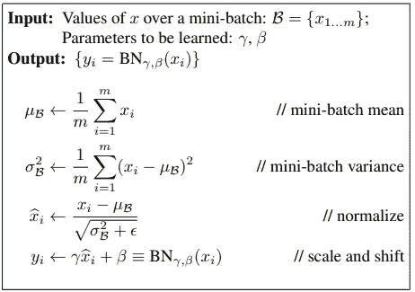

# 批处理规范化及其优点

> 原文：<https://medium.com/mlearning-ai/batch-normalization-and-its-advantages-a1dc52af83d0?source=collection_archive---------2----------------------->

最近在看一篇关于 NFNets 的文章，这是 Deepmind 在图像分类方面最先进的算法，不需要归一化。理解深度神经网络中批量规范化的功能及其影响是理解 NFNets 算法的关键要素之一。只是想分享一下我对批量标准化的理解。

训练具有 n 层的深度神经网络是具有挑战性的，因为它们对少数参数敏感，如初始随机权重、学习速率等。一个可能的原因是，当反向传播时，输入到网络深层的分布可能在每个小批量之后改变。深层神经网络中各层输入分布的这种变化被称为“内部协方差偏移”。

# 什么是批量正常化？

批量标准化是一种用于训练非常深的神经网络的技术，该神经网络对每个小批量的层的输入进行标准化。这具有稳定学习过程和显著减少训练深度网络所需的训练时期的效果。

> 算法

image from paper

BN 变换可以被添加到网络中以操纵任何激活。在符号 y = BNγ，β(x)中，我们表示参数γ和β将被学习，但是应该注意，BN 变换在每个训练示例中不独立地处理激活。相反，BNγ，β(x)取决于训练样本和小批量中的其他样本。经缩放和移位的值 y 被传递到其他网络层。规范化激活 xb 是我们转换的内部，但它们的存在是至关重要的。任何 xb 的值的分布具有 0 的期望值和 1 的方差，只要每个小批量的元素是从相同的分布中取样的，并且如果我们忽略ε。每个归一化激活 xb (k)可以被视为由线性变换 y (k) = γ (k)xb (k) + β (k)组成的子网络的输入，随后是由原始网络完成的其他处理。这些子网络输入都具有固定的均值和方差，尽管这些归一化 xb (k)的联合分布可以在训练过程中改变，但是我们期望归一化输入的引入加速子网络的训练，并因此加速整个网络的训练。

# 加速批处理规范化网络

简单地向网络添加批量标准化并不能充分利用我们的方法。为此，我们进行了以下修改:

*   ***提高学习率:*** 在一个批量标准化的模型中，他们已经能够从更高的学习率实现训练加速，而没有副作用
*   ***去除漏失:*** 谷歌研究团队发现，从 BN-Inception 中去除漏失可以让网络达到更高的验证精度。我们推测批量标准化提供了与丢弃相似的正则化好处，因为对训练样本观察到的激活受同一小批量中随机选择的样本的影响。
*   ***更彻底地混洗训练样本*** :谷歌研究团队启用了训练数据的分片内混洗，这可以防止相同的样本总是一起出现在一个小批量中。这导致验证准确性提高了约 1%,这与批量标准化作为正则化的观点相一致:当每次看到一个实例时，其影响不同时，我们方法中固有的随机化应该是最有益的。
*   **降低 L2 权重正则化:**虽然在初始阶段，模型参数上的 L2 损失控制过拟合，但是在修改的 BN-初始阶段，该损失的权重降低了 5 倍。他们发现这提高了保留验证数据的准确性。
*   ***加速学习率衰减*** 。在训练初期，学习率呈指数衰减。因为我们的网络训练速度比初始阶段快，所以我们降低学习速度的速度比初始阶段快 6 倍。
*   ***去除局部响应归一化*** 虽然 Inception 和其他网络(Srivastava et al .，2014)从中受益，但我们发现批量归一化是没有必要的。减少光度失真。因为批量标准化网络训练更快，并且观察每个训练示例的次数更少，所以我们通过减少扭曲让训练者专注于更多“真实”的图像。

整篇文章是对论文中重要信息的汇编。我希望这有助于更好更快地理解批处理规范化。

**参考**

[http://static . Google user content . com/media/research . Google . com/en//pubs/archive/43442 . pdf](http://static.googleusercontent.com/media/research.google.com/en//pubs/archive/43442.pdf)